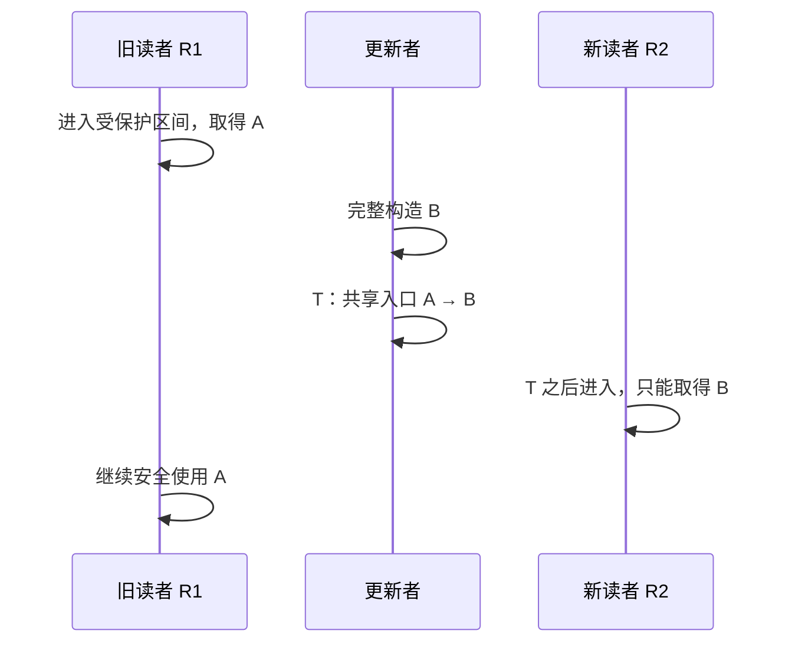
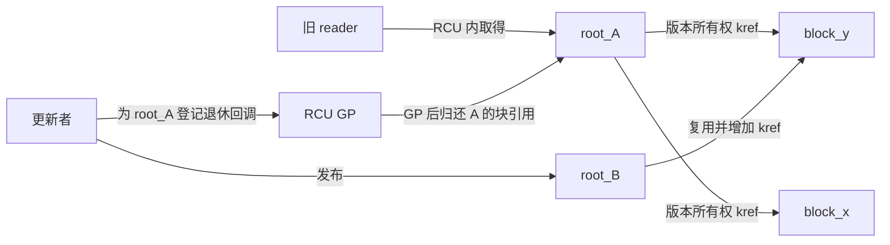
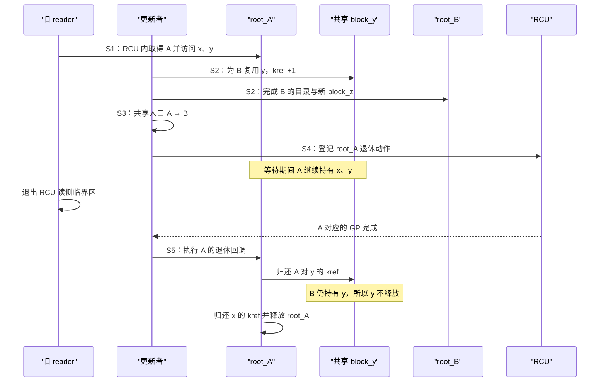

# 第2章\_RCU\_抽象机制推演

第一章已经说明读写锁、单纯原子换指针和引用计数分别留下什么缺口。本章暂时不看 Linux 字段和 API，而是假设我们要从零设计一种方案：高频读者尽量不争抢同一个共享写热点，更新者又必须证明旧对象已经无人使用。

> **阅读目标：** 从问题约束自行推出“发布新版本—划定旧读者边界—等待宽限期—延迟回收”的最小机制。下一章再用真实运行条件寻找这个朴素模型的漏洞。

## 2.1\_把设计目标写成约束

继续使用第一章的共享配置对象场景。新机制必须同时满足：

1. 多个读者可以并行读取当前配置。
2. 已经取得旧指针的读者不能因为更新而访问已释放内存。
3. 更新之后开始的读者应能取得新版本。
4. 旧对象最终必须可以回收，不能永久泄漏。
5. 普通读操作不能依赖每次修改同一个全局共享计数，否则会重新制造缓存行热点。

第五条决定了这不是“把读写锁换一种写法”。我们需要改变读者与更新者协作的方式，把更多工作转移到低频更新和回收路径。

## 2.2\_第一步\_不再原地覆盖读者正在使用的版本

如果写者直接修改 A 的多个字段，读者可能观察到一半旧值、一半新值。最直接的办法是先构造一个完整的新版本 B，再一次性切换共享入口：

```text
更新前：shared_ptr ──> A

写者在私有状态中构造 B

发布后：shared_ptr ──> B
                    A 仍然暂时存活
```

这个动作解决了“新读者应该看到哪个版本”，却没有解决“旧读者是否还在使用 A”。因此，**复制并发布新版本只是更新协议，不是回收协议。**

## 2.3\_第二步\_取消发布封闭旧读者集合

设写者在时刻 T 把共享入口从 A 切换到 B：

- T 之前进入的读者可能已经取得 A。
- T 之后从共享入口取值的读者只能取得 B。
- 新读者不需要等待旧读者，旧读者也不必被赶出临界区。

这意味着 T 形成了一条集合边界。回收者不必找出“历史上所有读取过 A 的任务”，只需证明 **T 之前可能取得 A 的读者都已经结束**。


```mermaid
sequenceDiagram
    participant R1 as 旧读者 R1
    participant W as 更新者
    participant R2 as 新读者 R2

    R1->>R1: 进入受保护区间，取得 A
    W->>W: 完整构造 B
    W->>W: T：共享入口 A → B
    R2->>R2: T 之后进入，只能取得 B
    R1->>R1: 继续安全使用 A
```

> **关键转折：** RCU 不要求更新者阻塞旧读者，而是允许 A 与 B 暂时共存，把“何时安全释放 A”变成一个独立问题。

## 2.4\_第三步\_用宽限期等待边界前读者离场

从 T 开始，到所有 T 之前的相关读者都已经结束，这段逻辑等待过程称为宽限期（Grace Period，GP）。GP 的目标不是让系统出现一个“所有 CPU 同时没有读者”的瞬间，而是让每个旧读者分别跨过安全边界。

```text
时间 ──────────────────────────────────────────────>

旧读者 R0： [---------读取 A---------]
旧读者 R1：       [------读取 A------]
发布边界 T：                 |
新读者 R2：                  | [----读取 B----]
新读者 R3：                  |       [----读取 B----]
GP：                         [等待 R0、R1]
回收 A：                                      X
```

R2、R3 即使在 GP 期间持续读取 B，也不会延迟 A 的回收，因为它们不属于边界前旧读者集合。

## 2.5\_第四步\_把等待结果连接到对象回收

GP 完成只能产生“旧读者已经离场”的证明，最终还要把证明交给需要回收 A 的执行者。由此得到两种抽象方式：

| 方式 | 等待者怎样得到结果 | 适合场景 |
| --- | --- | --- |
| 同步等待 | 当前更新者睡眠，GP 完成后被唤醒 | 后续步骤必须立即使用完成结论 |
| 异步回调 | 更新者登记回收动作后继续执行，GP 完成后由系统调用回调 | 不希望更新路径阻塞 |

两者依赖同一个 GP 证明，区别只在于 **完成结果如何交付**。

### 2.5.1\_回收目标可能是一块内存也可能是一张所有权图

朴素模型把旧版本 A 画成一个方框，容易让人默认“旧版本就是一块内存”。真实对象可能分成一个版本根和多个独立分配的数据块：

```text
current_root ──> root_A
                  ├── block_x（kref）
                  ├── block_y（kref）
                  └── block_z（kref）
```

此时 RCU 直接保护的是 `current_root -> root_A` 这条发布关系和沿 root 进行的临时访问；每个 block 的 kref 统计的是 **哪些版本根或长期用户仍然拥有这个分配块**。如果把“RCU 读者”和“block 所有者”混成一组计数，就会误以为每个 reader 都必须逐块 get／put，也无法确定 GP 与引用归零谁应该先发生。

先固定五类角色和状态位置：

| 角色 | 状态位置 | 写入者 | 后续读取者 | 责任 |
| --- | --- | --- | --- | --- |
| 当前版本入口 | 一个 RCU 发布的根指针 | 更新者 | reader | 决定新 reader 从哪一代 root 开始遍历 |
| 版本根 | 块指针数组、树或其他只读目录 | 构造该版本的更新者 | 该代 RCU reader、退休回调 | 定义一张逻辑旧照包含哪些 block |
| block 引用 | 每个 block 内的 kref/refcount | 版本构造者、版本退休者、逃逸 reader | 最后一次 put | 统计这个独立分配块的实际所有者 |
| RCU 读侧状态 | 任务／CPU 与 GP 状态 | reader、RCU 子系统 | GP 协调者 | 证明旧 reader 不再沿旧 root 访问任何 block |
| 退休动作 | 旧 root 的 RCU 回调或同步等待结果 | 更新者登记，RCU 交付 | 对象所属模块 | 在 GP 后归还旧 root 对各 block 的引用 |


```mermaid
flowchart LR
    Reader["旧 reader"] -->|"RCU 内取得"| RootA["root_A"]
    RootA -->|"版本所有权 kref"| X["block_x"]
    RootA -->|"版本所有权 kref"| Y["block_y"]
    Writer["更新者"] -->|"发布"| RootB["root_B"]
    RootB -->|"复用并增加 kref"| Y
    Writer -->|"为 root_A 登记退休回调"| GP["RCU GP"]
    GP -->|"GP 后归还 A 的块引用"| RootA
```

### 2.5.2\_复合旧照的一次完整状态转换

沿用 `root_A -> {x, y}`，新版本 `root_B -> {y, z}`。其中 y 被两代版本共享，z 是 B 新建的块。一次完整更新可以划分为统一阶段：

| 阶段 | 进入触发 | root 与 block 状态 | 谁写哪里 | 退出条件 |
| --- | --- | --- | --- | --- |
| S0 当前版本 | A 已经发布 | A 各持有 x、y 一份 kref | 已完成的构造路径 | reader 可以从入口取得 A |
| S1 旧 reader 进入 | reader 取得 A | A 对 x、y 的引用保持不变 | reader 只留下 RCU 读侧状态 | reader 可以安全沿 A 访问块 |
| S2 构造 B | 更新者准备新版本 | B 为共享 y 增加一份 kref，新建 z 的初始引用属于 B | 更新者写 B 的私有目录和 block 计数 | B 完整且尚未发布 |
| S3 发布 B | 原子切换根入口 | 新 reader 只从 B 开始；旧 reader 仍可能使用 A | 更新者写共享根指针 | A 的旧 reader 集合被封闭 |
| S4 等待 A 的 GP | 更新者登记退休动作 | A 继续持有 x、y，不能提前 put | RCU 子系统推进读者状态 | 所有可能沿 A 访问块的 reader 退出 |
| S5 退休 A | GP 完成并交付回调 | 模块对 x、y 各执行一次 put | 回调写每个 block 的 kref | A 不再拥有任何 block |
| S6 分块收敛 | 各次 put 完成 | x 可能归零释放；y 因 B 仍持有而继续存活 | 最后 put 调用各 block 的 release | 每个块独立得到结论 |
| S7 根释放 | A 的目录不再被访问 | 释放 root_A 本身 | 退休路径 | 本次旧版本退休结束 |


```mermaid
sequenceDiagram
    participant R as "旧 reader"
    participant W as "更新者"
    participant A as "root_A"
    participant Y as "共享 block_y"
    participant B as "root_B"
    participant GP as "RCU"

    R->>A: S1：RCU 内取得 A 并访问 x、y
    W->>Y: S2：为 B 复用 y，kref +1
    W->>B: S2：完成 B 的目录与新 block_z
    W->>W: S3：共享入口 A → B
    W->>GP: S4：登记 root_A 退休动作
    Note over A,Y: 等待期间 A 继续持有 x、y
    R->>R: 退出 RCU 读侧临界区
    GP-->>W: A 对应的 GP 完成
    W->>A: S5：执行 A 的退休回调
    A->>Y: 归还 A 对 y 的 kref
    Note over Y: B 仍持有 y，所以 y 不释放
    A->>A: 归还 x 的 kref 并释放 root_A
```

这条时序中没有“RCU 查询 y 的 kref”。RCU 只交付“旧 reader 已经不能再沿 A 访问子块”的证明；模块收到证明后，才有资格归还 A 持有的块引用。

### 2.5.3\_为什么普通短读不需要逐块增加引用

只要满足下面的不变量：

```text
root_A 仍可能被 RCU reader 取得
    -> A 对其目录中每个 block 的所有权引用都保持有效；

A 对 block 的引用只在 A 的 GP 完成后归还。
```

那么 reader 在 RCU 临界区内访问 `A->block` 时，使用的是 A 已经持有的版本引用，不需要为本次短访问再修改 block 的共享计数器。这样读者数量增加不会自动变成每个 block 的原子 get／put 风暴。

只有 reader 要把 block 带出 RCU 读区时，才需要在仍受 A 保护时取得一份独立引用。此时保护发生一次交接：

```text
A 的版本引用保证 get 时 block 仍存在且计数非零
    ↓
reader 增加自己的 block 引用
    ↓
reader 退出 RCU 后凭自己的引用继续使用
    ↓
A 的 GP 完成并归还版本引用，不影响 reader 的长期引用
```

### 2.5.4\_不同所有权顺序为什么不能互相套用

最终释放始终需要“RCU 临时访问已经结束”和“长期所有者已经归零”两个条件，但条件落在哪个对象上决定了自然顺序：

| 所有权问题 | 自然串联方式 | 原因 |
| --- | --- | --- |
| RCU 入口直接发布的对象本身被长期用户持有 | 对象 kref 归零 → `release()` 登记 RCU 回调 → GP 后释放对象 | 同一块内存同时承载 kref 和 RCU 临时 lookup |
| 单对象的发布引用要覆盖全部旧 lookup | 取消发布对象 → GP 后归还发布引用 → 最后一次 put 直接释放 | 发布引用在 GP 前保证对象及其计数器始终非零 |
| 旧 root 拥有多个 kref block，RCU reader 通过 root 临时访问它们 | root 的 GP 完成 → root 归还各 block 的 kref → 各块分别归零释放 | GP 完成前，root 的版本引用必须替旧 reader 托住全部子块 |
| reader 还把某个子块带出读区 | root GP 后归还版本引用；reader 最后 put 再结束该 block | 版本所有权和 reader 所有权是两份独立引用 |

因此，“RCU 一定等 kref”与“kref 一定等 RCU”都不是通用规则。通用规则是：**先确定访问路径和所有权边，再按从入口到叶子分配块的顺序关闭可见性、等待临时访问、归还所有权。**

## 2.6\_四类动作不能互相替代

| 推演出的动作 | 解决的问题 | 如果缺少会怎样 |
| --- | --- | --- |
| 标记受保护读取区间 | 确定哪些访问可能保留旧引用 | 无法区分受保护访问与任意普通取值 |
| 完整初始化后发布新版本 | 保证后来读者不会看到半初始化对象 | 指针已经可见，对象字段却可能尚不可见 |
| 从共享入口取消旧版本 | 阻止后来读者继续取得旧对象 | 旧读者集合没有封闭边界 |
| 等待既存读者并延迟回收 | 让边界前取得旧指针的读者完成 | 更新者可能在旧读者使用期间释放对象 |

**取消发布只负责关闭入口，不证明旧读者已经离场；等待旧读者只解决生命周期，不负责让新对象的初始化正确可见。** Linux API 到应用阶段再统一映射。

## 2.7\_发布为什么不能只是原子换指针

即使指针替换不会撕裂，也只能保证读者取得 A 或 B 中的一个合法地址，不能保证读者取得 B 时已经看见 B 的全部初始化。因此抽象机制还需要一份发布—取得顺序契约：

```text
写者完成 B 的字段初始化
    happens-before
写者发布指向 B 的入口
    synchronizes-with
读者取得 B
    happens-before
读者使用 B 的字段
```

具体需要哪些编译器约束和 CPU 内存序原语，取决于目标系统和体系结构；下一章再解释硬件为什么不会自动提供这份高层对象契约。

## 2.8\_最小抽象模型

把以上推演合并，可以得到不绑定具体 API 的伪代码：

```text
读者：
    进入受保护读取区间
    p = 取得当前发布指针
    使用 p 指向的版本
    退出受保护读取区间

更新者：
    完整构造新版本 B
    串行化并发更新者
    将共享入口从 A 发布为 B
    请求等待“发布 B 之前可能取得 A”的旧读者
    等待完成后：
        若 A 是单个分配，回收 A
        若 A 是复合根，先归还 A 对各子块的所有权，再分别回收归零的块
```

这里包含三种独立正确性责任：

- **写者串行化：** 多个更新者不能互相覆盖，具体由额外更新协议负责。
- **发布可见性：** 读者取得 B 时，必须同时看见 B 已完成的初始化。
- **旧版本生命周期：** A 必须存活到最后一个既存读者结束。

## 2.9\_朴素模型还没有回答什么

到这里，我们只得到一个逻辑要求：“等待所有边界前读者结束”。它还不是一套能在真实多核系统中运行的算法，因为至少有七个问题没有答案：

1. **读者状态放在哪里：** 如果不能让每次读取修改同一个全局计数，系统怎样留下读者存在的证据？
2. **读者离开原 CPU 怎么办：** 任务在保护区内被抢占或迁移后，谁继续代表它？
3. **CPU 不主动运行协调代码怎么办：** CPU 进入用户态、idle 或长时间无 tick 时，怎样判断它是否安全？
4. **多个 CPU 怎样汇聚：** 如果所有 CPU 最终仍争抢一个全局完成字，扩展性问题是否只是换了位置？
5. **参与者迟迟不报告怎么办：** 协调者是读取远端状态、发送 IPI，还是无限等待？
6. **跨 CPU 观察怎样有序：** 指针发布、读者访问和 GP 完成之间需要什么内存顺序？
7. **复合版本怎样退休：** 根节点、共享子块和逃逸引用分别由谁持有，GP 结束后在哪个上下文逐层归还？

> **本章故意停在这里。** 前六个运行问题将逐个逼出每任务状态、每 CPU 状态、共享汇聚节点、EQS、强制探测和内存序约束；这正是下一章“机制完善”的任务。第七个对象所有权问题不由 RCU 子系统替应用回答，将在 API 之后的[RCU 数据结构模板与选型](P21_RCU_数据结构模板与选型.md)中落实。

## 2.10\_抽象机制不保证什么

RCU 抽象不会自动保证：

- 多个写者之间的互斥。
- 对象内部多字段不变量的原子更新。
- 离开受保护读取区间后对象仍然存活。
- 新读者立即观察到某一业务版本。
- 持有指针就拥有该对象的引用计数。
- 一个旧版本的根节点、子块和外部句柄会自动形成正确的所有权图。

这些需求必须由更新锁、不变数据、seqcount、引用计数或其他机制分层完成。

## 2.11\_本章验收

1. 能从读写锁的共享写热点推出“读路径不能每次修改同一全局计数”的约束。
2. 能区分发布、取消发布、宽限期和最终回收。
3. 能解释为什么 GP 只需要覆盖边界前的既存读者。
4. 能列出朴素 GP 模型在真实多核系统中尚未解决的问题。
5. 能区分单分配旧对象与“版本根 + 多个 kref 子块”的复合旧照。
6. 能解释为什么复合旧照通常在 GP 后才归还根对各子块的引用，而短 reader 不必逐块 get／put。
7. 不借助 Linux 字段，也能画出“发布新版本—封闭旧读者集合—等待—逐层回收”的时间线。

上一篇：[为什么需要 RCU](P01_为什么需要_RCU.md)。

下一篇：[RCU 机制完善：硬件与运行约束](P03_RCU_机制完善_硬件与运行约束.md)。
