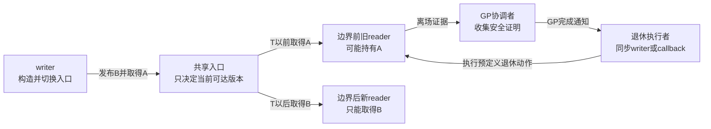
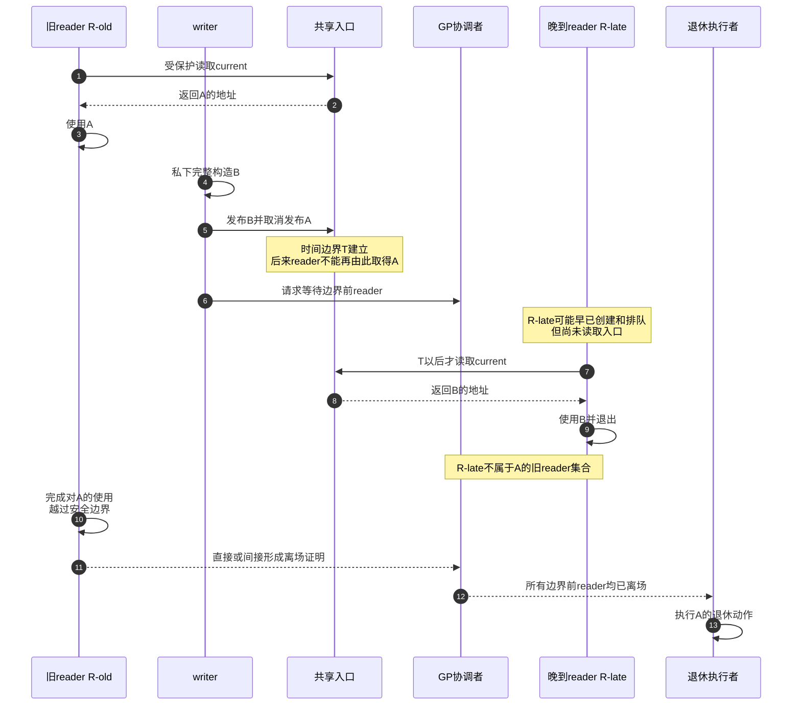

# 第2章\_RCU\_抽象机制推演

## 2.1\_从一个可复现的问题开始

假设网络数据面每秒执行数百万次路由查找，控制面每几秒更新一次路由版本。一个版本包含前缀树和下一跳信息；读者只需要在一次报文处理期间读取它，不会永久持有版本。

最初只有一份对象：

```c
struct route_version {
	u64 generation;
	struct route_table table;
};

struct route_version *current = version_a;
```

读写锁能够保证正确：

```c
read_lock(&route_lock);
version = current;
forward_packet(version, skb);
read_unlock(&route_lock);
```

但每个 reader 都要修改同一把锁的共享状态。CPU 越多、短 reader 越密集，这条共享缓存行就越可能成为扩展瓶颈。我们希望保留“更新时绝不释放 reader 正在使用的版本”这一正确性，却把高频 reader 从共享写热点中移开。

## 2.2\_把目标改写成五条约束

不能只说“读快、写慢”，必须说明方案仍要保证什么：

1. reader 取得的版本在其使用期间不能被释放；
2. reader 要么看到完整旧版本，要么看到完整新版本，不能看到半初始化对象；
3. writer 发布新版本以后，后来 reader 不应继续从正式入口取得旧版本；
4. writer 不需要知道旧 reader 的任务 ID，也不能扫描每个对象地址；
5. reader 高频路径不能每次修改同一个全局引用计数或锁状态。

这五条约束会依次推出“不原地修改、先切入口、封闭旧 reader 集合、等待边界前 reader、延迟回收”五个动作。

## 2.3\_第一步\_不原地覆盖reader正在使用的版本

若 writer 直接改 A：

```c
current->table.root = new_root;
current->generation++;
```

reader 可能先取得旧 `root`，再取得新 `generation`，组合出一个从未存在过的业务版本。即使对象没有释放，也已经破坏多字段不变量。

因此先构造一份 reader 尚不可见的新版本 B：

```c
version_b = alloc_route_version();
build_route_table(version_b, new_config);
version_b->generation = version_a->generation + 1;
```

构造期间只有 writer 能访问 B。它可以校验完整性，失败时直接丢弃，不影响 reader 正在使用的 A。这一步是 **多版本**，还不是 RCU 的完整答案。

## 2.4\_第二步\_切换入口以封闭旧reader集合

writer 完整构造 B 后，一次性改变正式入口：

```text
T以前：current → A
T以后：current → B
```

于是 reader 被时间边界分成两组：


```mermaid
flowchart LR
    R0["T以前已经读取入口的reader<br/>可能仍持有A"]
    T["发布边界T<br/>current从A切到B"]
    R1["T以后才读取入口的reader<br/>只可能得到B"]

    R0 -->|"允许继续使用A"| T
    T -->|"关闭A的正式取得入口"| R1
```

“任务已经创建”不能决定它属于哪一组。真正的分界是它是否在 T 以前执行了受保护的入口读取：

```text
task_struct已创建并在运行队列
    ≠ 已执行reader函数
    ≠ 已读取current
    ≠ 已持有A的地址
```

这一步非常重要：如果 T 以后仍允许某个未受控制入口取得 A，旧 reader 集合就没有封闭，后续等待算法无法证明 A 可释放。

## 2.5\_第三步\_允许既有reader保留旧版本

切换入口时不能强迫已经取得 A 的 reader 立即重试，也不必停止全部 CPU。旧 reader 继续使用 A，新 reader 使用 B：

```text
CPU1旧reader： [----使用A----------------]
CPU0 writer：          构造B | 发布B | 等待
CPU2新reader：                    [--使用B--]
```

这就是 RCU 与“就地互斥更新”的本质区别：writer 不争夺旧 reader 手中的对象，而是让两个代际暂时共存。

代价也随之出现：A 不能在入口切换后立刻释放；连续更新时可能同时滞留 A、B、C 多个版本。RCU 不是免费删除，而是把“阻塞 reader”改成“暂存旧版本并异步证明”。

## 2.6\_第四步\_定义宽限期要等待的集合

我们需要一个完成条件：

```text
所有在发布边界T以前可能取得A的受保护读侧执行现场
都已经越过一个不可能继续携带该旧读侧的安全边界
```

从 T 附近开始到该条件成立的逻辑区间称为宽限期。它不是固定毫秒数，也不是固定 N 次调度。

本节只定义跨实现稳定的抽象 GP。普通 Tree RCU 怎样把 GP 请求、物理 GP、GP 代际、长期 GP kthread 和完成发布落到具体状态，统一转入 [Tree RCU GP 请求与全局生命周期](P12_Tree_RCU_GP请求与全局生命周期.md#12.2_六个必须分开的专有名词)；SRCU 与 Tasks RCU 会改变 reader 定义或保护域，不能沿用普通 Tree RCU 的字段解释。

```text
旧reader R0： [-----------A-----------]
旧reader R1：       [------A------]
发布边界 T：                 |
新reader R2：                  | [----B----]
新reader R3：                  |       [----B----]
GP：                           [等待R0、R1]
回收 A：                                        X
```

R2、R3 即使在 GP 期间不断进入，也不应延长 A 的 GP，因为它们只能从更新后的入口得到 B。这是 RCU 能在持续读负载下仍让旧版本最终退休的必要条件。

## 2.7\_第五步\_把GP证明交给退休执行者

GP 只得出“旧读侧已经离场”的证明，仍需把证明交给某个能执行对象退休动作的上下文。抽象上有两种交付方式：

| 方式 | 调用者行为 | 完成结果怎样交付 | 适用场景 |
| --- | --- | --- | --- |
| 同步等待 | writer 阻塞 | GP 完成后唤醒原 writer | 后续步骤必须立即依赖完成结论 |
| 异步回调 | writer 登记动作后返回 | GP 后由系统执行 callback | 更新路径不能长时间睡眠 |

抽象伪代码是：

```c
/* 同步退休。 */
old = publish_new_version(new);
wait_for_grace_period();
retire_version(old);

/* 异步退休。 */
old = publish_new_version(new);
enqueue_after_grace_period(old, retire_version);
```

`retire_version()` 可能最终释放一块内存，也可能归还更复杂的资源；这属于对象模块自己的生命期协议。此处刻意不提前引入 kref。第 4 章会在 RCU 自身闭环以后讨论单对象、发布引用和多块所有权图。

## 2.8\_六个角色和三类状态


```mermaid
flowchart LR
    W["writer<br/>构造并切换入口"]
    E["共享入口<br/>只决定当前可达版本"]
    OR["边界前旧reader<br/>可能持有A"]
    NR["边界后新reader<br/>只能取得B"]
    GP["GP协调者<br/>收集安全证明"]
    RT["退休执行者<br/>同步writer或callback"]

    W -->|"发布B并取得A"| E
    E -->|"T以前取得A"| OR
    E -->|"T以后取得B"| NR
    OR -->|"离场证据"| GP
    GP -->|"GP完成通知"| RT
    RT -->|"执行预定义退休动作"| OR
```

不要把所有状态叫作“RCU 引用计数”。抽象机制至少有三类正交状态：

| 状态 | 回答的问题 | 不回答什么 |
| --- | --- | --- |
| 入口状态 | 新 reader 从哪一代开始 | 旧 reader 是否已经退出 |
| reader/GP 状态 | 边界前受保护访问是否已经结束 | 对象具体有哪些资源 |
| 对象退休状态 | 收到 GP 证明后怎样释放或归还资源 | 哪些 CPU/任务还欠 GP 证明 |

RCU 子系统负责第二类证明及结果交付；发布者必须正确操作第一类入口，并定义第三类退休动作。

## 2.9\_完整抽象时序


```mermaid
sequenceDiagram
    autonumber

    participant O as 旧reader R-old
    participant W as writer
    participant E as 共享入口
    participant G as GP协调者
    participant N as 晚到reader R-late
    participant X as 退休执行者

    O->>E: 受保护读取current
    E-->>O: 返回A的地址
    O->>O: 使用A

    W->>W: 私下完整构造B
    W->>E: 发布B并取消发布A
    Note over E: 时间边界T建立<br/>后来reader不能再由此取得A

    W->>G: 请求等待边界前reader
    Note over N: R-late可能早已创建和排队<br/>但尚未读取入口
    N->>E: T以后才读取current
    E-->>N: 返回B的地址
    N->>N: 使用B并退出
    Note over G,N: R-late不属于A的旧reader集合

    O->>O: 完成对A的使用<br/>越过安全边界
    O-->>G: 直接或间接形成离场证明
    G-->>X: 所有边界前reader均已离场
    X->>X: 执行A的退休动作
```

图中最难实现的是 `O → G`（步骤 11 → 12）：高频 reader 不能每次争用同一个全局计数，但 GP 又必须获得可信证据。Linux 的非抢占式和抢占式 Tree RCU 会用不同的 CPU/任务状态交接兑现这条抽象箭头。

## 2.10\_四类动作不能互相替代

| 动作 | 解决的问题 | 缺少时的后果 |
| --- | --- | --- |
| 构造不可见的新版本 | 避免 reader 看见半更新状态 | 多字段版本撕裂 |
| 有序发布新入口 | reader 取得新指针时能观察完整初始化 | 地址正确但字段仍不可见 |
| 取消发布旧版本 | 阻止后来 reader 新取得 A | 旧 reader 集合永远不封闭 |
| 等待 GP 后退休 | 保护边界前已经取得 A 的 reader | 入口已切换仍可能 UAF |

“原子换指针”只能帮助入口不撕裂，不能自动提供发布顺序，也不能证明旧 reader 已离场。“等待 GP”解决旧版本生命周期，不负责多个 writer 互斥或新版本的业务一致性。

## 2.11\_最小抽象代码

```text
reader：
    进入受保护读取区间
    p = 从正式入口取得当前发布版本
    在区间内使用p
    退出受保护读取区间

writer：
    在私有状态完整构造B
    用额外协议串行化并发writer
    有序地把正式入口从A发布为B
    请求等待“发布以前可能取得A”的旧reader
    收到完成证明后执行A的退休动作
```

这里有三份独立责任：

- **writer 串行化：** 防止两个更新者互相覆盖，通常由 mutex/spinlock 完成；
- **发布可见性：** 保证 reader 取得 B 时看到 B 的完整初始化；
- **旧版本生命周期：** 保证 A 存活到最后一个边界前 reader 离场。

它们可以在同一段代码中相邻出现，但不能把其中一个接口的保证扩张成另外两个。

## 2.12\_进入真实系统前尚未解决的问题

朴素机制还缺六个答案：

1. **reader 状态放在哪里：** 高频 reader 不写一个全局计数时，系统怎样留下旧 reader 存在的证据？
2. **任务被抢占或迁移怎么办：** 原 CPU 经过调度边界以后，谁继续代表仍持有旧指针的任务？
3. **CPU 已在 user/idle 怎么办：** 它不主动运行 GP 协调代码时，怎样证明没有普通内核 reader？
4. **大量 CPU 怎样汇聚：** 所有 CPU 最终是否仍争抢一个全局完成缓存行？
5. **参与者迟迟不报告怎么办：** 正常上报、共享状态扫描、IPI、boost 和 stall 各在什么条件发生？
6. **跨 CPU 观察怎样有序：** 新版本发布、旧读侧访问和 GP 完成需要哪些编译器与硬件约束？

专题下一步先把抽象动作映射到最小 Linux API，并明确裸指针的使用范围；随后再分别用非抢占式和抢占式模型解决前两个核心证明问题。硬件、EQS、树形汇聚和慢路径约束在两种模型之后独立展开。

## 2.13\_本章不保证什么

RCU 抽象不会自动保证：

- 多个 writer 之间互斥；
- 对象内部仍被原地修改时的多字段一致性；
- 裸指针离开受保护区间后继续有效；
- 任意第二入口都遵守同一发布协议；
- reader 立即观察某一个业务版本；
- 收到 GP 证明后对象模块一定选择了正确的最终销毁顺序。

## 2.14\_本章验收

1. 能从共享写热点推出“reader 不能每次修改同一个全局计数”的约束。
2. 能区分构造、发布、取消发布、GP 和退休结果交付。
3. 能解释为什么已排队但尚未读取入口的任务不是旧 reader。
4. 能解释为什么 GP 只覆盖发布边界以前可能取得 A 的执行现场。
5. 能说明持续到来的新 reader 为什么不能无限延长 A 的 GP。
6. 能列出朴素模型进入多 CPU 与抢占环境后仍缺少的状态和通信。

上一篇：[为什么需要 RCU](P01_为什么需要_RCU.md)。

下一篇：[RCU 通用 API 与最小使用闭环](P03_RCU_通用API与最小使用闭环.md)。
