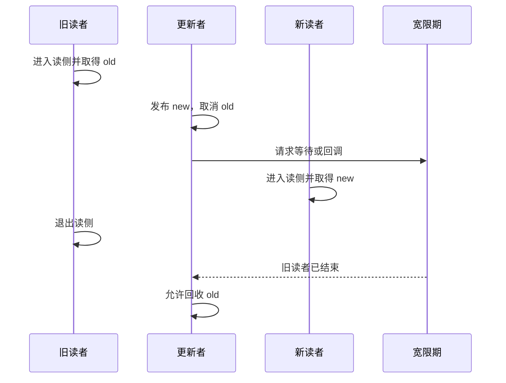

# 第2章\_RCU\_核心概念与工作机制

第一章先用读写锁与对象删除建立了直觉：更新者不必赶走已经拿到旧对象的读者，但必须推迟旧对象回收。本章开始给这条时间线上的动作正式命名，并划清各自承担的正确性责任。

## 2.1\_问题起点

RCU（Read-Copy-Update）主要解决读多写少场景中的两个问题：

1. 更新者修改共享数据时，已经拿到旧指针的读者如何继续安全访问？
2. 旧对象从共享结构中取消发布后，何时才能释放其内存？

RCU 不是“不需要同步”，而是将同步成本从高频读路径转移到低频更新与回收路径。读者通常不与写者争抢同一把锁，写者则必须处理发布顺序、写写互斥和延迟回收。

## 2.2\_四个不能混为一谈的动作

| 动作 | 解决的问题 | 常用接口 |
| --- | --- | --- |
| 标记读侧临界区 | 告诉 RCU 当前读者可能保留旧引用 | `rcu_read_lock()` / `rcu_read_unlock()` |
| 发布与取得指针 | 保证读者看到已完成初始化的对象 | `rcu_assign_pointer()` / `rcu_dereference()` |
| 从结构中取消发布 | 阻止后续读者通过该入口取得对象 | `rcu_replace_pointer()`、`list_del_rcu()` 等 |
| 等待或延迟回收 | 等待取消发布前已存在的读者结束 | `synchronize_rcu()`、`call_rcu()`、`kfree_rcu()` |

其中任何一步都不能代替另一步。例如，`list_del_rcu()` 只是取消发布，不代表旧读者已经离场；`rcu_read_lock()` 保护的是临界区内的旧引用，不是离开临界区后的长期对象所有权。

## 2.3\_最小指针替换模型

```c
struct config {
	int mode;
	struct rcu_head rcu;
};

static struct config __rcu *current_config;
static DEFINE_MUTEX(config_lock);

static int read_mode(void)
{
	struct config *cfg;
	int mode;

	rcu_read_lock();
	cfg = rcu_dereference(current_config);
	mode = cfg->mode;
	rcu_read_unlock();

	return mode;
}

static void replace_config(struct config *new)
{
	struct config *old;

	mutex_lock(&config_lock);
	old = rcu_replace_pointer(current_config, new,
				  lockdep_is_held(&config_lock));
	mutex_unlock(&config_lock);

	if (old)
		kfree_rcu(old, rcu);
}
```

这段代码中存在三层不同的正确性：

- `config_lock` 串行化多个更新者。
- RCU 发布和读侧临界区保护新旧指针的可见性与临时可解引用性。
- `kfree_rcu()` 将旧对象的最终释放延迟到宽限期之后。

## 2.4\_发布与依赖顺序

Linux 6.12.20 中，[`rcu_assign_pointer()`](../../../../research/source_reading/linux/include/linux/rcupdate.h) 对非 `NULL` 常量路径使用 `smp_store_release()`，使对象的先前初始化不会被重排到指针发布之后。

`rcu_dereference()` 不应简单理解为“所有架构上的普通 acquire load”。源码注释明确指出，它的职责包括：

- 使用 `READ_ONCE()` 类语义防止编译器合并或重新取值。
- 在需要的架构上插入依赖顺序所需的屏障。
- 通过 Sparse 与 lockdep 表达该指针受 RCU 保护，并检查读侧上下文。

因此，正确规则是使用 RCU 接口表达发布—取得契约，而不是自行将它们等价成某个固定 CPU 指令。

## 2.5\_宽限期等待的是谁

假设更新者在时刻 `T` 取消旧对象的发布，一个与该更新关联的宽限期必须覆盖所有在 `T` 之前已经开始的相关读侧临界区。它不需要等待 `T` 之后才开始的新读者。

这里必须区分“对象追踪”和“读者状态追踪”：

- Tree RCU 不记录哪个 CPU 或任务读取了对象 A，也没有按地址建立读者映射树。
- `rcu_read_lock()` / `rcu_read_unlock()` 会建立并更新读侧生命周期状态；它们不是“完全没有通知”的空壳。
- 非抢占 Tree RCU 通过禁止读侧跨越调度点，并结合 CPU 后续报告的 QS/EQS，证明 GP 前的旧读者已经结束。
- `PREEMPT_RCU` 还维护 `current->rcu_read_lock_nesting`；临界区中被抢占的任务会进入 `rcu_node->blkd_tasks`，并通过 `gp_tasks` 等状态继续阻塞相应 GP。
- 因此，RCU 子系统追踪的是“哪些 CPU／任务仍可能属于本 GP 开始前的旧读者集合”，而不是“谁正在读取地址 A”。

所谓“通知”也应按这个边界理解：CPU 的 QS/EQS 报告、调度器登记被抢占读者、任务退出最外层读侧临界区后的状态推进，都会把读者生命周期信息交给 RCU；但不存在逐对象询问或逐地址通知。



[`call_rcu()`](../../../../research/source_reading/linux/kernel/rcu/tree.c) 源码注释也明确说明：回调可以与 `call_rcu()` 之后才开始的新读侧临界区并发执行。

## 2.6\_Tree\_RCU\_如何识别宽限期

Linux 6.12.20 的 Tree RCU 不是简单地等待“所有 CPU 读计数归零”。它综合处理：

- CPU 经过调度、用户态或 idle 等静止状态。
- `CONFIG_PREEMPT_RCU` 下被抢占读者的任务状态。
- CPU hotplug、dynticks/EQS 和强制静止状态扫描。
- `rcu_data` 中的每 CPU 状态和 `rcu_node` 层次树中的聚合状态。

源码主线可以先按下表定位：

| 阶段 | Linux 6.12.20 源码入口 | 职责 |
| --- | --- | --- |
| 初始化宽限期 | `rcu_gp_init()` | 推进 `gp_seq`，并初始化 `rcu_node` 树的等待状态 |
| 处理每 CPU RCU 工作 | `rcu_core()` | 报告延后静止状态、检查 GP、加速和执行回调 |
| 向 `rcu_node` 树上报 | `rcu_report_qs_rnp()` | 清除等待位并逐层向根节点传播 |
| 注册异步回调 | `call_rcu()` | 将 `rcu_head` 交给回调子系统 |
| 同步等待 | `synchronize_rcu()` | 在可阻塞上下文等待相关 GP |

Tree RCU 的详细调用路径将在后续源码阅读章中展开，本章只建立稳定模型。

## 2.7\_读侧的调度与阻塞边界

“普通 RCU 读侧不能睡眠”是实用缩写，但不应与“读侧永远不会被抢占”混淆。[`rcu_read_lock()`](../../../../research/source_reading/linux/include/linux/rcupdate.h) 的 Linux 6.12.20 源码注释给出了更准确的边界：

- 非可抢占 RCU 实现中，读侧临界区不得阻塞。
- `PREEMPT_RCU` 下读者可以被抢占，但仍不得主动执行会阻塞的操作。
- PREEMPT_RT 存在更精细的特例，例如获取受优先级继承管理的自旋锁；普通驱动代码不应依赖这些特例。

工程上可以遵守一条更稳妥的规则：普通 RCU 读侧临界区保持短小且不主动阻塞；如果保护区必须跨越睡眠、I/O 或长时间等待，再评估 SRCU 或在读侧内取得独立引用后退出 RCU。

## 2.8\_RCU\_不保证什么

RCU 不自动保证：

- 多个写者之间的互斥。
- 对象内部多字段不变量的原子更新。
- 离开读侧临界区后对象仍然存活。
- 新读者立即观察到某一业务版本。
- 持有指针就拥有该对象的引用计数。

这些需求必须由更新锁、不变数据、seqcount、kref/refcount 或其他机制分层完成。

## 2.9\_本章验收

1. 能区分发布、取消发布、宽限期和最终回收。
2. 能解释为什么宽限期只需要覆盖既存读者。
3. 能说明 `rcu_assign_pointer()` 与 `rcu_dereference()` 的契约，而不把它们粗暴等价成固定指令。
4. 能解释 Tree RCU 为什么需要 `rcu_data`、`rcu_node` 树和静止状态。
5. 能区分“可被抢占”与“可主动阻塞”。

上一篇：[为什么需要 RCU](P01_为什么需要_RCU.md)。

下一篇：[RCU 的硬件基础与内存模型](P03_RCU_的硬件基础与内存模型.md)。

