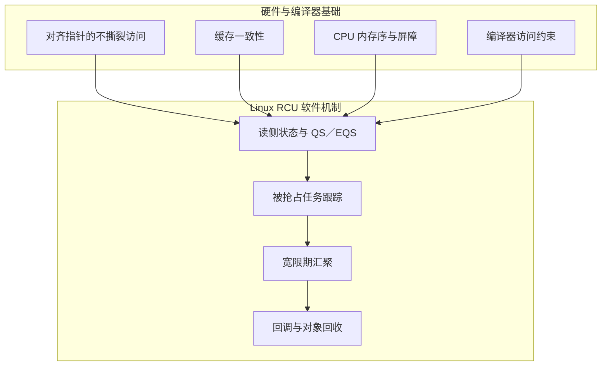

# 第3章\_RCU\_的硬件基础与内存模型

上一章给出了 RCU 的软件时间线，但还没有回答一个更底层的问题：不同 CPU 怎样可靠地看到新指针，为什么读侧可以不争用同一把共享锁？本章先拆开硬件与编译器提供的能力；下一章再讨论内核如何在这些能力之上建立读者状态与通知机制。

## 3.1\_CPU\_中没有\_RCU\_单元

RCU 是 Linux 内核软件算法，CPU 不存在专用的“RCU 硬件”。它的正确性和扩展性建立在以下基础上：

1. 自然对齐的机器字指针可以做不撕裂的单次读写。
2. 缓存一致性协议使各 CPU 最终对同一缓存行的写入达成一致。
3. CPU 内存模型和 Linux 内存屏障定义哪些操作不得跨过发布点重排。
4. 编译器约束防止共享指针读取被合并、拆分、推测或重新取值。
5. 中断、调度、上下文跟踪和每 CPU 状态给 Tree RCU 提供观测静止状态的软件钩子。

硬件只提供原子读写、一致性和排序原语；“哪些读者必须等待”、“哪个宽限期已完成”和“何时执行回调”都是内核软件的责任。



## 3.2\_缓存一致性不等于内存顺序

缓存一致性解决“同一个物理缓存行上的写入如何传播”，但不保证另一 CPU 会按源码顺序观察两个不同地址的操作。

写者可能按源码执行：

```c
new->value = 42;          /* A：初始化对象 */
global_ptr = new;         /* B：发布指针 */
```

如果没有发布顺序约束，CPU 或编译器可能让另一 CPU 先观察到 B，却还没观察到 A。此时缓存一致性仍然“正常工作”，但读者可能看到未完全初始化的对象。

Linux 6.12.20 的 `rcu_assign_pointer()` 在非 `NULL` 常量路径使用 `smp_store_release()`，用发布语义建立 A 先于 B 的契约。

## 3.3\_为什么读侧尽量不写共享状态

读写锁或全局读者计数通常需要对共享缓存行执行原子读—改—写。当多个 CPU 频繁更新同一缓存行时，该行的所有权在核心之间传递，产生 cache-line bouncing。

Tree RCU 的快速读侧避免每次进入都修改一个全局共享计数器。在 `CONFIG_PREEMPT_RCU` 下，`__rcu_read_lock()` 增加的是当前任务的 `current->rcu_read_lock_nesting`；这不是 C 语言局部变量，而是当前 `task_struct` 中的任务私有状态。只有读者在临界区内被抢占等特殊情况下，才需要将其状态挂入 `rcu_node` 的 `blkd_tasks` 等全局可见结构。

因此，更准确的说法是：

- RCU 避免了每个读者都争用同一个全局缓存行。
- 读侧并非在所有配置下都是“空宏”或“零指令”。
- 读侧仍会读取共享数据，可能发生普通 cache miss；它只是避免了某类共享写热点。

## 3.4\_读者写数据会发生什么

RCU 没有禁止 CPU 在读侧临界区执行 store 指令。“读侧”是算法角色，不是硬件特权级。如果代码修改了其他 CPU 共享的缓存行：

1. 当前 CPU 必须获得该缓存行的可写所有权。
2. 其他 CPU 中的共享副本会被一致性协议失效或更新。
3. 多 CPU 频繁写同一行时会恢复缓存行所有权传递开销。

但这不意味着每次 store 都“强制回写到 DRAM”。缓存一致性关心各级缓存对同一行的一致观察，数据可以在某个 CPU 的修改态缓存行中保留，而不必立即到达 DRAM。

更重要的是，硬件一致性不会自动维护高层 C 对象的多字段不变量。如果 RCU 读者修改对象字段，仍然需要锁、原子操作、seqcount 或其他对应同步机制。

## 3.5\_指针原子性只解决撕裂

自然对齐指针的单次读写通常不会让读者看到“一半旧地址 + 一半新地址”。但这只是 RCU 发布的最低层前提，它不解决：

- 新对象字段是否先于指针发布被观察。
- 编译器是否合并或重新取值。
- 旧对象是否仍被旧读者引用。
- 多个写者是否互相覆盖。

所以 RCU 仍需要 `WRITE_ONCE()`/`READ_ONCE()` 类约束、发布—取得契约、宽限期和写者互斥。

## 3.6\_编译器屏障与\_CPU\_屏障

Linux 6.12.20 的 PREEMPT_RCU `__rcu_read_lock()` 在增加嵌套深度后使用 `barrier()`，使临界区中的访问不被编译器移到入口之前。`__rcu_read_unlock()` 在减少嵌套深度前也使用 `barrier()`。

`barrier()` 是编译器屏障，不等于向 CPU 发出全内存屏障指令。RCU 实现在不同位置使用不同层次的顺序原语：

| 位置 | 原语示例 | 目的 |
| --- | --- | --- |
| 对象发布 | `smp_store_release()` | 对象初始化先于指针发布 |
| RCU 指针取得 | `READ_ONCE()` + 依赖顺序 | 防止错误重取值并保持地址依赖 |
| GP 序列推进 | `rcu_seq_start()` 等 | 为 GP 前后的更新建立顺序 |
| `rcu_node` 锁链 | `smp_mb__after_unlock_lock()` 类链式保证 | 把分布在 CPU 和节点上的顺序串联起来 |
| SRCU 同步返回 | `smp_mb()` | 使后续代码有序于已完成的 SRCU GP |

## 3.7\_中断和调度不是唯一物理基础

调度时钟中断是 Tree RCU 观测与促进静止状态的一个入口，`rcu_sched_clock_irq()` 会检查用户态、idle 中断以及紧急 QS 请求。但宽限期不是单纯“等所有 CPU 各发生一次时钟中断”。

Tree RCU 还会利用：

- 上下文切换与被抢占读者跟踪。
- idle/user/EQS 的 dynticks/context-tracking 计数。
- CPU hotplug 状态。
- 调度器重调度请求、irq_work 和 force-QS 扫描。
- `rcu_node` 树对所有待报告 CPU 和阻塞任务的聚合。

## 3.8\_硬件与软件的责任分界

| 问题 | 硬件/编译器机制 | RCU 软件算法 |
| --- | --- | --- |
| 指针是否撕裂 | 自然对齐机器字读写 | 使用正确类型和 `READ_ONCE()`/`WRITE_ONCE()` 封装 |
| 新对象是否完整发布 | CPU 顺序原语 | `rcu_assign_pointer()` / `rcu_dereference()` 契约 |
| 缓存副本是否一致 | cache-coherence 协议 | 避免读侧全局共享写热点 |
| 旧读者是否结束 | 硬件不知道 C 临界区语义 | 读侧标记、QS/EQS、被抢占任务跟踪和 GP |
| 旧对象能否释放 | 硬件不管理对象生命周期 | `synchronize_rcu()` / `call_rcu()` / `kfree_rcu()` |

源码证据：[`rcupdate.h`](../../../../research/source_reading/linux/include/linux/rcupdate.h)、[`tree_plugin.h`](../../../../research/source_reading/linux/kernel/rcu/tree_plugin.h)、[`tree.c`](../../../../research/source_reading/linux/kernel/rcu/tree.c)。

上一篇：[RCU 核心概念与工作机制](P02_RCU_核心概念与工作机制.md)。

下一篇：[Tree RCU 读侧与静止状态](P04_Tree_RCU_读侧与静止状态.md)。
