# 第4章\_Linux\_Tree\_RCU\_状态与通知机制

上一章已经用六个反例推出可实现 RCU 必须具备的能力。本章把这些抽象需求逐一映射到 Linux 6.12.20 Tree RCU：任务状态进入 `task_struct`，每 CPU 进度进入 `rcu_data`，分层等待集合进入 `rcu_node`，全局 GP 生命周期进入 `rcu_state`，CPU 是否处于 EQS 则由 context tracking/dynticks 表达。

硬件不知道哪一段 C 代码是 RCU 临界区，也不知道对象何时可以释放。因此， **“旧读者已经离场”必须由内核软件通过具体内存状态和跨 CPU 通信证明。** 本章固定采用“多个读者 CPU 与单个写者 CPU”的视角，沿正常上报、被抢占登记与写侧强制探测三条通信路径追踪一轮 GP。

> **源码边界：** 本章结论以 `\\192.168.31.142\work\linux\nxp\kernel\linux-imx-6.12` 的 Linux 6.12.20 为证据，优先引用 `kernel/rcu/`、`include/linux/rcupdate.h` 和相关公共调度/context-tracking 路径。

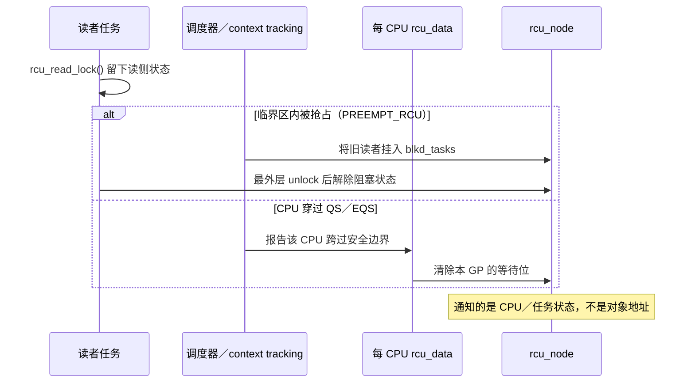

## 4.1\_固定角色视角\_多个读者\_CPU\_与单个写者\_CPU

> **这一节先看角色，不急着记字段。** 只需要分清：谁在读取旧对象、谁提出回收要求、谁替写者收集“旧读者已经离场”的证明。

先假设一个最小但足够真实的场景：CPU0、CPU1、CPU2 持续查询共享表，CPU3 偶尔替换其中一个对象并等待旧版本可以回收。

```text
CPU0：读者 R0，可能取得旧对象 A
CPU1：读者 R1，可能取得旧对象 A
CPU2：读者 R2，可能在更新后取得新对象 B
CPU3：单个写者 W，发布 B 并等待 A 可回收
```

### 4.1.1\_读者\_CPU\_负责什么

每个读者 CPU 的正常快路径只完成本地工作：

1. 当前任务进入 `rcu_read_lock()`，在任务或 CPU 本地留下读侧状态。
2. 通过 `rcu_dereference()` 取得当前发布的对象指针。
3. 在读侧区间内使用 A 或 B。
4. 退出读侧；普通退出不直接给 CPU3 发送“我读完 A”的消息。
5. 本 CPU 后续经过调度、用户态或 idle 等 QS/EQS 时，由本 CPU 的 RCU 路径记录并上报“我已经跨过本轮 GP 所需的安全边界”。

因此，读者 CPU 并非永远沉默。准确说法是： **每次读操作不跨 CPU 上报；每轮相关 GP 所需的 QS 由本 CPU 在合适事件上主动上报。**

### 4.1.2\_写者\_CPU\_负责什么

单个写者 CPU3 的业务更新路径负责：

1. 完整初始化新对象 B。
2. 将共享入口从 A 发布为 B。
3. 取消发布 A，使后来的读者不能再从该入口取得 A。
4. 请求一个宽限期，等待更新前可能取得 A 的旧读者跨过安全边界。
5. 宽限期结束后释放 A。

这里的“单个写者”只是为了先消除写写竞争对主线的干扰；RCU 本身不提供写者互斥。若系统中可能有多个写者，它们仍需额外的更新锁或单写者协议。

### 4.1.3\_为什么还要单列\_GP\_kthread

从业务视角看，CPU3 是需要同步结果的写者；从实现视角看，CPU3 通常不会亲自逐个管理其他 CPU 的报告。`synchronize_rcu()` 把请求交给普通 Tree RCU 的全局 GP 基础设施，GP kthread代表同步请求执行：

- 初始化本轮 `qsmask`，保守地等待所有相关在线 CPU。
- 接收各读者 CPU 经叶 `rcu_node` 向上汇聚的 QS 报告。
- 保留 PREEMPT_RCU 被抢占旧任务的 `blkd_tasks/gp_tasks` 状态。
- 迟迟未完成时读取远端 watching/EQS 状态，必要时催促远端调度。
- 条件满足后结束 GP，并唤醒 CPU3 上的同步等待者或放行回调。

因此，本章图中必须区分两种“写侧角色”：

```text
写者 CPU：提出“我要等旧读者结束”的业务要求。
GP kthread：代表一个或多个同步要求执行跨 CPU 状态汇聚。
```

> **阅读重点：写者负责提出回收要求，GP kthread 负责收集证明；二者不是同一个角色。**

### 4.1.4\_端到端角色关系

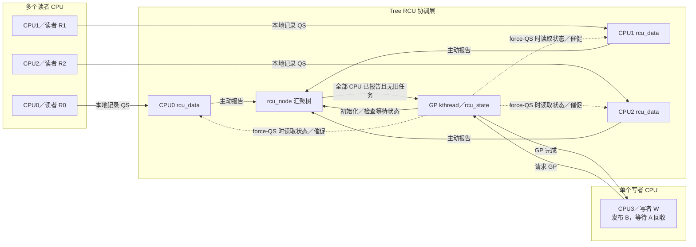

这张图先回答“谁与谁通信”。后续章节再把每条箭头落实到 `task_struct`、`rcu_data`、context tracking、`rcu_node` 和 `rcu_state` 的具体字段与源码函数。

## 4.2\_一轮宽限期就是六组状态共同推进

> **这一节是全章主干。** 先看六组状态分别回答什么问题，再沿 S0～S9 走完一轮 GP；后面的 QS、EQS、数据结构和源码函数都是这条主线的局部放大。

先纠正一个容易导致后续全部混乱的想象： **Tree RCU 中不存在一把“记录所有读者是否退出”的全局锁，也不存在一个字段能够单独回答“现在还有没有旧读者”。** 它维护的是六组彼此关联、所有权不同的状态：

| 状态轴 | 典型存储 | 它回答的问题 | 主要写入者 | 主要读取者 |
| --- | --- | --- | --- | --- |
| 任务读侧状态 | `task_struct::rcu_read_lock_nesting` | 当前任务是否仍嵌套在可抢占 RCU 读侧内 | 当前任务；调度慢路径 | 本 CPU 调度器、读侧退出慢路径 |
| 被抢占旧读者状态 | `rcu_node::blkd_tasks/gp_tasks` | 已经离开 CPU、但仍阻塞本轮 GP 的旧读者有哪些 | 发生切换的本 CPU；任务最外层退出路径 | GP 判断与节点推进路径 |
| 每 CPU 报告状态 | `rcu_data::gp_seq/core_needs_qs/cpu_no_qs` | 本 CPU 是否知道新 GP、是否仍欠本轮一个 QS | 本 CPU RCU 路径 | 本 CPU `rcu_core()`；force-QS 路径可远端观察辅助状态 |
| 分层等待状态 | `rcu_node::qsmask` | 这个叶节点或子树还有哪些 CPU/子节点没有报告 | GP 初始化路径；各 CPU 报告路径 | 节点汇聚路径、GP kthread |
| 全局 GP 状态 | `rcu_state::gp_seq/gp_state/gp_flags` | 当前是第几轮 GP、推进到哪个阶段、是否有人请求 GP | 请求路径与 GP kthread | GP kthread、等待者、各 CPU GP 检测路径 |
| CPU watching/EQS 状态 | context tracking/dynticks 状态 | CPU 是否处在不可能持有普通 RCU 读侧引用的扩展静止区 | 本 CPU 进出 idle/user 等路径 | 本 CPU RCU 路径；force-QS 扫描路径 |

> **核心结论：GP 完成不是等待某个全局读者计数归零，而是等待多组状态共同满足完成条件。**

这个组合谓词是：

```text
各层节点代表本轮的 qsmask 等待位最终全部向根收敛
且
各相关节点不存在阻塞本轮 GP 的 gp_tasks
```

**`qsmask` 提供 CPU/子树维度的证据，`gp_tasks` 提供被抢占任务维度的证据。两类证据缺一不可。**

### 4.2.1\_完整状态拓扑\_状态放在哪里以及沿哪条路流动

> **看图时沿三条线走：** 先看写者如何请求 GP，再看各 CPU 如何向叶节点提交证据，最后看叶节点如何向根汇聚并唤醒写者。虚线只表示等待过久后的 force-QS 慢路径。

下面不是抽象组件图，而是内存状态的所有权和流向图。实线表示正常路径中的写入或汇聚，虚线表示 GP 迟迟不能结束时的观察或催促。

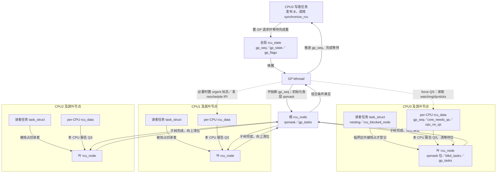

> **扩展性的关键不是取消状态，而是避免所有读者在每次读取时反复写同一个全局地址。**

通信被拆成三层：

1. 高频读路径只改当前任务或本 CPU 状态，不碰根节点。
2. 每个 CPU 每轮 GP 至多在需要报告时进入叶 `rcu_node`，清除自己的位。
3. 只有某个叶或中间节点整体完成时，报告才继续向父节点传播。

这就是 **Tree RCU 用本地状态和分层汇聚替代全局读者计数器缓存行争抢** 的核心。

### 4.2.2\_S0\_到\_S9\_一次完整通信到底怎样发生

> **读表方法：** 先纵向阅读“阶段”和“状态变化”得到时间线，再横向检查“谁写、谁读、何时结束”，确认每一步确实存在信息交互。

以下各阶段描述的是 **同一轮** GP，不是十套互不相关的机制。假设 CPU0 和 CPU1 可能仍在读取旧对象 A，CPU2 在更新后才开始读取 B，CPU3 发布 B 后调用 `synchronize_rcu()`。

| 阶段 | 触发与状态变化 | 谁写哪块状态 | 谁随后读取 | 阶段结束条件 |
| --- | --- | --- | --- | --- |
| S0 旧版本可达 | 共享入口仍指向 A；读者可能取得 A | 读者只更新自己的 nesting/抢占状态 | 本 CPU 调度与退出路径 | 写者准备好 B |
| S1 取消发布 | CPU3 用发布原语把入口从 A 换成 B | CPU3 写共享指针 | 后来的读者取得 B | A 不再能被新读者取得 |
| S2 请求 GP | 同步路径设置 GP 请求标志并唤醒 GP kthread；CPU3 睡眠等待 | 请求路径写 `rcu_state::gp_flags` 等全局请求状态 | GP kthread | GP kthread 接受请求 |
| S3 建立保守等待集 | GP kthread开始新 `gp_seq`，令各节点 `qsmask = qsmaskinit` | GP kthread写 `rcu_state` 与各 `rcu_node` | 各 CPU GP 检测路径和节点报告路径 | 所有相关 CPU 都先被列入等待集 |
| S4 CPU 得知新 GP | 各 CPU 在 RCU 核心路径比较节点/本地序号 | 本 CPU 写本地 `rdp->gp_seq`，并置 `core_needs_qs`、`cpu_no_qs` | 同一 CPU 后续的 `rcu_core()` | CPU 知道自己欠一个 QS，或已经在 EQS 中可直接证明安全 |
| S5 读者状态分流 | 未被抢占读者继续运行；临界区内被抢占的任务由本 CPU 调度器挂到叶节点 | 调度路径读 `nesting`，写 `blkd_tasks`、`gp_tasks` 和任务的 `rcu_blocked_node` | 节点完成判断、任务退出慢路径 | 旧读者要么仍由 CPU 等待位代表，要么已转换为共享任务记录 |
| S6 本 CPU 观察到 QS | 上下文切换、idle/user/EQS 等软件认可事件证明本 CPU 已跨边界 | 本 CPU 执行 `rcu_qs()`，令本地 `cpu_no_qs=false` | 本 CPU `rcu_core()` | 本地已有“可以报告”的证据 |
| S7 报告并逐层汇聚 | `rcu_core()` 发现本轮需要 QS 且本地证据已出现 | 本 CPU 锁叶节点，清 `qsmask` 中自己的位；节点归零才向父层清位 | 父节点报告路径、GP kthread | 根的 CPU/子树等待位全清；被抢占旧任务也须退出 |
| S8 必要时强制探测 | 等待过久，GP kthread扫描仍在 `qsmask` 中的 CPU | 协调路径读远端 watching/dynticks；必要时写 urgent 标志或发送 reschedule IPI | 远端 CPU 中断/调度/RCU 路径 | 远端产生并上报可用证据；不是直接替它伪造 QS |
| S9 完成并唤醒 | 根节点没有欠报子树且没有阻塞本轮的 `gp_tasks` | 根报告路径唤醒 GP kthread；清理路径推进完成序号并完成等待量 | CPU3 的同步等待路径、回调推进路径 | CPU3 返回并可安全释放 A |

这里有三个非常关键的状态转换：

```text
任务本地 nesting
    --[临界区内被调度出去]-->
叶节点 blkd_tasks/gp_tasks

CPU 本地 cpu_no_qs=false
    --[本 CPU rcu_core 取得叶节点锁并提交]-->
叶节点 qsmask 清位

叶节点 qsmask=0 且无阻塞旧任务
    --[逐层向父节点汇聚]-->
根节点完成 -> GP kthread -> 等待写者
```

- **本地状态变成共享状态：** 任务在临界区内被抢占后，`nesting` 对应的读者事实转入 `blkd_tasks/gp_tasks`。
- **本地证据变成节点证据：** 本 CPU 形成 QS 后，由 `rcu_core()` 把结果提交到叶节点 `qsmask`。
- **局部证据变成全局结论：** 叶节点完成后逐层向根汇聚，最终唤醒等待写者。

这三条转换分别回答： **任务离开 CPU 后谁还记得它、本地知道安全后协调者怎样知道、多个 CPU 的分散证据怎样合成为可回收结论。**

### 4.2.3\_端到端时序\_主动报告与远端催促在哪里相遇

> **这张图重点观察两个分支：** 正常 CPU 主动提交 QS；被抢占任务则先进入共享链表，直到最外层 `rcu_read_unlock()` 才解除对 GP 的阻塞。

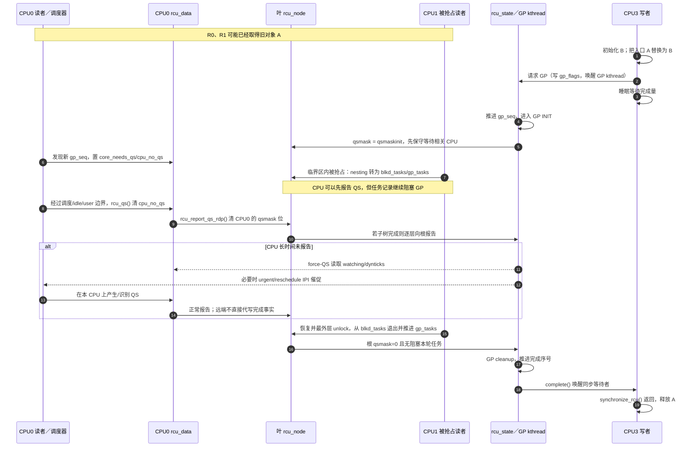

> **正常通信主线：GP 建立等待集合 → 各 CPU 本地形成证据 → 各 CPU 主动清除自己的分层等待位 → 根节点完成 → 唤醒写者。**

正常路径既不是写者逐个读取所有 `current->rcu_read_lock_nesting`，也不是每次 `rcu_read_unlock()` 都向写者发消息。只有读者在临界区内被抢占时，任务的 nesting 才被转换成节点上的共享阻塞记录；等待过久时，GP 才通过远端状态读取和 IPI 催促补上慢路径。

### 4.2.4\_谁会跨\_CPU\_访问谁的缓存行

> **不要把“低成本”读成“零成本”。** 真正要比较的是：成本发生在每次读取、每轮 GP，还是仅发生在异常慢路径。

必须把“低成本”落实到缓存行访问上：

| 路径 | 是否通常跨 CPU | 原因 |
| --- | --- | --- |
| 每次 `rcu_read_lock/unlock()` | 否 | 主要修改当前任务或当前 CPU 的状态，不争抢一个全局读计数 |
| GP 初始化节点 `qsmask` | 是，但按 GP 发生 | GP kthread为本轮建立共享等待集合，不发生在每次读取上 |
| CPU 提交 QS 到叶节点 | 是，但按 CPU、按 GP 汇聚 | 各 CPU 会取得叶节点锁并清自己的位；多个 CPU 可能争用同一叶节点缓存行 |
| 被抢占读者登记/退出 | 是，但只在慢路径 | 调度器把必须跨 CPU/跨调度持续存在的信息写入共享节点链表 |
| force-QS 扫描 | 是，但只在超时/催促路径 | 协调者读取远端 watching/dynticks，必要时触发 IPI |

> **成本边界：RCU 不是没有通信成本，而是把成本从每次读取转移到每轮 GP、每 CPU 报告和少数异常慢路径。**

当读取次数远大于更新和 GP 次数时，这种成本重排才有扩展性价值。

后续各节都是这台状态机的源码放大图：读侧配置解释 S0/S5 的本地状态，QS/EQS 解释 S6 的证据，数据结构拓扑解释六组状态的地址，通知源码解释 S2–S9 的具体函数。阅读时应始终回到这张阶段表，而不是把后文误解为几套独立机制。

## 4.3\_读侧入口怎样形成本地状态

`rcu_read_lock()` 是公共封装，内部调用 `__rcu_read_lock()`。Linux 6.12.20 存在两条重要路径：

| 配置 | 进入读侧 | 退出读侧 |
| --- | --- | --- |
| `CONFIG_PREEMPT_RCU=y` | 增加 `current->rcu_read_lock_nesting` | 减少 nesting；最外层退出时处理 deferred QS/被抢占读者等特殊状态 |
| 非 PREEMPT_RCU | `preempt_disable()` | `preempt_enable()`，严格 GP 配置下还可触发额外处理 |

因此，“`rcu_read_lock()` 是空宏”不是通用结论。正确结论是：快速路径尽量不修改全局共享计数器，且将昂贵记账推迟到抢占、最外层退出或 GP 推进等慢路径。

`lock` 在这里表示读侧生命周期区间，不表示对某个对象加互斥锁。普通 Tree RCU 的调用不接收对象参数，因此它不会登记“当前任务正在读取地址 A”；但这不等于读侧没有状态或没有通知机制。读侧入口/出口、调度器、context tracking 和每 CPU RCU 路径共同留下足以判定旧读者集合是否跨过安全边界的状态。

这一结论可以直接从仓库中的 Linux 6.12.20 源码得到：

| 源码位置 | 可以确认的事实 |
| --- | --- |
| `include/linux/rcupdate.h::__rcu_read_lock()` | 非 PREEMPT_RCU 进入时调用 `preempt_disable()`，退出时调用 `preempt_enable()` |
| `kernel/rcu/tree_plugin.h::__rcu_read_lock()` | PREEMPT_RCU 增加 `current->rcu_read_lock_nesting`；源码注释说明发生阻塞时才更新共享状态 |
| `kernel/rcu/tree_plugin.h::rcu_note_context_switch()` | 调度器发现嵌套深度大于零时，将任务登记到 `blkd_tasks`；随后 CPU 本身可以报告 QS |
| `kernel/rcu/tree.h::rcu_node` | `qsmask` 表示当前 GP 仍需报告的 CPU／子节点，`gp_tasks` 指向阻塞当前 GP 的第一个任务 |

因此，“没有逐对象登记”不能推导出“没有读者状态”；源码采用的是任务、CPU 和层次节点三个粒度的保守状态。

### 4.3.1\_所谓\_通知机制\_具体通知什么

RCU 的确有通知和状态推进机制，但不是读者调用 `rcu_read_unlock()` 后直接向某个写者发送“对象 A 已读完”的消息。通知内容是：

```text
某 CPU 已经为当前 GP 跨过 QS/EQS
或者
某个阻塞当前 GP 的 PREEMPT_RCU 任务已经退出最外层读侧区间
```

两条主要通知链如下：

```text
非 PREEMPT_RCU：
rcu_read_lock() -> preempt_disable()
    ...读侧区间...
rcu_read_unlock() -> preempt_enable()
    ↓ 后续上下文切换 / user / idle / CPU offline 等观测点
记录本 CPU QS/EQS
    ↓ rcu_report_qs_rdp() / rcu_report_qs_rnp()
清除叶节点 qsmask 位并逐层向根传播

PREEMPT_RCU 被抢占读者：
rcu_read_lock() -> current->rcu_read_lock_nesting++
    ↓ 临界区内发生 context switch
rcu_note_context_switch()
    ↓
任务进入 rcu_node->blkd_tasks，必要时由 gp_tasks 标记为阻塞当前 GP
    ↓ 任务恢复并执行最外层 rcu_read_unlock()
rcu_read_unlock_special() / rcu_preempt_deferred_qs()
    ↓
任务出链，gp_tasks 推进；条件满足时继续向上报告
```

因此，`rcu_read_unlock()` 是读者生命周期结束的重要输入，但普通 GP 的完整通知链还包括调度器、context tracking、每 CPU RCU 状态和 `rcu_node` 树；不能把 unlock 单独等同于 GP 完成通知。

## 4.4\_QS/EQS\_是硬件还是软件实现

> **先抓住分类：** 硬件只提供执行模式、中断、原子操作和内存序等事实；把这些事实解释成 QS/EQS，并记录为 GP 证据的是 Linux 软件。

先给出明确结论：

> QS 和 EQS 都是 Linux RCU 定义、记录和解释的 **软件概念**，不是 ARM 或其他 CPU 提供的 RCU 硬件状态。硬件不会产生一个名为“QS”的信号，也不会替内核判断某个 RCU 旧对象已经无人使用。

硬件只提供构造这套证明所需的基础能力，例如当前特权级、异常和中断入口、定时器、原子操作、内存序及缓存一致性。Linux 的调度器、context tracking、dynticks 和 Tree RCU 软件把上下文切换、用户态、idle、CPU offline 等事件解释为 RCU 可以使用的证据，再把证据记录到每 CPU `rcu_data`、任务状态和 `rcu_node` 树中。

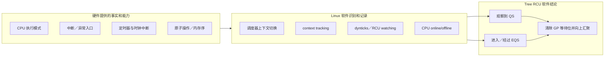

### 4.4.1\_QS\_是一个软件认可的证明事件

对某一普通 Tree RCU 宽限期而言，静止状态（Quiescent State，QS）是一个可以证明“当前 CPU 已经不可能仍在执行该 GP 开始前的非可抢占读侧临界区”的 **观测事件**。

以非 PREEMPT_RCU 为例，普通读侧通过 `preempt_disable()` 保证任务不能在临界区中被调度出去。因此一旦调度器真的完成一次上下文切换，RCU 就能利用下面的软件不变量进行推理：

```text
若旧读侧临界区禁止抢占，
而 CPU 已完成上下文切换，
则切换之后该 CPU 不可能仍在执行切换之前的旧读侧临界区。
```

RCU 把这次上下文切换认可为 QS。这里 CPU 硬件只执行了普通指令和上下文恢复；“它足以证明旧读者已经离开”是 Linux 根据读侧契约得出的软件结论。

常见 QS 证据包括：

- 经过上下文切换。
- 进入或经过用户态。
- 进入或经过 idle/EQS，且相关 IRQ/NMI 嵌套已经按规则处理。
- CPU 下线路径完成相应报告。

这些事件不是天然等价的硬件信号，而是内核不同子系统在明确入口和出口处调用 context tracking、调度或 RCU 接口留下记录，RCU 核心随后检查和消费这些记录。

### 4.4.2\_EQS\_是由软件维护的一段持续区间

扩展静止状态（Extended Quiescent State，EQS）不是“更强的 CPU 休眠指令”，而是一段 RCU 可以认为该 CPU **持续不承载普通内核 RCU 读侧临界区** 的时间区间。典型场景是：

```text
CPU 进入用户态
或者
CPU 进入 idle，且当前没有需要 RCU 继续观察的 IRQ/NMI 执行
```

QS 更像一个已经跨过安全边界的事件，EQS 更像一个持续成立的软件状态：

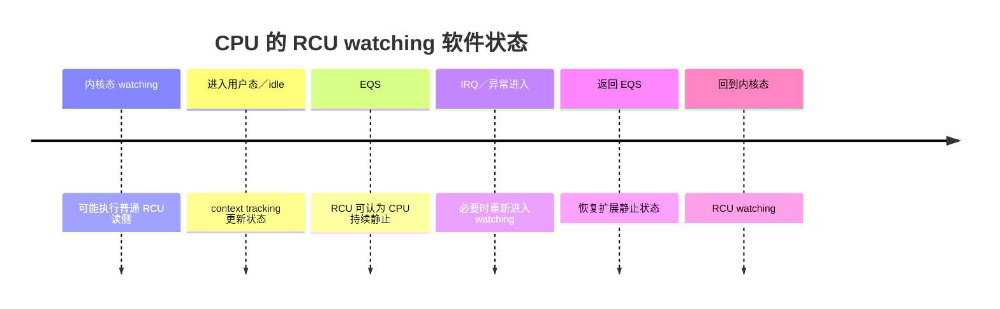

Linux 6.12.20 使用 context tracking/dynticks 的 `RCU_WATCHING` 状态和序列变化记录这种区间。`rcu_watching_snap_in_eqs()` 判断快照是否位于 EQS，`rcu_watching_snap_stopped_since()` 比较前后快照，判断 CPU 自某个观察点以来是否曾经过 EQS。这里读取的是内核维护的软件计数和状态，不是在读取某个“CPU 的 RCU 寄存器”。

### 4.4.3\_硬件事件为什么不能直接等同于\_QS/EQS

即使硬件告诉内核“CPU 当前在用户态”或“发生了一次中断”，单凭这个瞬时事实仍不足以完成 RCU 证明：

- CPU 进入 idle 后可能被 IRQ/NMI 打断，处理程序又可能执行 RCU 保护的代码。
- PREEMPT_RCU 任务可能在读侧临界区中被抢占；原 CPU 已经切换任务，不代表被抢占的旧读者已经结束。
- 远端 CPU 当前不活跃，不等于它在本次 GP 开始以后确实跨过了安全边界。
- CPU online/offline 和 NO_HZ_FULL 会改变常规调度 tick 是否存在，不能依赖单一时钟中断作为证明。

因此，软件必须同时记录“当前是否 watching”“是否自 GP 快照以来穿过 EQS”“是否有被抢占旧读者”“该 CPU 是否仍在本次 GP 的等待位图中”等状态，再按内存序要求汇聚结果。

| 层次 | 典型载体 | 职责 |
| --- | --- | --- |
| 任务级 | `rcu_read_lock_nesting`、`blkd_tasks` | 跟踪 PREEMPT_RCU 被抢占读者 |
| CPU 级 | `rcu_data`、context tracking/dynticks 状态 | 记录 CPU 对当前 GP 的观察和 QS/EQS 进展 |
| 节点级 | `rcu_node->qsmask`、`gp_tasks` | 汇聚子 CPU/节点报告并保留阻塞 GP 的任务 |
| GP 级 | `gp_seq`、GP kthread | 判断本轮宽限期是否完成并推进回调 |

### 4.4.4\_QS\_不等于读者计数归零

QS 不是“某个读者计数变为 0”的同义词，也不是所有 CPU 同时处于空闲状态。Tree RCU 要证明的是： **本次 GP 开始前可能存在的旧读者已经分别跨过安全边界**。各 CPU 可以在不同时间报告，后来进入的新读者也不阻止这一轮 GP 完成。

非可抢占路径可以主要根据 CPU 的调度/EQS 轨迹判断，可抢占 RCU 则还必须独立跟踪被抢占的任务读者。因此，CPU 报告 QS 后，挂在 `rcu_node->blkd_tasks` 中的旧任务仍可能继续阻塞 GP。

`rcu_read_unlock()` 也不能在所有配置下直接画等号为“CPU 已报告 QS”。例如 PREEMPT_RCU 任务退出最外层临界区时会更新任务读者状态；CPU 的 QS 报告则可能发生在上下文切换、用户态、idle 或其他 RCU 观测路径。两类状态最终共同服务于 GP 判定，但不是同一个事件。

## 4.5\_状态存在哪里\_Tree\_RCU\_的数据结构拓扑

> **这一节回答“地址在哪里”。** 阅读时不要孤立背字段，而要把每个字段放回 S0～S9：它在哪个阶段被谁写入，又在哪个阶段被谁消费。

RCU 的通知不可能脱离内存中的状态存在。Tree RCU 的扩展性也不是“不要状态”，而是把原来集中在一个读写锁字中的状态拆到不同所有者的内存区域，再用层次节点汇聚。

可以先用一个简化对比建立直觉：

```text
传统读写锁：
    CPU0 ─┐
    CPU1 ─┼─> 同一个 lock->state 地址
    CPU2 ─┤    每次 read_lock/unlock 都可能原子修改
    CPU3 ─┘

Tree RCU：
    任务 T0 -> T0 的 task_struct RCU 字段
    CPU0   -> CPU0 的 rcu_data/context-tracking 区
    CPU1   -> CPU1 的 rcu_data/context-tracking 区
    CPU2   -> CPU2 的 rcu_data/context-tracking 区
    CPU3   -> CPU3 的 rcu_data/context-tracking 区
                    ↓ 发生 QS 时批量汇聚
              叶 rcu_node -> 父 rcu_node -> 根
```

这里说的“每个 CPU 有自己的访问区”不是比喻。`struct rcu_data` 是真正的 per-CPU 变量：同一字段名在每个 CPU 上对应不同内存实例。正常情况下 CPU0 使用 `this_cpu_ptr(&rcu_data)` 访问 CPU0 实例，CPU1 访问 CPU1 实例，因此它们修改 `cpu_no_qs` 时不会共同写同一个地址。

### 4.5.1\_五类状态对象分别解决什么问题

Linux 6.12.20 的普通 Tree RCU 至少涉及五类状态载体：

| 粒度 | 数据结构或状态 | 典型字段 | 主要问题 |
| --- | --- | --- | --- |
| 每任务 | `task_struct` | `rcu_read_lock_nesting`、`rcu_node_entry`、`rcu_blocked_node` | PREEMPT_RCU 任务是否在读侧，以及被抢占后挂在哪个节点 |
| 每 CPU | `struct rcu_data` | `gp_seq`、`cpu_no_qs`、`core_needs_qs`、`mynode`、`grpmask` | 本 CPU 是否已认识当前 GP、是否已经经过 QS、向哪个叶节点报告 |
| 每 CPU context tracking | RCU watching/dynticks 状态 | watching 序列与快照 | CPU 是否处于/经过 EQS，供本地记录和远端 force-QS 检查 |
| 每层节点 | `struct rcu_node` | `qsmask`、`qsmaskinit`、`blkd_tasks`、`gp_tasks`、`parent` | 汇聚一组 CPU/子节点的 QS，并保留被抢占旧任务 |
| 全局 GP | `struct rcu_state` | `gp_seq`、`gp_kthread`、`gp_flags`、`gp_state`、`node[]` | 管理宽限期代际、GP kthread、强制 QS 时机和整棵汇聚树 |

这五类对象不是五份重复的“是否在临界区”布尔值，而是不同层次的证明材料：

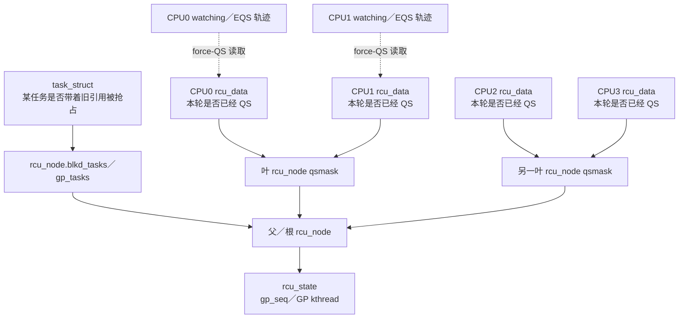

### 4.5.2\_每任务区\_为什么\_nesting\_不等于已经通知远端

`task_struct` 中的相关字段在 `CONFIG_PREEMPT_RCU` 下真实存在：

```c
int              rcu_read_lock_nesting;
union rcu_special rcu_read_unlock_special;
struct list_head rcu_node_entry;
struct rcu_node *rcu_blocked_node;
```

`rcu_read_lock_nesting` 是当前任务自己的地址。任务执行 `rcu_read_lock()` 时写这个地址，目的首先是让 **同一任务的退出路径和本 CPU 调度器** 知道它是否位于读侧。只写 nesting 不会自动使远端 CPU 收到中断，也不会自动更新 `rcu_node`。

当本 CPU 即将调度走该任务时，`rcu_note_context_switch()` 读取 nesting。如果它大于零，调度器才使用同一 `task_struct` 中的 `rcu_node_entry`，把任务链接到共享 `rcu_node->blkd_tasks`。此时状态经历了明确转换：

```text
任务私有状态：T->rcu_read_lock_nesting > 0
        ↓ 本 CPU 调度器观察到上下文切换
共享可见状态：T->rcu_node_entry 挂入 rcu_node->blkd_tasks
        ↓
GP 通过 rcu_node->gp_tasks 知道仍有旧任务读者
```

因此，nesting 是通知链的 **本地输入**，不是通知已经完成后的共享信箱。

### 4.5.3\_每\_CPU\_区\_各自写自己的\_rcu_data

`struct rcu_data` 中与普通 GP 最直接相关的字段是：

```c
unsigned long    gp_seq;       /* 本 CPU 认识的 GP 代际 */
union rcu_noqs   cpu_no_qs;    /* 本 CPU 本轮是否还欠一个 QS */
bool             core_needs_qs;
struct rcu_node *mynode;       /* 本 CPU 对应的叶节点 */
unsigned long    grpmask;      /* 本 CPU 在叶 qsmask 中的位 */
int              watching_snap;
bool             rcu_urgent_qs;
bool             rcu_need_heavy_qs;
```

可以把四核系统想象成四块不同地址的内存：

```text
per-CPU base + CPU0 offset -> rcu_data[CPU0]
per-CPU base + CPU1 offset -> rcu_data[CPU1]
per-CPU base + CPU2 offset -> rcu_data[CPU2]
per-CPU base + CPU3 offset -> rcu_data[CPU3]
```

正常 QS 路径中，CPU2 执行 `__this_cpu_write(rcu_data.cpu_no_qs..., false)`，只写 `rcu_data[CPU2]`。CPU0、CPU1、CPU3 不需要争用这个地址。随后 CPU2 的 `rcu_core()` 再把这个本地结果批量提交到共享叶节点。

远端 GP kthread在 force-QS 时也可以通过 `per_cpu_ptr(&rcu_data, cpu)` 找到某个 CPU 的 `rcu_data` 地址，读取 watching 快照或设置 urgent 标志。这种远端访问确实会通过缓存一致性协议取相应缓存行，但只发生在 GP 扫描慢路径，而不是每个读者进入和退出时发生。

### 4.5.4\_节点区\_为什么要用树而不是一个全局位图

`struct rcu_node` 是 CPU 状态从“各自一块”走向“全局 GP 结论”的共享汇聚点。关键字段的源码语义非常直接：

| 字段 | 含义 |
| --- | --- |
| `qsmaskinit` | 每轮 GP 开始时应等待哪些 CPU/子节点 |
| `qsmask` | 当前 GP 仍未报告的 CPU/子节点位图 |
| `grpmask` | 本节点在父节点 `qsmask` 中对应的那一位 |
| `parent` | 上一级汇聚节点 |
| `blkd_tasks` | 在 RCU 读侧中被抢占的任务列表 |
| `gp_tasks` | 第一个仍阻塞当前普通 GP 的任务，空表示没有这种阻塞者 |
| `lock` | 保护本节点共享位图和任务列表的内部自旋锁 |

如果所有 CPU 都直接原子修改一个全局位图，CPU 很多时根缓存行仍会成为热点。Tree RCU 让 CPU 先在叶节点内汇聚：只有一个叶节点的所有 CPU 位都清零后，才由最后一个报告者到父节点清除代表整组 CPU 的一位。

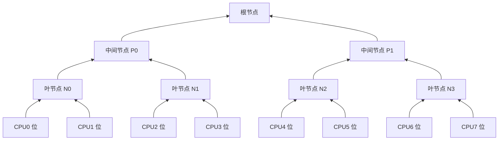

这棵树仍有共享锁和共享缓存行，只是把争用限制在局部节点，并把多次 CPU 报告压缩成较少的父节点更新。

### 4.5.5\_全局区\_谁代表需要同步的人推进\_GP

`struct rcu_state` 保存整套普通 Tree RCU 的全局 GP 状态，其中：

```c
struct rcu_node node[NUM_RCU_NODES];
unsigned long   gp_seq;
struct task_struct *gp_kthread;
struct swait_queue_head gp_wq;
short gp_flags;
short gp_state;
unsigned long jiffies_force_qs;
```

调用 `synchronize_rcu()` 的写者并不是自己逐个访问所有 CPU 状态。它把同步请求接入 `rcu_state` 管理的 GP 请求/等待机制；GP kthread负责初始化 `qsmask`、等待节点报告、执行 force-QS 扫描和结束 GP，最后唤醒同步等待者或推进回调。

因此，“需要同步的人自己去每个 CPU 区拿状态”只描述了 force-QS 的一部分。完整实现是推拉结合：

```text
正常路径（push）：
    每个 CPU 自己记录 QS
    -> 自己的 rcu_core 把结果推到叶节点
    -> 节点逐层推到根

慢路径（pull + request）：
    GP kthread查看仍未清零的 qsmask
    -> 主动读取对应 CPU 的 watching/EQS 状态
    -> 必要时写 urgent 标志或发送重调度请求
    -> 促使远端 CPU 走正常上报路径
```

### 4.5.6\_用地址读写关系总结数据流

| 动作 | 谁执行 | 读取地址 | 写入地址 | 是否普通读侧每次发生 |
| --- | --- | --- | --- | --- |
| 进入读侧 | 当前任务 | 本任务 nesting | 本任务 nesting | 是 |
| 退出读侧 | 当前任务 | 本任务 nesting/special | 本任务 nesting，必要时节点任务链 | 是，但共享节点仅特殊路径 |
| 任务被抢占 | 本 CPU 调度器 | 当前任务 nesting | 叶节点 `blkd_tasks/gp_tasks` | 否 |
| 本 CPU 经过 QS | 本 CPU 调度/RCU 路径 | 本 CPU `rcu_data` | 本 CPU `cpu_no_qs` | 否，按 QS/GP 发生 |
| QS 向树报告 | 本 CPU `rcu_core` | 本 CPU `rcu_data`、节点 `qsmask` | 叶到根的 `qsmask` | 否，每轮相关 GP 报告 |
| force-QS 扫描 | GP kthread | 远端 watching/`rcu_data`、节点 `qsmask` | 节点位图、远端 urgent 标志 | 否，GP 慢路径 |
| 催促远端 | GP kthread | 未报告 CPU 位图 | 重调度请求/IPI | 否，必要时 |

至此可以把你的直觉修正成一句实现级描述：

> Tree RCU 把每次读侧都要修改的集中锁字，拆成任务私有状态、每 CPU 状态和较低频更新的层次共享节点；正常情况下由各 CPU 主动向上汇聚，GP 久等时再由 GP kthread按未完成位图读取远端状态并催促。通知依赖的确是这些具体内存地址及其缓存一致性、锁和内存序协议。

## 4.6\_通知机制的源码实现\_谁知道读者还在临界区

> **这一节回答“代码怎样推进状态”。** 重点不是孤立记忆函数名，而是核对 S2～S9 的每一次状态转换，都能在 Linux 6.12.20 源码中找到写入者、存储地址和读取者。

前文只说明了状态种类，还没有回答最关键的问题：

> 如果 `rcu_read_lock()` 不直接通知远端写者，远端怎么知道当前 CPU 或任务还在读侧临界区？

答案不是“远端随时知道每一个活动读者”，而是 Tree RCU 使用一种更保守、也更便宜的证明方法： **GP 开始时假定所有在线 CPU 都可能承载旧读者；此后只要每个 CPU 证明自己跨过了一个 GP 开始之后的 QS，并另外等完所有已经登记的被抢占旧任务，就足以结束 GP。**

```text
GP 不需要先知道：CPU2 此刻正在读对象 A。
GP 只需要知道：     CPU2 在本轮 GP 开始以后，是否已经跨过一个
                    不可能继续承载旧读者的安全边界。
```

### 4.6.1\_先看完整通信图\_谁写状态\_谁读状态\_谁通知谁

Tree RCU 不是没有通信，而是把通信从“每次读侧进入/退出”移到“GP 开始、QS 发生、任务被抢占、GP 强制推进”这些事件上。下面这张关系图先固定每个角色负责的动作和共享载体：

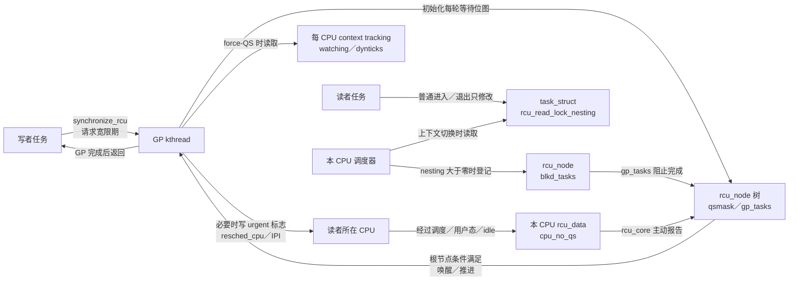

读图时要注意四种不同方向的交互：

| 交互 | 主动方 | 接收或被访问方 | 发生时机 |
| --- | --- | --- | --- |
| GP 请求 | 写者任务 | GP 子系统/kthread | `synchronize_rcu()` 或回调需要新 GP |
| 正常 QS 上报 | 本 CPU 的 `rcu_core()` | 叶 `rcu_node`，再逐层到根 | 本 CPU 在本轮 GP 后经过 QS |
| 被抢占读者登记 | 本 CPU 调度器 | `rcu_node->blkd_tasks` | nesting 非零的任务发生上下文切换 |
| 远端探测和催促 | GP kthread | 远端 watching 状态和远端 CPU | 未报告 CPU 使 GP 等待过久 |

下面是一次完整 GP 的端到端时序。它同时画出正常上报、被抢占读者和强制 QS 三条路径：

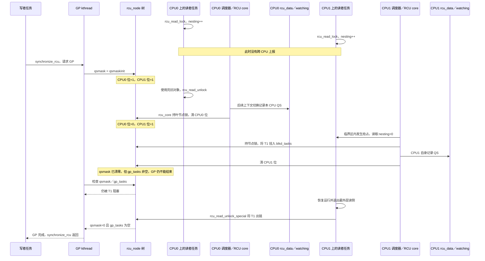

如果某个 CPU 迟迟没有像上图那样主动报告，时序会进入 force-QS 分支：

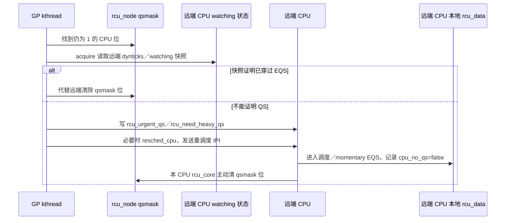

因此，通信流程可以压缩成下面四句话，但不能再少：

```text
普通读侧：只留本地状态，不跨 CPU 通信。
发生 QS： 本 CPU 主动把本轮完成状态报告到 rcu_node 树。
读者被抢占：本 CPU 调度器主动把任务登记到共享阻塞列表。
GP 久等：  GP kthread主动读取远端状态，并可能用 IPI 催促远端上报。
```

### 4.6.2\_第一步\_GP\_先等待所有在线\_CPU

调用 `synchronize_rcu()` 的任务不会亲自循环读取其他 CPU 的 `rcu_read_lock_nesting`。它提出宽限期请求，随后主要由 RCU GP kthread 推进本轮 GP。

在 Linux 6.12.20 的 [`rcu_gp_init()`](../../../../research/source_reading/linux/kernel/rcu/tree.c) 中，每个 `rcu_node` 都执行：

```c
rnp->qsmask = rnp->qsmaskinit;
```

`qsmaskinit` 表示该节点当前在线 CPU/子节点的初始位图，复制到 `qsmask` 后，含义是：

```text
qsmask 某位为 1：本轮 GP 仍在等待这个 CPU／子节点给出 QS 证明
qsmask 某位清 0：这个 CPU／子节点已经完成本轮报告
```

注意这里没有先询问“哪个 CPU 正处于读侧”。GP 直接保守地等待所有相关在线 CPU 各自经过一个安全边界。这样就不需要在每次读侧进入时把任务身份广播给写者。

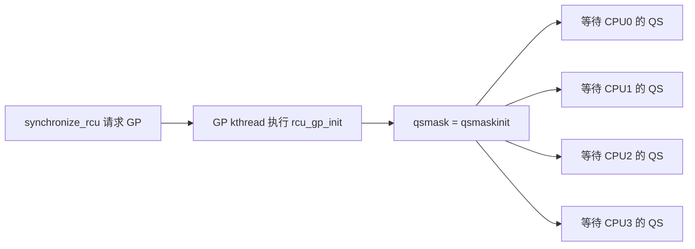

### 4.6.3\_第二步\_nesting\_只在需要时转换成共享通知

在 PREEMPT_RCU 中，`rcu_read_lock()` 的快速路径只增加：

```c
current->rcu_read_lock_nesting++;
```

这个字段表达的是 **当前任务** 的读侧嵌套深度，而不是“当前 CPU 的全局 RCU 状态”。任务可能从 CPU0 迁移到 CPU1，所以状态必须跟着 `task_struct` 走。

它确实是 RCU 判断任务是否在临界区的重要依据，但正常情况下，远端 GP kthread不会轮询这个字段。源码 [`tree_plugin.h::__rcu_read_lock()`](../../../../research/source_reading/linux/kernel/rcu/tree_plugin.h) 上方的注释明确说明：

```text
只增加 rcu_read_lock_nesting；如果任务发生阻塞，才更新共享状态。
```

真正的转换点是本 CPU 的调度路径 `rcu_note_context_switch()`：

```c
if (rcu_preempt_depth() > 0 && !t->...blocked) {
    raw_spin_lock_rcu_node(rnp);
    t->...blocked = true;
    t->rcu_blocked_node = rnp;
    rcu_preempt_ctxt_queue(rnp, rdp);
}
rcu_qs();
```

这段代码的因果关系是：

1. 调度器在 **即将切走当前任务的本 CPU** 上读取 `current->rcu_read_lock_nesting`。
2. 若 nesting 大于零，说明该任务可能仍握着旧 RCU 指针；CPU 即将运行其他任务，不能再用“等待这个 CPU 经过 QS”代表原任务结束。
3. 调度器取得叶 `rcu_node` 的自旋锁，把任务挂入共享 `blkd_tasks`，并让 `gp_tasks` 等状态阻止当前 GP。
4. 登记完成后，CPU 自身可以执行 `rcu_qs()`，因为旧任务已经从“CPU 上的潜在读者”转换成“树上显式登记的被抢占读者”。
5. 原任务以后恢复运行并退出最外层 `rcu_read_unlock()` 时，`rcu_read_unlock_special()` 将它从共享阻塞列表移除；最后一个阻塞者消失后，GP 才能继续向上报告。

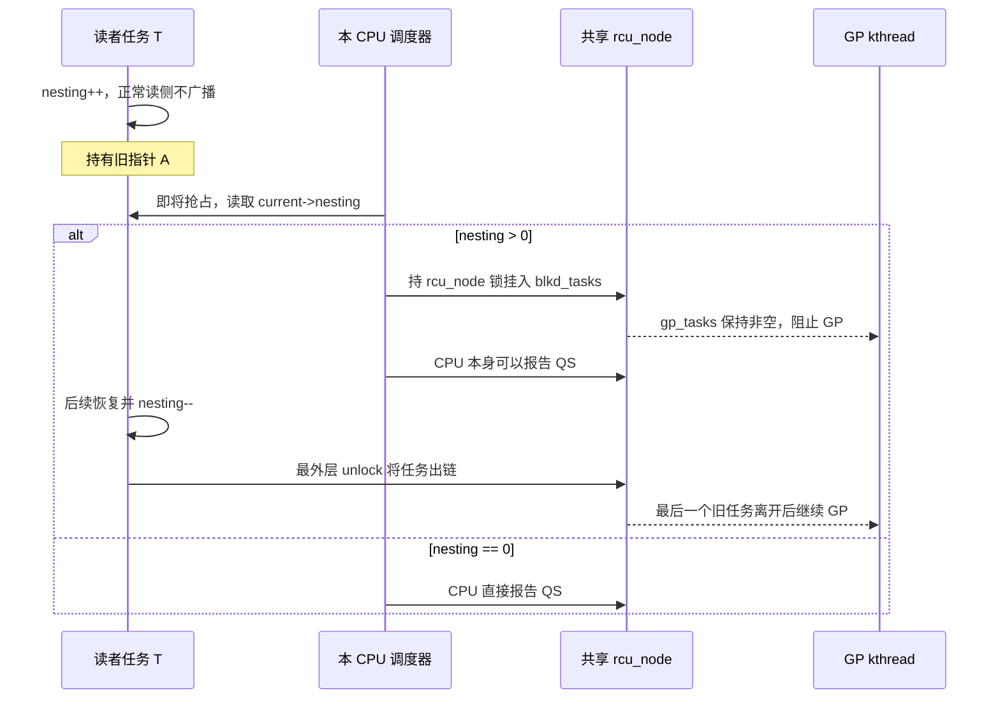

因此，`current->rcu_read_lock_nesting` 可以称为 **本任务留给本地 RCU/调度路径的临界区状态**，但不能称为“已经通知其他 CPU 的共享状态”。只有发生抢占等需要跨 CPU 保留读者身份的情况，它才由调度器转换为 `rcu_node->blkd_tasks` 中的共享通知。

### 4.6.4\_第三步\_CPU\_怎样主动完成本轮\_QS\_报告

当本 CPU 经过调度 QS 时，`rcu_note_context_switch()` 调用 `rcu_qs()`。Linux 6.12.20 的普通 GP 路径先执行：

```c
__this_cpu_write(rcu_data.cpu_no_qs.b.norm, false);
```

这一步只修改本 CPU 的 `rcu_data`，含义是“本 CPU 已观察到本轮所需的 QS”。它仍是便宜的本地记录，还没有立即走完整棵共享树。

随后本 CPU 的 RCU softirq 或 `rcuc` kthread 执行：

```text
rcu_core()
  -> rcu_check_quiescent_state(rdp)
     -> rcu_report_qs_rdp(rdp)
        -> rcu_report_qs_rnp(mask, leaf_rnp, gp_seq, flags)
```

`rcu_report_qs_rdp()` 的源码明确要求“必须在被报告的 CPU 上调用”，然后取得本 CPU 所属叶 `rcu_node` 的锁。`rcu_report_qs_rnp()` 清除 `qsmask` 中代表本 CPU/子节点的位：

```c
WRITE_ONCE(rnp->qsmask, rnp->qsmask & ~mask);
```

若该节点还有其他 CPU 未报告，函数就释放锁返回；只有节点的 `qsmask` 已清零且不存在阻塞旧任务时，才取得父节点锁并向上一层清位。这样多个 CPU 的报告逐层合并，避免所有 CPU 每次都争用根节点同一条缓存行。

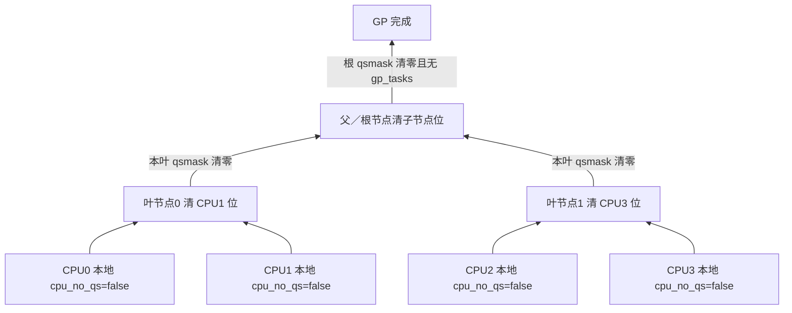

这就是普通情况下真正的“通知”： **CPU 先在本地记录 QS，再由本 CPU 的 RCU 核心路径持节点锁，把本轮完成位逐层传播给 GP。** 它当然有自旋锁、缓存一致性和内存屏障成本，只是按 GP、按 CPU 的 QS 批量发生，而不是每次 `rcu_read_lock()`/`unlock()` 都发生。

### 4.6.5\_第四步\_迟迟不报告时远端会不会读取缓存行

会。你的直觉在 **强制 QS 慢路径** 上是成立的，只是读取的通常不是远端任务的 `rcu_read_lock_nesting`，执行者也不一定是最初调用 `synchronize_rcu()` 的写者 CPU。

GP kthread 在 `rcu_gp_fqs_loop()` 中等待；到达 force-QS 时机后，`force_qs_rnp()` 只扫描 `qsmask` 中仍未报告的 CPU，并调用 dynticks/context-tracking 检查函数读取远端 CPU 的 watching 快照：

```c
rdp->watching_snap = ct_rcu_watching_cpu_acquire(rdp->cpu);
```

如果前后快照表明远端 CPU 已经进入或穿过 EQS，GP 路径可以替它清除相应 `qsmask` 位。如果 CPU 长时间停留在内核态而没有可确认的 QS，RCU 会设置远端每 CPU 的 `rcu_urgent_qs`/`rcu_need_heavy_qs` 等状态；必要时 `force_qs_rnp()` 最后调用：

```c
resched_cpu(cpu);
```

这可能通过架构的重调度 IPI 促使远端 CPU 进入调度路径并产生 QS。读取远端 context-tracking 状态、写远端每 CPU 标志、取得 `rcu_node` 锁以及发送 IPI，都会通过缓存一致性和中断机制产生真实成本。

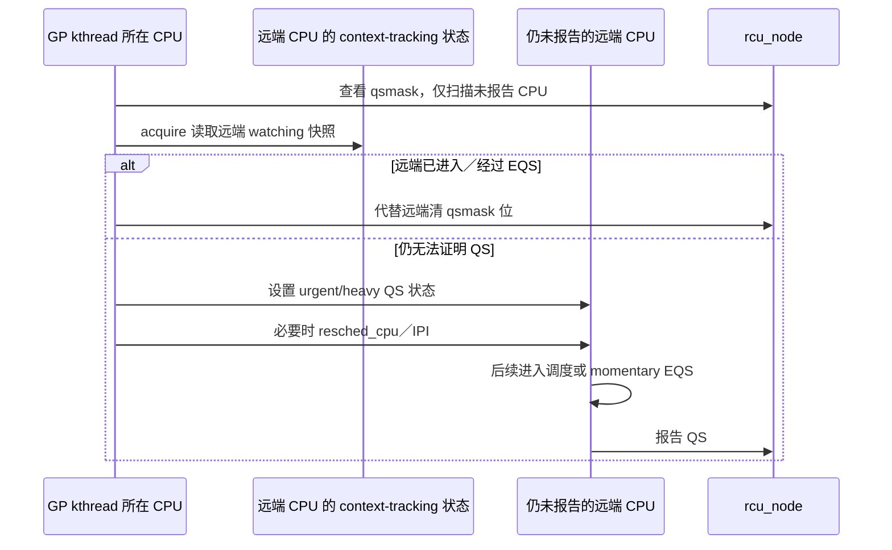

所以 RCU 不是“没有跨 CPU 通知”，而是把跨 CPU 通知从每次读操作移到了较低频的 GP 推进和异常慢路径：

| 路径 | 是否触碰跨 CPU 共享状态 | 典型频率 |
| --- | --- | --- |
| 普通 `rcu_read_lock()`/`unlock()` | 通常不触碰统一全局计数；主要修改任务/CPU 本地状态 | 每次读取 |
| 本 CPU 经过 QS | 本地记录，随后持叶节点锁清位并分层传播 | 每 CPU、每相关 GP 至少一次 |
| 读者在临界区被抢占 | 持 `rcu_node` 锁登记 `blkd_tasks` | 特殊事件 |
| force-QS | 读取远端 watching 状态，可能设置远端标志或发重调度 IPI | GP 延迟时的慢路径 |

这就是“低成本而不是无成本”的准确落点：成本没有消失，而是从“所有高频读者共同修改一个锁字”，转成“每轮 GP 所需的本地 QS 记录、分层节点汇聚、少数被抢占读者登记，以及必要时的远端扫描/IPI”。

### 4.6.6\_用一句完整的话回答通知问题

> Tree RCU 不要求写者实时知道每个读者是否在临界区。GP 开始时先保守等待所有在线 CPU；每个 CPU 在 GP 之后经过 QS 时，由本 CPU 的 RCU 路径把完成位逐层报告到 `rcu_node` 树。PREEMPT_RCU 任务若带着 `rcu_read_lock_nesting` 被抢占，本 CPU 调度器才把它登记为共享的 `blkd_tasks`；GP 久等时再由 GP kthread读取远端 context-tracking 状态并可能发送重调度请求。

这套设计避免了每次读侧进入/退出都通知写者，却仍通过本地记录、事件触发登记、分层共享位图和远端慢路径检查，给出可验证的宽限期完成条件。

## 4.7\_扩展静止状态\_EQS

CPU 长时间处于 idle 或用户态时，可能不运行内核 RCU 读侧。Tree RCU 通过 context tracking/dynticks 计数判断 CPU 是否：

- 已进入 EQS。
- 自 GP 快照以来曾经穿越 EQS。
- 当前是否有 IRQ/NMI 使 CPU 重新处于 RCU watching 状态。

`rcu_watching_snap_save()` 保存某 CPU 的 watching 快照，`rcu_watching_snap_recheck()` 后续检查它是否已经进入或经过 dynticks idle。如果是，可以代替该 CPU 报告 QS。

## 4.8\_可抢占读者为什么要挂到树上

PREEMPT_RCU 中，任务可在 RCU 读侧临界区内被抢占。被抢占后，CPU 可以继续运行其他任务甚至经过 QS，但原任务仍然保留旧 RCU 指针。

`rcu_note_context_switch()` 因此执行两件事：

1. 将临界区内被抢占的任务排入对应 `rcu_node->blkd_tasks`。
2. 允许 CPU 本身报告 QS，但用 `gp_tasks` 等指针阻止 GP 越过这些旧任务读者。

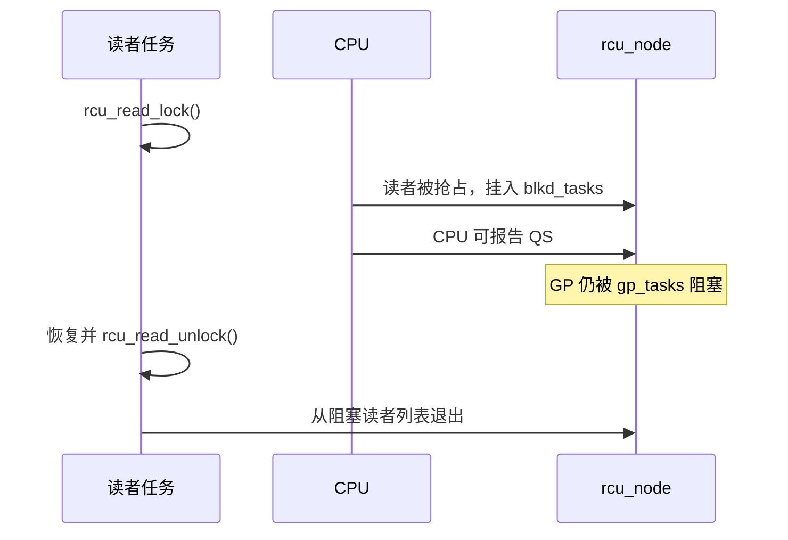

## 4.9\_调度时钟中断的作用

`rcu_sched_clock_irq()` 在调度时钟中断中：

- 更新当前 CPU 的 GP tick 统计。
- 检查 GP 是否正在紧急等待该 CPU 的 QS。
- 必要时设置 `need_resched` 促进上下文切换。
- 检查当前是否在用户态或从 idle 进入中断，并进行 QS 记录。
- 在存在 RCU 工作时触发 `rcu_core()`。

它是促进器和观测点，不是 RCU 正确性的唯一来源。NO_HZ_FULL CPU 可以长时间没有调度 tick，Tree RCU 仍需要通过 dynticks 快照、force-QS 扫描和远程重调度请求等路径推进 GP。

## 4.10\_读侧为什么不能随意阻塞

非 PREEMPT_RCU 依赖禁止抢占使读侧不跨过上下文切换。PREEMPT_RCU 虽可跟踪“被抢占”的读者，但主动睡眠会把读侧生命期与任意等待链耦合，可导致 GP 长时间被阻塞，并产生锁依赖问题。

工程规则仍是：普通 RCU 读侧保持短小、不主动阻塞；必须跨阻塞时用 SRCU 或在 RCU 中安全获取独立引用。

## 4.11\_源码入口

- [`rcupdate.h`](../../../../research/source_reading/linux/include/linux/rcupdate.h)：读侧公共封装和非 PREEMPT_RCU 实现。
- [`tree_plugin.h`](../../../../research/source_reading/linux/kernel/rcu/tree_plugin.h)：PREEMPT_RCU nesting、context switch 与 blocked readers。
- [`tree.c`](../../../../research/source_reading/linux/kernel/rcu/tree.c)：dynticks/EQS 快照、`rcu_sched_clock_irq()` 和 force-QS。

上一篇：[RCU 机制完善：硬件与运行约束](P03_RCU_机制完善_硬件与运行约束.md)。

下一篇：[Tree RCU 初始化、拓扑与执行上下文](P05_Tree_RCU_初始化_拓扑与执行上下文.md)。
