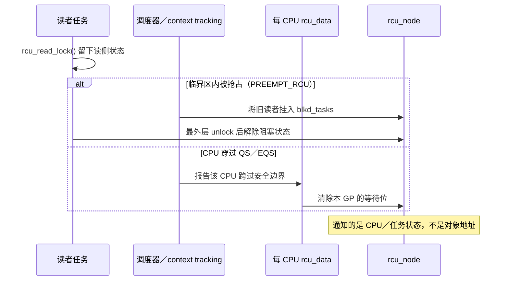
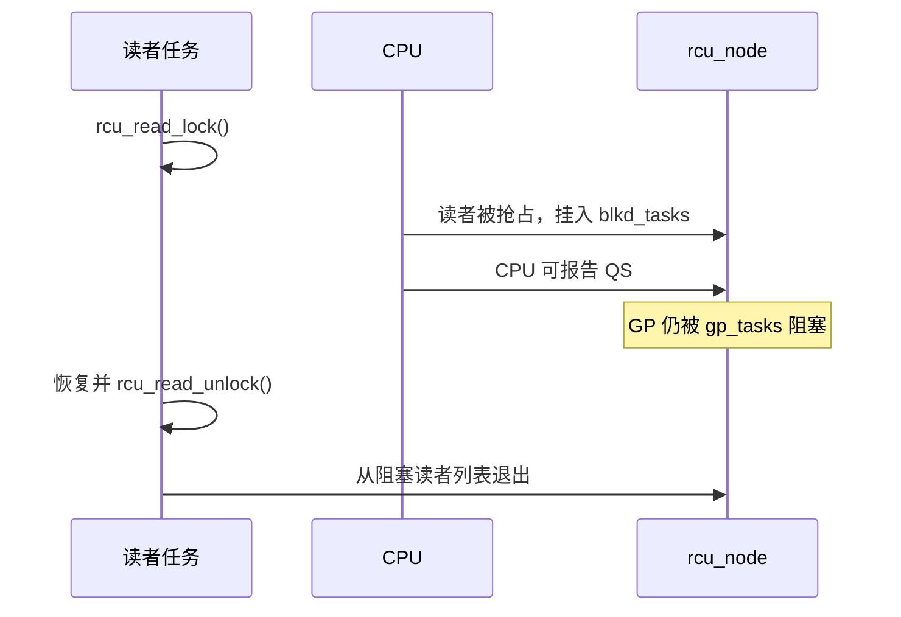

# 第4章\_Tree\_RCU\_读侧与静止状态

硬件不知道哪一段 C 代码是 RCU 临界区，也不知道对象何时可以释放。因此，“旧读者已经离场”必须由内核软件证明。本章从读侧入口开始，追踪任务、CPU、调度器和上下文跟踪怎样留下并更新状态，也就是 RCU 真正的通知机制。



## 4.1\_读侧的真实代价取决于配置

`rcu_read_lock()` 是公共封装，内部调用 `__rcu_read_lock()`。Linux 6.12.20 存在两条重要路径：

| 配置 | 进入读侧 | 退出读侧 |
| --- | --- | --- |
| `CONFIG_PREEMPT_RCU=y` | 增加 `current->rcu_read_lock_nesting` | 减少 nesting；最外层退出时处理 deferred QS/被抢占读者等特殊状态 |
| 非 PREEMPT_RCU | `preempt_disable()` | `preempt_enable()`，严格 GP 配置下还可触发额外处理 |

因此，“`rcu_read_lock()` 是空宏”不是通用结论。正确结论是：快速路径尽量不修改全局共享计数器，且将昂贵记账推迟到抢占、最外层退出或 GP 推进等慢路径。

`lock` 在这里表示读侧生命周期区间，不表示对某个对象加互斥锁。普通 Tree RCU 的调用不接收对象参数，因此它不会登记“当前任务正在读取地址 A”；但这不等于读侧没有状态或没有通知机制。读侧入口/出口、调度器、context tracking 和每 CPU RCU 路径共同留下足以判定旧读者集合是否跨过安全边界的状态。

这一结论可以直接从仓库中的 Linux 6.12.20 源码得到：

| 源码位置 | 可以确认的事实 |
| --- | --- |
| `include/linux/rcupdate.h::__rcu_read_lock()` | 非 PREEMPT_RCU 进入时调用 `preempt_disable()`，退出时调用 `preempt_enable()` |
| `kernel/rcu/tree_plugin.h::__rcu_read_lock()` | PREEMPT_RCU 增加 `current->rcu_read_lock_nesting`；源码注释说明发生阻塞时才更新共享状态 |
| `kernel/rcu/tree_plugin.h::rcu_note_context_switch()` | 调度器发现嵌套深度大于零时，将任务登记到 `blkd_tasks`；随后 CPU 本身可以报告 QS |
| `kernel/rcu/tree.h::rcu_node` | `qsmask` 表示当前 GP 仍需报告的 CPU／子节点，`gp_tasks` 指向阻塞当前 GP 的第一个任务 |

因此，“没有逐对象登记”不能推导出“没有读者状态”；源码采用的是任务、CPU 和层次节点三个粒度的保守状态。

### 4.1.1\_调用规则到底是什么

普通 Tree RCU 的最小调用规则不是“调用一对 lock/unlock 就万事大吉”，而是以下完整契约：

| 参与者 | 必须执行的顺序 | 不能省略的边界 |
| --- | --- | --- |
| 读者 | `rcu_read_lock()` → `rcu_dereference()` → 使用对象/复制所需字段/安全增引用 → `rcu_read_unlock()` | 未取得独立引用时，裸指针不得逃出读侧区间 |
| 更新者 | 完整初始化新状态 → 用更新锁串行化写者 → `rcu_assign_pointer()`/`rcu_replace_pointer()` 发布并取得旧对象 → 解除更新锁 | RCU 不提供写写互斥；发布接口不等于回收接口 |
| 同步回收者 | 取消发布 → `synchronize_rcu()` → 显式释放旧对象 | 只能在允许阻塞的上下文执行；不得在普通 RCU 读侧内等待同一域 GP |
| 异步回收者 | 取消发布 → `call_rcu()`/`kfree_rcu()` → 立即返回 | 回调或释放发生在相关 GP 后，不是调用时立即发生 |

```c
/* 读者：裸指针只在保护区内有效 */
rcu_read_lock();
p = rcu_dereference(global_ptr);
if (p)
	use_object(p);
rcu_read_unlock();

/* 更新者：写写互斥、取消发布和延迟回收是三件事 */
new = alloc_and_init();
mutex_lock(&update_lock);
old = rcu_replace_pointer(global_ptr, new,
			  lockdep_is_held(&update_lock));
mutex_unlock(&update_lock);
if (old)
	kfree_rcu(old, rcu);
```

### 4.1.2\_所谓\_通知机制\_具体通知什么

RCU 的确有通知和状态推进机制，但不是读者调用 `rcu_read_unlock()` 后直接向某个写者发送“对象 A 已读完”的消息。通知内容是：

```text
某 CPU 已经为当前 GP 跨过 QS/EQS
或者
某个阻塞当前 GP 的 PREEMPT_RCU 任务已经退出最外层读侧区间
```

两条主要通知链如下：

```text
非 PREEMPT_RCU：
rcu_read_lock() -> preempt_disable()
    ...读侧区间...
rcu_read_unlock() -> preempt_enable()
    ↓ 后续上下文切换 / user / idle / CPU offline 等观测点
记录本 CPU QS/EQS
    ↓ rcu_report_qs_rdp() / rcu_report_qs_rnp()
清除叶节点 qsmask 位并逐层向根传播

PREEMPT_RCU 被抢占读者：
rcu_read_lock() -> current->rcu_read_lock_nesting++
    ↓ 临界区内发生 context switch
rcu_note_context_switch()
    ↓
任务进入 rcu_node->blkd_tasks，必要时由 gp_tasks 标记为阻塞当前 GP
    ↓ 任务恢复并执行最外层 rcu_read_unlock()
rcu_read_unlock_special() / rcu_preempt_deferred_qs()
    ↓
任务出链，gp_tasks 推进；条件满足时继续向上报告
```

因此，`rcu_read_unlock()` 是读者生命周期结束的重要输入，但普通 GP 的完整通知链还包括调度器、context tracking、每 CPU RCU 状态和 `rcu_node` 树；不能把 unlock 单独等同于 GP 完成通知。

## 4.2\_静止状态的含义

对某一普通 Tree RCU 宽限期而言，静止状态（Quiescent State，QS）是一个可以证明“当前 CPU 不再执行该 GP 开始前的非可抢占读侧临界区”的观测点。

常见观测包括：

- 经过上下文切换。
- 进入或经过用户态。
- 进入 idle/EQS，且没有仍在执行的 IRQ/NMI 嵌套。
- CPU 下线路径完成相应报告。

QS 不是“某个读者计数变为 0”的同义词。非可抢占路径可以主要根据 CPU 的调度/EQS 轨迹判断，可抢占 RCU 则还必须独立跟踪被抢占的任务读者。

`rcu_read_unlock()` 也不能在所有配置下直接画等号为“CPU 已报告 QS”。例如 PREEMPT_RCU 任务退出最外层临界区时会更新任务读者状态；CPU 的 QS 报告则可能发生在上下文切换、用户态、idle 或其他 RCU 观测路径。两类状态最终共同服务于 GP 判定，但不是同一个事件。

## 4.3\_扩展静止状态\_EQS

CPU 长时间处于 idle 或用户态时，可能不运行内核 RCU 读侧。Tree RCU 通过 context tracking/dynticks 计数判断 CPU 是否：

- 已进入 EQS。
- 自 GP 快照以来曾经穿越 EQS。
- 当前是否有 IRQ/NMI 使 CPU 重新处于 RCU watching 状态。

`rcu_watching_snap_save()` 保存某 CPU 的 watching 快照，`rcu_watching_snap_recheck()` 后续检查它是否已经进入或经过 dynticks idle。如果是，可以代替该 CPU 报告 QS。

## 4.4\_可抢占读者为什么要挂到树上

PREEMPT_RCU 中，任务可在 RCU 读侧临界区内被抢占。被抢占后，CPU 可以继续运行其他任务甚至经过 QS，但原任务仍然保留旧 RCU 指针。

`rcu_note_context_switch()` 因此执行两件事：

1. 将临界区内被抢占的任务排入对应 `rcu_node->blkd_tasks`。
2. 允许 CPU 本身报告 QS，但用 `gp_tasks` 等指针阻止 GP 越过这些旧任务读者。



## 4.5\_调度时钟中断的作用

`rcu_sched_clock_irq()` 在调度时钟中断中：

- 更新当前 CPU 的 GP tick 统计。
- 检查 GP 是否正在紧急等待该 CPU 的 QS。
- 必要时设置 `need_resched` 促进上下文切换。
- 检查当前是否在用户态或从 idle 进入中断，并进行 QS 记录。
- 在存在 RCU 工作时触发 `rcu_core()`。

它是促进器和观测点，不是 RCU 正确性的唯一来源。NO_HZ_FULL CPU 可以长时间没有调度 tick，Tree RCU 仍需要通过 dynticks 快照、force-QS 扫描和远程重调度请求等路径推进 GP。

## 4.6\_读侧为什么不能随意阻塞

非 PREEMPT_RCU 依赖禁止抢占使读侧不跨过上下文切换。PREEMPT_RCU 虽可跟踪“被抢占”的读者，但主动睡眠会把读侧生命期与任意等待链耦合，可导致 GP 长时间被阻塞，并产生锁依赖问题。

工程规则仍是：普通 RCU 读侧保持短小、不主动阻塞；必须跨阻塞时用 SRCU 或在 RCU 中安全获取独立引用。

## 4.7\_源码入口

- [`rcupdate.h`](../../../../research/source_reading/linux/include/linux/rcupdate.h)：读侧公共封装和非 PREEMPT_RCU 实现。
- [`tree_plugin.h`](../../../../research/source_reading/linux/kernel/rcu/tree_plugin.h)：PREEMPT_RCU nesting、context switch 与 blocked readers。
- [`tree.c`](../../../../research/source_reading/linux/kernel/rcu/tree.c)：dynticks/EQS 快照、`rcu_sched_clock_irq()` 和 force-QS。

上一篇：[RCU 的硬件基础与内存模型](P03_RCU_的硬件基础与内存模型.md)。

下一篇：[Tree RCU 宽限期与回调机制](P05_Tree_RCU_宽限期与回调机制.md)。
