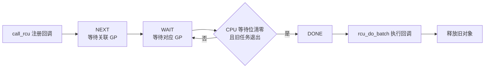
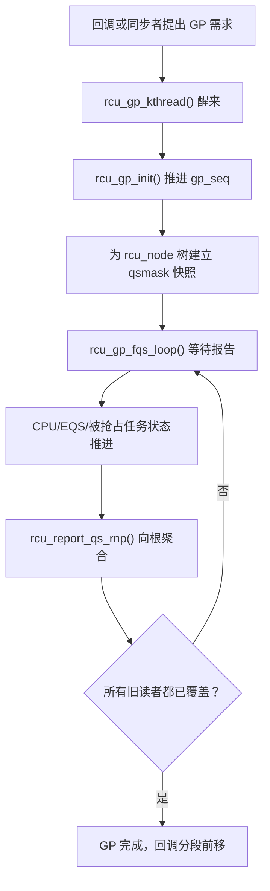

# 第5章\_Tree\_RCU\_宽限期与回调机制

上一章已经说明单个 CPU 或被抢占任务怎样暴露“我是否仍可能承载旧读者”。这一章继续回答：这些分散的通知怎样沿层次树汇聚，何时足以证明一个宽限期完成，以及完成后为什么回调还要经过另一段队列推进过程。



## 5.1\_宽限期是一个分布式判定过程

一个 Tree RCU GP 需要证明：在 GP 开始前已存在的相关读侧临界区已经全部结束。这不是对某个对象的引用计数，而是对 CPU 和被抢占任务的执行轨迹做保守判定。

因此，写者既不会查询“对象 A 当前被谁引用”，也不是毫无依据地等一段时间。GP 初始化出的 `qsmask`、各 CPU 的 QS/EQS 状态，以及 PREEMPT_RCU 的 `blkd_tasks`/`gp_tasks`，明确表示哪些 CPU 或任务仍可能承载 GP 前的旧读者。RCU 等待这些状态被真实推进，而不是等待一个固定超时。

## 5.2\_rcu\_data\_rcu\_node\_和\_rcu\_state

| 层次 | 职责 |
| --- | --- |
| `rcu_data` | 每 CPU 保存 GP 快照、QS 状态、dynticks 跟踪和回调列表 |
| `rcu_node` | 一个节点聚合一组 CPU/子节点的 QS，并跟踪被抢占读者 |
| `rcu_state` | 全局 GP 序列、GP 线程、层次树和全局调度状态 |

`rcu_node->qsmask` 中的位表示当前 GP 仍在等待哪些 CPU 或子节点。叶节点的位清零后，`rcu_report_qs_rnp()` 向父节点逐层上报；根节点的等待位全部清零且没有仍在阻塞本 GP 的旧任务读者时，GP 才能完成。

源码中的完成判定不是抽象比喻：`rcu_gp_init()` 将各节点的 `qsmask` 初始化为 `qsmaskinit`；`rcu_report_qs_rnp()` 清除已报告的位，并在 `qsmask != 0` 或 `gp_tasks != NULL` 时停止向上汇报。只有本层位全部清零且没有阻塞当前 GP 的任务，报告才能继续传播到根节点。

## 5.3\_宽限期线程主线



`rcu_gp_init()` 使用 `rcu_seq_start()` 推进 `gp_seq`，再处理 CPU online/offline 缓冲状态并初始化各层节点。`rcu_gp_fqs_loop()` 负责正常等待和必要时的 force-quiescent-state 扫描。

### 5.3.1\_GP\_完成后如何通知等待者和回调系统

读者状态不会逐个唤醒调用 `synchronize_rcu()` 的写者。CPU/任务状态先汇聚到 `rcu_node` 根节点；最后一项 GP 条件满足后，RCU core 完成 GP 序列推进，再分别处理两类消费者：

```text
QS/EQS 与 blocked-task 状态
    ↓ rcu_report_qs_rnp() 逐层传播
根节点确认 qsmask == 0 且无阻塞当前 GP 的 gp_tasks
    ↓
GP 完成，gp_seq 推进
    ├─ 同步等待链：完成 synchronize_rcu() 对应请求，唤醒阻塞调用者
    └─ 异步回调链：rcu_advance_cbs() 把满足 GP 的回调推进到 DONE
                         ↓
                     rcu_core()/nocb CB 线程执行回调
```

这里有三种不同的“通知”，不能混写：

1. CPU/任务向 RCU core 报告自身已跨过安全边界。
2. RCU 层次树向 GP core 汇报本轮等待条件已收敛。
3. GP core 在 GP 完成后唤醒同步等待者，或使异步回调获得执行资格。

整个过程都不包含“对象 A 的最后一个实际读者通知写者”，因为 Tree RCU 从未建立对象到读者的映射。

## 5.4\_强制静止状态扫描不是强制结束读者

Force-QS 路径不会粗暴地杀死或跳过旧读者。它主要：

- 重新检查某 CPU 是否已经穿越 EQS。
- 检查 CPU 是否已下线。
- 对长时间在内核运行的 CPU 发出 urgent-QS/重调度提示。
- 对 NO_HZ_FULL CPU 使用远程 reschedule/irq_work 促进观测点出现。
- 如实等待仍在 `blkd_tasks` 中的旧 PREEMPT_RCU 读者。

## 5.5\_为什么回调列表要分段

`rcu_segcblist` 把回调划分为四个逻辑段：

| 段 | 含义 |
| --- | --- |
| `RCU_DONE_TAIL` | 已经等过目标 GP，可以执行 |
| `RCU_WAIT_TAIL` | 已绑定某个正在等待的 GP |
| `RCU_NEXT_READY_TAIL` | 下一次 GP 开始后可进入 WAIT |
| `RCU_NEXT_TAIL` | 刚加入，尚未与具体 GP 建立关联 |

这个结构使回调可以批量共享 GP，并在 GP 序列推进时通过调整尾指针快速前移，而不是遍历每个回调对象重新判定。

## 5.6\_call\_rcu()到回调执行

`call_rcu()` 调用 `__call_rcu_common()` 将 `rcu_head` 放入当前 CPU 的回调系统。后续路径大致为：

```text
call_rcu()
  → 排入 rcu_data.cblist
  → rcu_accelerate_cbs() 为回调关联 GP
  → GP 完成后 rcu_advance_cbs() 推进分段
  → rcu_core()
  → rcu_do_batch()
  → func(struct rcu_head *)
```

`rcu_core()` 还会处理静止状态、检查 GP 进度和回调负载。当 `CONFIG_RCU_NOCB_CPU` 启用时，部分 CPU 的回调可被 offload 给 nocb GP/CB 线程，减少对被隔离 CPU 的干扰。

## 5.7\_同步等待与回调屏障

- `synchronize_rcu()` 等待一个覆盖调用前旧读者的 GP。
- `call_rcu()` 使回调在相关 GP 后异步执行。
- `rcu_barrier()` 等待调用前已排队的 RCU 回调真正执行完毕。

GP 完成不等于所有回调代码已执行，这是 `synchronize_rcu()` 与 `rcu_barrier()` 不能混用的根本原因。

## 5.8\_源码入口

- [`tree.h`](../../../../research/source_reading/linux/kernel/rcu/tree.h)：三层数据结构。
- [`tree.c`](../../../../research/source_reading/linux/kernel/rcu/tree.c)：GP 线程、QS 聚合、`rcu_core()` 和回调执行。
- [`rcu_segcblist.h`](../../../../research/source_reading/linux/include/linux/rcu_segcblist.h) 与 [`rcu_segcblist.c`](../../../../research/source_reading/linux/kernel/rcu/rcu_segcblist.c)：回调分段。
- [`tree_nocb.h`](../../../../research/source_reading/linux/kernel/rcu/tree_nocb.h)：回调 offload。

上一篇：[Tree RCU 读侧与静止状态](P04_Tree_RCU_读侧与静止状态.md)。

下一篇：[RCU 种类与内核配置](P06_RCU_种类与内核配置.md)。
