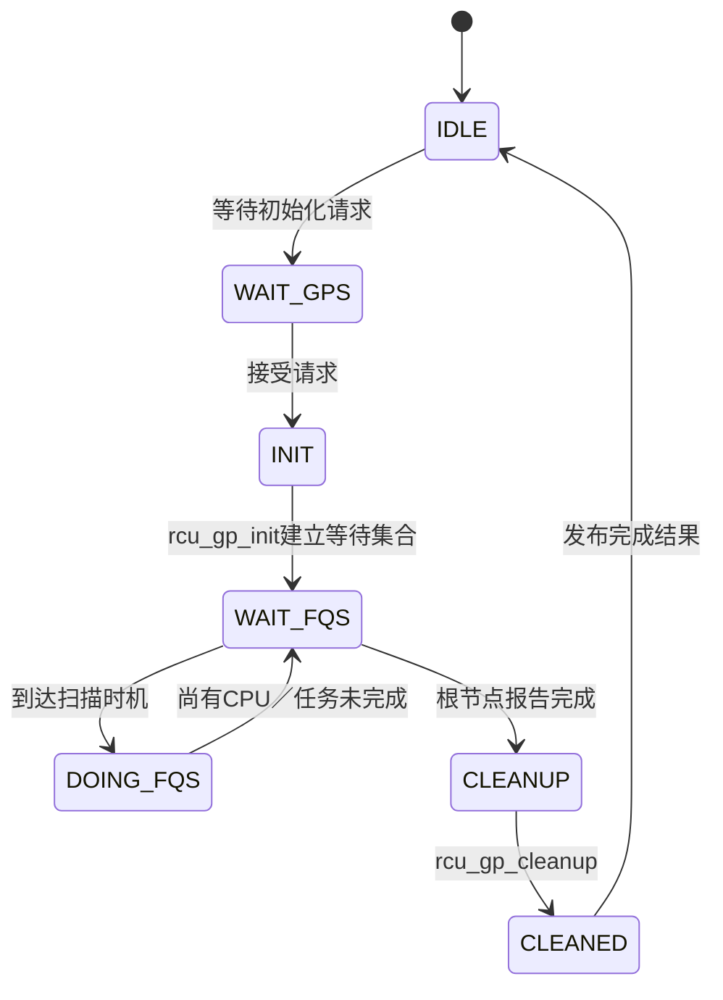

# 第6章\_Tree\_RCU\_GP请求与全局生命周期

本章只追踪全局 GP，不展开单个读者怎样形成 QS，也不展开回调分段。它回答：谁提出请求、请求写到哪里、GP kthread为何醒来、如何进入等待循环、根完成后如何清理并交付结果。

## 6.1\_请求不是调用者亲自扫描\_CPU

同步等待、回调推进和轮询接口最终都可能要求一个新 GP。请求路径在全局状态中设置初始化请求，例如 `rcu_state.gp_flags` 的 `RCU_GP_FLAG_INIT`，并唤醒 `rcu_state.gp_kthread`。业务写者随后等待完成或继续运行，不负责逐 CPU 管理 `qsmask`。

## 6.2\_GP\_kthread主状态机

`rcu_gp_kthread()` 主循环调用 `rcu_gp_init()`、`rcu_gp_fqs_loop()` 和 `rcu_gp_cleanup()`。`gp_state` 主要用于表达和观测阶段，真正完成条件仍来自节点等待位和被抢占任务状态。

## 6.3\_gp\_seq怎样划分代际

`gp_seq` 不只是布尔“正在等待”。它编码 GP 是否进行及其代际，使各 CPU、节点和回调能够判断自己观察的是哪一轮。CPU 通过本地 `rdp->gp_seq` 与节点序列比较识别新 GP；回调也以序列确定需要等待哪一轮。

## 6.4\_请求合并

多个同步者和回调不必各自产生独立物理 GP。若一轮进行中的 GP 已足以覆盖调用者要求，调用者可以等待该轮；否则只需保证下一轮被请求。合并是 RCU 把更新侧成本批量化的重要来源。

## 6.5\_完成怎样交付

根报告路径唤醒 GP kthread；`rcu_gp_cleanup()` 推进完成序列、传播最终节点状态并把全局阶段转回空闲。同步等待基础设施随后完成 completion，回调子系统则根据新完成序列推进分段。二者消费同一 GP 结论，但完成条件不同。

## 6.6\_源码入口

- `kernel/rcu/tree.c::rcu_gp_kthread()`。
- `kernel/rcu/tree.c::rcu_gp_init()`、`rcu_gp_fqs_loop()`、`rcu_gp_cleanup()`。
- `kernel/rcu/tree.h::rcu_state` 与 GP state 枚举。

上一篇：[Tree RCU 初始化、拓扑与执行上下文](P05_Tree_RCU_初始化_拓扑与执行上下文.md)。

下一篇：[Tree RCU 读者状态与被抢占任务](P07_Tree_RCU_读者状态与被抢占任务.md)。
