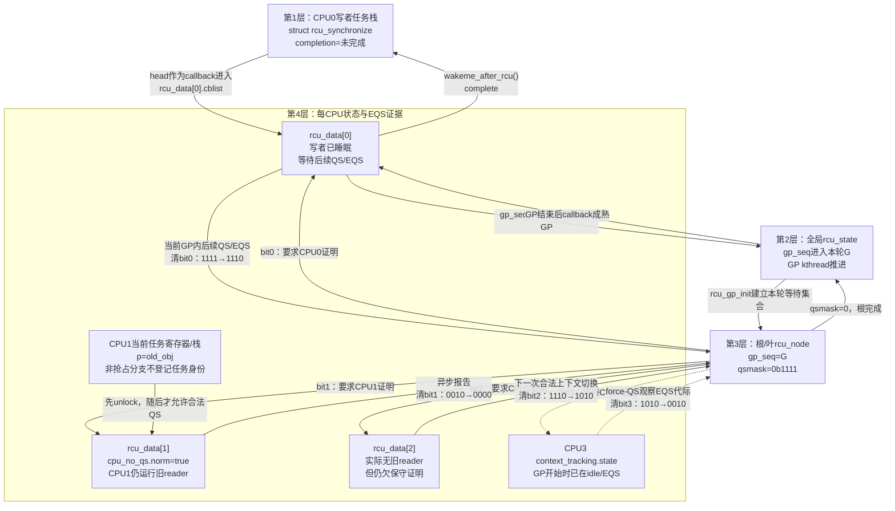
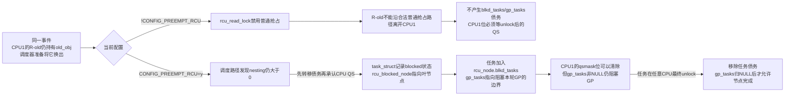
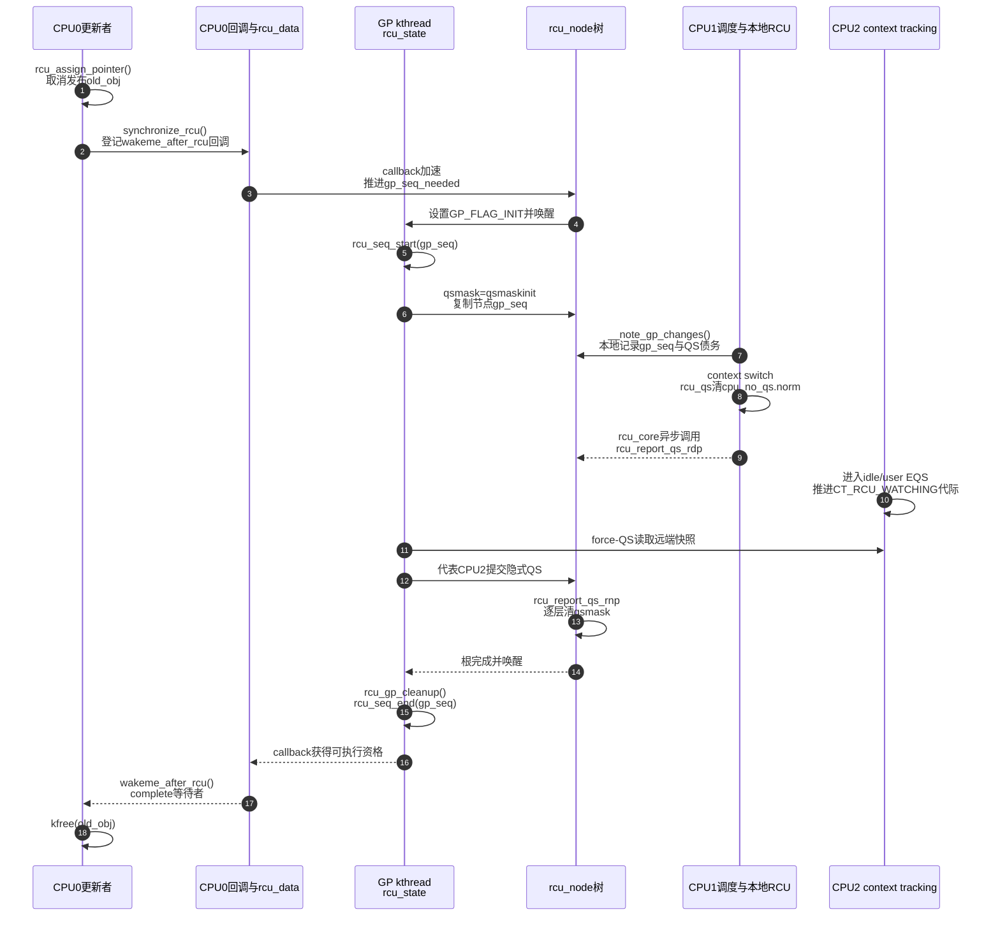

# 第6章\_非抢占式\_Tree\_RCU\_源码同步机制

第五章已经证明“非抢占 reader 不能跨任务切换 QS”，本章把每一步落实到 Linux 6.12.20 的地址、字段、写入者和调用链。研究对象仍是 `CONFIG_TREE_RCU=y && !CONFIG_PREEMPT_RCU`；已核对源码快照对应的 `.config` 虽然启用 PREEMPT_RCU，但相关非抢占分支存在于同一份源码中。

## 6.1\_源码边界与贯穿场景

版本证据来自 NXP 官方 [`linux-imx`](https://github.com/nxp-imx/linux-imx) 仓库发布标签 `lf-6.12.20-2.0.0`、提交 `dfaf2136deb2af2e60b994421281ba42f1c087e0` 对应的源码快照，顶层 `Makefile` 为 Linux 6.12.20。本地工作树位置不进入仓库记录；统一身份和配置边界见 [Linux 源码阅读基线](../../../../research/source_reading/linux/SOURCE_BASELINE.md)。主要文件已经按上游相对路径保存在研究层：

| 文件 | 本章使用的证据 |
| --- | --- |
| [`include/linux/rcupdate.h`](../../../../research/source_reading/linux/include/linux/rcupdate.h) | 读侧封装、`rcu_assign_pointer()`、`rcu_dereference()` |
| [`kernel/rcu/tree.h`](../../../../research/source_reading/linux/kernel/rcu/tree.h) | `rcu_node`、`rcu_data`、`rcu_state` |
| [`kernel/rcu/tree.c`](../../../../research/source_reading/linux/kernel/rcu/tree.c) | 同步等待、GP、QS 检查、树形报告、EQS 扫描 |
| [`kernel/rcu/tree_plugin.h`](../../../../research/source_reading/linux/kernel/rcu/tree_plugin.h) | 非抢占与抢占配置分支 |
| [`kernel/rcu/update.c`](../../../../research/source_reading/linux/kernel/rcu/update.c) | `__wait_rcu_gp()`、`wakeme_after_rcu()`、四个 RCU Lockdep maps 与 held 查询 |

继续沿用以下应用代码：

```c
mutex_lock(&update_lock);
old_obj = rcu_replace_pointer(global_ptr, new_obj,
			      lockdep_is_held(&update_lock));
mutex_unlock(&update_lock);
synchronize_rcu();
kfree(old_obj);
```

要解释的不是三个函数各自“有什么作用”，而是 `synchronize_rcu()` 怎样把一个栈上等待者连接到 GP，GP 怎样把 CPU 债务写进树，CPU 怎样形成并上报 QS，完成又怎样回到这个等待者。

RCU 源码材料的分类和建议顺序统一从[Linux 6.12 Tree RCU 与 SRCU 源码导读](../../../../research/source_reading/rcu/navigation/P01_Linux_6.12_Tree_RCU_与_SRCU_源码导读.md#1.9_建议的源码阅读顺序)进入；本章对应的状态、调用链和模块闭环由[非抢占式 Tree RCU 模块源码概念导读](../../../../research/source_reading/rcu/navigation/P02_Linux_6.12_非抢占式_Tree_RCU_模块源码概念导读.md#2.3_源码文件与状态所有权)集中归纳。本章只保留与当前场景直接相连的接口索引；Linux 6.12.20 的裁剪源码、中文注释、配置分支和检查路径集中在[公共接口与检查机制源码详解](../../../../research/source_reading/rcu/source_explanations/P01_Linux_6.12_RCU_公共接口与检查机制源码详解.md#1.1_源码详解边界与引用入口)，避免同一源码在多个机制正文中反复展开。

| 接口或检查点 | 本场景中的职责 | 调用约束与误用后果 |
| --- | --- | --- |
| [`rcu_replace_pointer()`](../../../../research/source_reading/rcu/source_explanations/P01_Linux_6.12_RCU_公共接口与检查机制源码详解.md#1.3_rcu_replace_pointer接口实现) | 在更新锁内取得旧入口并发布 `new_obj` | 第三个参数应表达可验证的保护条件；它不等待 GP，也不释放旧对象 |
| [`rcu_dereference_protected()`](../../../../research/source_reading/rcu/source_explanations/P01_Linux_6.12_RCU_公共接口与检查机制源码详解.md#1.5_rcu_dereference_protected功能与检查路径) | 供 `rcu_replace_pointer()` 在更新侧读取旧入口 | 只适用于更新被阻止的路径；没有适当保护时省略 `READ_ONCE()` 会使错误更隐蔽 |
| [`synchronize_rcu()`](../../../../research/source_reading/rcu/source_explanations/P01_Linux_6.12_RCU_公共接口与检查机制源码详解.md#1.4_synchronize_rcu接口实现) | 等待边界前的普通 RCU reader 结束 | 只能在可阻塞上下文调用；从受等待的 RCU 读侧内调用会形成非法自等待 |
| [RCU Lockdep适配层](../../../../research/source_reading/rcu/source_explanations/P04_Linux_6.12_RCU_Lockdep适配层源码实现.md#4.2_源码符号覆盖账本) | 把普通/BH/sched读侧和callback上下文登记为四个独立检查身份 | 四个 map 不是功能锁；必须与功能入口/退出保持正确顺序和配对 |
| [`RCU_LOCKDEP_WARN()`](../../../../research/source_reading/rcu/source_explanations/P01_Linux_6.12_RCU_公共接口与检查机制源码详解.md#1.6_RCU_LOCKDEP_WARN检查适配层) | 在调试配置中检查上面声明的保护条件和调用上下文 | 它只负责动态诊断，不提供锁、GP、发布顺序或对象生命期保证 |

## 6.2\_四层状态放在哪里

只列结构体和字段无法解释状态机。本节先固定一轮可以逐步推演的 GP，再把每一步写回具体地址。

### 6.2.1\_先固定四个逻辑CPU的现场

下面是第 5 章场景的源码层版本。它是为了展示 Tree RCU 分布式状态而构造的四逻辑 CPU 模型，不宣称 i.MX6ULL 单核硬件实际同时运行四个 CPU。假设该内核采用：

```text
CONFIG_NR_CPUS=4
CONFIG_TREE_RCU=y
CONFIG_PREEMPT_RCU=n
CONFIG_RCU_STRICT_GRACE_PERIOD=n
CONFIG_RCU_NOCB_CPU=n
```

并固定本例使用默认的 `rcu_normal_wake_from_gp=0`，即让 `synchronize_rcu()` 通过普通 callback 加 completion 等待，而不是混入 6.4.2 的直接唤醒优化。这样后文每一条箭头都只对应一条确定配置路径。

CPU1 的 reader 在更新前已经取得旧指针，并用测试门保持在最外层读区内：

```c
/* CPU1：非抢占式旧 reader。读区内不主动阻塞。 */
rcu_read_lock();
p = rcu_dereference(global_ptr);
complete(&cpu1_has_old_pointer);

while (!READ_ONCE(allow_cpu1_exit))
	cpu_relax();

use_obj(p);
rcu_read_unlock();
```

CPU0 上的写者确认 CPU1 已取得 `old_obj` 后替换入口并等待：

```c
/* CPU0：写者。 */
wait_for_completion(&cpu1_has_old_pointer);
mutex_lock(&update_lock);
old_obj = rcu_replace_pointer(global_ptr, new_obj,
			      lockdep_is_held(&update_lock));
mutex_unlock(&update_lock);
synchronize_rcu();
kfree(old_obj);
```

这里的代码只保留决定状态归属的交错；对象分配、线程创建、CPU 绑定、退出清理和日志观察见[晚到读者与抢占读者的对象回收实验](../../../../labs/kernel/rcu/P01_晚到读者与抢占读者/README.md)。本节不会把省略的测试编排伪装成可直接加载的完整模块。

另外两个 CPU 的现场是：

- CPU2 正在执行普通内核代码，但没有进入任何旧 RCU 读区；
- CPU3 在 GP 开始时已经位于 idle/EQS；
- CPU0 的写者把同步请求登记后睡在 completion 上，CPU0 此后仍需在当前 GP 内提供一次有效 QS/EQS 证据，不能拿 GP 开始前发生的切换抵债。

为了把位图变化写成确定时间线，假设 4 个 CPU 都由同一个叶 `rcu_node` 覆盖，而且该节点同时是根节点。Linux 6.12 的 `tree.h` 明确允许小系统把层次折叠为单个 `rcu_node`。本例约定 bit0～bit3 分别代表 CPU0～CPU3，并固定后续证据到达顺序为 CPU0、CPU2、CPU3、CPU1：

```text
GP初始化：qsmask = 0b1111
CPU0报告：qsmask = 0b1110
CPU2报告：qsmask = 0b1010
CPU3的EQS被观察：qsmask = 0b0010
CPU1退出旧读区后报告：qsmask = 0b0000
```

这个顺序只是为了让读者逐位追踪地址；真实 CPU 可以并发上报，顺序不影响“最后一位清除后才能完成 GP”的条件。若系统有多层 `rcu_node`，叶节点归零后还要用自己的 `grpmask` 清父节点的一位，但每一位表达的债务语义不变。

### 6.2.2\_同一现场怎样穿过四层地址



图中最容易误读的是 CPU1 的 `p=old_obj`：这个指针确实存在，却没有被写进 `rcu_data` 或 `rcu_node`。非抢占式 Tree RCU 保存的不是 reader 名单，而是一个执行约束：CPU1 在最外层读区结束前不能发生普通抢占式任务切换。因此，后来的 CPU1 QS 可以反向证明这个未登记的旧 reader 已经结束。

### 6.2.3\_四层表必须写出本例中的实际值

| 层次与具体地址                                                                     | 本例在 GP 开始时的状态                                                       | 谁在什么事件写入                                                                                                                       | 后续谁读取                                                        | 本例最终怎样退出                                                                               |
| --------------------------------------------------------------------------- | ------------------------------------------------------------------- | ------------------------------------------------------------------------------------------------------------------------------ | ------------------------------------------------------------ | -------------------------------------------------------------------------------------- |
| 写者等待层：CPU0 写者栈上的 `struct rcu_synchronize`，其中 `head` 链入 `rcu_data[0].cblist` | `completion` 未完成，写者睡眠；栈帧不能销毁                                        | CPU0 的 `__wait_rcu_gp()` 初始化 `head/completion` 并提交 callback；GP 后 callback 执行 `wakeme_after_rcu()`                              | callback 执行上下文用 `container_of()` 找回等待对象；CPU0 睡在 completion 上 | `wakeme_after_rcu()` 调用 `complete()`，CPU0 返回 `synchronize_rcu()` 后才允许 `kfree(old_obj)` |
| 全局协调层：`rcu_state.gp_seq`、`gp_flags` 与 GP kthread                            | callback 请求需要一个覆盖它的未来 GP；`gp_seq` 随后进入本轮代际 G 的进行态                   | 请求路径设置 GP 需求；GP kthread 在 `rcu_gp_init()`/cleanup 中开始、结束 G                                                                     | 所有 `rcu_node`、每 CPU 新 GP 检测、callback 推进路径                    | 根节点报告完成后结束 G，使等待 callback 获得执行资格                                                       |
| 节点共享层：本例唯一根/叶 `rcu_node.gp_seq/qsmask`                                      | `gp_seq=G`，`qsmask=0b1111`；这四位是 CPU 债务，不是四个 reader                  | `rcu_gp_init()` 置 `qsmask=qsmaskinit`；CPU 本地报告或远端 EQS 观察路径按 `1111→1110→1010→0010→0000` 清位                                      | `rcu_report_qs_rdp()`、`rcu_report_qs_rnp()` 与 GP kthread     | `qsmask=0`；若存在父节点则继续清父节点对应位，本例直接到根完成                                                   |
| 每 CPU/EQS 证据层：`rcu_data[0..3]`，以及独立的每 CPU `context_tracking.state`          | CPU0/CPU1/CPU2 的节点位先保守置位；CPU1 真有旧 reader，CPU0/CPU2 实际没有；CPU3 已在 EQS | 本 CPU `__note_gp_changes()` 写 `gp_seq/cpu_no_qs/core_needs_qs`；调度路径的 `rcu_qs()` 锁存本地 QS；idle/user/IRQ 路径更新 context-tracking 代际 | 本 CPU `rcu_check_quiescent_state()`，或 force-QS 对 EQS 快照的远端检查 | CPU0、CPU2 用后续 QS，CPU3 用 EQS 证据，CPU1 用“unlock 后才可能出现的 QS”分别清除自己的节点位                     |

四层之间不是包含关系，而是一条接力链：**写者等待对象提出需求 → 全局状态建立代际 → 节点状态保存共享债务 → 每 CPU/EQS 状态产生证据 → 节点归零 → 全局结束代际 → callback 唤醒原写者。** 把其中任何一层单独拿出来，都不能解释 `old_obj` 为什么此时可以释放。

### 6.2.4\_逐个CPU看本例为什么不是reader计数

| CPU | GP 开始瞬间的真实现场 | 非抢占式配置允许什么证明事件 | 地址变化与结果 |
| --- | --- | --- | --- |
| CPU0 | 写者已经提交同步请求并睡眠，本 CPU 没有旧 reader | GP 开始后的后续任务切换或进入 EQS | `rcu_data[0].cpu_no_qs.norm` 锁存 QS，随后清节点 bit0；写者睡眠本身若发生在 GP 开始前，不能冒充本轮 QS |
| CPU1 | 当前任务仍在最外层读区，寄存器/栈上的 `p` 指向 `old_obj` | 必须先执行 `rcu_read_unlock()`，以后才能发生合法任务切换 QS 或进入 EQS | CPU1 在此之前不能清 bit1；本例让它最后把 `0b0010` 清为 `0` |
| CPU2 | 正在执行内核代码，但没有任何旧 reader | 下一次合法任务切换就是足够的保守证明 | RCU 虽然多等了一次，但只降低活性；bit2 清除不依赖 reader 计数 |
| CPU3 | GP 开始时已经处于 idle/EQS | force-QS/context-tracking 路径确认 CPU 在本轮边界处于或经过 EQS | 不要求 CPU3 先运行一个 reader 或专门回调；EQS 代际证据使 bit3 清除 |

因此，`qsmask=0b1111` 不能翻译成“四个 CPU 都有旧 reader”。本例中只有 CPU1 真正持有 `old_obj`，Tree RCU 却先向四个 CPU 都收取证明；这种保守等待把“每次 reader 都登记身份”的高频共享写，转移成“每轮 GP 每个相关 CPU 至少交一次证据”的低频工作。

### 6.2.5\_同一现场切到抢占式配置会多出什么

现在只改变一个条件：启用 `CONFIG_PREEMPT_RCU=y`，并让 CPU1 的旧 reader 在 `use_obj(p)` 前被高优先级任务抢占。四个公共层仍然存在，但 **CPU1 的旧指针债务可以离开 CPU1 执行现场**，所以必须增加与 CPU 债务正交的任务状态：



| 同一问题 | 非抢占式 Tree RCU | 抢占式 Tree RCU |
| --- | --- | --- |
| CPU1 旧 reader 能否被普通抢占 | 不能；`rcu_read_lock()` 建立禁止普通抢占的执行约束 | 能；调度路径必须保存被换出任务仍在读区的事实 |
| CPU1 上下文切换以后，CPU 位能否清 | 合法旧 reader 不可能跨过这次切换，因此可以把切换当 CPU 证明 | 可以清 CPU 债务，但清位前必须先把仍在读区的任务登记为任务债务 |
| 旧 reader 债务存在哪里 | 不单独登记任务；借助 CPU 位和“读区不能跨 QS”的不变量间接证明 | `task_struct` 的 nesting/special/blocked-node 状态，加叶节点 `blkd_tasks/gp_tasks` |
| 节点完成条件 | `qsmask==0`，非抢占分支的 `rcu_preempt_blocked_readers_cgp()` 恒为 0 | `qsmask==0` 仍不够；当前 GP 对应的 `gp_tasks` 还必须为空 |

所以本章后续 S0～S10 的主线只讨论 **非抢占式配置**：普通 GP 债务可由 CPU/子树位完整表达。抢占式实现不是把 `qsmask` 改成任务位图，而是在保留 CPU 位图的同时增加任务债务轴；完整转移过程见[抢占式 Tree RCU 的问题与任务跟踪模型](P07_抢占式_Tree_RCU_问题与任务跟踪模型.md)和[抢占式 Tree RCU 源码同步机制](P08_抢占式_Tree_RCU_源码同步机制.md)。

## 6.3\_S0到S10\_一轮同步等待的真实状态机

| 阶段 | 触发 | 修改前后 | 写入者与地址 | 后续读取者 | 退出条件 |
| --- | --- | --- | --- | --- | --- |
| S0 | 旧对象仍发布 | `global_ptr=old_obj` | 业务模块 | reader | 写者完成新对象初始化 |
| S1 | 替换入口 | `old_obj -> new_obj` | 写者写业务入口 | 新 reader | 旧对象不再由正式入口发布 |
| S2 | `synchronize_rcu()` | 创建栈上 `rcu_synchronize`，callback 入队 | 写者/`__wait_rcu_gp()` 写 completion 与 `rcu_head` | 每 CPU callback/GP 请求路径 | 回调已绑定到未来 GP |
| S3 | callback 加速 | `gp_seq_needed` 推向根，`gp_flags|=INIT` | 本 CPU RCU 路径与 `rcu_start_this_gp()` | GP kthread | GP kthread 被唤醒或已有 GP 可承接 |
| S4 | GP 开始 | `rcu_state.gp_seq` 进入进行态 | GP kthread/`rcu_seq_start()` | 各节点与 CPU | 全局代际已建立 |
| S5 | 建立等待集 | 每节点 `qsmask=qsmaskinit`，`rnp->gp_seq=rsp->gp_seq` | `rcu_gp_init()` | 每 CPU GP 检测和报告路径 | 所有节点初始化完成 |
| S6 | CPU 感知新 GP | `rdp->gp_seq` 更新；`cpu_no_qs=true`、`core_needs_qs=true` | 本 CPU `__note_gp_changes()` | 本 CPU QS 与 core | CPU 知道自己欠证明 |
| S7 | 发生 QS/EQS | `cpu_no_qs.norm: true -> false`，或远端观察到 EQS 代际变化 | 本 CPU调度/tick/context tracking；EQS 可由 GP 扫描观察 | `rcu_check_quiescent_state()` 或 force-QS | 本地或隐式证据成立 |
| S8 | 提交本 CPU 证据 | `core_needs_qs: true -> false`；叶 `qsmask` 清本 CPU 位 | 当前 CPU `rcu_report_qs_rdp()` | 父节点报告路径 | 叶节点还有位则停止，否则向上 |
| S9 | 逐层汇聚 | 子节点完成后父 `qsmask` 清对应位 | `rcu_report_qs_rnp()` | 根报告路径 | 根 `qsmask=0` |
| S10 | GP 清理并交付 | `rcu_seq_end()`，callback 进入可执行段并调用 `complete()` | GP kthread、每 CPU RCU core、`wakeme_after_rcu()` | 原写者 | `wait_for_completion` 返回 |

这不是一条函数直接调用到底的同步栈。S2 的写者可能已经睡眠；S4～S10 分别由 GP kthread、远端 CPU 的调度/context-tracking 路径、本 CPU RCU core 和 callback 执行上下文接力完成。

## 6.4\_synchronize\_rcu()怎样提交并等待GP

### 6.4.1\_Linux\_6.12.20默认路径

`kernel/rcu/tree.c:4096` 的 `synchronize_rcu()` 完成 lockdep 检查后进入 `synchronize_rcu_normal()`。默认模块参数 `rcu_normal_wake_from_gp` 为 0，所以走：

```text
synchronize_rcu()
    -> synchronize_rcu_normal()
        -> wait_rcu_gp(call_rcu_hurry)
            -> __wait_rcu_gp()
                -> 初始化栈上 rcu_synchronize.completion
                -> call_rcu_hurry(&rs.head, wakeme_after_rcu)
                -> wait_for_completion_state()
```

`kernel/rcu/update.c:402` 的 `wakeme_after_rcu()` 用 `container_of()` 找回栈上的 `struct rcu_synchronize`，然后 `complete(&rcu->completion)`。因此默认路径的同步者不是自己扫描 CPU，而是把“唤醒我”登记成一个必须跨 GP 才能执行的 RCU callback。

`call_rcu_hurry()` 进入 `__call_rcu_common()`，把 callback 放入当前 CPU 的 `rcu_data.cblist`。回调加速路径最终调用 `rcu_start_this_gp()`：沿叶到根写 `gp_seq_needed`，需要新 GP 时对 `rcu_state.gp_flags` 设置 `RCU_GP_FLAG_INIT`，再由调用者执行 `rcu_gp_kthread_wake()`。

### 6.4.2\_中的直接唤醒优化分支

如果运行时参数 `rcu_normal_wake_from_gp` 非零，`synchronize_rcu_normal()` 不走普通 callback completion，而是：

```text
rcu_sr_normal_add_req(&rs)
    -> start_poll_synchronize_rcu()
        -> 请求GP
    -> wait_for_completion(&rs.completion)
```

请求存入 `rcu_state.srs_next`，`rcu_sr_normal_gp_init()` 在 GP 开始时划分等待批次，`rcu_sr_normal_gp_cleanup()` 在 GP 清理阶段交付完成。这个分支是 6.12 的实现优化，不改变“调用前读侧必须结束、后来读侧可以并发”的 API 语义。

## 6.5\_GP初始化怎样标记谁欠QS

`rcu_gp_kthread()` 睡在 `rcu_state.gp_wq`，观察到 `gp_flags & RCU_GP_FLAG_INIT` 后调用 `rcu_gp_init()`：

1. 在根节点锁保护下清请求标志。
2. `rcu_seq_start(&rcu_state.gp_seq)` 启动新代际。
3. 先把 hotplug 对 `qsmaskinitnext` 的变化应用到 `qsmaskinit`。
4. 按广度优先遍历全部 `rcu_node`。
5. 对每个节点执行 `rnp->qsmask = rnp->qsmaskinit`。
6. 执行 `WRITE_ONCE(rnp->gp_seq, rcu_state.gp_seq)`。

所以写者不需要先发现 reader：GP 先把当前参与集合都视为“尚未证明”，然后让实际执行过程逐步清除债务。在线集合变化由 `qsmaskinitnext`、hotplug 锁和 GP 初始化中的离线掩码共同处理，不是每轮直接无锁复制 `cpu_online_mask`。

## 6.6\_每CPU怎样感知新GP

本 CPU 的 `rcu_core()` 会执行 `rcu_check_quiescent_state(rdp)`，其第一步 `note_gp_changes()` 在叶 `rcu_node` 锁下进入 [`__note_gp_changes()` 实现](../../../../research/source_reading/rcu/source_explanations/P02_Linux_6.12_非抢占式_Tree_RCU_关键函数源码实现.md#2.5___note_gp_changes让CPU识别新GP)。该函数根据 `rnp->qsmask & rdp->grpmask` 计算 `need_qs`，写入本地 QS 债务，再记录节点代际。

这些字段仍然不表示“本 CPU 当前有 reader”。它们表示：本 CPU 已看到该叶节点的新代际，而且节点的等待位说明它还欠一个本轮 QS。

## 6.7\_调度路径怎样形成本地QS

调度器 `kernel/sched/core.c::__schedule()` 在持有当前任务、尚未切换 `prev/next` 的位置关闭本地中断并调用 `rcu_note_context_switch(preempt)`。非 PREEMPT_RCU 分支的 [`rcu_note_context_switch()` 与 `rcu_qs()` 实现](../../../../research/source_reading/rcu/source_explanations/P02_Linux_6.12_非抢占式_Tree_RCU_关键函数源码实现.md#2.6_rcu_note_context_switch与rcu_qs记录静止态)会直接把本 CPU 的 `cpu_no_qs.b.norm` 清零。

它不取得 `rcu_node` 锁，也不在调度器关键路径上逐层清树。这里完成的是 **本地锁存**：“这个 CPU 已经看见当前 GP 所需的 QS”。

为什么能够这样做？因为非抢占 reader 的 `__rcu_read_lock()` 调用 `preempt_disable()`，合法任务切换不能穿过仍在使用旧指针的读区。调度钩子不必知道被切走任务读取过哪个对象。

## 6.8\_用户态和idle怎样提供EQS证明

### 6.8.1\_Linux\_6.12的context-tracking状态

6.12.20 不再把主要 EQS 代际保存在 `rcu_data.dynticks`。`kernel/context_tracking.c` 使用每 CPU `context_tracking.state`，其中 `CT_RCU_WATCHING` 位区分 RCU 是否正在关注该 CPU：

- `ct_idle_enter()` 调用 `ct_kernel_exit(false, ...)`，进入 idle EQS。
- `__ct_user_enter()` 在启用相应 context tracking 时调用 `ct_kernel_exit(true, ...)`，进入 user EQS。
- `ct_kernel_exit_state()` 用有序的原子状态增量记录“不再 watching”。
- `ct_idle_exit()` / `__ct_user_exit()` 通过 `ct_kernel_enter()` 恢复 watching，且必须在可能使用普通 RCU 以前完成。

### 6.8.2\_远端怎样确认CPU已经经过EQS

force-QS 扫描并不只看一个布尔值。`rcu_watching_snap_save()` 用 acquire 语义保存远端 CPU 的 watching 代际；若快照已经表明 CPU 在 EQS，可以立即形成隐式证明。否则后续 `rcu_watching_snap_recheck()` 调用 `rcu_watching_snap_stopped_since()`，只有发现代际变化，才证明该 CPU 自快照后经过 EQS。

这避免了如下竞态：协调 CPU 第一次看见“watching”，远端迅速进入又退出 idle；只看当前布尔值可能错过这段经历，比较代际则能保留“至少经过一次 EQS”的历史证据。

普通调度时钟路径也能提供证明：非抢占分支的 `rcu_flavor_sched_clock_irq(user)` 在中断来自用户态或 idle 时调用 `rcu_qs()`。

## 6.9\_本地QS怎样异步进入rcu\_node树

`rcu_core()` 后续调用 `rcu_check_quiescent_state()`：

```text
note_gp_changes()
    -> 确认本 CPU 的 GP 代际
if (!core_needs_qs)
    -> 无债务，返回
if (cpu_no_qs.b.norm)
    -> 尚无本地证据，返回
rcu_report_qs_rdp(rdp)
```

`rcu_report_qs_rdp()` 先锁本 CPU 的叶 `rcu_node`，再次核对：

- `rdp->cpu_no_qs.b.norm` 必须已经为 false；
- `rdp->gp_seq` 必须等于 `rnp->gp_seq`；
- 本 CPU 的 `grpmask` 位必须仍在等待。

代际不匹配时，它拒绝把旧 QS 上报给新 GP，并重新令 `cpu_no_qs.b.norm=true`。核对成功才清 `core_needs_qs`，调用 `rcu_report_qs_rnp()`。

因此存在一个正常异步窗口：

```text
cpu_no_qs.b.norm 已经是 false
    但
rcu_node.qsmask 中本 CPU 位仍为 1
```

这不是状态矛盾；前者是本地证据，后者是共享汇聚状态。

## 6.10\_qsmask怎样逐层清到根

`rcu_report_qs_rnp(mask, rnp, gps, flags)` 在每一级都检查 `rnp->gp_seq == gps`，然后清除 `rnp->qsmask` 中的 `mask`：

```text
本级 qsmask 仍非零
    -> 还有兄弟 CPU/子节点欠证明，停止上报

本级 qsmask 变零
    -> 用本节点 grpmask 作为父节点中的一位
    -> 锁父节点并继续上报

到达根且 qsmask 变零
    -> rcu_report_qs_rsp()
    -> 设置 FQS 标志并唤醒 GP kthread
```

树形汇聚把争用限制在叶节点和偶尔向上的节点：每个 reader 不写树，每个 CPU 每轮通常只需报告一次；只有某个子树整体完成时才继续碰父层缓存行。

## 6.11\_GP完成怎样唤醒原写者

GP kthread 从 `rcu_gp_fqs_loop()` 返回后进入 `rcu_gp_cleanup()`：

1. 先把完成后的 `gp_seq` 广度优先传播到全部节点。
2. 断言 `rnp->qsmask` 已清空；非抢占分支也不存在阻塞当前 GP 的普通 reader 任务。
3. 对全局 `rcu_state.gp_seq` 调用 `rcu_seq_end()`，把 GP 置为完成态。
4. callback 分段随后因 GP 完成而推进到可执行状态。
5. 原 `synchronize_rcu()` 登记的 `wakeme_after_rcu()` 被调用，对栈上 completion 执行 `complete()`。
6. 写者从 `wait_for_completion_state()` 返回，才执行 `kfree(old_obj)`。

如果启用 `rcu_normal_wake_from_gp`，第 4～5 步由 `rcu_sr_normal_gp_cleanup()` 的专用同步等待者链完成；安全边界相同，交付路径不同。

## 6.12\_端到端源码时序



## 6.13\_读侧接口在非抢占配置中的实际展开

[`include/linux/rcupdate.h` 的非抢占读侧实现](../../../../research/source_reading/rcu/source_explanations/P02_Linux_6.12_非抢占式_Tree_RCU_关键函数源码实现.md#2.6_rcu_note_context_switch与rcu_qs记录静止态)让 `__rcu_read_lock()` 禁止抢占，让 `__rcu_read_unlock()` 恢复抢占；`CONFIG_RCU_STRICT_GRACE_PERIOD` 还会从退出端进入额外的严格测试慢路径。

外层 `rcu_read_lock()` / `rcu_read_unlock()` 还包含 Sparse/lockdep 标记和 watching 合法性检查。核心结论是：普通分支提供执行约束，而不是向树登记 `task_struct` 或设置 `qsmask`。

## 6.14\_发布与取得原语的实际约束

[`rcu_assign_pointer()` 的发布实现](../../../../research/source_reading/rcu/source_explanations/P01_Linux_6.12_RCU_公共接口与检查机制源码详解.md#1.3.1_rcu_assign_pointer发布实现)在 `v` 不是编译期常量 `NULL` 时使用 `smp_store_release()`；常量 `NULL` 分支使用 `WRITE_ONCE()`。

它保证发布指针以前的对象初始化不会被移到发布之后。

[`rcu_dereference()` 的取得实现](../../../../research/source_reading/rcu/source_explanations/P01_Linux_6.12_RCU_公共接口与检查机制源码详解.md#1.3.2_rcu_dereference取得实现)进入 `rcu_dereference_check(p, 0)`，底层通过 `READ_ONCE(p)` 取得一次指针值，保留地址依赖顺序，并执行 Sparse/lockdep 检查。它既不复制对象，也不增加引用计数。发布/取得只保证新对象初始化的观察顺序；GP 才负责旧对象回收边界，两条轴不能互相替代。

## 6.15\_Linux\_5.10明显差异

跨版本成立的主线没有变化：`rcu_state.gp_seq`、节点 `gp_seq/qsmask/qsmaskinit`、每 CPU `gp_seq/cpu_no_qs/core_needs_qs`、调度 QS 和树形汇聚都已经存在。

明显差异是 EQS 状态位置：

| 版本 | EQS/watching主要状态 | 典型函数名 |
| --- | --- | --- |
| Linux 5.10 | `rcu_data.dynticks_nesting`、`dynticks_nmi_nesting`、`atomic_t dynticks` | `rcu_eqs_enter()`、`rcu_idle_enter()`、`rcu_user_enter()`、`rcu_momentary_dyntick_idle()` |
| Linux 6.12.20 | `context_tracking.state` 与 `CT_RCU_WATCHING`，`rcu_data` 保存 `watching_snap` 等 GP 观察值 | `ct_kernel_exit/enter()`、`ct_idle_enter/exit()`、`__ct_user_enter/exit()`、`rcu_momentary_eqs()` |

另一个可见差异是 6.12.20 增加了 `rcu_state.srs_next` 等普通同步等待者批处理状态以及 `rcu_normal_wake_from_gp` 直接唤醒优化；阅读 5.10 时不要查找这些 6.12 字段，应从该版本自己的同步等待实现追踪。

## 6.16\_十五项源码证据核对

| 要求 | Linux 6.12.20 证据 |
| --- | --- |
| 1. 同步提交和等待 | [`synchronize_rcu()` 入口](../../../../research/source_reading/rcu/source_explanations/P01_Linux_6.12_RCU_公共接口与检查机制源码详解.md#1.4_synchronize_rcu接口实现)；[`__wait_rcu_gp()` / `wakeme_after_rcu()`](../../../../research/source_reading/rcu/source_explanations/P02_Linux_6.12_非抢占式_Tree_RCU_关键函数源码实现.md#2.3___wait_rcu_gp与wakeme_after_rcu连接等待者) |
| 2. GP 开始 | [`rcu_gp_init()` 建立等待集合](../../../../research/source_reading/rcu/source_explanations/P02_Linux_6.12_非抢占式_Tree_RCU_关键函数源码实现.md#2.4_rcu_gp_init建立本轮等待集合) |
| 3. 全局代际 | [`rcu_gp_init()` 的 `rcu_seq_start()`](../../../../research/source_reading/rcu/source_explanations/P02_Linux_6.12_非抢占式_Tree_RCU_关键函数源码实现.md#2.4_rcu_gp_init建立本轮等待集合)；[`rcu_gp_cleanup()` 的 `rcu_seq_end()`](../../../../research/source_reading/rcu/source_explanations/P02_Linux_6.12_非抢占式_Tree_RCU_关键函数源码实现.md#2.8_rcu_gp_cleanup公布完成代际) |
| 4. 节点等待集 | [`rcu_gp_init()` 从 `qsmaskinit` 建立 `qsmask`](../../../../research/source_reading/rcu/source_explanations/P02_Linux_6.12_非抢占式_Tree_RCU_关键函数源码实现.md#2.4_rcu_gp_init建立本轮等待集合) |
| 5. CPU 感知 | [`__note_gp_changes()` 更新 `rdp->gp_seq`](../../../../research/source_reading/rcu/source_explanations/P02_Linux_6.12_非抢占式_Tree_RCU_关键函数源码实现.md#2.5___note_gp_changes让CPU识别新GP) |
| 6. 本地 QS 债务 | [`__note_gp_changes()` 建债](../../../../research/source_reading/rcu/source_explanations/P02_Linux_6.12_非抢占式_Tree_RCU_关键函数源码实现.md#2.5___note_gp_changes让CPU识别新GP)；[`rcu_qs()` 清债](../../../../research/source_reading/rcu/source_explanations/P02_Linux_6.12_非抢占式_Tree_RCU_关键函数源码实现.md#2.6_rcu_note_context_switch与rcu_qs记录静止态) |
| 7. 上下文切换 | [`rcu_note_context_switch()` → 非抢占 `rcu_qs()`](../../../../research/source_reading/rcu/source_explanations/P02_Linux_6.12_非抢占式_Tree_RCU_关键函数源码实现.md#2.6_rcu_note_context_switch与rcu_qs记录静止态) |
| 8. user/idle | [`ct_*` 与 `rcu_watching_snap_*()` 的模块调用链](../../../../research/source_reading/rcu/navigation/P02_Linux_6.12_非抢占式_Tree_RCU_模块源码概念导读.md#2.8_调用链E_user和idle怎样提供EQS证据)；当前未保存 context-tracking 实现快照，不伪造函数体讲解 |
| 9. 本地 QS | [`tree_plugin.h` 非抢占分支 `rcu_qs()`](../../../../research/source_reading/rcu/source_explanations/P02_Linux_6.12_非抢占式_Tree_RCU_关键函数源码实现.md#2.6_rcu_note_context_switch与rcu_qs记录静止态) |
| 10. CPU 报告 | [`rcu_report_qs_rdp()`](../../../../research/source_reading/rcu/source_explanations/P02_Linux_6.12_非抢占式_Tree_RCU_关键函数源码实现.md#2.7_rcu_report_qs_rdp与rcu_report_qs_rnp汇聚证据) |
| 11. 树形清位 | [`rcu_report_qs_rnp()` → `rcu_report_qs_rsp()`](../../../../research/source_reading/rcu/source_explanations/P02_Linux_6.12_非抢占式_Tree_RCU_关键函数源码实现.md#2.7_rcu_report_qs_rdp与rcu_report_qs_rnp汇聚证据) |
| 12. 唤醒同步者 | [`rcu_gp_cleanup()` 推进完成代际](../../../../research/source_reading/rcu/source_explanations/P02_Linux_6.12_非抢占式_Tree_RCU_关键函数源码实现.md#2.8_rcu_gp_cleanup公布完成代际)；[`wakeme_after_rcu()` 调用 `complete()`](../../../../research/source_reading/rcu/source_explanations/P02_Linux_6.12_非抢占式_Tree_RCU_关键函数源码实现.md#2.3___wait_rcu_gp与wakeme_after_rcu连接等待者) |
| 13. lock/unlock 展开 | [`rcupdate.h` 的 `!CONFIG_PREEMPT_RCU` 分支](../../../../research/source_reading/rcu/source_explanations/P02_Linux_6.12_非抢占式_Tree_RCU_关键函数源码实现.md#2.6_rcu_note_context_switch与rcu_qs记录静止态) |
| 14. 发布/取得 | [`rcu_assign_pointer()`](../../../../research/source_reading/rcu/source_explanations/P01_Linux_6.12_RCU_公共接口与检查机制源码详解.md#1.3.1_rcu_assign_pointer发布实现)；[`rcu_dereference()`](../../../../research/source_reading/rcu/source_explanations/P01_Linux_6.12_RCU_公共接口与检查机制源码详解.md#1.3.2_rcu_dereference取得实现) |
| 15. 并发使用检查 | [`update.c` 的四个 RCU Lockdep身份与状态来源](../../../../research/source_reading/rcu/source_explanations/P04_Linux_6.12_RCU_Lockdep适配层源码实现.md#4.2_源码符号覆盖账本)；[`rcupdate.h::RCU_LOCKDEP_WARN()`](../../../../research/source_reading/rcu/source_explanations/P01_Linux_6.12_RCU_公共接口与检查机制源码详解.md#1.6_RCU_LOCKDEP_WARN检查适配层) |

GP、QS、树形汇聚和 5.10 对照先沿[Linux 6.12 非抢占式 Tree RCU 模块源码概念导读](../../../../research/source_reading/rcu/navigation/P02_Linux_6.12_非抢占式_Tree_RCU_模块源码概念导读.md#2.1_证据目标和配置边界)建立功能闭环；需要逐函数实现时进入[非抢占式 Tree RCU 函数实现索引](../../../../research/source_reading/rcu/source_explanations/P02_Linux_6.12_非抢占式_Tree_RCU_关键函数源码实现.md#2.2_函数实现索引)，演示代码使用的公共接口统一进入[接口与源码索引](../../../../research/source_reading/rcu/source_explanations/P01_Linux_6.12_RCU_公共接口与检查机制源码详解.md#1.2_接口与源码索引)。

上一篇：[非抢占式 Tree RCU 的问题与证明模型](P05_非抢占式_Tree_RCU_问题与证明模型.md)。

下一篇：[抢占式 Tree RCU 的问题与任务跟踪模型](P07_抢占式_Tree_RCU_问题与任务跟踪模型.md)。
