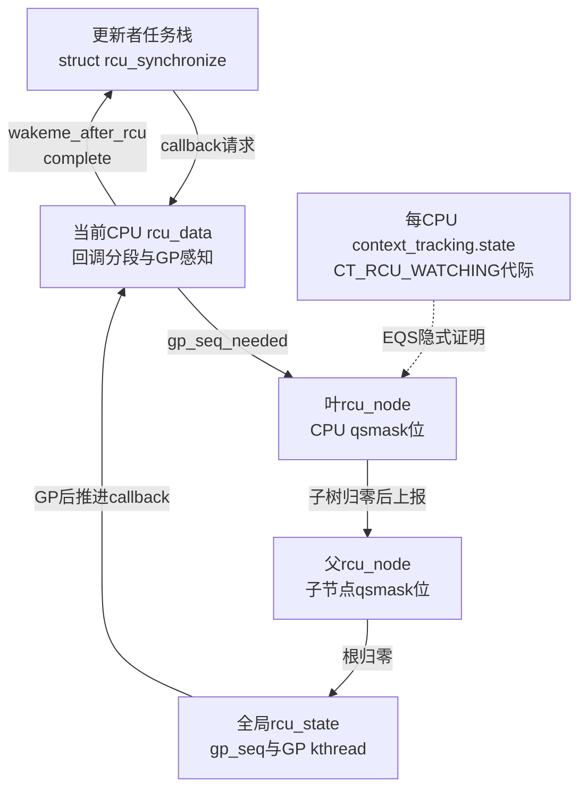
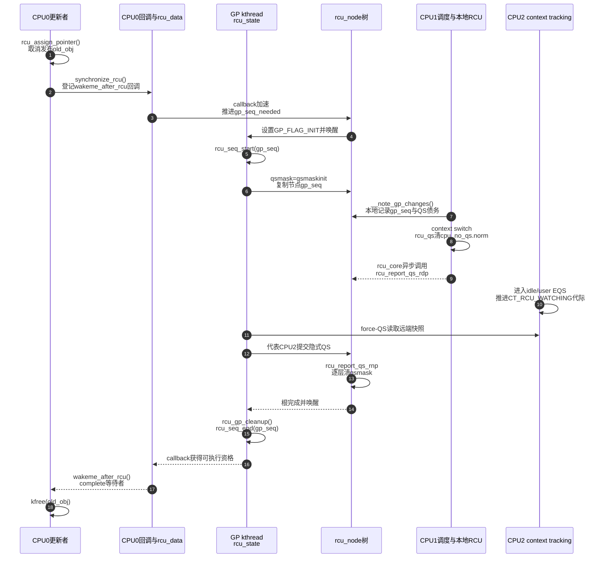

# 第6章\_非抢占式\_Tree\_RCU\_源码同步机制

第五章已经证明“非抢占 reader 不能跨任务切换 QS”，本章把每一步落实到 Linux 6.12.20 的地址、字段、写入者和调用链。研究对象仍是 `CONFIG_TREE_RCU=y && !CONFIG_PREEMPT_RCU`；本地源码树虽然按 PREEMPT_RCU 构建，但相关非抢占分支存在于同一份源码中。

## 6.1\_源码边界与贯穿场景

版本证据来自 `\\192.168.31.142\work\linux\nxp\kernel\linux-imx-6.12`，顶层 `Makefile` 为 6.12.20。主要文件已经按上游相对路径保存在研究层：

| 文件 | 本章使用的证据 |
| --- | --- |
| [`include/linux/rcupdate.h`](../../../../research/source_reading/linux/include/linux/rcupdate.h) | 读侧封装、`rcu_assign_pointer()`、`rcu_dereference()` |
| [`kernel/rcu/tree.h`](../../../../research/source_reading/linux/kernel/rcu/tree.h) | `rcu_node`、`rcu_data`、`rcu_state` |
| [`kernel/rcu/tree.c`](../../../../research/source_reading/linux/kernel/rcu/tree.c) | 同步等待、GP、QS 检查、树形报告、EQS 扫描 |
| [`kernel/rcu/tree_plugin.h`](../../../../research/source_reading/linux/kernel/rcu/tree_plugin.h) | 非抢占与抢占配置分支 |
| [`kernel/rcu/update.c`](../../../../research/source_reading/linux/kernel/rcu/update.c) | `__wait_rcu_gp()` 与 `wakeme_after_rcu()` |

继续沿用以下应用代码：

```c
old_obj = rcu_replace_pointer(global_ptr, new_obj, true);
synchronize_rcu();
kfree(old_obj);
```

要解释的不是三个函数各自“有什么作用”，而是 `synchronize_rcu()` 怎样把一个栈上等待者连接到 GP，GP 怎样把 CPU 债务写进树，CPU 怎样形成并上报 QS，完成又怎样回到这个等待者。

## 6.2\_四层状态放在哪里



| 层次 | 关键字段 | 谁主要写 | 谁主要读 | 表达的事实 |
| --- | --- | --- | --- | --- |
| 全局 | `rcu_state.gp_seq` | GP kthread 在 `rcu_gp_init/cleanup` | 节点、每 CPU 检测、轮询者 | 当前普通 GP 代际及进行/完成状态 |
| 节点 | `rcu_node.gp_seq` | GP 初始化/清理路径 | CPU 报告路径 | 该节点正在服务哪一代 GP |
| 节点 | `qsmaskinitnext`、`qsmaskinit` | CPU hotplug 与 GP 初始化 | GP 初始化 | 下一轮/本轮应纳入哪些 CPU 或子节点 |
| 节点 | `qsmask` | GP 初始化先置位；报告路径清位 | 报告路径、GP 判断 | 本轮仍欠哪些 CPU/子树证明 |
| 每 CPU | `rcu_data.gp_seq` | 本 CPU 的 `__note_gp_changes()` | 本 CPU RCU core | 本 CPU 已感知到哪一代 GP |
| 每 CPU | `cpu_no_qs.b.norm` | 新 GP 时置 true；本 CPU `rcu_qs()` 清 false | `rcu_check_quiescent_state()` | 本 CPU 是否仍未观察到当前 GP 的 QS |
| 每 CPU | `core_needs_qs` | 新 GP 时置位；上报后清除 | `rcu_check_quiescent_state()` | RCU core 是否还需要把本 CPU 结果交到节点树 |
| EQS | `context_tracking.state` 的 `CT_RCU_WATCHING` 位与代际 | 本 CPU 进出 idle/user/IRQ 路径 | force-QS 远端扫描 | CPU 当前是否被 RCU watching、是否经过 EQS |

`qsmask` 不是 reader 位图。叶节点的一位对应一个 `rcu_data`/CPU；非叶节点的一位对应一个子 `rcu_node`。非抢占构建没有普通被抢占 reader，因此普通 GP 完成条件可由 CPU/子树等待位表达。

## 6.3\_S0到S10\_一轮同步等待的真实状态机

| 阶段 | 触发 | 修改前后 | 写入者与地址 | 后续读取者 | 退出条件 |
| --- | --- | --- | --- | --- | --- |
| S0 | 旧对象仍发布 | `global_ptr=old_obj` | 业务模块 | reader | 写者完成新对象初始化 |
| S1 | 替换入口 | `old_obj -> new_obj` | 写者写业务入口 | 新 reader | 旧对象不再由正式入口发布 |
| S2 | `synchronize_rcu()` | 创建栈上 `rcu_synchronize`，callback 入队 | 写者/`__wait_rcu_gp()` 写 completion 与 `rcu_head` | 每 CPU callback/GP 请求路径 | 回调已绑定到未来 GP |
| S3 | callback 加速 | `gp_seq_needed` 推向根，`gp_flags|=INIT` | 本 CPU RCU 路径与 `rcu_start_this_gp()` | GP kthread | GP kthread 被唤醒或已有 GP 可承接 |
| S4 | GP 开始 | `rcu_state.gp_seq` 进入进行态 | GP kthread/`rcu_seq_start()` | 各节点与 CPU | 全局代际已建立 |
| S5 | 建立等待集 | 每节点 `qsmask=qsmaskinit`，`rnp->gp_seq=rsp->gp_seq` | `rcu_gp_init()` | 每 CPU GP 检测和报告路径 | 所有节点初始化完成 |
| S6 | CPU 感知新 GP | `rdp->gp_seq` 更新；`cpu_no_qs=true`、`core_needs_qs=true` | 本 CPU `__note_gp_changes()` | 本 CPU QS 与 core | CPU 知道自己欠证明 |
| S7 | 发生 QS/EQS | `cpu_no_qs.norm: true -> false`，或远端观察到 EQS 代际变化 | 本 CPU调度/tick/context tracking；EQS 可由 GP 扫描观察 | `rcu_check_quiescent_state()` 或 force-QS | 本地或隐式证据成立 |
| S8 | 提交本 CPU 证据 | `core_needs_qs: true -> false`；叶 `qsmask` 清本 CPU 位 | 当前 CPU `rcu_report_qs_rdp()` | 父节点报告路径 | 叶节点还有位则停止，否则向上 |
| S9 | 逐层汇聚 | 子节点完成后父 `qsmask` 清对应位 | `rcu_report_qs_rnp()` | 根报告路径 | 根 `qsmask=0` |
| S10 | GP 清理并交付 | `rcu_seq_end()`，callback 进入可执行段并调用 `complete()` | GP kthread、每 CPU RCU core、`wakeme_after_rcu()` | 原写者 | `wait_for_completion` 返回 |

这不是一条函数直接调用到底的同步栈。S2 的写者可能已经睡眠；S4～S10 分别由 GP kthread、远端 CPU 的调度/context-tracking 路径、本 CPU RCU core 和 callback 执行上下文接力完成。

## 6.4\_synchronize\_rcu()怎样提交并等待GP

### 6.4.1\_Linux\_6.12.20默认路径

`kernel/rcu/tree.c:4096` 的 `synchronize_rcu()` 完成 lockdep 检查后进入 `synchronize_rcu_normal()`。默认模块参数 `rcu_normal_wake_from_gp` 为 0，所以走：

```text
synchronize_rcu()
    -> synchronize_rcu_normal()
        -> wait_rcu_gp(call_rcu_hurry)
            -> __wait_rcu_gp()
                -> 初始化栈上 rcu_synchronize.completion
                -> call_rcu_hurry(&rs.head, wakeme_after_rcu)
                -> wait_for_completion_state()
```

`kernel/rcu/update.c:402` 的 `wakeme_after_rcu()` 用 `container_of()` 找回栈上的 `struct rcu_synchronize`，然后 `complete(&rcu->completion)`。因此默认路径的同步者不是自己扫描 CPU，而是把“唤醒我”登记成一个必须跨 GP 才能执行的 RCU callback。

`call_rcu_hurry()` 进入 `__call_rcu_common()`，把 callback 放入当前 CPU 的 `rcu_data.cblist`。回调加速路径最终调用 `rcu_start_this_gp()`：沿叶到根写 `gp_seq_needed`，需要新 GP 时对 `rcu_state.gp_flags` 设置 `RCU_GP_FLAG_INIT`，再由调用者执行 `rcu_gp_kthread_wake()`。

### 6.4.2\_中的直接唤醒优化分支

如果运行时参数 `rcu_normal_wake_from_gp` 非零，`synchronize_rcu_normal()` 不走普通 callback completion，而是：

```text
rcu_sr_normal_add_req(&rs)
    -> start_poll_synchronize_rcu()
        -> 请求GP
    -> wait_for_completion(&rs.completion)
```

请求存入 `rcu_state.srs_next`，`rcu_sr_normal_gp_init()` 在 GP 开始时划分等待批次，`rcu_sr_normal_gp_cleanup()` 在 GP 清理阶段交付完成。这个分支是 6.12 的实现优化，不改变“调用前读侧必须结束、后来读侧可以并发”的 API 语义。

## 6.5\_GP初始化怎样标记谁欠QS

`rcu_gp_kthread()` 睡在 `rcu_state.gp_wq`，观察到 `gp_flags & RCU_GP_FLAG_INIT` 后调用 `rcu_gp_init()`：

1. 在根节点锁保护下清请求标志。
2. `rcu_seq_start(&rcu_state.gp_seq)` 启动新代际。
3. 先把 hotplug 对 `qsmaskinitnext` 的变化应用到 `qsmaskinit`。
4. 按广度优先遍历全部 `rcu_node`。
5. 对每个节点执行 `rnp->qsmask = rnp->qsmaskinit`。
6. 执行 `WRITE_ONCE(rnp->gp_seq, rcu_state.gp_seq)`。

所以写者不需要先发现 reader：GP 先把当前参与集合都视为“尚未证明”，然后让实际执行过程逐步清除债务。在线集合变化由 `qsmaskinitnext`、hotplug 锁和 GP 初始化中的离线掩码共同处理，不是每轮直接无锁复制 `cpu_online_mask`。

## 6.6\_每CPU怎样感知新GP

本 CPU 的 `rcu_core()` 会执行 `rcu_check_quiescent_state(rdp)`，其第一步 `note_gp_changes()` 在叶 `rcu_node` 锁下进入 `__note_gp_changes()`：

```c
need_qs = !!(rnp->qsmask & rdp->grpmask);
rdp->cpu_no_qs.b.norm = need_qs;
rdp->core_needs_qs = need_qs;
rdp->gp_seq = rnp->gp_seq;
```

这些字段仍然不表示“本 CPU 当前有 reader”。它们表示：本 CPU 已看到该叶节点的新代际，而且节点的等待位说明它还欠一个本轮 QS。

## 6.7\_调度路径怎样形成本地QS

调度器 `kernel/sched/core.c::__schedule()` 在持有当前任务、尚未切换 `prev/next` 的位置关闭本地中断并调用：

```c
rcu_note_context_switch(preempt);
```

非 PREEMPT_RCU 分支的 `tree_plugin.h::rcu_note_context_switch()` 直接调用 `rcu_qs()`。`rcu_qs()` 只修改当前 CPU 的本地字段：

```c
if (this_cpu_read(rcu_data.cpu_no_qs.b.norm))
	this_cpu_write(rcu_data.cpu_no_qs.b.norm, false);
```

它不取得 `rcu_node` 锁，也不在调度器关键路径上逐层清树。这里完成的是 **本地锁存**：“这个 CPU 已经看见当前 GP 所需的 QS”。

为什么能够这样做？因为非抢占 reader 的 `__rcu_read_lock()` 调用 `preempt_disable()`，合法任务切换不能穿过仍在使用旧指针的读区。调度钩子不必知道被切走任务读取过哪个对象。

## 6.8\_用户态和idle怎样提供EQS证明

### 6.8.1\_Linux\_6.12的context-tracking状态

6.12.20 不再把主要 EQS 代际保存在 `rcu_data.dynticks`。`kernel/context_tracking.c` 使用每 CPU `context_tracking.state`，其中 `CT_RCU_WATCHING` 位区分 RCU 是否正在关注该 CPU：

- `ct_idle_enter()` 调用 `ct_kernel_exit(false, ...)`，进入 idle EQS。
- `__ct_user_enter()` 在启用相应 context tracking 时调用 `ct_kernel_exit(true, ...)`，进入 user EQS。
- `ct_kernel_exit_state()` 用有序的原子状态增量记录“不再 watching”。
- `ct_idle_exit()` / `__ct_user_exit()` 通过 `ct_kernel_enter()` 恢复 watching，且必须在可能使用普通 RCU 以前完成。

### 6.8.2\_远端怎样确认CPU已经经过EQS

force-QS 扫描并不只看一个布尔值。`rcu_watching_snap_save()` 用 acquire 语义保存远端 CPU 的 watching 代际；若快照已经表明 CPU 在 EQS，可以立即形成隐式证明。否则后续 `rcu_watching_snap_recheck()` 调用 `rcu_watching_snap_stopped_since()`，只有发现代际变化，才证明该 CPU 自快照后经过 EQS。

这避免了如下竞态：协调 CPU 第一次看见“watching”，远端迅速进入又退出 idle；只看当前布尔值可能错过这段经历，比较代际则能保留“至少经过一次 EQS”的历史证据。

普通调度时钟路径也能提供证明：非抢占分支的 `rcu_flavor_sched_clock_irq(user)` 在中断来自用户态或 idle 时调用 `rcu_qs()`。

## 6.9\_本地QS怎样异步进入rcu\_node树

`rcu_core()` 后续调用 `rcu_check_quiescent_state()`：

```text
note_gp_changes()
    -> 确认本 CPU 的 GP 代际
if (!core_needs_qs)
    -> 无债务，返回
if (cpu_no_qs.b.norm)
    -> 尚无本地证据，返回
rcu_report_qs_rdp(rdp)
```

`rcu_report_qs_rdp()` 先锁本 CPU 的叶 `rcu_node`，再次核对：

- `rdp->cpu_no_qs.b.norm` 必须已经为 false；
- `rdp->gp_seq` 必须等于 `rnp->gp_seq`；
- 本 CPU 的 `grpmask` 位必须仍在等待。

代际不匹配时，它拒绝把旧 QS 上报给新 GP，并重新令 `cpu_no_qs.b.norm=true`。核对成功才清 `core_needs_qs`，调用 `rcu_report_qs_rnp()`。

因此存在一个正常异步窗口：

```text
cpu_no_qs.b.norm 已经是 false
    但
rcu_node.qsmask 中本 CPU 位仍为 1
```

这不是状态矛盾；前者是本地证据，后者是共享汇聚状态。

## 6.10\_qsmask怎样逐层清到根

`rcu_report_qs_rnp(mask, rnp, gps, flags)` 在每一级都检查 `rnp->gp_seq == gps`，然后清除 `rnp->qsmask` 中的 `mask`：

```text
本级 qsmask 仍非零
    -> 还有兄弟 CPU/子节点欠证明，停止上报

本级 qsmask 变零
    -> 用本节点 grpmask 作为父节点中的一位
    -> 锁父节点并继续上报

到达根且 qsmask 变零
    -> rcu_report_qs_rsp()
    -> 设置 FQS 标志并唤醒 GP kthread
```

树形汇聚把争用限制在叶节点和偶尔向上的节点：每个 reader 不写树，每个 CPU 每轮通常只需报告一次；只有某个子树整体完成时才继续碰父层缓存行。

## 6.11\_GP完成怎样唤醒原写者

GP kthread 从 `rcu_gp_fqs_loop()` 返回后进入 `rcu_gp_cleanup()`：

1. 先把完成后的 `gp_seq` 广度优先传播到全部节点。
2. 断言 `rnp->qsmask` 已清空；非抢占分支也不存在阻塞当前 GP 的普通 reader 任务。
3. 对全局 `rcu_state.gp_seq` 调用 `rcu_seq_end()`，把 GP 置为完成态。
4. callback 分段随后因 GP 完成而推进到可执行状态。
5. 原 `synchronize_rcu()` 登记的 `wakeme_after_rcu()` 被调用，对栈上 completion 执行 `complete()`。
6. 写者从 `wait_for_completion_state()` 返回，才执行 `kfree(old_obj)`。

如果启用 `rcu_normal_wake_from_gp`，第 4～5 步由 `rcu_sr_normal_gp_cleanup()` 的专用同步等待者链完成；安全边界相同，交付路径不同。

## 6.12\_端到端源码时序



## 6.13\_读侧接口在非抢占配置中的实际展开

`include/linux/rcupdate.h` 的配置分支是：

```c
static inline void __rcu_read_lock(void)
{
	preempt_disable();
}

static inline void __rcu_read_unlock(void)
{
	preempt_enable();
	if (IS_ENABLED(CONFIG_RCU_STRICT_GRACE_PERIOD))
		rcu_read_unlock_strict();
}
```

外层 `rcu_read_lock()` / `rcu_read_unlock()` 还包含 Sparse/lockdep 标记和 watching 合法性检查。核心结论是：普通分支提供执行约束，而不是向树登记 `task_struct` 或设置 `qsmask`。

## 6.14\_发布与取得原语的实际约束

`rcu_assign_pointer(p, v)` 在 `v` 不是编译期常量 `NULL` 时展开到：

```c
smp_store_release(&p, RCU_INITIALIZER(v));
```

它保证发布指针以前的对象初始化不会被移到发布之后；常量 `NULL` 分支使用 `WRITE_ONCE()`。

`rcu_dereference(p)` 进入 `rcu_dereference_check(p, 0)`，底层通过 `READ_ONCE(p)` 取得一次指针值，保留地址依赖顺序，并执行 Sparse/lockdep 检查。它既不复制对象，也不增加引用计数。发布/取得只保证新对象初始化的观察顺序；GP 才负责旧对象回收边界，两条轴不能互相替代。

## 6.15\_Linux\_5.10明显差异

跨版本成立的主线没有变化：`rcu_state.gp_seq`、节点 `gp_seq/qsmask/qsmaskinit`、每 CPU `gp_seq/cpu_no_qs/core_needs_qs`、调度 QS 和树形汇聚都已经存在。

明显差异是 EQS 状态位置：

| 版本 | EQS/watching主要状态 | 典型函数名 |
| --- | --- | --- |
| Linux 5.10 | `rcu_data.dynticks_nesting`、`dynticks_nmi_nesting`、`atomic_t dynticks` | `rcu_eqs_enter()`、`rcu_idle_enter()`、`rcu_user_enter()`、`rcu_momentary_dyntick_idle()` |
| Linux 6.12.20 | `context_tracking.state` 与 `CT_RCU_WATCHING`，`rcu_data` 保存 `watching_snap` 等 GP 观察值 | `ct_kernel_exit/enter()`、`ct_idle_enter/exit()`、`__ct_user_enter/exit()`、`rcu_momentary_eqs()` |

另一个可见差异是 6.12.20 增加了 `rcu_state.srs_next` 等普通同步等待者批处理状态以及 `rcu_normal_wake_from_gp` 直接唤醒优化；阅读 5.10 时不要查找这些 6.12 字段，应从该版本自己的同步等待实现追踪。

## 6.16\_十四项源码证据核对

| 要求 | Linux 6.12.20 证据 |
| --- | --- |
| 1. 同步提交和等待 | `tree.c::synchronize_rcu_normal()`；`rcupdate_wait.h::wait_rcu_gp`；`update.c::__wait_rcu_gp()/wakeme_after_rcu()` |
| 2. GP 开始 | `tree.c::rcu_gp_kthread()` → `rcu_gp_init()` |
| 3. 全局代际 | `tree.h::rcu_state.gp_seq`；`rcu_seq_start/end()` |
| 4. 节点等待集 | `tree.h::rcu_node.gp_seq/qsmask/qsmaskinit/qsmaskinitnext`；`rcu_gp_init()` |
| 5. CPU 感知 | `tree.c::__note_gp_changes()` 更新 `rdp->gp_seq` |
| 6. 本地 QS 债务 | `rcu_data.cpu_no_qs.b.norm/core_needs_qs` |
| 7. 上下文切换 | `sched/core.c::__schedule()` → `rcu_note_context_switch()` → 非抢占 `rcu_qs()` |
| 8. user/idle | `context_tracking.c::ct_idle_enter/__ct_user_enter/ct_kernel_exit()`；`tree.c::rcu_watching_snap_*()` |
| 9. 本地 QS | `tree_plugin.h` 非抢占分支 `rcu_qs()` 清 `cpu_no_qs.b.norm` |
| 10. CPU 报告 | `tree.c::rcu_check_quiescent_state()` → `rcu_report_qs_rdp()` |
| 11. 树形清位 | `tree.c::rcu_report_qs_rnp()` → `rcu_report_qs_rsp()` |
| 12. 唤醒同步者 | GP cleanup 推进 callback → `wakeme_after_rcu()` → `complete()` |
| 13. lock/unlock 展开 | `rcupdate.h` 的 `!CONFIG_PREEMPT_RCU` 分支；严格 GP 例外在 `rcu_read_unlock_strict()` |
| 14. 发布/取得 | `rcupdate.h::rcu_assign_pointer()` 与 `__rcu_dereference_check()` |

更长的逐函数源码摘录和 5.10 对照见[Linux 6.12 非抢占式 Tree RCU 源码调用链](../../../../research/source_reading/rcu/P02_Linux_6.12_非抢占式_Tree_RCU_源码调用链.md)。

上一篇：[非抢占式 Tree RCU 的问题与证明模型](P05_非抢占式_Tree_RCU_问题与证明模型.md)。

下一篇：[抢占式 Tree RCU 的问题与任务跟踪模型](P07_抢占式_Tree_RCU_问题与任务跟踪模型.md)。
