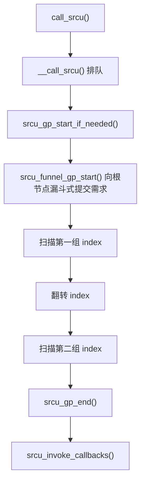

# 第7章\_SRCU\_私有域与双\_index\_运行机制

第六章建立了变体地图，本章只挑出最容易与普通 RCU 混淆、也最常用于驱动的 SRCU 深挖。重点不是背诵“它可以睡眠”，而是理解私有域、显式读计数和双 index 如何改变通知与宽限期判定。

## 7.1\_SRCU\_不只是\_可睡眠的\_RCU

可主动阻塞是 SRCU 最容易被看到的特征，但它的核心设计是“显式私有域 + 分期读者计数”。每个 `struct srcu_struct` 都定义了独立读者集合和宽限期序列。

与普通 Tree RCU 相比：

- Tree RCU 主要通过 CPU/QS/EQS 和被抢占任务跟踪判定旧读者。
- SRCU 读者显式更新指定域的每 CPU 读计数，因此可以在读侧中调度和主动阻塞。
- 代价是 SRCU 读侧不再具有普通 RCU 的最低快速路径开销。

## 7.2\_四层数据结构

| 结构 | 职责 |
| --- | --- |
| `srcu_struct` | 使用者持有的域入口，连接每 CPU 数据、节点树和 usage |
| `srcu_data` | 每 CPU 读计数、回调列表和工作项 |
| `srcu_node` | 对一组 CPU/子节点的读计数和回调 GP 进度做层次聚合 |
| `srcu_usage` | GP 序列、`srcu_gp_mutex`、延迟工作和域生命期状态 |

`srcu_struct` 不只是一个读者计数器，Tree SRCU 同样使用分层节点和每 CPU 数据保持扩展性。

## 7.3\_为什么需要两个\_index

SRCU 读者进入时：

1. 取得当前 `srcu_idx` 的低位作为 index。
2. 增加该 index 对应的每 CPU 读计数。
3. 将 index 返回给调用者。
4. unlock 使用原 index 减少同一组计数。

宽限期不能只等待“当前 index 归零”，因为在翻转边界附近，旧读者可能位于两组计数中。Linux 6.12.20 `synchronize_srcu()` 的注释描述了两阶段排空：

```text
等待非当前 index 计数归零
        ↓
翻转 srcu_idx，将新读者导向另一组
        ↓
等待原当前 index 中的旧读者归零
        ↓
一个完整 SRCU GP 结束
```

两组计数的作用不是让读者停下，而是在新读者继续进入的同时，划出一组可被稳定排空的旧读者。

## 7.4\_为什么读者可以阻塞

SRCU 不需要用“CPU 经过上下文切换”代替某个具体读者的退出。即使任务睡眠并换到其他 CPU 恢复，它仍持有 lock 时取得的 index，最终 unlock 会减少正确的那组计数。

这也解释了为什么 lock/unlock 必须：

- 使用同一 `srcu_struct`。
- 使用 lock 返回的原 index。
- 在同一执行上下文中成对，不能在另一 IRQ 或任务中代为 unlock。

## 7.5\_SRCU\_宽限期状态机

`call_srcu()` 经过 `__call_srcu()` 排队回调，再调用 `srcu_gp_start_if_needed()` 确保有足够的 GP 推进。Tree SRCU 主线为：



`srcu_funnel_gp_start()` 使用 `srcu_node` 树把多个 CPU 上的 GP 需求向根节点聚合，避免所有请求者都争用同一全局状态。

## 7.6\_synchronize\_srcu()为什么会阻塞

`synchronize_srcu()` 内部创建栈上 `rcu_synchronize`、初始化 completion，通过 `__call_srcu()` 排队唤醒回调，然后 `wait_for_completion()`。因此：

- 它必须在 process context 调用。
- 它不得在同一 SRCU 域的读侧临界区中调用，否则自己就是正在等待的读者。
- 经由锁依赖间接等待同一 SRCU GP 同样会死锁。

`call_srcu()` 回调虽在 process context 执行，源码注释仍要求它快速且不阻塞。读者可阻塞不代表回调也可任意阻塞。

## 7.7\_SRCU\_与普通\_RCU\_的成本对比

| 维度 | 普通 Tree RCU | Tree SRCU |
| --- | --- | --- |
| 读侧主要记账 | nesting/执行上下文与慢路径跟踪 | 显式更新域内每 CPU 分 index 计数 |
| 主动阻塞 | 普通路径禁止 | 允许 |
| 域 | 系统 Tree RCU 语义 | 每个 `srcu_struct` 独立 |
| GP 判定 | QS/EQS + blocked tasks | 两组 index 读计数排空 |
| 适合 | 极高频、短小读侧 | 需跨睡眠/I/O 或需私有域的读侧 |

## 7.8\_源码入口

- [`srcu.h`](../../../../research/source_reading/linux/include/linux/srcu.h)：读侧接口、域检查和同步 API。
- [`srcutree.h`](../../../../research/source_reading/linux/include/linux/srcutree.h)：Tree SRCU 数据结构。
- [`srcutree.c`](../../../../research/source_reading/linux/kernel/rcu/srcutree.c)：双 index GP、回调和 `synchronize_srcu()`。

上一篇：[RCU 种类与内核配置](P06_RCU_种类与内核配置.md)。

下一篇：[RCU API 速查](P08_RCU_API_速查.md)。
