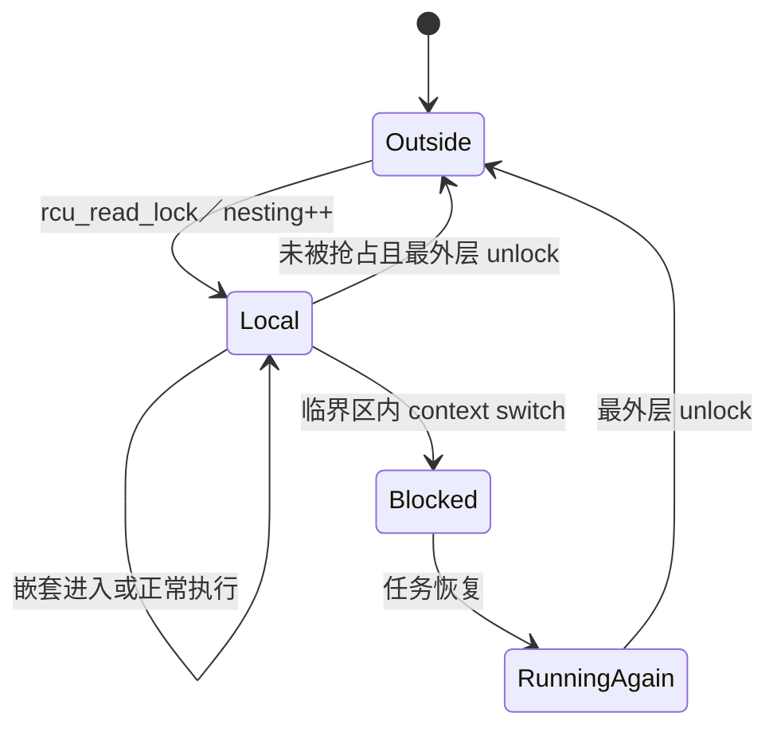

# 第7章\_Tree\_RCU\_读者状态与被抢占任务

本章单独追踪“一个读者任务”的状态归属变化，避免把任务 nesting、CPU QS 和节点等待位混成一个状态。

## 7.1\_PREEMPT\_RCU\_读者状态机

`current->rcu_read_lock_nesting` 首先只供当前任务和本 CPU 调度路径使用。`tree_plugin.h::rcu_note_context_switch()` 发现 nesting 大于零时，才在叶 `rcu_node` 锁保护下设置任务的 `rcu_blocked_node`，并通过 `rcu_preempt_ctxt_queue()` 把任务挂入 `blkd_tasks`。

## 7.2\_为什么\_CPU\_报告后任务仍能阻塞\_GP

任务被切走后，原 CPU 已经跨过上下文切换，可以提交 CPU 维度 QS；但任务本身可能稍后在另一个 CPU 上继续使用旧对象。因此 CPU 等待位与任务阻塞记录必须分离：`qsmask` 可以清零，`gp_tasks` 仍阻止节点向上宣布完成。

## 7.3\_退出怎样解除共享登记

任务恢复并执行最外层 `rcu_read_unlock()` 时，特殊退出路径处理 `rcu_read_unlock_special` 状态，推进或移除节点上的 blocked-reader 记录；若该任务是最后一个阻塞当前 GP 的旧读者，节点才可能继续向父节点报告。

## 7.4\_非抢占实现的不同证明

非 PREEMPT_RCU 通过禁止普通读侧被调度出去，使一次真实上下文切换足以证明此前读侧已经结束，因此不需要为普通被抢占任务维护同样的链表状态。

源码：`kernel/rcu/tree_plugin.h` 中的 `__rcu_read_lock()`、`rcu_note_context_switch()`、`rcu_preempt_ctxt_queue()` 和读侧特殊退出路径。

上一篇：[Tree RCU GP 请求与全局生命周期](P06_Tree_RCU_GP请求与全局生命周期.md)。

下一篇：[Tree RCU QS、EQS 与 Context Tracking](P08_Tree_RCU_QS_EQS与Context_Tracking.md)。
