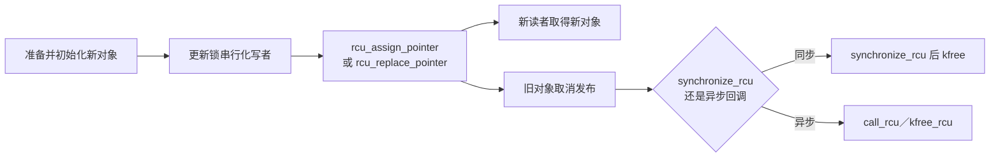

# 第8章\_RCU\_API\_速查

前七章已经回答“为什么需要 RCU”以及“机器和内核怎样使它成立”。从这里开始才进入使用方式：先把每个接口放回读侧标记、发布、取消发布、等待和回收这条调用链，而不是孤立记函数名。

## 8.1\_查表前的三个前提

1. RCU 接口是契约的不同部分，不能用一个接口代替整套发布、读取和回收流程。
2. “可以在某上下文调用”与“函数本身是否阻塞”是两个不同问题。
3. 下表以仓库内 Linux 6.12.20 的 [`rcupdate.h`](../../../../research/source_reading/linux/include/linux/rcupdate.h)、[`srcu.h`](../../../../research/source_reading/linux/include/linux/srcu.h)、[`tree.c`](../../../../research/source_reading/linux/kernel/rcu/tree.c) 和 [`srcutree.c`](../../../../research/source_reading/linux/kernel/rcu/srcutree.c) 为版本边界。

### 8.1.1\_先按调用链选择接口

| 目标 | 正确调用链 |
| --- | --- |
| 临界区内读取 | `rcu_read_lock()` → `rcu_dereference()` → 使用 → `rcu_read_unlock()` |
| 查找后长期持有 | 在上述区间内安全取得 kref/refcount → `rcu_read_unlock()` → 使用 → `put()` |
| 同步替换并释放 | 更新锁内替换/摘除 → 解锁 → `synchronize_rcu()` → `kfree()` |
| 异步替换并释放 | 更新锁内替换/摘除 → 解锁 → `call_rcu()` 或 `kfree_rcu()` |
| 模块卸载等待回调代码退场 | 阻止产生新回调并取消发布 → 按业务停止读写路径 → `rcu_barrier()` 等待先前排队回调执行完 |

`synchronize_rcu()`、`call_rcu()` 和 `kfree_rcu()` 是不同的回收路径选择，不应在同一对象上无依据地叠加。`rcu_barrier()` 也不是普通对象删除时的 GP 替代品。

## 8.2\_读侧标记与指针取得

| 接口 | 作用 | 关键边界 |
| --- | --- | --- |
| `rcu_read_lock()` / `rcu_read_unlock()` | 标记普通 RCU 读侧临界区 | 允许嵌套；不应主动阻塞；可抢占性取决于内核配置 |
| `rcu_read_lock_bh()` / `rcu_read_unlock_bh()` | 标记读侧并禁用本地 softirq | lock/unlock 必须在同一上下文成对 |
| `rcu_read_lock_sched()` / `rcu_read_unlock_sched()` | 标记读侧并禁用抢占 | 用于确实需要 sched 语义的路径 |
| `rcu_dereference(p)` | 在普通 RCU 读侧中取得将被解引用的指针 | 需要读侧保护或 lockdep 可证明的替代条件 |
| `rcu_dereference_check(p, c)` | 允许 RCU 读侧或条件 `c` 证明的替代保护 | 适合同时允许读锁和更新锁的封装 |
| `rcu_dereference_protected(p, c)` | 在更新锁确定阻止指针变化时取值 | 仅用于更新侧；不能只靠 `rcu_read_lock()` |
| `rcu_access_pointer(p)` | 只取得指针值，常用于与 `NULL` 比较 | 不能因此解引用返回指针 |

## 8.3\_发布与替换

| 接口 | 作用 | 关键边界 |
| --- | --- | --- |
| `rcu_assign_pointer(p, v)` | 将已初始化对象发布给 RCU 读者 | 不提供写写互斥；更新者仍需自行协调 |
| `rcu_replace_pointer(p, v, c)` | 在条件 `c` 证明的保护下取旧值并发布新值 | 适合替换后需要回收旧对象的更新路径 |
| `RCU_INIT_POINTER(p, v)` | 在不需要发布顺序的严格初始化/拆除条件下赋值 | 误用会破坏发布顺序；默认使用 `rcu_assign_pointer()` |

SRCU 没有通用的 `srcu_assign_pointer()`。SRCU 指针仍通常用 `rcu_assign_pointer()` 发布。

## 8.4\_宽限期\_回调与释放

| 接口 | 是否等待 | 回收语义 | 关键边界 |
| --- | --- | --- | --- |
| `synchronize_rcu()` | 是 | 返回时调用前的相关读者已结束 | 只能在允许阻塞的上下文调用；不得在 RCU 读侧内调用 |
| `call_rcu(head, func)` | 否 | 在相关 GP 后调用 `func(head)` | 回调需要短小、不阻塞 |
| `kfree_rcu(ptr, member)` | 否 | 在相关 GP 后释放内嵌 `rcu_head` 的对象 | 参数 `member` 是对象中 `struct rcu_head` 成员名 |
| `kvfree_rcu(ptr)` | 否 | 不需要对象内嵌 `rcu_head` 的延迟释放形式 | 具体宏形式和限制应以当前内核头文件为准 |
| `rcu_barrier()` | 是 | 等待先前排队的 RCU 回调执行完毕 | 与 `synchronize_rcu()` 不同；后者等 GP，不保证所有已排队回调都已执行 |

### 8.4.1\_同步等待与异步回调的选择

- 更新路径可以阻塞，且需要在后续同步释放多个资源时，可用 `synchronize_rcu()`。
- 更新路径不应等待，或单个对象可以异步销毁时，使用 `call_rcu()` 或 `kfree_rcu()`。
- 模块卸载前必须确保回调不会再进入将被卸载的代码，此时检查是否需要 `rcu_barrier()`。

## 8.5\_RCU\_链表接口

[`rculist.h`](../../../../research/source_reading/linux/include/linux/rculist.h) 封装了链表发布、删除和读侧遍历：

| 类别 | 常用接口 | 要点 |
| --- | --- | --- |
| 发布 | `list_add_rcu()`、`list_add_tail_rcu()` | 发布前先完成节点初始化 |
| 取消发布 | `list_del_rcu()` | 不等于可以立即释放；旧读者仍可能持有节点 |
| 遍历 | `list_for_each_entry_rcu()` | 读侧需要 RCU 保护或宏参数允许的替代锁条件 |
| 替换 | `list_replace_rcu()` | 新节点需完整初始化，旧节点延迟回收 |

RCU 链表宏不提供写者互斥。多个更新者并发修改链表时，仍然需要合适的锁。

## 8.6\_SRCU\_接口

| 接口 | 作用 | 关键边界 |
| --- | --- | --- |
| `DEFINE_SRCU(name)` | 静态定义 SRCU 域 | 适合静态生命期 |
| `init_srcu_struct(ssp)` / `cleanup_srcu_struct(ssp)` | 动态初始化和清理 | 清理前必须停止新读者并处理已排队工作 |
| `srcu_read_lock(ssp)` | 进入域并返回 index | 保留 index 供 unlock 使用 |
| `srcu_dereference(p, ssp)` | 在指定 SRCU 域中取得指针 | `ssp` 参与 lockdep 域检查 |
| `srcu_read_unlock(ssp, idx)` | 退出域 | 必须与 lock 在同一上下文中成对 |
| `synchronize_srcu(ssp)` | 等待该域既存读者 | 可阻塞；不得在同一域的读侧内调用 |
| `call_srcu(ssp, head, func)` | 在该域 GP 后调用回调 | Linux 6.12.20 注释要求回调短小且不阻塞 |

## 8.7\_代码审查速查

1. 共享指针是否用 `__rcu` 表达类型契约？
2. 发布前是否已完成对象初始化？
3. 读侧是否在正确域内取得指针？
4. 更新侧取旧指针时，lockdep 条件是否能证明保护成立？
5. 写者之间是否由锁或其他机制串行化？
6. 取消发布与最终回收是否明确分开？
7. 读者离开临界区后是否还使用对象？如果是，是否已取得独立引用？
8. 同步等待接口是否出现在不允许阻塞的上下文？
9. SRCU lock/unlock 是否使用同一 `srcu_struct` 和正确 index？
10. 卸载路径是否需要 `rcu_barrier()` 等待已排队回调？

上一篇：[SRCU 私有域与双 index 运行机制](P07_SRCU_私有域与双_index_运行机制.md)。

下一篇：[RCU 模板、选型与核对](P09_RCU_模板_选型与核对.md)。

