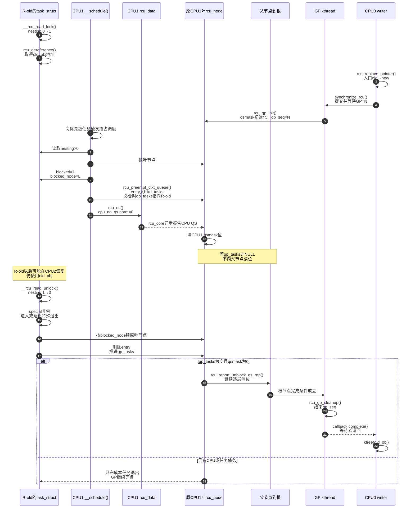

# 第8章\_抢占式\_Tree\_RCU\_源码同步机制

## 8.1\_版本\_配置与源码边界

本章以 NXP 官方 [`linux-imx`](https://github.com/nxp-imx/linux-imx) 仓库发布标签 `lf-6.12.20-2.0.0`、提交 `dfaf2136deb2af2e60b994421281ba42f1c087e0` 对应的 Linux 6.12.20 源码快照为证据基线；本地工作树位置不属于证据身份，统一记录见 [Linux 源码阅读基线](../../../../research/source_reading/linux/SOURCE_BASELINE.md)。该快照核对时的 `.config` 实际启用了：

```text
CONFIG_TREE_RCU=y
CONFIG_PREEMPT_RCU=y
CONFIG_PREEMPT=y
CONFIG_CONTEXT_TRACKING=y
CONFIG_CONTEXT_TRACKING_IDLE=y
CONFIG_NO_HZ=y
```

因此，本章不再从抽象模型猜函数，而是跟踪当前配置实际选择的 `#ifdef CONFIG_PREEMPT_RCU` 分支。主要源码位置如下：

| 位置 | 本章使用的职责 |
| --- | --- |
| `include/linux/rcupdate.h` | 公共 `rcu_read_lock/unlock` 包装、`rcu_assign_pointer()`、`rcu_dereference()` |
| `include/linux/sched.h` | `task_struct` 中的抢占式 RCU 任务状态 |
| `kernel/sched/core.c` | `__schedule()` 调用 RCU context-switch 钩子 |
| `kernel/rcu/tree.h` | `rcu_node`、`rcu_data`、`rcu_state` 字段 |
| `kernel/rcu/tree_plugin.h` | 抢占读者入队、CPU QS、特殊 unlock、boost |
| `kernel/rcu/tree.c` | GP 初始化、CPU QS 上报、节点汇聚、任务解阻后的继续汇聚、GP 完成 |

源码材料先从[Linux 6.12 Tree RCU 与 SRCU 源码导读](../../../../research/source_reading/rcu/navigation/P01_Linux_6.12_Tree_RCU_与_SRCU_源码导读.md#1.9_建议的源码阅读顺序)选择阅读路径，再由[抢占式 Tree RCU 模块源码概念导读](../../../../research/source_reading/rcu/navigation/P03_Linux_6.12_抢占式_Tree_RCU_模块源码概念导读.md#3.1_取证问题)归纳任务债务、CPU 债务和调用链；遇到具体字段或函数时，正文直接链接[抢占式 Tree RCU 关键函数源码实现](../../../../research/source_reading/rcu/source_explanations/P03_Linux_6.12_抢占式_Tree_RCU_关键函数源码实现.md#3.1_实现讲解边界与入口)的对应标题，不再复制上游函数体。

第 6 章已经解释同步请求、`gp_seq`、CPU `qsmask` 和回调唤醒链。本章只增加抢占式实现必须有的 **任务债务轴**，但会把它放回同一个 GP 周期中，不让读者自行拼接。

## 8.2\_实际数据结构不是一个状态机而是四组正交状态

### 8.2.1\_任务私有状态

Linux 6.12.20 的 `include/linux/sched.h::task_struct` 在 `CONFIG_PREEMPT_RCU` 下包含 `rcu_read_lock_nesting`、`rcu_read_unlock_special`、`rcu_node_entry` 和 `rcu_blocked_node`。当前仓库没有保存 `sched.h` 快照，所以[任务与节点的共享状态实现](../../../../research/source_reading/rcu/source_explanations/P03_Linux_6.12_抢占式_Tree_RCU_关键函数源码实现.md#3.2_任务与节点的共享状态实现)不伪造字段声明，而是用 `tree_plugin.h` 中真实的字段读写继续取证。

它们分别承担：

| 字段 | 状态含义 | 谁写 |
| --- | --- | --- |
| `rcu_read_lock_nesting` | 当前任务的读侧嵌套深度 | 当前任务的 lock/unlock 快路径 |
| `rcu_read_unlock_special.b.blocked` | 任务曾在读侧内被换出，最终 unlock 必须清共享登记 | 调度钩子置位，特殊退出清除 |
| `rcu_read_unlock_special.b.need_qs` | 最终退出还应兑现一个延迟 QS 请求 | 严格 GP 或老化 GP 路径置位，QS/特殊退出清除 |
| `rcu_node_entry` | 挂接到叶节点 `blkd_tasks` 的链表节点 | 调度钩子加入，特殊退出删除 |
| `rcu_blocked_node` | 最初登记任务的叶节点地址 | 调度钩子设置，特殊退出使用并清空 |

### 8.2.2\_每CPU状态

`rcu_data.gp_seq`、`cpu_no_qs.b.norm`、`core_needs_qs` 仍表示 CPU 对当前 GP 的感知和 QS 债务；`mynode` 给出当前 CPU 的叶节点，`grpmask` 给出它在该叶节点的位。

这些字段不保存被换出任务的生命期。context switch 完成任务登记后，`rcu_qs()` 可以清本 CPU 的 `cpu_no_qs.b.norm`，而任务仍留在共享链表。

### 8.2.3\_叶节点任务状态

[`kernel/rcu/tree.h::rcu_node` 的任务等待字段](../../../../research/source_reading/rcu/source_explanations/P03_Linux_6.12_抢占式_Tree_RCU_关键函数源码实现.md#3.2_任务与节点的共享状态实现)包括 `blkd_tasks`、`gp_tasks`、`exp_tasks` 和 `boost_tasks`。

`blkd_tasks` 是所有在本叶节点登记的被抢占读者集合。`gp_tasks` 指向其中第一个阻塞当前普通 GP 的任务；从它到链表等待方向上的任务属于当前 GP 债务。`exp_tasks`、`boost_tasks` 分别服务加速 GP 与优先级提升，不能和普通 GP 指针混成同一语义。

### 8.2.4\_节点CPU债务与全局代际

`rcu_node.qsmask` 仍是 CPU/子节点债务，`rcu_node.gp_seq` 与 `rcu_state.gp_seq` 仍是代际边界。抢占式完成条件是在原有条件上增加：

```text
节点qsmask == 0
    && 当前GP不再有gp_tasks
```

对多层树而言，叶节点只有满足两项条件，才能清除父节点中代表自己的那一位；因而根的 `qsmask == 0` 已经汇聚了下级 CPU 债务和任务债务。单节点树还会显式检查根节点的 `gp_tasks`。

## 8.3\_S0到S12\_一个旧读者被抢占的完整周期

| 阶段 | 触发 | 修改的状态 | 写入者 | 后续观察者 | 退出条件 |
| --- | --- | --- | --- | --- | --- |
| S0 发布旧对象 | `rcu_assign_pointer()` | 共享入口指向 `old_obj` | 发布者 | reader | 对象已初始化并发布 |
| S1 读者进入 | `rcu_read_lock()` | 任务 `nesting: 0→1` | reader | 本任务与调度钩子 | reader 可取指针 |
| S2 取得旧指针 | `rcu_dereference()` | reader 局部变量保存 `old_obj` 地址 | reader | reader 自己 | 进入使用阶段 |
| S3 写者摘除 | `rcu_replace_pointer()` | 共享入口 `old→new` | writer | 后来 reader | 旧对象不再从正式入口取得 |
| S4 GP 建立 | `rcu_gp_init()` | `gp_seq` 开始；节点 `qsmask` 初始化；既有 blocked task 建立 `gp_tasks` | GP kthread | CPU、节点、调度钩子 | 等待集合可见 |
| S5 reader 被换出 | `__schedule()` | 尚未直接清 CPU 位 | scheduler | `rcu_note_context_switch()` | 进入 RCU 调度钩子 |
| S6 债务转移 | `rcu_preempt_ctxt_queue()` | 任务 special/blocked_node/entry 与节点 `blkd_tasks/gp_tasks` | 原 CPU 调度路径 | GP 与最终 unlock | 任务记录已共享可见 |
| S7 CPU 锁存 QS | `rcu_qs()` | `cpu_no_qs.b.norm: 1→0` | 原 CPU | `rcu_core()` | CPU 本地债务已清 |
| S8 CPU 证据上报 | `rcu_report_qs_rdp/rnp()` | 叶 `qsmask` 清 CPU 位 | RCU core | 父节点 | 可能仍被 `gp_tasks` 截住 |
| S9 任务恢复 | 调度到原 CPU 或其他 CPU | 不改变原叶节点地址 | scheduler | reader | reader 继续使用旧对象 |
| S10 最外层退出 | `__rcu_read_unlock()` | `nesting: 1→0`，检测 special | reader | 特殊退出路径 | 可以清任务债务 |
| S11 任务解阻 | `rcu_preempt_deferred_qs_irqrestore()` | 从原叶链表删除；推进 `gp_tasks` | reader 退出路径 | 节点汇聚 | 最后一个任务且 `qsmask==0` |
| S12 GP完成 | `rcu_report_unblock_qs_rnp()`、树上报、`rcu_gp_cleanup()` | 父节点位、全局代际、等待 callback | 节点/GP kthread | 同步写者 | writer 被唤醒后释放旧对象 |

S6 是非抢占实现没有的状态转移。S7 可以在 S6 后立即发生，因此 S8 与 S11 可能相隔很久。

## 8.4\_S1\_lock快路径只修改当前任务

[`kernel/rcu/tree_plugin.h::__rcu_read_lock()` 的实现](../../../../research/source_reading/rcu/source_explanations/P03_Linux_6.12_抢占式_Tree_RCU_关键函数源码实现.md#3.3___rcu_read_lock与__rcu_read_unlock实现)先通过 `rcu_preempt_read_enter()` 增加当前任务的 nesting，再执行调试/严格 GP 分支和编译器屏障。

`rcu_preempt_read_enter()` 对 `current->rcu_read_lock_nesting` 加一。普通路径没有取得 `rcu_node` 锁，没有写 `blkd_tasks`，也没有设置 `qsmask`。编译器屏障确保临界区内访问不能被编译器移到进入代码之前。

因此“抢占式 RCU 会登记每个 reader”仍是错误说法。只有 reader 真正在读侧内遭遇 context switch 时，局部 nesting 才转为共享任务记录。

## 8.5\_S4\_GP如何接住在开始以前已经被抢占的任务

一种关键交错是：`R-old` 先被抢占并进入 `blkd_tasks`，此时尚无普通 GP；随后写者才请求 GP。任务不能因为“入队时没有 GP”而失踪。

[`kernel/rcu/tree.c::rcu_gp_init()`](../../../../research/source_reading/rcu/source_explanations/P02_Linux_6.12_非抢占式_Tree_RCU_关键函数源码实现.md#2.4_rcu_gp_init建立本轮等待集合)在遍历每个节点并设置新一轮 `qsmask` 前，持有 `rnp->lock` 调用 [`rcu_preempt_check_blocked_tasks()`](../../../../research/source_reading/rcu/source_explanations/P03_Linux_6.12_抢占式_Tree_RCU_关键函数源码实现.md#3.6_rcu_preempt_check_blocked_tasks接管旧任务)，然后才从 `qsmaskinit` 建立本轮 CPU 债务并发布节点代际。

抢占分支的 `rcu_preempt_check_blocked_tasks()` 检查 `blkd_tasks`。若存在需要本轮等待的任务，就把 `gp_tasks` 指向链表的相应旧端边界。这样 GP 开始以前已经共享登记的任务会被本轮接管。

这个顺序还说明：`gp_tasks` 是每轮 GP 的代际游标，不是 `blkd_tasks` 是否为空的缓存。

## 8.6\_S5到S7\_调度器怎样完成债务交接

### 8.6.1\_调度入口

`kernel/sched/core.c::__schedule()` 在本地中断关闭后调用 [`rcu_note_context_switch(preempt)`](../../../../research/source_reading/rcu/source_explanations/P03_Linux_6.12_抢占式_Tree_RCU_关键函数源码实现.md#3.4_rcu_note_context_switch转移读侧债务)。参数 `preempt` 区分抢占式换出与主动调度；函数首先用 `WARN_ONCE()` 检查“主动调度却仍位于普通 RCU 读侧”的错误路径。

这给出了“PREEMPT_RCU 不授权主动睡眠”的直接源码证据。

### 8.6.2\_从当前任务转入叶节点

若 `rcu_preempt_depth() > 0` 且任务尚未登记，[`rcu_note_context_switch()`](../../../../research/source_reading/rcu/source_explanations/P03_Linux_6.12_抢占式_Tree_RCU_关键函数源码实现.md#3.4_rcu_note_context_switch转移读侧债务)会锁住当前叶节点、置位 `blocked`、保存 `rcu_blocked_node`，再进入 [`rcu_preempt_ctxt_queue()`](../../../../research/source_reading/rcu/source_explanations/P03_Linux_6.12_抢占式_Tree_RCU_关键函数源码实现.md#3.5_rcu_preempt_ctxt_queue建立任务等待边界)完成链表插入和 GP 游标建立。

这里的状态传播方向是：

```text
current任务局部nesting
    → 当前CPU调度钩子观察
    → 原CPU叶节点锁
    → task_struct保存原叶节点地址
    → node_entry进入共享blkd_tasks
```

`rcu_preempt_ctxt_queue()` 还读取两组当前 GP 状态：普通 GP 的 `gp_tasks` 与 `qsmask & rdp->grpmask`，加速 GP 的 `exp_tasks` 与 `expmask & grpmask`。它根据任务是否会阻塞正在进行的 GP 决定插到链表头、尾或现有边界附近，并在首个阻塞者出现时设置 `gp_tasks` / `exp_tasks`。

### 8.6.3\_登记以后CPU才能成为QS

`rcu_note_context_switch()` 随后无条件调用同一节展开的 [`rcu_qs()`](../../../../research/source_reading/rcu/source_explanations/P03_Linux_6.12_抢占式_Tree_RCU_关键函数源码实现.md#3.4_rcu_note_context_switch转移读侧债务)，清本 CPU 的普通 QS 债务，并清当前任务已兑现的 `need_qs`。

源码注释明确说明：这不一定表示当前任务本身处于 QS，而是表示当前 GP 不必再等待本 CPU 上未来开始的读侧；若当前任务仍在旧读侧，它已经被放进某个叶节点的 `blkd_tasks`。

所以 context switch 路径的逻辑顺序是：

```text
先把旧任务身份写入共享节点
    → 后清CPU本地债务
    → 后续RCU core再异步清qsmask
```

## 8.7\_S8\_为什么qsmask清零仍不能向父节点报告

CPU 的本地 QS 仍通过第 6 章的路径汇聚：

```text
rcu_qs()
    → rcu_core()
    → rcu_check_quiescent_state()
    → rcu_report_qs_rdp()
    → rcu_report_qs_rnp()
```

但 [`rcu_report_qs_rnp()` 的树形汇聚实现](../../../../research/source_reading/rcu/source_explanations/P02_Linux_6.12_非抢占式_Tree_RCU_关键函数源码实现.md#2.7_rcu_report_qs_rdp与rcu_report_qs_rnp汇聚证据)每到一层，在清除对应位后同时检查 `qsmask` 和 [`rcu_preempt_blocked_readers_cgp()`](../../../../research/source_reading/rcu/source_explanations/P03_Linux_6.12_抢占式_Tree_RCU_关键函数源码实现.md#3.7_节点汇聚同时等待CPU与任务)。后者通过 `READ_ONCE(rnp->gp_tasks) != NULL` 判断当前普通 GP 是否仍有任务债务。

因此叶节点可能形成：

```text
qsmask = 0
gp_tasks = &R-old->rcu_node_entry
```

此时叶节点不能清父节点中的自己的 `grpmask` 位。任务债务被转换成了树上的汇聚阻塞条件，而不是伪装成某个 CPU 位。

## 8.8\_S9到S11\_迁移后的最外层unlock怎样找到原节点

### 8.8.1\_快路径先把nesting减到零

[`tree_plugin.h::__rcu_read_unlock()` 的实现](../../../../research/source_reading/rcu/source_explanations/P03_Linux_6.12_抢占式_Tree_RCU_关键函数源码实现.md#3.3___rcu_read_lock与__rcu_read_unlock实现)先用屏障约束临界区访问，再减少 nesting；只有最外层从 1 变 0 且 special 非零，才进入 `rcu_read_unlock_special()`。

内层 unlock 只减少嵌套；只有最外层从 1 变 0 且 special 非零，才进入共享清理。第一个屏障防止临界区访问移到退出之后，第二个屏障约束 nesting 退出和 special 检查。

### 8.8.2\_不安全上下文先延迟处理

`rcu_read_unlock_special()` 若发现抢占、BH 或中断仍禁用，不能立刻执行完整共享清理。它会根据条件触发 RCU softirq、设置 reschedule 标志，必要时排 `irq_work`，等待安全上下文再调用 `rcu_preempt_deferred_qs()`。

所以“unlock 直接通知 GP”仍然过度简化。实际可能是：

```text
最外层unlock发现special
    → 当前上下文不适合操作共享状态
    → 仅安排softirq/reschedule/irq_work
    → 调度或RCU core路径以后完成清理
```

### 8.8.3\_从原叶节点删除任务

安全时进入 `rcu_preempt_deferred_qs_irqrestore()`。若 `special.b.blocked`：

1. 从 `t->rcu_blocked_node` 取得原叶节点，而不是使用恢复 CPU 的 `rdp->mynode`；
2. 锁住这个叶节点；
3. 保存任务链表的下一个等待项；
4. `list_del_init(&t->rcu_node_entry)`；
5. 清空 `t->rcu_blocked_node`；
6. 若当前任务正是 `gp_tasks` / `exp_tasks` / `boost_tasks` 指向项，推进对应指针。

源码在删除以前执行的 `smp_mb()` 用于保证加速 GP 快路径观察到读侧结束；它不替代节点锁，也不是普通对象发布的 `rcu_assign_pointer()` 屏障。

## 8.9\_S11到S12\_最后一个任务怎样重新启动树形汇聚

删除任务前，退出路径先记录节点原先是否存在普通 GP 阻塞者；删除后若从“有阻塞者”变为“无阻塞者”，并且 `rnp->qsmask == 0`，就调用 [`rcu_report_unblock_qs_rnp()`](../../../../research/source_reading/rcu/source_explanations/P03_Linux_6.12_抢占式_Tree_RCU_关键函数源码实现.md#3.8_最外层退出删除任务并恢复传播)。

[`kernel/rcu/tree.c::rcu_report_unblock_qs_rnp()`](../../../../research/source_reading/rcu/source_explanations/P03_Linux_6.12_抢占式_Tree_RCU_关键函数源码实现.md#3.8_最外层退出删除任务并恢复传播) 再次校验：

```text
CONFIG_PREEMPT_RCU已启用
当前节点gp_tasks已经为空
当前节点qsmask已经为零
```

随后它把这个叶节点对父节点的 `grpmask` 作为新的证明向上报告。父节点也只有在自身其他位与任务阻塞条件都清空后才继续上报，最终唤醒 GP kthread。

这补齐了第三类关键通信：

```text
分散任务局部结束
    → 修改叶节点共享游标
    → 恢复被任务债务截断的树形汇聚
    → 根节点得出全局结论
    → GP cleanup推进代际
    → callback完成并唤醒synchronize_rcu()等待者
```

## 8.10\_端到端源码时序



## 8.11\_新读者入队为什么不无限延长旧GP

`rcu_preempt_ctxt_queue()` 不是简单 `list_add_tail()`。它计算四个条件：

```text
普通GP是否已有gp_tasks
加速GP是否已有exp_tasks
当前CPU位是否仍阻塞普通GP
当前CPU位是否仍阻塞加速GP
```

若新任务不阻塞已经进行的 GP，它会被放到不会落入既有 `gp_tasks` 等待后缀的位置；若它是第一个会阻塞本轮 GP 的任务，才建立相应游标。源码注释也承认该排队是保守近似：某些情况下普通 GP 会多等一个并非严格必要的任务，但实现选择的是多等而不是漏等。

这段链表算法兑现了第 7 章的时间边界：共享入口更新以后才开始的新读者，不应仅因后来被抢占就把当前旧对象 GP 永久向后延伸。

## 8.12\_GP等待条件在源码中的两个落点

GP 强制 QS 循环的快速完成检查同时要求根节点 `qsmask` 为空且 [`rcu_preempt_blocked_readers_cgp()`](../../../../research/source_reading/rcu/source_explanations/P03_Linux_6.12_抢占式_Tree_RCU_关键函数源码实现.md#3.7_节点汇聚同时等待CPU与任务)为假。

GP cleanup 在结束各节点代际前还会警告检查 `gp_tasks` 和 `qsmask` 必须为空。这是安全性防线：任务债务没有消失时，GP 不能靠时间到期进入 cleanup。

多层树中，普通 GP 阻塞任务只登记在叶节点。叶节点未同时清空 CPU 与任务债务，就不会清父节点位；因此根 `qsmask` 汇聚下层状态。源码对单节点树另有显式 `gp_tasks` 检查，因为根本身同时就是叶节点。

## 8.13\_退出\_CPU离线与异常清理

任务若带着错误的 RCU nesting 退出，[`tree_plugin.h::exit_rcu()` 所复用的特殊清理路径](../../../../research/source_reading/rcu/source_explanations/P03_Linux_6.12_抢占式_Tree_RCU_关键函数源码实现.md#3.8_最外层退出删除任务并恢复传播)会把状态整理到一次最外层退出并清除共享登记，避免链表节点永久遗留；这是一条错误恢复路径，不是允许调用者省略 `rcu_read_unlock()` 的契约。

CPU offline 也不能丢掉已经登记的任务。叶节点的 `wait_blkd_tasks` 表示即使该节点没有在线 CPU，仍可能必须等待被抢占任务退出；GP 初始化和 hotplug 清理据此决定是否继续把该叶节点纳入树形传播。详细热插拔路径见[Tree RCU CPU 热插拔与回调迁移](P21_Tree_RCU_CPU热插拔与回调迁移.md)。

## 8.14\_普通GP与加速GP不能混讲

本章主线是普通 GP：`gp_tasks` 与 `qsmask`。同一条 `blkd_tasks` 上还有 `exp_tasks`，用于 `synchronize_rcu_expedited()`；退出最后一个加速 GP 阻塞任务时，路径调用 `rcu_report_exp_rnp()`。若启用 `CONFIG_RCU_BOOST`，`boost_tasks` 和节点 boost kthread 还会尝试提升拖住 GP 的读者优先级。

三组游标共享任务链表以减少重复登记，但完成条件、催促方式和成本不同。不能看到 `exp_tasks` 或 boost 就把普通 GP 描述成主动向每个 reader 发通知。加速与 boost 详见[Tree RCU Expedited GP](P16_Tree_RCU_Expedited_GP.md)。

## 8.15\_Linux\_5.10差异与稳定主线

Linux 5.10 已经具有本章的核心任务跟踪框架：`task_struct` 的 nesting/special/node entry/blocked node，`rcu_node.blkd_tasks/gp_tasks`，`rcu_note_context_switch()`、`rcu_preempt_ctxt_queue()` 和特殊 unlock 清理。因而“CPU 债务转任务债务”的证明主线跨 5.10 与 6.12 成立。

阅读 5.10 时仍需以该版本函数体为准：特殊退出、加速 GP、boost 和 context-tracking 辅助路径在版本间持续调整；尤其第 6 章所述 6.12 普通同步等待者直接批处理状态不能反推到 5.10。长期源码证据导读会把两版差异放在具体调用点，而不是只列函数名。

## 8.16\_本章源码证据核对表

| 问题 | Linux 6.12.20 证据 |
| --- | --- |
| 读者身份保存在哪里 | [`task_struct` RCU 字段的证据边界](../../../../research/source_reading/rcu/source_explanations/P03_Linux_6.12_抢占式_Tree_RCU_关键函数源码实现.md#3.2_任务与节点的共享状态实现)；当前未保存 `sched.h` 快照，不伪造声明 |
| lock/unlock 怎样展开 | [`__rcu_read_lock()` / `__rcu_read_unlock()`](../../../../research/source_reading/rcu/source_explanations/P03_Linux_6.12_抢占式_Tree_RCU_关键函数源码实现.md#3.3___rcu_read_lock与__rcu_read_unlock实现) |
| 调度器何时介入 | [`rcu_note_context_switch(preempt)`](../../../../research/source_reading/rcu/source_explanations/P03_Linux_6.12_抢占式_Tree_RCU_关键函数源码实现.md#3.4_rcu_note_context_switch转移读侧债务) |
| 本地状态怎样转共享 | [`rcu_note_context_switch()` 设置 special/blocked_node](../../../../research/source_reading/rcu/source_explanations/P03_Linux_6.12_抢占式_Tree_RCU_关键函数源码实现.md#3.4_rcu_note_context_switch转移读侧债务) → [`rcu_preempt_ctxt_queue()` 入队](../../../../research/source_reading/rcu/source_explanations/P03_Linux_6.12_抢占式_Tree_RCU_关键函数源码实现.md#3.5_rcu_preempt_ctxt_queue建立任务等待边界) |
| 任务挂在哪里 | [`rcu_node.blkd_tasks` 与任务链表项](../../../../research/source_reading/rcu/source_explanations/P03_Linux_6.12_抢占式_Tree_RCU_关键函数源码实现.md#3.2_任务与节点的共享状态实现) |
| 当前普通 GP 等谁 | [`rcu_node.gp_tasks` 的等待游标](../../../../research/source_reading/rcu/source_explanations/P03_Linux_6.12_抢占式_Tree_RCU_关键函数源码实现.md#3.7_节点汇聚同时等待CPU与任务) |
| GP 开始前已挂起任务怎样纳入 | [`rcu_gp_init()`](../../../../research/source_reading/rcu/source_explanations/P02_Linux_6.12_非抢占式_Tree_RCU_关键函数源码实现.md#2.4_rcu_gp_init建立本轮等待集合) → [`rcu_preempt_check_blocked_tasks()`](../../../../research/source_reading/rcu/source_explanations/P03_Linux_6.12_抢占式_Tree_RCU_关键函数源码实现.md#3.6_rcu_preempt_check_blocked_tasks接管旧任务) |
| CPU何时可报告 | 任务登记完成后 [`rcu_note_context_switch()` → `rcu_qs()`](../../../../research/source_reading/rcu/source_explanations/P03_Linux_6.12_抢占式_Tree_RCU_关键函数源码实现.md#3.4_rcu_note_context_switch转移读侧债务) |
| CPU位为何不能越过任务 | [`rcu_report_qs_rnp()` 的双条件](../../../../research/source_reading/rcu/source_explanations/P02_Linux_6.12_非抢占式_Tree_RCU_关键函数源码实现.md#2.7_rcu_report_qs_rdp与rcu_report_qs_rnp汇聚证据)与 [`rcu_preempt_blocked_readers_cgp()`](../../../../research/source_reading/rcu/source_explanations/P03_Linux_6.12_抢占式_Tree_RCU_关键函数源码实现.md#3.7_节点汇聚同时等待CPU与任务) |
| 迁移后怎样找到登记点 | [`task_struct.rcu_blocked_node` 的读取与清空](../../../../research/source_reading/rcu/source_explanations/P03_Linux_6.12_抢占式_Tree_RCU_关键函数源码实现.md#3.8_最外层退出删除任务并恢复传播) |
| 最终退出怎样删除 | [`rcu_preempt_deferred_qs_irqrestore()`](../../../../research/source_reading/rcu/source_explanations/P03_Linux_6.12_抢占式_Tree_RCU_关键函数源码实现.md#3.8_最外层退出删除任务并恢复传播) |
| 最后任务怎样恢复汇聚 | [`rcu_report_unblock_qs_rnp()`](../../../../research/source_reading/rcu/source_explanations/P03_Linux_6.12_抢占式_Tree_RCU_关键函数源码实现.md#3.8_最外层退出删除任务并恢复传播) |
| GP最终完成条件 | [模块导读的普通 GP 双条件](../../../../research/source_reading/rcu/navigation/P03_Linux_6.12_抢占式_Tree_RCU_模块源码概念导读.md#3.12_GP完成处的双重检查)；[`rcu_gp_cleanup()`](../../../../research/source_reading/rcu/source_explanations/P02_Linux_6.12_非抢占式_Tree_RCU_关键函数源码实现.md#2.8_rcu_gp_cleanup公布完成代际) |
| 活性怎样补救 | [模块导读的 FQS、stall 与 boost 边界](../../../../research/source_reading/rcu/navigation/P03_Linux_6.12_抢占式_Tree_RCU_模块源码概念导读.md#3.12_GP完成处的双重检查) |

RCU 源码材料的分类和建议顺序见[Linux 6.12 Tree RCU 与 SRCU 源码导读](../../../../research/source_reading/rcu/navigation/P01_Linux_6.12_Tree_RCU_与_SRCU_源码导读.md#1.9_建议的源码阅读顺序)；子功能、状态轴和调用链归纳见[Linux 6.12 抢占式 Tree RCU 模块源码概念导读](../../../../research/source_reading/rcu/navigation/P03_Linux_6.12_抢占式_Tree_RCU_模块源码概念导读.md#3.1_取证问题)；字段、入队、退出和恢复传播的具体实现见[抢占式 Tree RCU 关键函数源码实现](../../../../research/source_reading/rcu/source_explanations/P03_Linux_6.12_抢占式_Tree_RCU_关键函数源码实现.md#3.2_任务与节点的共享状态实现)。

上一篇：[抢占式 Tree RCU 的问题与任务跟踪模型](P07_抢占式_Tree_RCU_问题与任务跟踪模型.md)。

下一篇：[RCU 机制完善：硬件与运行约束](P09_RCU_机制完善_硬件与运行约束.md)。
