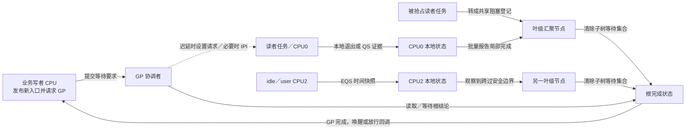
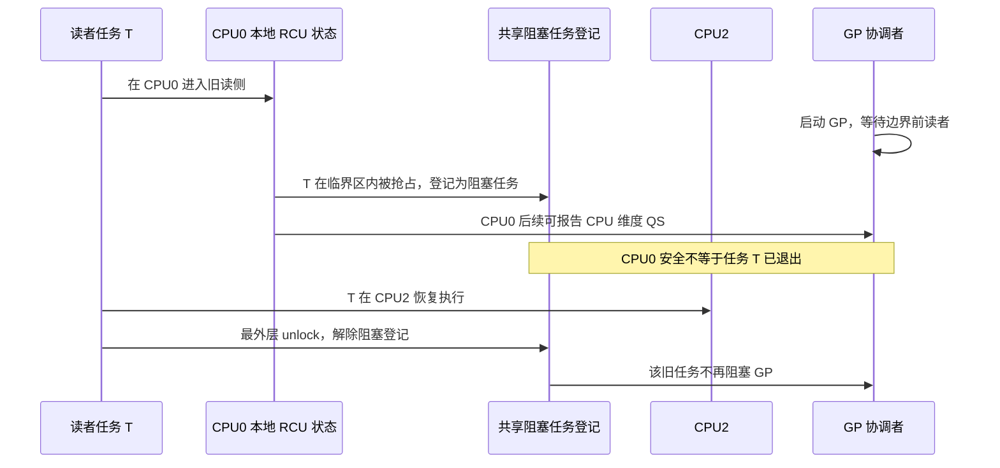
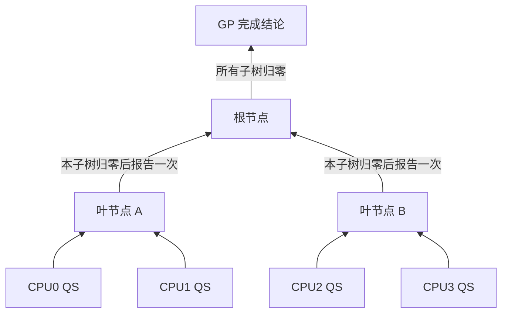
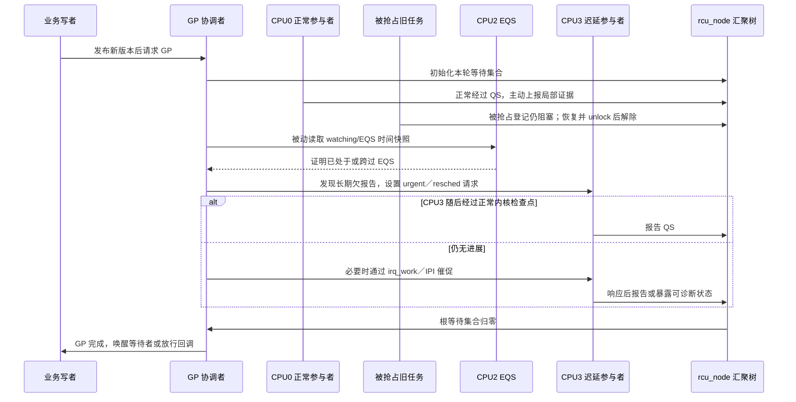

# 第9章\_RCU\_机制完善\_硬件与运行约束

前几章已经推导并分别落实了最小 RCU 时间线：发布新版本，封闭可能持有旧版本的读者集合，等待这些旧读者结束，然后回收旧版本。但只看这条主线，仍容易默认 CPU 会及时参与、分散证据容易汇总，而且各 CPU 会按源码顺序观察共享状态。本章逐项打破这些假设，回答： **真实运行条件会迫使 RCU 增加哪些状态和通信路径？**

本章不再零散教授缓存协议、访问原子性或屏障。通用机制由各自权威专题独立维护；这里先链接到所需结论，再把结论用于 RCU 反例。这样既可以连续读完 RCU 主线，也可以单独进入底层专题追问硬件过程。

> **本章边界：** 前六个反例决定 RCU 子系统怎样识别并汇聚旧读者；“版本根 + 多个 kref 子块”怎样逐层退休属于对象所有权问题，仍由 [RCU、kref 与复合对象生命周期](P04_RCU_kref与复合对象生命周期.md)负责。

## 9.1\_先建立依赖地图

CPU 中没有专用的“RCU 单元”。RCU 是 Linux 软件协议，它使用硬件和编译器提供的基础能力，却必须自己定义读者、宽限期、完成条件和回收时机。

| 本章使用的基础结论 | 通用权威正文 | 到 RCU 中要追问什么 |
| --- | --- | --- |
| 一致性维护同一缓存行的副本；高频共享写会转移缓存行所有权 | [缓存一致性问题与缓存行](../../../foundations/computer_architecture/cache_coherence/P01_缓存一致性问题与缓存行.md)、[缓存行所有权竞争与伪共享](../../../foundations/computer_architecture/cache_coherence/P03_缓存行所有权竞争与伪共享.md) | 怎样避免每个 reader 都写同一个全局计数器？ |
| 单次访问能否保持完整由宽度、对齐和架构保证决定 | [访问粒度、对齐与撕裂](../../../foundations/computer_architecture/memory_ordering/P02_访问粒度_对齐与撕裂.md) | 为什么指针不撕裂仍不足以完成 RCU 发布？ |
| Store Buffer、传播和多观察者会改变跨地址观察顺序 | [体系结构内存顺序专题](../../../foundations/computer_architecture/memory_ordering/大纲.md) | 对象发布和分散 GP 证据怎样形成可证明顺序？ |
| 编译器访问、Linux 屏障和 release/acquire 分属不同契约 | [Linux 内存顺序专题](../../memory_ordering/大纲.md) | RCU 为什么还要专用指针接口、依赖检查和宽限期？ |

硬件只知道地址、缓存行、访问和中断目标，不知道哪段 C 代码属于 RCU 临界区，也不知道哪个对象是“旧照”。这些语义必须落入内核可读写的状态中。

## 9.2\_固定角色与状态流向

先固定一轮普通 Tree RCU GP 的抽象角色，下一章再把它们映射到 Linux 6.12.20 字段：



这不是单一变量构成的状态机，而是几组正交状态共同完成证明：

- **任务维度：** 当前任务是否位于读侧，若被抢占是否仍阻塞 GP；
- **CPU 维度：** 本 CPU 是否已经跨过本轮要求的 QS，是否正在 watching；
- **节点维度：** 哪些 CPU 或子节点仍欠本轮报告；
- **全局维度：** GP 处于请求、初始化、等待还是完成阶段；
- **对象维度：** 业务入口何时换代、旧对象何时取消发布和回收。

对象地址不会被逐个“上报给 RCU”。RCU 收集的是任务/CPU 已跨过安全边界的证据；业务写者再把这个通用完成结论用于自己取消发布的旧对象。

## 9.3\_六个反例怎样逼出完整机制

| 朴素假设 | 真实反例 | 被迫增加的能力 | Linux 具体实现的后续入口 |
| --- | --- | --- | --- |
| 每次进入/退出改一个全局读者数即可 | 多 CPU 高频读使同一计数缓存行来回转移 | 高频路径使用任务或 CPU 所有的本地状态，低频事件才写共享状态 | [P08 抢占读者状态](P08_抢占式_Tree_RCU_源码同步机制.md)、[P14 分层汇聚](P14_Tree_RCU_rcu_node树与分层汇聚.md) |
| 读者始终留在原 CPU 并很快退出 | 临界区内被抢占，随后可能迁移 | 读侧状态能随任务存在，并能从本地状态转成共享阻塞登记 | [P08 抢占读者状态](P08_抢占式_Tree_RCU_源码同步机制.md) |
| 每颗 CPU 都会很快运行一次 RCU 代码 | CPU 进入 user、idle、NO_HZ 或动态离线 | watching/EQS 状态、跨时间快照和参与集合变化 | [P13 QS/EQS](P13_Tree_RCU_QS_EQS与Context_Tracking.md)、[P21 CPU 热插拔](P21_Tree_RCU_CPU热插拔与回调迁移.md) |
| 所有 CPU 可直接写一个完成字 | CPU 越多，全局完成字越成为共享写热点 | per-CPU 记录、叶节点聚合、逐层向根汇聚 | [P14 分层汇聚](P14_Tree_RCU_rcu_node树与分层汇聚.md) |
| 参与者总会及时报告 | CPU 长时间不经过普通检查点 | 被动观察、urgent 请求、重调度或 IPI 催促、stall 诊断 | [P15 force-QS](P15_Tree_RCU_force_QS迟延与Stall.md) |
| 源码顺序就是其他 CPU 的观察顺序 | 新指针可能先于对象初始化被观察，GP 状态也分散在多个 CPU | 对象发布—取得契约与 GP 内部的屏障/锁顺序链 | [P28 RCU 内存序](P28_RCU_内存序_误用与选择边界.md) |

后面各节不重复这些后续文档的字段说明，只把反例中的因果链走通。

## 9.4\_反例一\_全局读者计数重新制造共享写热点

假设每次查询都执行：

```text
进入：atomic_inc(global_readers)
退出：atomic_dec(global_readers)
```

它能表达“还有多少读者”，但高读负载下会发生：

1. CPU0 必须取得 `global_readers` 所在缓存行的可写所有权；
2. CPU1 随后递增，又要让 CPU0 的副本失效并取得所有权；
3. 每次进入和退出各发生一次原子 RMW；
4. CPU 数和查询频率越高，这条缓存行越接近串行化热点；
5. 读者原本并行访问不同对象，却被一个生命周期计数强制联系起来。

RCU 要保留“写者能判断旧读者已经离场”的正确性，又不能让每次读取都争用同一共享字。因此被迫选择： **正常读侧只修改任务/CPU 所有的局部状态，等到一次 GP 需要证据时，再由低频路径把局部结论汇聚出去。**

这不是“读侧绝对不写内存”。PREEMPT_RCU 可以修改当前任务的嵌套状态；关键是这类状态通常由当前执行者所有，不是所有 reader 都原子修改的同一全局计数。

> **“读侧”也不等于硬件只读。** 临界区内当然可以执行 store；但 RCU 不会替这些 store 串行化。如果 reader 修改多个 CPU 共享的同一缓存行，缓存行所有权迁移成本会回来；如果它修改对象字段，还需要锁、原子操作或其他字段级同步。

## 9.5\_反例二\_读者被抢占和迁移后不能只看原\_CPU

如果读侧状态只保存在 CPU0，下面的交错会误导 GP：



状态转换的关键不是“把所有 reader 都放入全局链表”，而是：

```text
正常运行：状态由当前任务/CPU 本地持有
临界区内被抢占：调度路径把仍存活的旧读者转成共享登记
迁移后退出：任务在新 CPU 上解除自己的共享登记
```

这样，正常读取不需要跨 CPU 通信；只有状态所有权从“正在 CPU 上运行”变成“被调度器挂起”时，才支付共享登记成本。Linux 的具体 nesting、`blkd_tasks` 和 `gp_tasks` 见 [P08](P08_抢占式_Tree_RCU_源码同步机制.md)。

## 9.6\_反例三\_user\_idle\_NO\_HZ\_与离线\_CPU\_不会按时跑检查点

朴素模型若规定“每颗 CPU 下一次时钟 tick 时报告”，会遇到两个相反问题：

- CPU 处于 user 或 idle 时，并没有在执行普通内核 RCU 读侧；让它为了证明“没有 reader”频繁醒来会破坏节电和隔离目标；
- CPU 从 EQS 返回并进入中断或内核后，又可能重新成为需要观察的参与者，不能把一次永久的“空闲”标记当成未来保证。

因此需要一个能跨时间比较的 watching/EQS 状态：

1. CPU 离开 RCU watching 区域时更新本地 context-tracking/dynticks 状态；
2. GP 取得某个时间点的快照；
3. 之后若观察到 CPU 一直处于 EQS，或已经完整穿过一次 EQS，就能推出它不再持有边界前的普通 RCU 读者；
4. CPU 重新进入内核、中断或其他 watching 区域时再次更新状态，避免把旧快照误用于新活动；
5. CPU 离线时还要从参与集合中移除，并迁移其回调和相关状态。

这里的通信主要通过共享可观察的每 CPU 状态和 GP 快照完成，不要求 idle CPU 为每轮 GP 主动发送一条对象级消息。具体状态转换见 [P13](P13_Tree_RCU_QS_EQS与Context_Tracking.md)，CPU 上下线边界见 [P21](P21_Tree_RCU_CPU热插拔与回调迁移.md)。

## 9.7\_反例四\_分散证据不能汇聚到一个全局热字

即使每个 CPU 只在每轮 GP 报告一次，如果几百颗 CPU 都原子修改同一个全局位图或计数，瓶颈也只是从“每次读取”后移到“每次 GP”。因此 RCU 需要分层归约：



每 CPU 状态由本 CPU 高频更新；叶节点只承受局部 CPU 的低频汇聚；父节点只在一个子树完成时收到一次上报。代价是多了节点状态、锁和传播层级，但换来了共享写压力随拓扑分散。具体 `rcu_data → rcu_node → root` 的位图所有权和上报路径见 [P14](P14_Tree_RCU_rcu_node树与分层汇聚.md)。

## 9.8\_反例五\_正常上报失效后需要逐级升级慢路径

“读侧不主动通知写者”只描述高频读取路径，不能推导出 GP 协调者永远不观察或催促远端 CPU。完整流程必须同时包含正常、特殊和超时路径：



成本分布因此是：

- **高频快路径：** reader 不给写者逐次发消息；
- **每轮 GP 正常路径：** CPU 在已有调度、内核或 QS 事件上记录并汇聚证据；
- **特殊路径：** 被抢占任务转成共享登记，EQS CPU 通过时间快照被观察；
- **迟延慢路径：** 协调者先扫描和设置请求，再按需要使用 reschedule、irq_work 或 IPI；
- **异常路径：** 长期无进展进入 stall 检测和诊断。

IPI 不是普通 GP 的统一广播基础，而是正常证据链不推进时的主动催促手段。具体阈值、状态和调用链见 [P15](P15_Tree_RCU_force_QS迟延与Stall.md)。

## 9.9\_反例六\_指针不撕裂仍然可能发布半初始化对象

假设自然对齐指针的单次读写不会撕裂，写者仍可能写出错误发布代码：

```c
new->value = 42;          /* A：初始化对象 */
WRITE_ONCE(global_ptr, new); /* B：只有单次写约束 */
```

缓存一致性分别维护 `new->value` 与 `global_ptr` 所在缓存行，不保证另一 CPU 按 A、B 的源码顺序观察它们。ONCE 约束编译器对那一次指针访问，也没有建立完整的发布—取得关系。硬件因果见[乱序执行与观察时机](../../../foundations/computer_architecture/memory_ordering/P03_乱序执行_Store_Buffer与观察时机.md)，Linux 契约见 [release/acquire 发布协议](../../memory_ordering/P04_release_acquire_发布协议.md)。

RCU 因此需要两条不同的顺序轴：

1. **对象轴：** `rcu_assign_pointer()` 使对象初始化先于入口发布，`rcu_dereference()` 在读侧按 RCU 契约取得指针；
2. **GP 轴：** 分散在任务、per-CPU 状态和 `rcu_node` 锁链上的证据，必须按实现规定的屏障与锁顺序形成可靠的“本轮已完成”结论。

宽限期不能代替对象发布屏障；release/acquire 也不能代替宽限期。前者回答旧读者是否结束，后者回答新读者观察新对象时初始化是否有序。RCU 专用接口和误用边界见 [P28](P28_RCU_内存序_误用与选择边界.md)。

## 9.10\_从六个反例交给\_Linux\_实现的需求

到这里，可以在不背任何 Linux 字段的情况下写出实现验收表：

| 必须成立的事实 | 状态保存要求 | 通信要求 |
| --- | --- | --- |
| 正常 reader 不争用全局计数 | 任务或 CPU 所有的局部读侧状态 | 正常进入/退出不跨 CPU 通知 |
| 被抢占旧任务继续阻塞 GP | 可随任务存在的共享登记 | 调度路径登记，最终 unlock 解除 |
| user/idle/NO_HZ CPU 可被判定安全 | 每 CPU watching/EQS 时间状态 | 本地事件写入，GP 可跨 CPU 读取快照 |
| 大量 CPU 的局部证据形成全局结论 | 每 CPU、叶节点、父节点和根的分层等待集合 | 子树完成时逐层上报 |
| 欠报告 CPU 最终被促进或诊断 | urgent、resched、stall 等慢路径状态 | 扫描、共享请求、irq_work/IPI 和诊断 |
| 发布、读取和 GP 完成顺序可证明 | 指针原语、屏障、锁和序列状态 | 通过共享内存顺序链传播，而非对象级通知 |

下一章将固定一轮 GP 的统一阶段，把这些抽象要求放进 `task_struct`、per-CPU `rcu_data`、`rcu_node`、`rcu_state` 和 GP kthread 的同一张状态与通信总图。P11～P15 再依次深入初始化、GP 生命周期、EQS、分层汇聚和迟延慢路径；抢占任务状态已经由 P07～P08 单独完成推演和源码兑现。

## 9.11\_硬件与软件的责任分界

| 问题 | 硬件/编译器能提供什么 | RCU 软件必须补什么 |
| --- | --- | --- |
| 指针是否撕裂 | 特定宽度与对齐下的单次访问能力 | 选用合适类型和指针接口 |
| 新对象是否完整发布 | 架构顺序原语和编译器约束 | `rcu_assign_pointer()` / `rcu_dereference()` 契约 |
| 同一地址副本是否一致 | cache-coherence 协议 | 避免把高频读侧变成全局共享写 |
| 哪些旧读者尚未结束 | 硬件不知道临界区语义 | 任务状态、QS/EQS、阻塞任务登记和 GP |
| 分散证据何时形成全局结论 | 原子访问、缓存和中断能力 | per-CPU 状态、`rcu_node` 树和 GP 协调者 |
| 旧对象何时真正释放 | 硬件不管理 C 对象所有权 | RCU API 给出 GP 边界，调用方设计对象回收协议 |

Linux 6.12.20 的版本化实现证据入口：[`rcupdate.h`](../../../../research/source_reading/linux/include/linux/rcupdate.h)、[`tree_plugin.h`](../../../../research/source_reading/linux/kernel/rcu/tree_plugin.h)、[`tree.c`](../../../../research/source_reading/linux/kernel/rcu/tree.c)。通用机制结论则以本章 9.1 节链接的各权威专题为准。

## 9.12\_本章验收

1. 能解释为什么 RCU 不需要 CPU 中存在专用硬件单元。
2. 能从全局读者计数的缓存行所有权迁移推出任务/CPU 本地状态。
3. 能画出被抢占读者从本地状态转成共享登记、迁移后解除的过程。
4. 能解释 EQS 快照为什么可以替代“每颗 CPU 每轮都主动发消息”。
5. 能区分正常 QS 上报、被动观察、urgent 请求、IPI 催促和 stall 诊断的成本位置。
6. 能区分对象发布顺序、GP 完成顺序和旧对象生命周期三条责任轴。
7. 遇到缓存、撕裂、屏障或 IPI 细节时，能进入相应权威专题，而不是要求本章维护另一套缩略教程。

上一篇：[抢占式 Tree RCU 源码同步机制](P08_抢占式_Tree_RCU_源码同步机制.md)。

下一篇：[Tree RCU 统一状态与通知总图](P10_Tree_RCU_统一状态与通知总图.md)。
