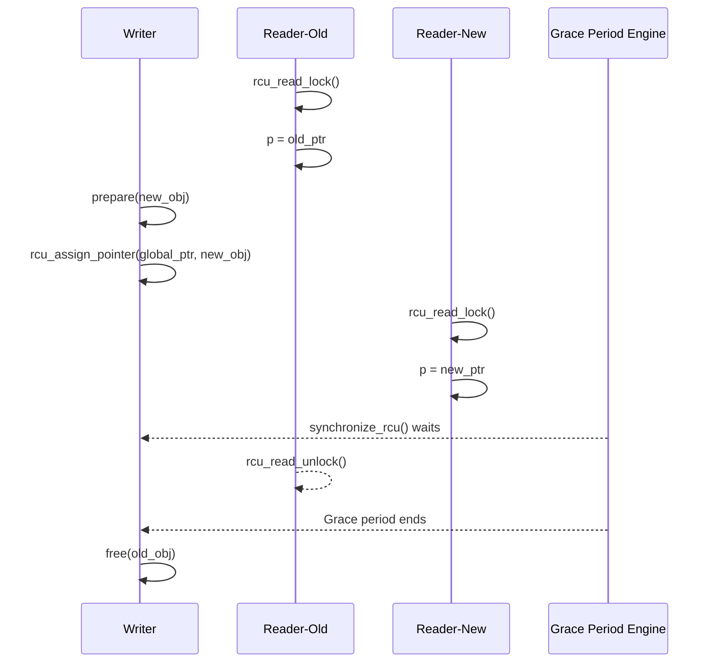

# 第9章\_RCU\_模板\_选型与核对

API 表解决“某个函数做什么”，却不能自动组成正确程序。本章把分散接口拼成一条完整生命期：写者准备并发布新对象、读者在正确域内取得指针、旧对象取消发布，最后同步或异步回收。

## 9.1\_最小模板\_全局\_RCU\_+\_异步释放

```c
/* [INV] 定义共享对象指针 */
struct my_data __rcu *gptr;
DEFINE_MUTEX(update_lock);

/* 写路径 */
void update_data(void)
{
    struct my_data *new, *old;
    new = kmalloc(sizeof(*new), GFP_KERNEL);
    prepare(new);
    mutex_lock(&update_lock);
    old = rcu_replace_pointer(gptr, new,
                              lockdep_is_held(&update_lock));
    mutex_unlock(&update_lock);
    if (old)
        call_rcu(&old->rcu, free_callback);  // 宽限期后异步销毁
}

/* 读路径 */
void read_data(void)
{
    struct my_data *p;
    rcu_read_lock();
    p = rcu_dereference(gptr);
    use(p);
    rcu_read_unlock();
}
```

------

## 9.2\_RCU\_与\_seqcount/seqlock\_对比矩阵

| 特征       | RCU            | seqcount_t           | seqlock_t      |
| ---------- | -------------- | -------------------- | -------------- |
| 读侧行为 | 轻量，工程上保持短小且不主动阻塞 | 无锁取快照 | 无锁取快照 |
| 写者串行化 | RCU 不提供，由使用者选择 | 必须由使用者提供 | `seqlock_t` 内置 spinlock |
| 读行为     | 不重试，读旧照 | 重试直到一致         | 重试直到一致   |
| 写行为     | 复制后替换     | 修改计数             | 锁保护修改     |
| 读取语义 | 新旧版本可并存，单个对象必须完整初始化 | 检测并发更新后重试 | 检测并发更新后重试 |
| 释放策略   | 延迟释放（GP） | 即时覆盖             | 即时覆盖       |
| 适合场景   | 读多写少       | 读多写少但追求强一致 | 控制层共享状态 |

------

## 9.3\_时序图\_新旧并存与宽限期释放



> 图示显示：RCU 通过全局宽限期机制允许旧读者读旧数据，同时新读者已可访问新数据。

------

## 9.4\_核对表

| 检查项                         | 目标          | 状态 |
| ------------------------------ | ------------- | ---- |
| 写者是否自互斥？               | 防止多写冲突  | □    |
| 所有读者是否包在读区？         | 避免未计入 GP | □    |
| 是否使用 `rcu_dereference()`？ | 保证内存序    | □    |
| 释放是否在 GP 后？             | 防止悬空指针  | □    |
| 保护区必须跨越主动阻塞时，是否使用 SRCU 或引用交接？ | 匹配读侧语义 | □ |

------

## 9.5\_小结

- RCU 以“读侧不与写者争抢同一把锁 + 新旧版本并存 + 延迟回收”保护读多写少对象；
- 它的安全来自发布—取得契约、读侧标记和宽限期回收；
- 普通 Tree RCU 协调全系统相关静止状态，SRCU 由 `srcu_struct` 定义私有域；
- 适合**读频高、写稀疏、读旧容忍**的场景；
- 与 `seqcount_t` / `seqlock_t` 相比，RCU 放弃即时一致性，换来极高的读扩展性。


上一篇：[RCU API 速查](P08_RCU_API_速查.md)。

下一篇：[RCU 驱动应用模式](P10_RCU_驱动应用模式.md)。


