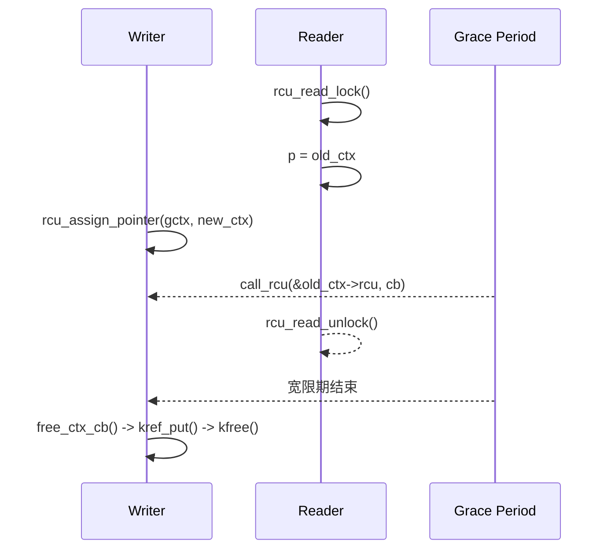

# 第10章\_RCU\_驱动应用模式

掌握最小模板后，再把同一套生命期规则放进真实驱动场景。本章关注设备链表、状态表和异步销毁中的结构差异，同时观察 RCU 何时必须与更新锁、kref 或卸载同步协作。

## 10.1\_RCU\_在驱动场景中的典型应用模式

#### (1)\_章节内容说明

本节从**开发者视角**出发，展示 RCU 在 Linux 驱动中三类典型场景的应用模式：

1. **设备链表与热插拔** —— 解决“读遍历与写插拔并发”；
2. **设备状态表（open/close/poll）** —— 解决“读频繁、写稀疏”的状态访问；
3. **对象引用与延迟销毁** —— 解决“对象仍被读者访问时不能提前释放”的问题。

所有示例均与平台无关，可直接在内核模块中编译运行。

------

#### (2)\_场景一\_设备链表与热插拔

##### 1)\_问题背景

驱动层往往维护一个设备节点链表：

```c
struct dev_entry {
	struct list_head list;
	struct device *dev;
	int online;
};
```

在设备热插拔或动态加载时：

- **读者**：频繁遍历链表（如 sysfs、监控任务）；
- **写者**：插入或删除节点。

传统锁方案 (`spin_lock`) 在高并发读下竞争严重，而 RCU 提供了**读无锁 + 延迟释放** 的解决方案。

------

##### 2)\_RCU\_化实现

```c
LIST_HEAD(dev_list);
DEFINE_SPINLOCK(dev_lock);

/* 写侧：添加新设备 */
void dev_add(struct device *d)
{
	struct dev_entry *e = kmalloc(sizeof(*e), GFP_KERNEL);
	e->dev = d;
	e->online = 1;

	spin_lock(&dev_lock);
	list_add_rcu(&e->list, &dev_list);
	spin_unlock(&dev_lock);
}

/* 写侧：删除设备（延迟释放） */
void dev_del(struct device *d)
{
	struct dev_entry *e;
	spin_lock(&dev_lock);
	list_for_each_entry_rcu(e, &dev_list, list) {
		if (e->dev == d) {
			list_del_rcu(&e->list);
			spin_unlock(&dev_lock);
			kfree_rcu(e, rcu);  // 延迟释放
			return;
		}
	}
	spin_unlock(&dev_lock);
}

/* 读侧：遍历设备 */
void dev_show_all(void)
{
	struct dev_entry *e;
	rcu_read_lock();
	list_for_each_entry_rcu(e, &dev_list, list)
		pr_info("dev: %s\n", dev_name(e->dev));
	rcu_read_unlock();
}
```

> `[INV]`：读区内禁止修改链表结构。
>  `[MIX]`：写侧仍需自行互斥；读侧不获取传统共享读锁，但仍执行配置相关的生命周期标记和 RCU 指针访问。

------

##### 3)\_机制分析

| 操作     | 安全点                 | 机制                     |
| -------- | ---------------------- | ------------------------ |
| 添加节点 | 加锁串行               | 结构一致                 |
| 删除节点 | RCU 删除 + 延迟释放    | 允许旧读者继续访问已摘除节点而不发生 UAF |
| 遍历     | `rcu_read_lock()` 保护 | 在生命周期保护区内遍历；不自动形成字段快照 |

`list_add_rcu()` / `list_del_rcu()` 与 `list_for_each_entry_rcu()` 实现了完整的 RCU 链表支持。

------

#### (3)\_场景二\_设备状态表(open/close/poll)

##### 1)\_问题背景

设备驱动常维护运行状态，例如：

```c
struct drv_status {
	bool online;
	bool ready;
	bool fault;
};
```

- **读者**：文件操作函数 (`read`, `poll`) 高频访问；
- **写者**：状态变化（如掉电、复位）低频更新。

这种“高读低写”的模式非常适合 RCU。

------

##### 2)\_RCU\_状态表实现

```c
struct drv_status __rcu *gstat;
static DEFINE_MUTEX(status_lock);

/* 写者：更新状态 */
void update_status(bool ready)
{
	struct drv_status *old, *new;

	new = kmalloc(sizeof(*new), GFP_KERNEL);
	if (!new)
		return;

	mutex_lock(&status_lock);
	old = rcu_dereference_protected(gstat,
					lockdep_is_held(&status_lock));
	*new = *old;
	new->ready = ready;
	rcu_assign_pointer(gstat, new);
	mutex_unlock(&status_lock);
	kfree_rcu(old, rcu);  // 宽限期后释放旧状态
}

/* 读者：访问状态 */
ssize_t drv_read(struct file *f, char __user *buf, size_t len, loff_t *off)
{
	struct drv_status *s;
	rcu_read_lock();
	s = rcu_dereference(gstat);
	if (!s->ready) {
		rcu_read_unlock();
		return -EAGAIN;
	}
	rcu_read_unlock();
	return len;
}
```

------

##### 3)\_性能与一致性比较

| 项         | RCU 方案           | 锁方案         |
| ---------- | ------------------ | -------------- |
| 读路径特征 | 不与写者争抢同一把锁 | 可能获取读锁或互斥锁 |
| 写代价 | 创建新版本并安排旧对象回收 | 通常可原地修改 |
| 实际延迟 | 必须通过基准测试 | 必须通过基准测试 |
| 读取模型 | 新旧版本可并存，读者不重试 | 读者取得锁保护的当前状态 |

> 适合：设备状态表、统计计数、策略标志等 **“读多写少”路径**。

------

#### (4)\_场景三\_对象引用与延迟销毁

##### 1)\_问题背景

设备上下文或资源对象常被多个线程同时访问：

- 用户态文件操作；
- 工作队列；
- 中断下半部。

若直接 `kfree()`，可能出现悬空指针。
 RCU + `kref` 是一种安全的“引用 + 延迟释放”组合方案。

------

##### 2)\_RCU\_+\_kref\_实现

```c
struct dev_ctx {
	struct kref ref;
	struct device *dev;
	struct rcu_head rcu;
};

struct dev_ctx __rcu *gctx;
static DEFINE_MUTEX(ctx_lock);

/* 读侧：获取上下文 */
struct dev_ctx *ctx_get(void)
{
	struct dev_ctx *c;
	rcu_read_lock();
	c = rcu_dereference(gctx);
	if (c && !kref_get_unless_zero(&c->ref))
		c = NULL;
	rcu_read_unlock();
	return c;
}

/* 写侧：替换上下文 */
void ctx_replace(struct device *dev)
{
	struct dev_ctx *old, *new;
	new = kzalloc(sizeof(*new), GFP_KERNEL);
	kref_init(&new->ref);
	new->dev = dev;

	mutex_lock(&ctx_lock);
	old = rcu_replace_pointer(gctx, new,
				  lockdep_is_held(&ctx_lock));
	mutex_unlock(&ctx_lock);
	if (old)
		call_rcu(&old->rcu, free_ctx_cb); // GP 后放掉集合持有的引用
}

/* 回调释放 */
void free_ctx_cb(struct rcu_head *head)
{
	struct dev_ctx *ctx = container_of(head, struct dev_ctx, rcu);
	kref_put(&ctx->ref, ctx_release);
}
```

> `[MIX]`：RCU 保护从共享入口查找并尝试增引用的窗口；成功取得的 `kref` 负责离开 RCU 后的长期生命周期。
>  `[INV]`：仅当引用为 0 且宽限期结束时，才真正释放对象。

------

##### 3)\_时序图



------

#### (5)\_混搭矩阵(驱动常见模块)

| 组件               | 是否可与 RCU 混用 | 混用模式                    |
| ------------------ | ----------------- | --------------------------- |
| GPIO / LED 驱动    | ✅                 | 状态表保护                  |
| 网络驱动           | ✅                 | 邻居表 / 路由表             |
| 字符设备           | ✅                 | `file_operations` 状态表    |
| I2C / SPI 子设备表 | ✅                 | 子节点链表                  |
| DMA 缓冲池         | ⚠️                 | 仅控制结构 RCU 化           |
| 中断处理           | ✅                 | `call_rcu()` 安全释放       |
| Block 层           | ⚠️                 | 局部结构可用                |
| Platform Device    | ✅                 | `device_link` 使用 RCU 管理 |

------

#### (6)\_核对表(交付前自检)

| 检查项                | 说明                                  | 状态 |
| --------------------- | ------------------------------------- | ---- |
| [CHECK] 写路径互斥    | 多写需自锁                            | □    |
| [CHECK] 延迟释放      | 是否使用 `call_rcu()` / `kfree_rcu()` | □    |
| [CHECK] 读路径最短    | 快照访问，不睡眠                      | □    |
| [CHECK] SRCU 场景识别 | 可睡读路径迁移至 SRCU                 | □    |
| [CHECK] 回调安全      | 回调中不再访问旧对象                  | □    |

------

#### (7)\_小结

| 要点                                                   | 说明 |
| ------------------------------------------------------ | ---- |
| RCU 是**读侧加速机制**，写侧仍需互斥。                 |      |
| 在驱动开发中，它广泛用于链表、状态表、上下文指针管理。 |      |
| 延迟释放是关键安全点：`call_rcu()` / `kfree_rcu()`。   |      |
| 可与 `kref`、`mutex`、`workqueue` 等安全组合。         |      |
| 适合“读多写少”的路径：状态读取、设备扫描、资源共享。   |      |


------

## 10.2\_驱动开发中的\_RCU\_接口与使用模式

------

#### (1)\_章节内容说明

本节面向驱动开发者，系统介绍 **驱动层能直接使用的 RCU 接口与开发模式**。
 目标是让读者在不研究底层机制的前提下，能独立写出**正确、安全、可维护**的 RCU 代码。

本节内容涵盖：

1. 基础读写接口族
2. 指针访问接口族
3. 延迟释放接口族
4. 链表 / 哈希表封装接口族
5. 同步接口族
6. 典型开发模式模板
7. 驱动自检核对表

------

#### (2)\_基础读写接口族

| 接口                                                | 功能              | 调用上下文                | 说明                   |
| --------------------------------------------------- | ----------------- | ------------------------- | ---------------------- |
| `rcu_read_lock()`                                   | 进入 RCU 读临界区 | 可在进程/中断上下文中使用 | 禁止睡眠               |
| `rcu_read_unlock()`                                 | 离开 RCU 读临界区 | 同上                      | 标记读完成             |
| `rcu_read_lock_bh()` / `rcu_read_unlock_bh()`       | 在 softirq 下使用 | 底半部保护                | `_bh` 表示 bottom half |
| `rcu_read_lock_sched()` / `rcu_read_unlock_sched()` | 调度器级同步      | 用于 scheduler 路径       | 更强的同步保证         |

> `[INV]`：RCU 读区必须成对出现。
>  `[CHECK]`：禁止在读区中睡眠（如 `msleep()`、`mutex_lock()` 等）。

------

#### (3)\_指针与对象访问接口族

| 接口                                 | 功能               | 用途             | 内存语义 |
| ------------------------------------ | ------------------ | ---------------- | -------- |
| `rcu_dereference(p)` | 在 RCU 读侧取得将被解引用的指针 | 单次取值、依赖顺序和调试检查 |
| `rcu_dereference_protected(p, cond)` | 在更新锁保护下取得指针 | `cond` 必须真实证明更新不会并发 |
| `rcu_assign_pointer(p, v)` | 发布已初始化的新指针 | 不提供写写互斥 |
| `rcu_access_pointer(p)` | 只取得指针值 | 常用于与 `NULL` 比较，不应据此解引用 |
| `RCU_INIT_POINTER(p, v)` | 特定初始化/拆除条件下赋值 | 默认应使用 `rcu_assign_pointer()` |

##### 1)\_示例

```c
struct dev_info __rcu *ginfo;
static DEFINE_MUTEX(info_lock);

/* 写侧更新 */
void update_dev(struct dev_info *new)
{
	struct dev_info *old;

	mutex_lock(&info_lock);
	old = rcu_replace_pointer(ginfo, new,
				  lockdep_is_held(&info_lock));
	mutex_unlock(&info_lock);
	if (old)
		kfree_rcu(old, rcu);
}

/* 读侧访问 */
void show_dev(void)
{
	struct dev_info *p;
	rcu_read_lock();
	p = rcu_dereference(ginfo);
	pr_info("dev id=%d\n", p->id);
	rcu_read_unlock();
}
```

> `[CHECK]`：写侧更新必须使用 `rcu_assign_pointer()`；读侧访问必须使用 `rcu_dereference()`。

------

#### (4)\_延迟释放接口族

| 接口                                                   | 功能                  | 场景               |
| ------------------------------------------------------ | --------------------- | ------------------ |
| `call_rcu(struct rcu_head *head, rcu_callback_t func)` | 宽限期后调用回调      | 自定义清理         |
| `kfree_rcu(ptr, member)`                               | 宽限期后自动释放      | 对象简单销毁       |
| `rcu_barrier()`                                        | 等待所有 RCU 回调完成 | 模块卸载、驱动收尾 |

##### 1)\_示例

```c
struct node {
	int id;
	struct rcu_head rcu;
};

void node_free_rcu(struct rcu_head *r)
{
	struct node *n = container_of(r, struct node, rcu);
	kfree(n);
}

void remove_node(struct node *n)
{
	list_del_rcu(&n->list);
	call_rcu(&n->rcu, node_free_rcu);
}
```

> `[INV]`：释放必须延迟到覆盖取消发布前潜在旧读者的宽限期之后。
>  `[CHECK]`：卸载模块前应执行 `rcu_barrier()` 确保所有回调完成。

------

#### (5)\_链表与哈希链表接口族

##### 1)\_普通链表

| 接口                                         | 功能         | 场景       |
| -------------------------------------------- | ------------ | ---------- |
| `list_add_rcu(new, head)`                    | 插入节点     | 设备注册表 |
| `list_del_rcu(entry)`                        | 删除节点     | 设备下线   |
| `list_replace_rcu(old, new)`                 | 替换节点     | 热切换对象 |
| `list_for_each_entry_rcu(pos, head, member)` | RCU 安全遍历 | 读者访问   |
| `list_entry_rcu(ptr, type, member)`          | 节点指针转换 | 内部使用   |

```c
LIST_HEAD(dev_list);
DEFINE_SPINLOCK(dev_lock);

/* 写侧 */
void dev_add(struct device *d)
{
	struct dev_entry *e = kmalloc(sizeof(*e), GFP_KERNEL);
	e->dev = d;
	spin_lock(&dev_lock);
	list_add_rcu(&e->list, &dev_list);
	spin_unlock(&dev_lock);
}

/* 读侧 */
void dev_show_all(void)
{
	struct dev_entry *e;
	rcu_read_lock();
	list_for_each_entry_rcu(e, &dev_list, list)
		pr_info("dev: %s\n", dev_name(e->dev));
	rcu_read_unlock();
}
```

------

##### 2)\_哈希链表

| 接口                                          | 功能     | 场景          |
| --------------------------------------------- | -------- | ------------- |
| `hlist_add_head_rcu(n, head)`                 | 插入节点 | 哈希映射      |
| `hlist_del_rcu(n)`                            | 删除节点 | 同上          |
| `hlist_replace_rcu(old, new)`                 | 替换节点 | 对象迁移      |
| `hlist_for_each_entry_rcu(pos, head, member)` | 安全遍历 | 网络 / 映射表 |

```c
DEFINE_HASHTABLE(dev_table, 8);
DEFINE_SPINLOCK(hash_lock);

void add_entry(struct dev_entry *e)
{
	spin_lock(&hash_lock);
	hlist_add_head_rcu(&e->hlist, &dev_table[e->id & 0xff]);
	spin_unlock(&hash_lock);
}

void show_table(void)
{
	struct dev_entry *e;
	int bkt;

	rcu_read_lock();
	hash_for_each_rcu(dev_table, bkt, e, hlist)
		pr_info("dev id=%d\n", e->id);
	rcu_read_unlock();
}
```

------

#### (6)\_同步接口族

| 接口                          | 功能             | 场景       |
| ----------------------------- | ---------------- | ---------- |
| `synchronize_rcu()`           | 阻塞等待覆盖调用前旧读者的普通 GP | 可阻塞控制路径 |
| `synchronize_rcu_expedited()` | 请求 expedited GP，代价更高      | 确有紧迫延迟要求且评估过系统代价的路径 |
| `synchronize_sched()`         | Linux 5.0 起已并入普通 RCU 语义的兼容接口 | 阅读旧代码时识别；新代码优先使用当前 RCU API |
| `synchronize_srcu()`          | 等待指定 `srcu_struct` 域中调用前的旧读者 | 使用 SRCU 私有域的路径 |

> `[CHECK]`：`synchronize_rcu()` 不能在中断上下文调用。

------

#### (7)\_驱动开发常见\_RCU\_模式

| 模式                 | 目的               | 最小模板                                       |
| -------------------- | ------------------ | ---------------------------------------------- |
| **指针保护模式**     | 状态切换读多写少   | `rcu_dereference()` / `rcu_assign_pointer()`   |
| **链表模式**         | 热插拔设备表       | `list_add_rcu()` / `list_for_each_entry_rcu()` |
| **延迟释放模式**     | 安全释放对象       | `call_rcu()` / `kfree_rcu()`                   |
| **状态复制更新模式** | 旧照可读，新照替换 | 写侧复制更新                                   |
| **卸载同步模式**     | 模块卸载安全       | `rcu_barrier()` / `synchronize_rcu()`          |

##### 1)\_示例\_指针保护模式

```c
struct drv_state __rcu *gstat;
static DEFINE_MUTEX(state_lock);

/* 写侧 */
void update_state(struct drv_state *new)
{
	struct drv_state *old;

	mutex_lock(&state_lock);
	old = rcu_replace_pointer(gstat, new,
				  lockdep_is_held(&state_lock));
	mutex_unlock(&state_lock);
	if (old)
		kfree_rcu(old, rcu);
}

/* 读侧 */
bool is_ready(void)
{
	struct drv_state *s;
	rcu_read_lock();
	s = rcu_dereference(gstat);
	bool r = s->ready;
	rcu_read_unlock();
	return r;
}
```

------

#### (8)\_核对表(驱动开发自检)

| 检查项                                                       | 说明         | 状态 |
| ------------------------------------------------------------ | ------------ | ---- |
| [CHECK] 是否正确成对调用 `rcu_read_lock()` / `rcu_read_unlock()` |              | □    |
| [CHECK] 写侧是否使用 `rcu_assign_pointer()`                  | 防止乱序写   | □    |
| [CHECK] 是否使用 `kfree_rcu()` / `call_rcu()` 延迟释放       | 防止悬空访问 | □    |
| [CHECK] 遍历是否采用 `list_for_each_entry_rcu()`             | 防止读写竞态 | □    |
| [CHECK] 模块退出是否区分 GP 与回调退场 | `synchronize_rcu()` 只等 GP；模块可能留下指向本模块代码的已排队回调时使用 `rcu_barrier()` | □ |

------

#### (9)\_小结

- 驱动开发中 RCU 用于：设备表、上下文指针、状态快照、引用对象。
- 常见接口分七类：**读写 / 指针 / 延迟释放 / 链表 / 哈希表 / 同步 / 模板**。
- 读侧保护：`rcu_read_lock()`；
   写侧更新：`rcu_assign_pointer()`；
   延迟释放：`call_rcu()` 或 `kfree_rcu()`。
- 驱动卸载时务必调用 `rcu_barrier()` 等待回调完成。
- 普通 RCU 读侧应保持短小且不主动阻塞；保护区必须跨越阻塞操作时，改用 SRCU，或在 RCU 内取得独立引用后退出。


------

上一篇：[RCU 模板、选型与核对](P09_RCU_模板_选型与核对.md)。

下一篇：[RCU 类型语义与 SRCU](P11_RCU_类型语义与_SRCU.md)。


