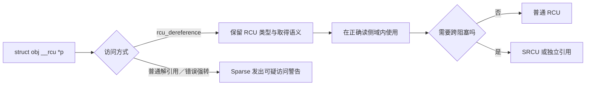

# 第11章\_RCU\_类型语义与\_SRCU

代码在运行时“看起来能工作”还不够，编译期也应尽量暴露错误的指针取得方式。本章从 `__rcu` 与 Sparse 类型检查切入，再从接口角度补充 SRCU 的域与调用规则。



## 11.1\_rcu\_修饰符与\_RCU\_类型语义

#### (1)\_章节内容说明

本节专门讲解 RCU 体系中最容易被忽略、但在编译期极为重要的语义标识符 —— `__rcu`。
 该修饰符并不直接影响运行时性能，而是 RCU 类型安全体系的核心。
 在驱动开发中，若不理解 `__rcu` 的存在与检查机制，很容易误用普通指针访问 RCU 数据，造成潜在的竞态与乱序读写。

------

#### (2)\_rcu\_的定义与属性

在内核头文件 `include/linux/compiler_types.h` 中定义如下：

```c
#define __rcu __attribute__((noderef, address_space(4)))
```

它由两个 GCC 属性组成：

| 属性               | 作用                                                   |
| ------------------ | ------------------------------------------------------ |
| `noderef`          | 禁止直接解引用该指针（即不允许 `*ptr` 访问）           |
| `address_space(4)` | 将其标识为“RCU 管理的指针空间”，不同于普通内核地址空间 |

------

#### (3)\_设计目的与意义

| 目标                 | 说明                                                         |
| -------------------- | ------------------------------------------------------------ |
| **类型区分**         | 区分“普通指针”和“RCU 管理指针”                               |
| **静态检查**         | Sparse 工具可检测错误访问方式                                |
| **接口强制性**       | 迫使开发者通过 `rcu_dereference()` / `rcu_assign_pointer()` 操作 |
| **文档语义化**       | 代码层面显式声明“该对象受 RCU 管理”                          |
| **防止编译优化错误** | 避免编译器跨屏障乱序访问共享内存                             |

简言之，

> `__rcu` 是一种**编译期契约（compile-time contract）**，
>  用于确保 RCU 对象只能以符合内存一致性语义的方式被访问。

------

#### (4)\_典型使用方式

##### 1)\_全局指针定义

```c
struct dev_state {
	int status;
};

/* 全局共享状态指针，受 RCU 管理 */
struct dev_state __rcu *gstate;
```

此时任何直接访问 `gstate` 的行为都将被静态分析工具报告为错误。

------

##### 2)\_正确读写方式

```c
/* 写侧 */
static DEFINE_MUTEX(state_lock);

void update_state(struct dev_state *new)
{
	struct dev_state *old;
	mutex_lock(&state_lock);
	old = rcu_replace_pointer(gstate, new,
				  lockdep_is_held(&state_lock));
	mutex_unlock(&state_lock);
	if (old)
		kfree_rcu(old, rcu);
}

/* 读侧 */
void show_state(void)
{
	struct dev_state *s;
	rcu_read_lock();
	s = rcu_dereference(gstate);
	pr_info("status=%d\n", s->status);
	rcu_read_unlock();
}
```

> `[INV]`：禁止直接 `s = gstate;` 或 `gstate = new;`，否则 Sparse 会发出类型空间警告。
>  `[CHECK]`：`rcu_assign_pointer()` 在当前 6.12.20 的非 `NULL` 常量路径使用 release store；`rcu_dereference()` 提供 `READ_ONCE()`、依赖顺序、编译器约束和检查语义，不能一概说成所有架构上的 acquire load。

------

#### (5)\_Sparse\_静态检查机制

##### 1)\_触发方式

内核编译命令中加入：

```bash
make C=1
```

即启用 Sparse 静态分析。Sparse 会识别 `address_space(4)` 类型的变量，
 当检测到不规范访问时，输出如下警告：

```
warning: incorrect type in assignment (different address spaces)
```

##### 2)\_典型误用示例

```c
struct foo *p = gptr;   // 错误：gptr 为 __rcu 类型
*p = *gptr;             // 错误：直接解引用 __rcu 指针
```

##### 3)\_正确写法

```c
struct foo *p = rcu_dereference(gptr);
```

Sparse 会自动识别并验证该 API 已执行必要的同步屏障。

------

#### (6)\_在驱动开发中的意义

| 使用场景       | 原因                   | 示例                                |
| -------------- | ---------------------- | ----------------------------------- |
| 全局设备状态   | 状态更新频繁，读多写少 | `struct dev_state __rcu *gstate;`   |
| 动态链表头     | 支持并发注册/注销      | `struct list_head __rcu *dev_list;` |
| 子系统配置指针 | 多线程访问配置结构     | `struct config __rcu *cfg;`         |
| 快速路径缓存   | 快速读无锁、写侧替换   | `rcu_assign_pointer(cache, new);`   |

------

#### (7)\_与普通指针的区别

| 项目                 | 普通指针 | `__rcu` 指针                |
| -------------------- | -------- | --------------------------- |
| 编译器属性           | 无       | `noderef, address_space(4)` |
| 可直接解引用         | ✅        | ❌                           |
| 是否强制使用 RCU API | ❌        | ✅                           |
| 是否经过内存屏障     | 否       | 是（由 API 插入）           |
| 是否能被 Sparse 检查 | 否       | 是                          |
| 使用场景             | 普通内存 | RCU 管理共享对象            |

------

#### (8)\_与链表\_/\_哈希封装宏的关系

- `list_for_each_entry_rcu()`、`list_entry_rcu()` 内部会自动封装 `rcu_dereference()`；
- 所以这些宏天然支持 `__rcu` 指针；
- 不需要显式写 `rcu_dereference()`。

##### 1)\_示例

```c
struct dev_node {
	struct list_head list;
	int id;
};

LIST_HEAD(dev_list);

void show_all(void)
{
	struct dev_node *n;
	rcu_read_lock();
	list_for_each_entry_rcu(n, &dev_list, list)
		pr_info("id=%d\n", n->id);
	rcu_read_unlock();
}
```

------

#### (9)\_核对表

| 检查项                                       | 说明              | 状态 |
| -------------------------------------------- | ----------------- | ---- |
| [CHECK] 是否使用 `__rcu` 修饰共享指针        | 强制静态检查      | □    |
| [CHECK] 是否通过 `rcu_dereference()` 读取    | 表达 RCU 取得、依赖顺序与检查契约 | □    |
| [CHECK] 是否通过 `rcu_assign_pointer()` 写入 | 使初始化先于指针发布被观察       | □    |
| [CHECK] 是否启用 Sparse 检查（`make C=1`）   | 静态验证          | □    |
| [CHECK] 是否在链表中使用 RCU 宏族            | 确保类型安全      | □    |

------

#### (10)\_小结

- `__rcu` 是 **RCU 类型体系的编译期保护层**；
- 它不改变运行逻辑，仅提供**类型安全与接口约束**；
- 所有 `__rcu` 指针必须通过 `rcu_dereference()` / `rcu_assign_pointer()` 访问；
- Sparse 静态分析工具会在编译期检测误用；
- 在驱动开发中，任何长期存在的全局共享结构或链表头都应使用 `__rcu` 修饰，
   以明确其数据访问路径受 RCU 机制保护。


------

## 11.2\_SRCU\_与驱动中的可睡眠读路径支持

------

#### (1)\_章节内容说明

普通 RCU（classic RCU）有一个关键限制：

> **普通 RCU 读侧应保持短小，且不得主动执行会阻塞的操作。**

是否能使用普通 RCU 取决于**读侧保护区内是否真的发生主动阻塞**，而不是取决于外层函数所在上下文。以下路径虽然允许睡眠，但其中短小且不阻塞的局部区间仍可使用普通 RCU：

- 工作队列（workqueue）
- 线程化中断（threaded IRQ）
- `probe()` / `remove()` 等设备绑定函数
- `sysfs` 属性回调（可被用户空间阻塞）

只有保护区必须跨越这些路径中的睡眠、I/O 或锁等待时，才需要评估 Linux 提供的另一种变体——
 **SRCU（Sleepable Read-Copy-Update）**。

SRCU 是 **可睡眠 RCU**：它同样提供读侧生命周期保护和 GP 后回收语义，但使用显式 `srcu_struct` 私有域及自己的读者计数/宽限期算法，不能把普通 RCU 与 SRCU 的 lock/unlock、等待或回调接口交叉配对。

------

#### (2)\_SRCU\_的核心特征

| 项目         | 普通 RCU                       | SRCU                               |
| ------------ | ------------------------------ | ---------------------------------- |
| 读侧阻塞语义 | 普通路径不得主动阻塞；是否可被抢占取决于配置 | 允许读侧跨越主动阻塞 |
| 读者状态来源 | QS/EQS、每 CPU 状态与 PREEMPT_RCU 被抢占任务跟踪 | `struct srcu_struct` 域内分 index 读计数 |
| 调用语义     | `rcu_read_lock()` / `unlock()` | `srcu_read_lock()` / `unlock()`    |
| 同步函数     | `synchronize_rcu()`            | `synchronize_srcu()`               |
| 延迟释放     | `call_rcu()` / `kfree_rcu()`   | `call_srcu()`                      |
| 初始化       | 无需                           | 需显式定义与注册域                 |
| 应用典型场景 | 中断上下文、快速路径           | 线程化环境、系统回调、驱动业务逻辑 |

> `[INV]`：SRCU 是通过**域（domain）**隔离不同上下文的。
>  每个 `struct srcu_struct` 就是一个独立的“RCU 宽限期域”。

------

#### (3)\_基础结构与初始化

##### 1)\_定义结构

```c
#include <linux/srcu.h>

static DEFINE_SRCU(dev_srcu);  /* 定义 SRCU 域 */
```

##### 2)\_或动态分配

```c
struct srcu_struct *dom;

dom = kmalloc(sizeof(*dom), GFP_KERNEL);
if (init_srcu_struct(dom))
    pr_err("SRCU init failed\n");
```

##### 3)\_销毁

```c
cleanup_srcu_struct(dom);
kfree(dom);
```

------

#### (4)\_SRCU\_接口族

| 分类        | 接口                                                 | 功能                 | 是否可睡眠 |
| ----------- | ---------------------------------------------------- | -------------------- | ---------- |
| 读区        | `srcu_read_lock(dom)`                                | 进入 SRCU 域         | ✅          |
| 读区        | `srcu_read_unlock(dom, idx)`                         | 离开域               | ✅          |
| 写侧同步    | `synchronize_srcu(dom)`                              | 等待本域中调用前的旧读者退出 | ✅          |
| 延迟释放    | `call_srcu(dom, &rcu_head, cb)`                      | 宽限期后执行回调     | ✅          |
| 初始化/清理 | `init_srcu_struct(dom)` / `cleanup_srcu_struct(dom)` | 初始化/销毁 SRCU 域  | —          |

> `[MIX]`：SRCU 可与普通 RCU 共存。
>  比如中断路径使用 `rcu_read_lock()`，工作线程使用 `srcu_read_lock()`。

------

#### (5)\_典型使用模式

##### 1)\_工作队列中读共享数据

```c
static DEFINE_SRCU(dev_srcu);
struct dev_ctx __rcu *gctx;
static DEFINE_MUTEX(ctx_lock);

void work_func(struct work_struct *work)
{
	int idx;
	struct dev_ctx *ctx;

	idx = srcu_read_lock(&dev_srcu);
	ctx = srcu_dereference(gctx, &dev_srcu);
	do_slow_task(ctx);
	srcu_read_unlock(&dev_srcu, idx);
}
```

> `[INV]`：此时 `do_slow_task()` 可调用 `msleep()`、`mutex_lock()` 等可睡眠函数。
>  `[CHECK]`：对应的写侧必须在更新指针后调用 `synchronize_srcu()` 等待域清空。

------

##### 2)\_写侧更新并安全等待

```c
void update_ctx(struct dev_ctx *new)
{
	struct dev_ctx *old;
	mutex_lock(&ctx_lock);
	old = rcu_replace_pointer(gctx, new,
				  lockdep_is_held(&ctx_lock));
	mutex_unlock(&ctx_lock);
	synchronize_srcu(&dev_srcu);  /* 等待调用前可能存在的本域旧读者退出 */
	if (old)
		kfree(old);
}
```

> `[INV]`：此处不能用 `synchronize_rcu()`，因为读者在 SRCU 域中。
>  `[CHECK]`：必须传入读者使用的同一 `&dev_srcu` 域，等待错误的域无法保证目标读者已退出。

------

##### 3)\_异步释放

```c
struct dev_ctx {
	struct rcu_head rcu;
	int val;
};

void free_ctx(struct rcu_head *r)
{
	struct dev_ctx *ctx = container_of(r, struct dev_ctx, rcu);
	kfree(ctx);
}

void remove_ctx(struct dev_ctx *old)
{
	call_srcu(&dev_srcu, &old->rcu, free_ctx);
}
```

> `[MIX]`：SRCU 的 `call_srcu()` 类似于 `call_rcu()`，但域独立。
>  适用于驱动关闭或设备解绑的异步回收。

------

#### (6)\_SRCU\_的内部机制(开发者视角)

| 阶段       | 普通 RCU                      | SRCU                                  |
| ---------- | ----------------------------- | ------------------------------------- |
| 读者跟踪 | 静止状态、抢占读者、dynticks 与 `rcu_node` 树协同 | 每 `srcu_struct` 域的分 index 读计数 |
| 宽限期计算 | 聚合 CPU/任务的静止状态并推进全局 GP | 在私有域内翻转 index 并等待两组既存读者 |
| 同步方式   | `rcu_gp_kthread` 管理全局 GP  | 域私有计数轮询                        |
| 性能特征   | 轻量，适合高频读              | 可睡眠，适合低频慢操作                |
| 驱动适配   | ISR / 软中断                  | 线程 / probe / sysfs                  |

------

#### (7)\_驱动典型应用场景

| 场景                | 读侧               | 写侧                   | 说明               |
| ------------------- | ------------------ | ---------------------- | ------------------ |
| **sysfs 属性回调**  | 可阻塞读           | `synchronize_srcu()`   | 防止读写冲突       |
| **工作队列任务**    | 可睡眠             | `call_srcu()` 延迟释放 | 状态安全切换       |
| **设备注册 / 注销** | probe() + remove() | `synchronize_srcu()`   | 保证解绑后无旧引用 |
| **线程化中断**      | 可睡眠处理阶段     | SRCU 保护共享数据      | 中断与线程共享状态 |

------

#### (8)\_核对表

| 检查项                                                  | 说明             | 状态 |
| ------------------------------------------------------- | ---------------- | ---- |
| [CHECK] 是否显式定义了 `struct srcu_struct` 域？        | 否则无法跟踪读者 | □    |
| [CHECK] 是否使用 `srcu_read_lock()` / `unlock()` 成对？ | 防止计数错误     | □    |
| [CHECK] 写侧是否使用 `synchronize_srcu()`？             | 等待读者退出     | □    |
| [CHECK] 延迟释放是否使用 `call_srcu()`？                | 对应正确域       | □    |
| [CHECK] 模块卸载前是否调用 `cleanup_srcu_struct()`？    | 防止内存泄漏     | □    |

------

#### (9)\_小结

- SRCU = Sleepable RCU，是为驱动线程化场景设计的 RCU 变体；
- 普通 RCU 不允许睡眠，SRCU 允许在读区中使用 `msleep()`、`mutex_lock()` 等；
- 每个 SRCU 域独立管理宽限期计数；
- 驱动需显式定义域（`DEFINE_SRCU()` 或动态 init/cleanup）；
- 写侧同步必须使用 `synchronize_srcu()`；
- 延迟释放使用 `call_srcu()`；
- 典型场景包括工作队列、sysfs 回调、设备 probe/remove 阶段。


------

上一篇：[RCU 驱动应用模式](P10_RCU_驱动应用模式.md)。

下一篇：[RCU 集成模式与常见误用](P12_RCU_集成模式与常见误用.md)。


