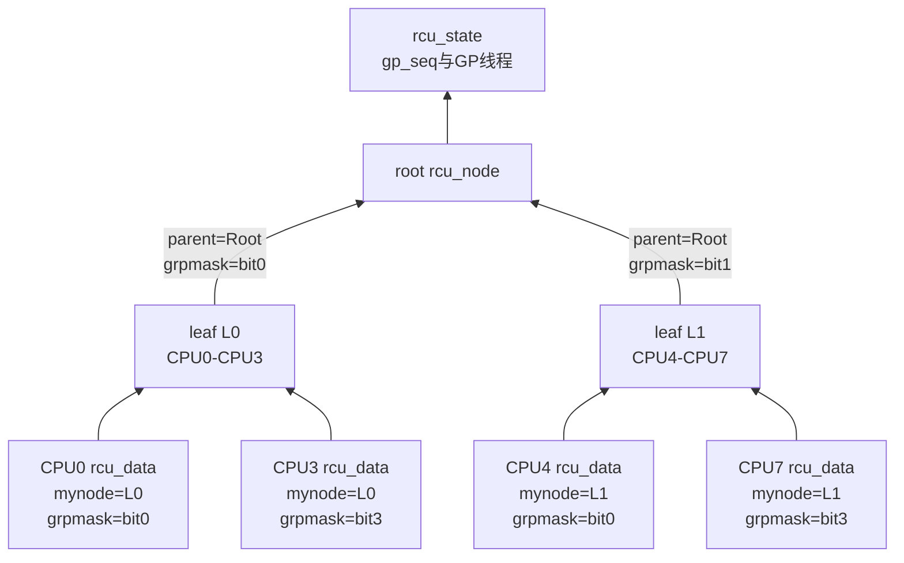
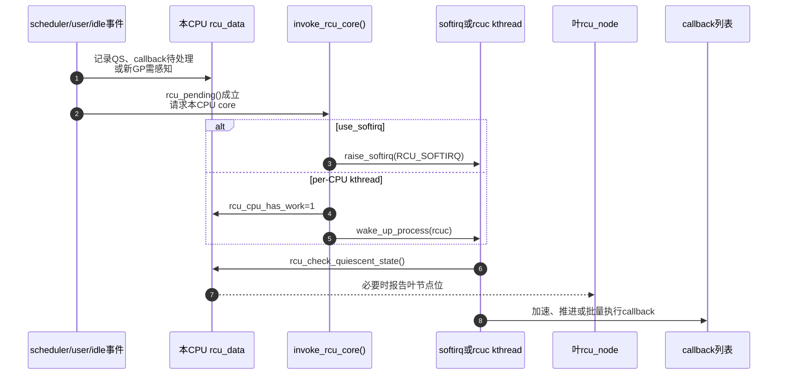

# 第11章\_Tree\_RCU\_初始化\_拓扑与执行上下文

## 11.1\_具体问题\_CPU的QS究竟要写进哪一个节点

假设一台 64 CPU 机器刚启动。CPU37 后来观察到一个 QS，源码只有 `this_cpu_ptr(&rcu_data)`；它必须立即知道：

```text
本CPU属于哪个叶rcu_node
本CPU在叶qsmask中对应哪一位
该叶节点向父节点报告时又对应哪一位
谁负责运行本CPU的rcu_core
谁负责推进全局GP
```

若这些关系要到每次 QS 才搜索整棵树，报告路径会变得昂贵；若映射错误，CPU37 可能清掉 CPU38 的债务。初始化的任务就是把拓扑、位图和执行上下文预先建立为可直接寻址的状态。

## 11.2\_启动代码不是一条单函数调用

Linux 6.12.20 的主要入口 `kernel/rcu/tree.c::rcu_init()` 依次完成：

```c
rcu_init_geometry();
rcu_init_one();
open_softirq(RCU_SOFTIRQ, rcu_core_si); /* use_softirq时 */
rcutree_prepare_cpu(boot_cpu);
rcutree_report_cpu_starting(boot_cpu);
rcutree_online_cpu(boot_cpu);
rcu_gp_wq = alloc_workqueue("rcu_gp", WQ_MEM_RECLAIM, 0);
sync_wq = alloc_workqueue("sync_wq", WQ_MEM_RECLAIM, 0);
```

这段顺序有启动约束：`rcu_init()` 很早执行，此时源码断言在线 CPU 数不超过一个；其他 CPU 以后通过 CPU hotplug/bring-up 钩子逐个准备。GP kthread、boost/nocb/expedited 工作线程还受 `kthreadd` 和对应初始化阶段是否就绪的限制，不能把“`rcu_init()` 一次创建全部执行者”当作事实。

这里第一次出现的 **GP kthread** 是一个长期存在的内核调度任务：`rcu_spawn_gp_kthread()` 创建 `task_struct`，入口为 `rcu_gp_kthread()`，任务指针保存在 `rcu_state.gp_kthread`，无请求时睡在 `rcu_state.gp_wq`。它不是每轮 GP 新建的线程，不是第五颗 CPU，也不负责执行所有 callback。完整术语和生命周期见 [Tree RCU GP 请求与全局生命周期](P12_Tree_RCU_GP请求与全局生命周期.md#12.3_为什么需要一个长期存在的GP内核线程)，版本化模块协作见 [GP 全局生命周期模块源码概念导读](../../../../research/source_reading/rcu/navigation/P06_Linux_6.12_Tree_RCU_GP全局生命周期模块源码概念导读.md#6.5_线程怎样创建并安全发布)，具体实现见 [`rcu_spawn_gp_kthread()`](../../../../research/source_reading/rcu/source_explanations/P05_Linux_6.12_Tree_RCU_GP全局生命周期源码实现.md#5.5_rcu_spawn_gp_kthread创建并发布长期任务)。

## 11.3\_S0到S6\_拓扑建立的统一阶段

| 阶段 | 触发 | 写入状态 | 写入者 | 后续读取者 | 完成条件 |
| --- | --- | --- | --- | --- | --- |
| S0 计算几何 | `rcu_init_geometry()` | 层数、每层节点数量与 fanout | boot CPU | `rcu_init_one()` | 覆盖 `nr_cpu_ids` |
| S1 初始化节点 | `rcu_init_one()` 叶到根遍历 | 锁、`gp_seq`、范围、parent、`grpmask`、blocked 链表 | boot CPU | GP/QS/expedited 路径 | 每个节点可独立加锁 |
| S2 绑定每CPU | `for_each_possible_cpu` | `rdp->mynode`、per-CPU callback/本地初值 | boot CPU | 当前 CPU 快路径 | 每个 possible CPU 可直接找到叶节点 |
| S3 注册core执行入口 | `open_softirq()` 或 per-CPU kthread准备 | `RCU_SOFTIRQ` handler、工作标志 | boot/CPU bring-up | `invoke_rcu_core()` | 本地工作有消费上下文 |
| S4 准备boot CPU | `rcutree_prepare_cpu()` | 本地代际、QS债务、callback list、watching nesting | boot CPU | scheduler、RCU core | CPU可加入参与集合 |
| S5 CPU online | starting/online 钩子 | `qsmaskinitnext` 等在线状态 | hotplug路径 | 下一轮 GP init | 新 CPU 在正确代际加入 |
| S6 工作线程就绪 | spawn/workqueue初始化 | GP、nocb、boost、expedited执行对象 | init/hotplug路径 | 请求和慢路径 | 对应配置允许唤醒 |

初始化不是单一状态机，而是拓扑、每 CPU、本地执行器和全局线程四组状态在启动阶段汇合。

## 11.4\_rcu\_node怎样由叶到根建立

`rcu_init_one()` 按层从叶向根初始化每个 `rcu_node`。关键关系是：

源码中的 `rcu_state.node[]` 与 `rcu_state.level[]` 先解决“树放在哪里”这个问题：

```text
逻辑树：Root → 中间rcu_node → 叶rcu_node

物理布局：rcu_state.node[0], node[1], node[2], ...
层入口：  rcu_state.level[i] → 第i层在node[]中的第一个元素
```

上游注释称这种布局为 tree in `"heap" form`，意思是类似堆数据结构那样按层紧密存入数组，**不是** `kmalloc()` 所说的动态内存堆。`node[0]` 是根；初始化根据 `num_rcu_lvl[]` 计算后续 `level[i]`，再为每个元素写 `parent/grpmask/grplo/grphi`。因此数组解决存储和遍历，节点字段解决逻辑父子关系，二者不是两棵树。

同一全局对象中的两个 CPU 计数也不能混用：

| 字段 | 含义 | 主要消费路径 |
| --- | --- | --- |
| `rcu_state.ncpus` | 到目前为止被 RCU 看见、加入过 expedited 初始化集合的 CPU 数；新 CPU 首次 online 时单调增加 | expedited GP 用它判断是否需要把新 CPU 传播进 `expmaskinit` 树 |
| `rcu_state.n_online_cpus` | 当前对 RCU online 的 CPU 数；prepare/online 增加，dead 路径减少 | 运行期在线数量，并用于判断早期 `rcu_init()` 是否已经发生 |

`ncpus` 不是当前在线数，CPU offline 不会让它回退；`n_online_cpus` 也不是本轮普通 GP 的等待集合，本轮集合仍由 `qsmaskinit/qsmask` 在 GP 边界建立。

Linux 6.12.20 全部 `rcu_state` 字段域及其初始化见 [`rcu_state` 把多个子状态机放在同一全局对象](../../../../research/source_reading/rcu/source_explanations/P05_Linux_6.12_Tree_RCU_GP全局生命周期源码实现.md#5.3_rcu_state把线程命令代际和等待队列放在一起)；本章只继续展开拓扑与 CPU 集合。

```c
rnp->grplo = j * cpustride;
rnp->grphi = min((j + 1) * cpustride - 1, nr_cpu_ids - 1);

if (root) {
	rnp->parent = NULL;
	rnp->grpmask = 0;
} else {
	rnp->grpnum = j % levelspread[parent_level];
	rnp->grpmask = BIT(rnp->grpnum);
	rnp->parent = parent_node;
}
```

节点同时初始化两类锁：普通 `rnp->lock` 保护 GP、`qsmask`、blocked task 等主要状态；`fqslock` 用于 force-QS 请求漏斗，减少所有发起者直接争用根状态。



图中的位宽只是教学示例；实际 fanout 和层数由内核配置、`nr_cpu_ids` 与 geometry 计算决定。

## 11.5\_每CPU怎样绑定叶节点

节点建立后，`rcu_init_one()` 遍历 possible CPU。它顺着叶节点的 `grphi` 找到覆盖该 CPU 的叶节点并写：

```c
per_cpu_ptr(&rcu_data, cpu)->mynode = rnp;
rcu_boot_init_percpu_data(cpu);
```

`rcu_boot_init_percpu_data()`/相关初始化令 `rdp->grpmask` 表示本 CPU 在该叶的位。以后报告无需全树查找：

```text
rdp = this_cpu_ptr(&rcu_data)
rnp = rdp->mynode
mask = rdp->grpmask
```

CPU 与叶节点是静态几何映射；CPU online/offline 改变的是该节点哪些位参加下一轮 GP，而不是每次热插拔都重新发明整棵树。

## 11.6\_CPU准备与加入参与集合是两步

`rcutree_prepare_cpu(cpu)` 在根锁和叶锁保护下初始化本地运行状态：

```c
rdp->gp_seq = READ_ONCE(rnp->gp_seq);
rdp->gp_seq_needed = rdp->gp_seq;
rdp->cpu_no_qs.b.norm = true;
rdp->core_needs_qs = false;
rdp->rcu_iw = IRQ_WORK_INIT_HARD(rcu_iw_handler);
```

它还初始化或重新启用 callback 分段列表，准备节点/CPU 相关 kthread，并增加在线 CPU 计数。但新增 CPU 对 `qsmaskinit` 的影响必须与 GP 边界和 hotplug 锁协调；源码用 `qsmaskinitnext` 表达下一轮参与集合，避免正在进行的 GP 因 CPU 中途上线而改变历史等待边界。

这与对象入口的时间边界相同：参与集合也必须按代际封闭，不能在 GP 中途随意增删而没有协议。

## 11.7\_五类执行者和状态通信

| 执行者 | 常见上下文 | 读取 | 写入/通知 | 是否代表业务writer |
| --- | --- | --- | --- | --- |
| reader任务 | 任意允许的内核任务/中断上下文 | RCU发布指针 | 每任务或执行约束状态 | 否 |
| scheduler/context tracking | context switch、user/idle、IRQ边界 | 当前任务、watching、本CPU债务 | 本地QS或blocked任务登记 | 否 |
| `rcu_core()` | `RCU_SOFTIRQ` 或 per-CPU `rcuc` kthread | `rcu_data`、叶节点、callback分段 | QS上报、callback推进/执行请求 | 否 |
| `rcu_gp_kthread` | 普通 Tree RCU 的长期全局 GP 内核任务 | 根完成条件、GP请求 | 初始化各节点、FQS、cleanup；[完整职责](P12_Tree_RCU_GP请求与全局生命周期.md#12.3_为什么需要一个长期存在的GP内核线程) | 汇聚多个请求，不代表单个writer，也不直接执行全部callback |
| callback/nocb/boost/exp执行者 | softirq、per-CPU/nocb/节点kthread或workqueue | READY callback、blocked task、exp状态 | 调用callback、boost、加速GP | 代表已登记动作，不拥有业务入口 |

## 11.8\_rcu\_core为何既可能是softirq也可能是kthread

`invoke_rcu_core()` 的 6.12.20 分支是：

```c
if (use_softirq)
	raise_softirq(RCU_SOFTIRQ);
else
	invoke_rcu_core_kthread();
```

softirq handler `rcu_core_si()` 只调用 `rcu_core()`；kthread 分支写本 CPU `rcu_cpu_has_work` 并唤醒 `rcuc` 线程。`rcu_core()` 自身依次：

1. 处理抢占式读者的 deferred QS；
2. `rcu_check_quiescent_state()` 消费本地 QS；
3. 必要时加速 callback；
4. 检查 GP 启动 stall；
5. 对非 offload CPU 调用 `rcu_do_batch()`；
6. 处理 NOCB 延迟唤醒。

所以 scheduler tick 只可能 **请求** core 工作，它不是 callback 和 QS 的唯一执行上下文。`NO_HZ_FULL` 场景尤其不能依赖周期 tick 永远存在。

## 11.9\_一次本地工作触发时序



## 11.10\_代码和运行观察

启动日志可先确认实现和几何：

```bash
dmesg | grep -E 'RCU|rcu:'
grep -E 'CONFIG_(TREE_RCU|RCU_FANOUT|RCU_NOCB_CPU|PREEMPT_RCU)=' \
    /boot/config-"$(uname -r)"
ps -eLo pid,psr,cls,rtprio,comm | grep -E 'rcu|rcuc|rcuo|rcub|rcuog|rcuop'
```

不要预期所有配置都出现同一组线程：`use_softirq`、NOCB、boost、PREEMPT_RT 和 CPU 数量会改变执行者。观察目标是把实际线程/softirq与本章状态职责对应，而不是靠线程名反推全部语义。

Linux 6.12.20 的版本化阅读先进入 [拓扑与 CPU 热插拔模块源码概念导读](../../../../research/source_reading/rcu/navigation/P08_Linux_6.12_Tree_RCU_拓扑与CPU热插拔模块源码概念导读.md#8.1_本模块究竟解决什么问题)，再分别直达 [`rcu_init_one()` 建立固定汇聚树](../../../../research/source_reading/rcu/source_explanations/P06_Linux_6.12_Tree_RCU_拓扑与CPU热插拔源码实现.md#6.4_rcu_init_one建立固定汇聚树并绑定每CPU叶节点) 与 [boot/prepare 两阶段初始化](../../../../research/source_reading/rcu/source_explanations/P06_Linux_6.12_Tree_RCU_拓扑与CPU热插拔源码实现.md#6.5_boot初始化与prepare为何仍未让CPU加入当前GP)。普通 GP kthread 和每 CPU core 执行者分别继续进入 P05 与 P09，不能由启动函数名把它们视为同一线程。

## 11.11\_成本与边界

- 初始化用固定拓扑换取运行时 `rdp->mynode/grpmask` 直接寻址。
- 树减少全局争用，但每个叶节点仍有锁和共享缓存行。
- 每 CPU callback 列表避免每次 `call_rcu()` 争用全局队列，却要求 hotplug 时迁移状态。
- 多种执行上下文改善隔离和实时性，却增加 softirq、线程唤醒、affinity 与卸载协调。

下一章从已经建立的全局线程和状态出发，追踪一个真实 GP 请求怎样被合并、开始并完成。

上一篇：[Tree RCU 统一状态与通知总图](P10_Tree_RCU_统一状态与通知总图.md)。

下一篇：[Tree RCU GP 请求与全局生命周期](P12_Tree_RCU_GP请求与全局生命周期.md)。
