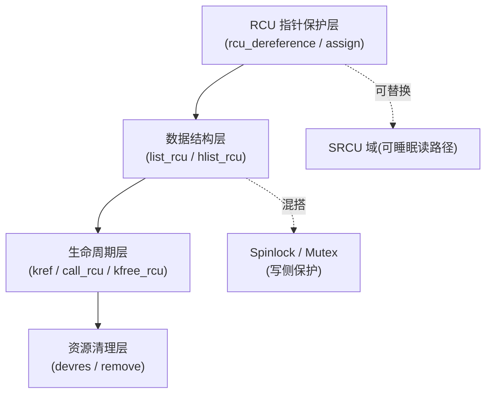

# 第12章\_RCU\_集成模式与常见误用

RCU 很少孤立存在：写者仍可能需要锁，对象离开读侧区间后可能需要引用计数，工作队列和模块卸载又引入新的生命期。本章从组合关系检查正确性，不再重复基础 API。

## 12.1\_RCU\_机制在驱动中的集成模式与常见误用

#### (1)\_章节内容说明

RCU 在驱动中极具价值：

- 读路径无锁、性能高；
- 写路径同步、可控；
- 延迟释放、避免悬空访问。

但由于它与 spinlock/mutex、工作队列、引用计数等机制可交叉使用，
 许多开发者误以为“RCU 就是万能同步”，从而引入隐性竞态或死锁。

本节通过“混搭矩阵 + 禁配对照表 + 模式整合图”，
 梳理驱动开发中 **RCU 与其它机制的可组合边界、禁区与正确搭配模式**。

------

#### (2)\_RCU\_混搭矩阵(驱动开发通用)

| 搭配机制                | 是否可混用       | 说明                                  | 替代建议                 |
| ----------------------- | ---------------- | ------------------------------------- | ------------------------ |
| **spinlock**            | ✅ 可混用（写侧） | 在写侧加锁保护更新；读侧用 RCU        | RCU 读 + spin 写         |
| **mutex**               | ⚠️ 谨慎           | 不可在 RCU 读区持有（可能睡眠）       | 改用 SRCU                |
| **rw_semaphore**        | ⚠️ 谨慎           | 写锁可同步更新，但读锁不可与 RCU 混用 | 按需拆分                 |
| **workqueue**           | ✅ | 短小且不阻塞的保护区可用普通 RCU；必须跨阻塞时用 SRCU | 按临界区行为选择 |
| **threaded IRQ**        | ✅ | 上下文可睡不等于保护区必然睡眠 | 按临界区行为选择 |
| **completion**          | ⚠️ 慎用           | completion 可能睡眠                   | SRCU 或同步点后触发      |
| **waitqueue**           | ❌ 禁配           | waitqueue 会睡眠                      | 不可与普通 RCU 混用      |
| **refcount/kref**       | ✅ 推荐           | RCU 管理生命周期，kref 计数资源       | kfree_rcu() 收尾         |
| **devres（devm 系列）** | ✅ 可共存         | RCU 控制访问，devres 控制清理         | 分层管理                 |
| **timer/hrtimer**       | ✅ 可用普通 RCU | 回调中不可调用阻塞等待接口 | 读侧保持短小 |

> `[INV]`：如果 RCU 保护范围必须跨越主动阻塞操作，使用 SRCU，或先在普通 RCU 内取得独立引用再退出。
>  `[MIX]`：RCU 只保证“指针一致性”，不保证“状态一致性”。

------

#### (3)\_禁配对照表

| 错误组合                                   | 后果             | 正确替代                               |
| ------------------------------------------ | ---------------- | -------------------------------------- |
| 在 `rcu_read_lock()` 中使用 `mutex_lock()` | 睡眠导致死锁     | 使用 `srcu_read_lock()`                |
| 在中断上下文中使用 `synchronize_rcu()`     | 阻塞导致软锁死   | 改用 `call_rcu()` 异步延迟释放         |
| 写侧未加锁直接更新指针                     | 并发覆盖导致脏读 | `spin_lock()` + `rcu_assign_pointer()` |
| 删除节点后立即 `kfree()`                   | 读者悬空访问     | 使用 `kfree_rcu()` 或 `call_rcu()`     |
| 混用不同 SRCU 域                           | 永不退出宽限期   | 保证域一致性                           |
| 在工作队列中调用 `rcu_read_lock()`         | 睡眠破坏语义     | 使用 `srcu_read_lock()`                |

------

#### (4)\_驱动中常见集成模式

| 模式                                  | 结构关系                              | 特点                    |
| ------------------------------------- | ------------------------------------- | ----------------------- |
| **模式①：RCU + Spinlock（经典组合）** | RCU 读无锁，写加自旋锁                | 读多写少场景最优        |
| **模式②：RCU + Kref（生命周期分层）** | RCU 管理结构体指针，kref 管理内部分配 | 对象自动清理            |
| **模式③：SRCU + 工作队列**            | 可睡眠读路径 + 延迟回收               | 异步任务安全读共享状态  |
| **模式④：RCU + 链表宏族**             | 使用 `list_for_each_entry_rcu()`      | 结构化访问，防错率低    |
| **模式⑤：RCU + Devm 资源**            | 仅在 remove 前先取消发布并排空相关读者/回调时可用 | devm 不理解 RCU GP，不能让其自动释放仍可被读者访问的资源 |

------

#### (5)\_模式示例\_RCU\_+\_Kref\_生命周期分层

```c
struct drv_obj {
	struct kref ref;
	struct rcu_head rcu;
	int id;
};

void drv_obj_release(struct kref *r)
{
	struct drv_obj *o = container_of(r, struct drv_obj, ref);
	kfree_rcu(o, rcu);   // 延迟释放对象
}

void drv_obj_put(struct drv_obj *o)
{
	kref_put(&o->ref, drv_obj_release);
}

void drv_obj_get(struct drv_obj *o)
{
	kref_get(&o->ref);
}
```

> `[INV]`：RCU 管指针一致性，Kref 管引用计数。两者配合形成完整的生命周期管理。

------

#### (6)\_RCU\_集成架构图



> `[CHECK]`：
>
> - RCU 层负责**一致性**，
> - Spinlock 层负责**互斥性**，
> - Kref 层负责**生存期**，
> - Devm 层负责**设备资源清理**。

------

#### (7)\_调试与验证要点

| 工具 / 文件                       | 作用                |
| --------------------------------- | ------------------- |
| `/sys/kernel/debug/rcu`           | RCU 调试状态与统计  |
| `/proc/lockdep_chains`            | 检查锁依赖死锁      |
| `CONFIG_PROVE_RCU=y`              | 启用运行期 RCU 检查 |
| `CONFIG_DEBUG_OBJECTS_RCU_HEAD=y` | 检查错误释放对象    |
| `CONFIG_TORTURE_TEST_RCU`         | 压力测试 RCU 机制   |

> `[CHECK]`：驱动调试阶段可暂时启用 `CONFIG_PROVE_RCU` 验证 API 使用正确性。

------

#### (8)\_核对表(RCU\_集成层)

| 检查项                         | 说明                                    | 状态 |
| ------------------------------ | --------------------------------------- | ---- |
| [CHECK] 保护区是否必须跨越主动阻塞？ | 若是，使用 SRCU 或改为引用交接 | □ |
| [CHECK] 写侧是否仍加锁？       | 否则无法保证指针完整性                  | □    |
| [CHECK] 删除路径是否延迟释放？ | 使用 `kfree_rcu()`                      | □    |
| [CHECK] 是否误用同步函数？     | 中断中不可 `synchronize_rcu()`          | □    |
| [CHECK] 资源清理顺序正确？     | `call_rcu()` → `rcu_barrier()` → remove | □    |

------

#### (9)\_小结

- RCU 并非“替代锁”，其核心是发布—取得、读侧生命周期保护与 GP 后回收；它不自动保证对象字段的一致快照；
- 存在多个写者或复合结构不变量时，写路径必须另行串行化；读侧不获取传统共享读锁，但仍有配置相关状态操作；
- SRCU 解决可睡眠读路径问题；
- RCU 与 Kref/Devm/Spinlock 是协同关系，而非竞争关系；
- 开发者必须在“可见性、一致性、生命周期”三层上分别控制；
- 只有模块可能留下指向本模块代码的已排队 RCU 回调时，卸载路径才需要 `rcu_barrier()`；不应无条件添加。

------

上一篇：[RCU 类型语义与 SRCU](P11_RCU_类型语义与_SRCU.md)。

下一篇：[RCU 变体、内存序与使用边界](P13_RCU_变体_内存序与使用边界.md)。


