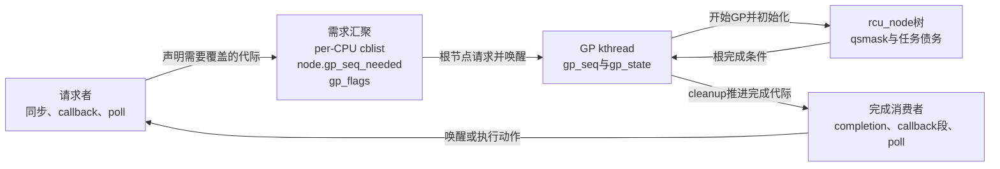
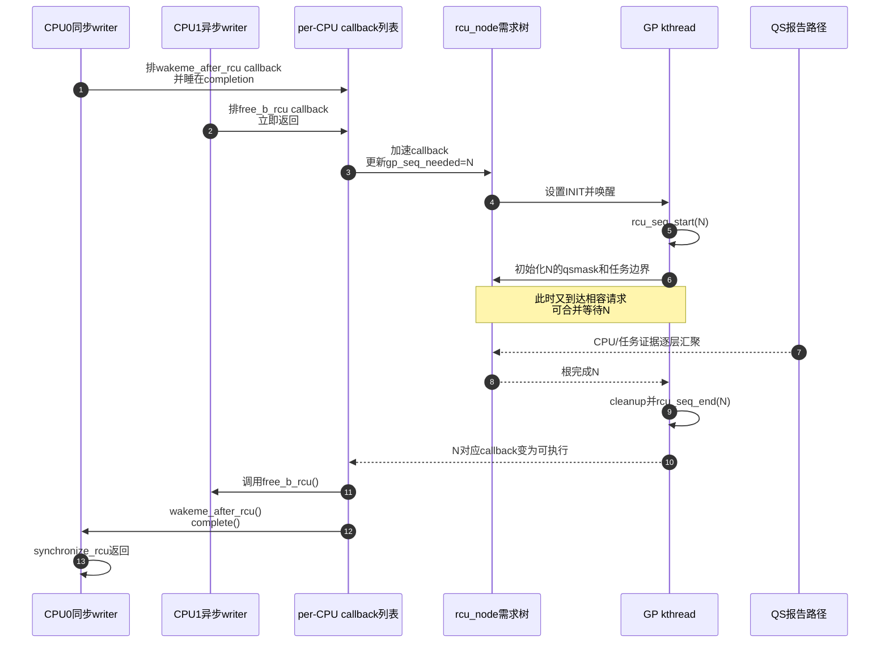

# 第12章\_Tree\_RCU\_GP请求与全局生命周期

## 12.1\_场景\_三个调用者是否会制造三个物理GP

CPU0 删除对象 A 后调用同步等待；CPU1 几乎同时登记对象 B 的 callback；CPU2 只想轮询一个 GP 是否已经过去：

```c
/* CPU0：必须等到旧 reader 离场后才继续。 */
old_a = rcu_replace_pointer(ptr_a, new_a, true);
synchronize_rcu();
kfree(old_a);

/* CPU1：异步退休。 */
old_b = rcu_replace_pointer(ptr_b, new_b, true);
call_rcu(&old_b->rcu, free_b_rcu);

/* CPU2：保存状态，以后条件等待。 */
cookie = get_state_synchronize_rcu();
do_other_work();
cond_synchronize_rcu(cookie);
```

三者的业务对象、等待方式和调用 CPU 都不同，但它们可以共享一轮足以覆盖各自时间边界的物理 GP。Tree RCU 的 GP 请求不是“每次 API 调用创建一个专属全局线程并扫描一次 CPU”。

## 12.2\_请求\_执行与交付是三层



请求层只保证“存在足够新的 GP”；GP kthread 负责物理执行；完成层再把同一结论交给不同调用者。

## 12.3\_默认同步等待实际也先登记callback

Linux 6.12.20 中 `synchronize_rcu()` 进入 `synchronize_rcu_normal()`。默认 `rcu_normal_wake_from_gp=0` 时：

```text
synchronize_rcu()
    → synchronize_rcu_normal()
    → wait_rcu_gp(call_rcu_hurry)
    → __wait_rcu_gp()
    → 栈上rcu_synchronize初始化completion
    → call_rcu_hurry(head, wakeme_after_rcu)
    → wait_for_completion()
```

因此同步调用的 GP 请求与普通 callback 管线相接。GP 后 `wakeme_after_rcu()` 执行 `complete()`，原 writer 才返回。

6.12 还有 `rcu_normal_wake_from_gp` 非零时的直接等待者批处理优化：请求进入 `rcu_state.srs_next` 等状态，由 GP init/cleanup 批量推进并完成。它是可选分支，不能用来覆盖默认 callback 解释；Linux 5.10 也没有这组 6.12 状态。

## 12.4\_callback需求怎样汇聚到根

`call_rcu()` 把 callback 加入当前 CPU `rcu_data.cblist`。加速路径计算该 callback 至少需要的 `gp_seq`，沿本 CPU 叶节点到根更新 `rcu_node.gp_seq_needed`。

到根时若所需代际尚未开始，请求路径在根节点锁的同步下设置：

```text
rcu_state.gp_flags |= RCU_GP_FLAG_INIT
    → rcu_gp_kthread_wake()
```

多个 CPU 可以同时提出相同或相近代际需求。`gp_seq_needed` 只向未来推进；已经存在的更强需求覆盖较弱需求，避免为每个 callback 单独启动 GP。

## 12.5\_gp\_seq不是一个进行中布尔值

`rcu_state.gp_seq`、各 `rcu_node.gp_seq` 与各 `rcu_data.gp_seq` 构成全局、节点、本地三份代际观察：

| 层 | 字段 | 作用 |
| --- | --- | --- |
| 全局 | `rcu_state.gp_seq` | 当前物理 GP 的权威序列和进行状态 |
| 节点 | `rcu_node.gp_seq` | 节点已经初始化/完成到哪一代 |
| CPU | `rcu_data.gp_seq` | 本 CPU 已经感知哪一代，用于拒绝跨代报告 |
| 请求 | `gp_seq_needed` | callback/等待者至少需要完成到哪一代 |

`rcu_seq_start()` 和 `rcu_seq_end()` 在同一序列上编码代际与进行状态。具体位编码是内部实现；使用者应依赖 `rcu_seq_*` 辅助函数，不能把奇偶或低位布局当成模块 API。

## 12.6\_S0到S9\_物理GP生命周期

| 阶段 | 进入事件 | 主要状态变化 | 写入者 | 退出条件 |
| --- | --- | --- | --- | --- |
| S0 空闲 | 没有未满足需求 | `gp_state=IDLE/WAIT_GPS` | GP kthread | 根出现新需求 |
| S1 请求 | callback/同步/poll 需要未来 GP | 节点 `gp_seq_needed`、全局 `gp_flags` | 请求 CPU | GP kthread 被唤醒 |
| S2 接受 | GP线程醒来 | 读取并消费初始化请求 | GP kthread | 确认需要新一轮 |
| S3 开始代际 | `rcu_gp_init()` | `rcu_seq_start(rcu_state.gp_seq)` | GP kthread | 新代际全局可见 |
| S4 建立集合 | 节点广度优先初始化 | `qsmask=qsmaskinit`、节点 `gp_seq`，抢占任务边界 | GP kthread | 所有节点初始化完成 |
| S5 等待 | `rcu_gp_fqs_loop()` | `gp_state=WAIT_FQS`，睡在 `gp_wq` | GP kthread | 根完成或到扫描时间 |
| S6 FQS | 超时/显式/过载触发 | watching快照、重调度/urgent、boost等 | GP线程与远端CPU | 得到更多证据或继续等 |
| S7 根完成 | 全树债务清零 | 根上报唤醒 `gp_wq` | 最后一条报告路径 | GP线程退出FQS循环 |
| S8 cleanup | `rcu_gp_cleanup()` | 节点完成序列、`rcu_seq_end()`、callback推进 | GP kthread | 当前代际完整发布 |
| S9 交付 | callback/core/直接等待批次运行 | completion、READY callback、poll可见 | callback/core/workqueue | 各请求者得到结果 |

`gp_state` 用于阶段观察和 stall 诊断，真正安全完成条件来自节点 CPU/任务债务，而不是把 `gp_state` 写成 `CLEANUP` 本身。

## 12.7\_GP线程主循环的实际骨架

`kernel/rcu/tree.c::rcu_gp_kthread()` 的循环可以压缩为：

```c
for (;;) {
	wait_for_gp_request();
	if (rcu_gp_init())
		continue;
	rcu_gp_fqs_loop();
	rcu_gp_cleanup();
}
```

实际代码在等待、trace、信号警告和状态发布上更细。职责边界仍清晰：请求者不进入这个循环；GP kthread也不执行具体业务 `kfree(old_obj)`，只推进 callback/等待条件。

## 12.8\_请求合并的三个时间场景

### 12.8.1\_请求到达时没有GP

请求设置 INIT，唤醒线程并启动 GP=N。该请求等待 N 完成。

### 12.8.2\_请求到达时GP=N正在进行且足以覆盖它

若请求时间边界落在 N 能覆盖的范围，callback 被分配给 N，调用者不要求额外 GP。

### 12.8.3\_请求到达太晚或需要下一代

它更新 `gp_seq_needed` 指向 N 之后的足够代际。当前 N 正常完成，cleanup 发现未来需求后让 GP kthread继续 N+1，而不是中途扩大 N 的历史读者集合。

这与晚到 reader 的原则一致：每轮 GP 的时间边界一旦封闭，就不能被后来事件随意改写。

## 12.9\_完整多请求时序



callback 的具体分段和执行预算在 P17/P18 展开；本章只说明它们怎样消费 GP 代际。

## 12.10\_安全性\_活性与批量收益

- **安全性：** 根债务未清，S8 不能开始；没有固定等待时间兜底释放。
- **活性：** 某 CPU/任务不提供证据时，GP 可长时间停在 S5/S6，callback 也会积压。
- **批量收益：** 多个对象和等待者共享物理 GP，更新侧固定成本被摊薄。
- **代价：** callback 可能等到下一轮边界，完成延迟不是单次 API 的独占服务时间。

## 12.11\_源码与trace入口

| 目标 | Linux 6.12.20 入口 |
| --- | --- |
| 普通同步 | `tree.c::synchronize_rcu()/synchronize_rcu_normal()` |
| callback等待包装 | `rcupdate_wait.h::wait_rcu_gp`、`update.c::__wait_rcu_gp()/wakeme_after_rcu()` |
| GP需求汇聚 | `tree.c::rcu_start_this_gp()` 及 callback acceleration |
| GP主循环 | `tree.c::rcu_gp_kthread()` |
| 初始化/等待/结束 | `rcu_gp_init()`、`rcu_gp_fqs_loop()`、`rcu_gp_cleanup()` |
| 全局状态 | `tree.h::struct rcu_state` 与 `RCU_GP_*` 状态值 |

运行时可观察：

```bash
cd /sys/kernel/tracing
echo 1 | sudo tee events/rcu/rcu_grace_period/enable
echo 1 | sudo tee events/rcu/rcu_callback/enable
echo 1 | sudo tee tracing_on
# 运行包含 synchronize_rcu()/call_rcu() 的测试后读取 trace
```

事件可用性取决于内核 tracing 配置；不存在时以源码、rcutorture 或已有 trace 配置重新验证。

上一篇：[Tree RCU 初始化、拓扑与执行上下文](P11_Tree_RCU_初始化_拓扑与执行上下文.md)。

下一篇：[Tree RCU QS、EQS 与 Context Tracking](P13_Tree_RCU_QS_EQS与Context_Tracking.md)。
