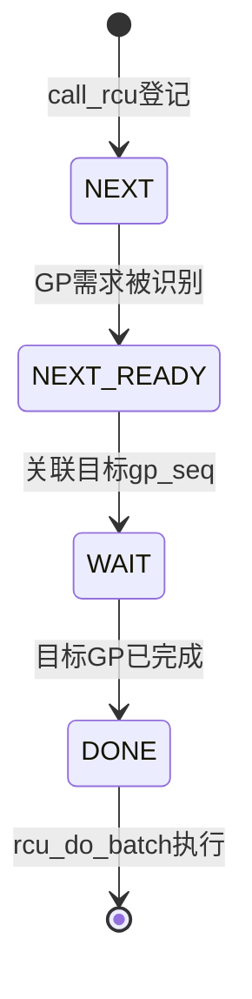

# 第12章\_Tree\_RCU\_rcu\_segcblist回调状态机

`call_rcu()` 返回时，回调既没有执行，也不一定已经关联到一轮正在进行的 GP。`rcu_segcblist` 用分段链表表达回调与 GP 的关系，避免为每个回调维护独立队列和等待器。

## 12.1\_四段不是四条独立链表

`RCU_DONE_TAIL`、`RCU_WAIT_TAIL`、`RCU_NEXT_READY_TAIL` 和 `RCU_NEXT_TAIL` 是同一条回调链上的尾指针边界：

```text
DONE | WAIT | NEXT_READY | NEXT
可执行  等待GP   已准备关联    新登记
```

空段可以共享相同尾位置。理解边界比把它想成四个容器更准确。

## 12.2\_状态推进



推进函数根据已完成和正在进行的 GP 序列加速、推进分段。**GP 完成只使对应回调有资格进入 DONE，不保证它已经得到 CPU 时间执行。**

## 12.3\_源码入口

- `kernel/rcu/rcu_segcblist.h`、`rcu_segcblist.c`。
- `kernel/rcu/tree.c::call_rcu()` 及回调加速/推进路径。
- `struct rcu_data::cblist`。

上一篇：[Tree RCU Expedited GP](P11_Tree_RCU_Expedited_GP.md)。

下一篇：[Tree RCU 回调执行、批处理与限流](P13_Tree_RCU_回调执行_批处理与限流.md)。
