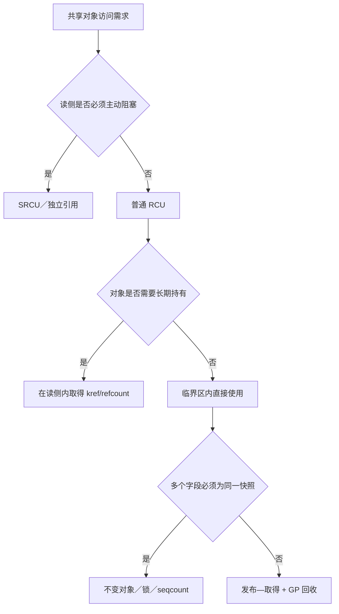

# 第13章\_RCU\_变体\_内存序与使用边界

最后一章不再引入一套新的入门模型，而是换几个容易出错的角度复盘整个专题：读侧域如何选择、发布—取得契约在哪里成立、宽限期不保证什么，以及 SRCU 与锁组合时的边界。



## 13.1\_先确定读侧域

选择 RCU 接口时，不能只看“读多写少”，还必须确定读者的执行上下文、是否需要主动阻塞，以及更新者等待的是哪一类读者。

| 形式 | 读侧接口 | 等待或回调 | 主要用途 |
| --- | --- | --- | --- |
| 普通 RCU | `rcu_read_lock()` | `synchronize_rcu()` / `call_rcu()` | 高频、短小、不主动阻塞的读侧 |
| RCU-bh 接口 | `rcu_read_lock_bh()` | Linux 5.0 以后仍由普通 RCU GP 覆盖 | 需要同时禁用本地软中断的读侧 |
| RCU-sched 接口 | `rcu_read_lock_sched()` | Linux 5.0 以后仍由普通 RCU GP 覆盖 | 需要同时禁用抢占的特定路径 |
| SRCU | `srcu_read_lock(ssp)` | `synchronize_srcu(ssp)` / `call_srcu(ssp, ...)` | 读侧需要主动阻塞，或需要私有宽限期域 |

Linux 6.12.20 的 [`rcupdate.h`](../../../../research/source_reading/linux/include/linux/rcupdate.h) 明确说明，从 Linux 5.0 开始，普通 `synchronize_rcu()` 和 `call_rcu()` 也会考虑禁止抢占、软中断或中断的区域。因此，不应再把 RCU-bh 描述成一个拥有独立宽限期的“SoftIRQ 域”。

## 13.2\_读侧上下文不决定是否使用\_SRCU

“工作队列中必须用 SRCU”或“线程化中断中必须用 SRCU”都不准确。这些上下文允许睡眠，但不代表每一段代码都会睡眠。

判断时应问：

1. 受保护的读侧临界区本身是否需要调用可阻塞操作？
2. 能否在普通 RCU 临界区内只取得独立引用，然后退出 RCU 再执行慢操作？
3. 是否需要一个与全局 Tree RCU 分离的私有宽限期域？

只有保护区必须跨越主动阻塞，或设计本身需要私有域时，SRCU 才是直接候选。

## 13.3\_发布\_取得契约

### 13.3.1\_rcu\_assign\_pointer()

Linux 6.12.20 的宏实现对非 `NULL` 常量路径调用：

```c
smp_store_release(&p, RCU_INITIALIZER(v));
```

它的意义是“对象初始化先于指针发布”。对于常量 `NULL` 则可以走 `WRITE_ONCE()` 特殊路径，所以不能把整个宏简单写成“它等于 `smp_wmb()`”。

### 13.3.2\_rcu\_dereference()

`rcu_dereference()` 组合了单次取值、编译器约束、架构所需的依赖顺序以及 RCU/Sparse/lockdep 检查。它依赖从取得的指针到后续对象访问的地址依赖。

以下操作可能破坏或隐藏依赖，不能在没有严格证明的情况下随意使用：

- 把指针转换为整数后做复杂运算再转回指针。
- 使用条件推导出某个无依赖的固定地址。
- 将读取出的值与另一来源的指针混合。

工程上应保持简单模式：用 `rcu_dereference()` 取得指针，然后直接通过该指针访问已初始化的对象。

### 13.3.3\_更新侧取值

更新者在已持有更新锁时，应使用：

```c
old = rcu_dereference_protected(ptr, lockdep_is_held(&update_lock));
```

如果需要“取得旧指针 + 发布新指针”，可使用 `rcu_replace_pointer()`。只检查指针是否为 `NULL` 而不解引用时，才考虑 `rcu_access_pointer()`。

## 13.4\_宽限期不是一个发布屏障

| 接口 | 是否阻塞调用者 | 完成条件 | 主要用途 |
| --- | --- | --- | --- |
| `synchronize_rcu()` | 是 | 调用前已经存在的相关读者结束 | 同步拆除、回收多个相关资源 |
| `call_rcu()` | 否 | 相关 GP 后调用回调 | 异步销毁或自定义回收 |
| `kfree_rcu()` | 否 | 相关 GP 后释放对象 | 简单对象的延迟释放 |
| `rcu_barrier()` | 是 | 在其前排队的 RCU 回调执行完毕 | 模块卸载等必须等待回调代码退场的路径 |

`synchronize_rcu()` 和 `call_rcu()` 具有明确的宽限期与内存顺序保证，但它们不代替用于发布指针的 `rcu_assign_pointer()`，也不代替用于字段不变量的锁。

## 13.5\_SRCU\_的域与死锁边界

SRCU 使用 `struct srcu_struct` 表示私有域。读侧必须保留 `srcu_read_lock()` 返回的 index，并在同一上下文中传给 `srcu_read_unlock()`：

```c
int idx;
struct config *cfg;

idx = srcu_read_lock(&config_srcu);
cfg = srcu_dereference(current_config, &config_srcu);
use_config_may_block(cfg);
srcu_read_unlock(&config_srcu, idx);
```

没有 `srcu_assign_pointer()` 这个通用发布 API。SRCU 保护的指针仍通常使用 `rcu_assign_pointer()` 发布，读侧用 `srcu_dereference()` 作带域检查的取得。

[`srcu.h`](../../../../research/source_reading/linux/include/linux/srcu.h) 和 [`srcutree.c`](../../../../research/source_reading/linux/kernel/rcu/srcutree.c) 还给出两条关键约束：

- lock/unlock 必须在同一上下文中成对。
- 不得在某个 SRCU 域的读侧临界区内等待同一域的宽限期，包括经由锁依赖间接等待，否则会形成死锁。

## 13.6\_选型核对表

| 问题 | 倾向选择 |
| --- | --- |
| 读侧短小且不主动阻塞？ | 普通 RCU |
| 读侧保护范围必须跨越睡眠或 I/O？ | SRCU，或改为 RCU 中取得引用后退出 |
| 只需要一致的小型数值快照，不涉及对象回收？ | seqcount/seqlock |
| 需要对对象字段做复合原地更新？ | 锁或 seqcount，RCU 不自动提供该不变量 |
| 需要离开 RCU 后继续使用对象？ | 在 RCU 临界区内安全取得 kref/refcount |
| 模块卸载时还可能有回调指向模块代码？ | 取消发布后使用 `rcu_barrier()` 等待已排队回调 |

上一篇：[RCU 集成模式与常见误用](P12_RCU_集成模式与常见误用.md)。

下一步：[Linux 6.12 Tree RCU 与 SRCU 源码导读](../../../../research/source_reading/rcu/P01_Linux_6.12_Tree_RCU_与_SRCU_源码导读.md)。


