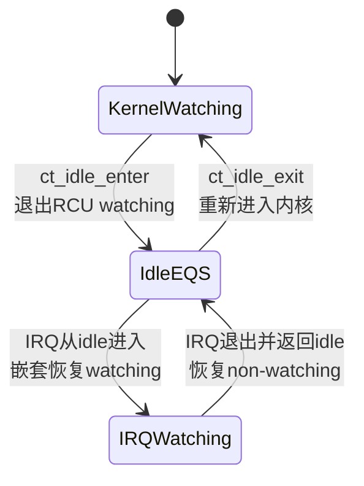
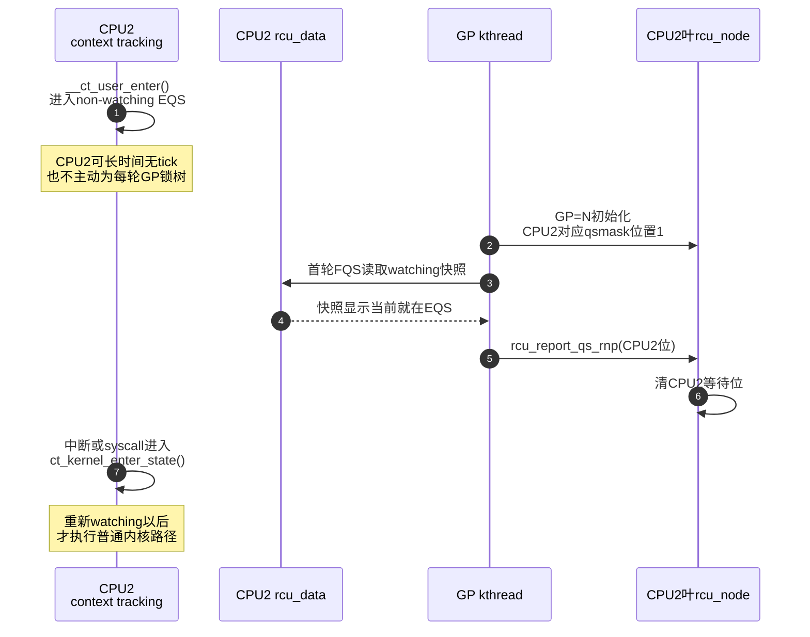

# 第13章\_Tree\_RCU\_QS\_EQS与Context\_Tracking


## 13.1\_Tree\_RCU\_QS\_EQS与\_Context\_Tracking

### 13.1.1\_场景\_三个CPU都不在执行普通旧reader\_却走三条证明路径

GP=N 开始时：

- CPU1 正在内核态运行普通任务，但当前不在 RCU 读侧；稍后发生 context switch。
- CPU2 正在用户态执行计算，可能是 `NO_HZ_FULL` CPU，长时间没有调度 tick。
- CPU3 已进入 idle，随后又被一次 IRQ 打断。

三者都可能没有旧 reader，但不能用一句“等每个 CPU 调度一次”处理：CPU2 和 CPU3 可能不发生普通任务切换；CPU3 的 IRQ 又意味着“进过 idle”不等于从此不执行内核代码。

本章解释 Linux 6.12.20 怎样用 **一次 QS 事件** 和 **持续 EQS/watching 状态** 两种证据覆盖这些现场。

### 13.1.2\_先区分QS\_EQS和watching

| 概念 | 形态 | 证明内容 | 典型来源 |
| --- | --- | --- | --- |
| QS | 一次事件/边界 | GP 开始前某类旧读侧不可能跨过该边界继续 | context switch、返回 user、进入 idle、offline |
| EQS | 一段持续区间 | CPU 在该区间中不执行普通内核 RCU reader | user、idle/offline 的受控区间 |
| watching | 内核软件状态 | RCU 当前是否把该 CPU 视为可能执行普通内核 reader | context tracking 的 `CT_RCU_WATCHING` 状态与嵌套 |

`rcu_read_lock()` 到 `rcu_read_unlock()` 是读侧临界区，不是 QS。硬件也不会自动产生名为 QS 的信号；scheduler、context tracking 和 RCU 根据执行边界维护软件证明。

### 13.1.3\_两条正交状态链

#### (1)\_CPU的当前GP债务

```text
rdp->gp_seq感知GP=N
    → cpu_no_qs.b.norm=true
    → core_needs_qs=true
    → 本CPU观察合法QS
    → cpu_no_qs.b.norm=false
    → rcu_core上报并清叶qsmask位
```

#### (2)\_CPU是否处于watching

```text
进入普通内核执行
    → watching

受控进入user/idle并且没有IRQ/NMI嵌套
    → non-watching EQS

IRQ/NMI从EQS进入内核
    → 临时恢复watching/嵌套

中断退出并返回EQS
    → 再次non-watching
```

第一条按 GP 表示“欠不欠证明”；第二条跨 GP 持续表示 CPU 当前能否执行普通 reader。FQS 扫描把第二条状态转换成第一条 GP 的完成证据。

### 13.1.4\_CPU1\_普通context\_switch的本地QS

`kernel/sched/core.c::__schedule()` 调用 `rcu_note_context_switch(preempt)`。

- 非抢占式 Tree RCU：读侧禁抢占，真实 context switch 不能跨越旧 reader，路径调用 `rcu_qs()`。
- 抢占式 Tree RCU：若任务在读侧内，先登记到叶 `blkd_tasks`；任务债务已共享以后再调用 `rcu_qs()` 清 CPU 债务。

两种分支最终都可能执行：

```c
__this_cpu_write(rcu_data.cpu_no_qs.b.norm, false);
```

这只是本 CPU 锁存事实。`rcu_core()` 以后通过 `rcu_check_quiescent_state()` 与 `rcu_report_qs_rdp()` 才把它写入共享节点。

### 13.1.5\_CPU2\_返回用户态为何可以成为EQS

普通内核 RCU reader 只能在内核执行区间运行；CPU 完成退出路径并进入 user 后，不会继续执行进入 user 以前的普通内核读侧。

Linux 6.12.20 的 context tracking 入口位于 `kernel/context_tracking.c`：

```text
__ct_user_enter()
    → ct_kernel_exit_state(...)
    → 更新context_tracking.state的watching/递增状态

__ct_user_exit()
    → ct_kernel_enter_state(...)
    → 重新进入内核watching
```

进入/退出函数标为 `noinstr`，并严格安排 instrumentation 边界，避免在已经宣告 non-watching 后执行一段未被 RCU 观察的普通内核 reader。

`NO_HZ_FULL` CPU 可以长期停在 user，不必为了每轮 GP 周期性打断它。远端 GP 扫描可以读取 watching 快照，若 CPU 当前就在 EQS，立即把它计为本轮证明。

### 13.1.6\_CPU3\_idle与IRQ嵌套为什么不能压成一个布尔值

idle 入口/退出由 `ct_idle_enter()` / `ct_idle_exit()` 管理。若 CPU 进入 idle 后发生 IRQ：



若只保存“CPU 执行过 idle”这一位，远端可能在 IRQ handler 正运行 RCU reader 时误判安全。context tracking 的状态/嵌套变化让快照能区分：

Linux 6.12.20 中，FQS 第一次用 `ct_rcu_watching_cpu_acquire()` 保存 `rdp->watching_snap`，后续用 `rcu_watching_snap_stopped_since()` 比较；完整模块通信先读 [force-QS 与 Stall 模块源码概念导读](../../../../research/source_reading/rcu/navigation/P09_Linux_6.12_Tree_RCU_force_QS与Stall模块源码概念导读.md#9.4_FQS是两阶段远端观察而不是无条件IPI)，函数实现见 [`rcu_watching_snap_save/recheck()`](../../../../research/source_reading/rcu/source_explanations/P07_Linux_6.12_Tree_RCU_force_QS与Stall源码实现.md#7.4_watching快照怎样把EQS变成隐式QS证据)。这两个函数读取 context tracking 已维护的状态，不替代 context tracking 入口本身。

```text
CPU当前就在稳定EQS
CPU自上次快照以来完整穿过EQS
CPU仍在watching且尚无证据
```

### 13.1.7\_watching快照算法

第一次 FQS 扫描调用 `rcu_watching_snap_save(rdp)`：

```c
rdp->watching_snap = ct_rcu_watching_cpu_acquire(rdp->cpu);
if (rcu_watching_snap_in_eqs(rdp->watching_snap))
	return 1;
return 0;
```

返回正值表示 CPU 当前已经在 EQS，可形成证明；否则保存快照。

以后扫描调用 `rcu_watching_snap_recheck(rdp)`。`rcu_watching_snap_stopped_since()` 比较远端当前状态与保存值，若证明 CPU 自快照以来进入或穿过 EQS，返回正值；若 CPU 长期 watching 且需要催促，返回负值；仍不确定则返回零。

`force_qs_rnp()` 在叶节点锁下聚合结果：

```text
ret > 0 → 把CPU位加入mask并用rcu_report_qs_rnp()报告
ret = 0 → 保持等待
ret < 0 → 把CPU位加入rsmask，解锁后resched_cpu(cpu)
```

这条路径是 GP 扫描者 **读取远端共享状态**，不等于远端 CPU 每次进入 idle 都主动锁 RCU 树为某一 GP 清位。

### 13.1.8\_本地事件与远端观察的完整时序



若 GP 开始时 CPU2 仍 watching，首轮只保存快照；CPU2 后来进出 user，下一轮 recheck 才把“自快照以来穿过 EQS”转为本轮 QS。

### 13.1.9\_内存顺序为什么属于证明的一部分

`ct_rcu_watching_cpu_acquire()` 的 acquire 读取、`rcu_seq_start()` 的屏障以及从 GP 初始化到叶节点锁的锁链共同保证：远端 CPU 在进入 EQS 前完成的旧读侧访问，不会在 GP 完成后还被当成未排序的对象访问。

这不是“只要读到 non-watching 位就安全”。快照值的状态变化和内存顺序必须一起成立。通用 acquire/release 与 RCU GP 屏障关系见[release/acquire 发布协议](../../memory_ordering/P04_release_acquire_发布协议.md)和[数据依赖、控制依赖与 RCU 取得](../../memory_ordering/P05_数据依赖_控制依赖与RCU取得.md)。

### 13.1.10\_与6.12的状态位置差异

| 版本 | watching/EQS主要状态 | 典型入口 |
| --- | --- | --- |
| Linux 5.10 | `rcu_data.dynticks_nesting`、`dynticks_nmi_nesting`、`atomic_t dynticks` | `rcu_eqs_enter()`、`rcu_idle_enter()`、`rcu_user_enter()`、`rcu_momentary_dyntick_idle()` |
| Linux 6.12.20 | 通用 per-CPU `context_tracking.state` 与 `CT_RCU_WATCHING`；`rcu_data.watching_snap` 保存扫描快照 | `ct_kernel_exit/enter_state()`、`ct_idle_enter/exit()`、`__ct_user_enter/exit()`、`rcu_momentary_eqs()` |

跨版本稳定的是“本地执行状态形成可验证快照”；不稳定的是字段位置和函数名。写 6.12 文档时继续把 dynticks 主状态塞回 `rcu_data` 会让状态所有权错误。

### 13.1.11\_代码与trace观察

可以让一个 CPU 运行用户态忙循环并进入 `nohz_full`，另一个 CPU 持续触发 GP：

```bash
# 先确认启动参数和实际配置
cat /proc/cmdline
grep -E 'CONFIG_(NO_HZ_FULL|CONTEXT_TRACKING|TREE_RCU)=' \
    /boot/config-"$(uname -r)"

cd /sys/kernel/tracing
echo 1 | sudo tee events/rcu/rcu_fqs/enable
echo 1 | sudo tee events/rcu/rcu_quiescent_state_report/enable
echo 1 | sudo tee tracing_on
```

事件名和字段依构建配置而异，先查看 `events/rcu/`。实验判断应基于 `rcu_fqs` 中的 watching/EQS 结果和节点报告顺序，不以“有没有周期 tick”作为安全条件。

### 13.1.12\_结论与边界

- QS 是一次证明事件，EQS 是持续状态，watching 是软件编码；三者不可互换。
- 本地 `cpu_no_qs=false` 与共享 `qsmask` 清位允许异步。
- user/idle 减少主动通知成本，但增加 context tracking、远端读取和特殊入口/退出约束。
- IRQ/NMI 嵌套必须被状态机覆盖，不能用简单 idle 布尔值。
- `NO_HZ_FULL` 移除了周期 tick 依赖，FQS 仍可读共享快照并在必要时催促 CPU。

上一篇：[Tree RCU GP 请求与全局生命周期](P12_Tree_RCU_GP请求与全局生命周期.md)。

下一篇：[Tree RCU rcu_node 树与分层汇聚](P14_Tree_RCU_rcu_node树与分层汇聚.md)。
