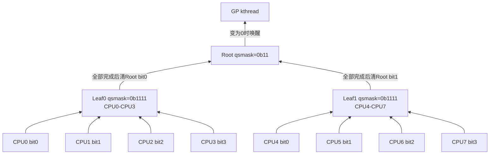
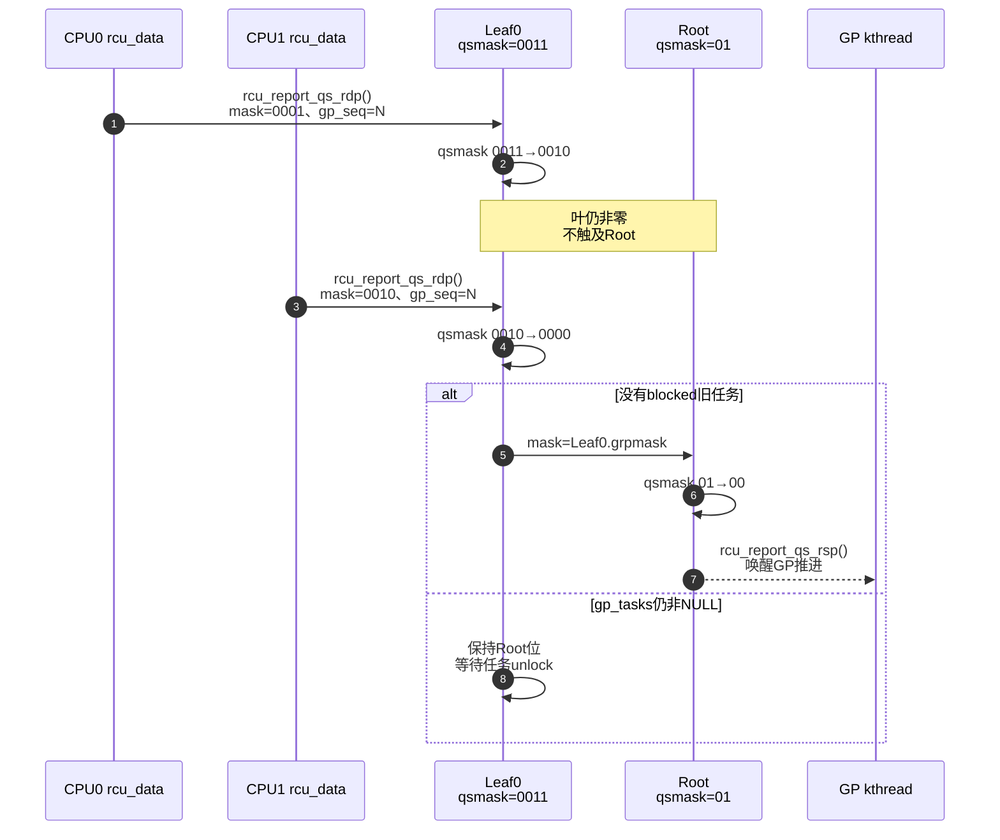

# 第14章\_Tree\_RCU\_rcu\_node树与分层汇聚

## 14.1\_问题\_为什么不让所有CPU清一个全局位图

设 256 个 CPU 都在 GP 后很快经过 QS。最直接的设计是让它们锁同一个全局对象并清自己的位：

```c
spin_lock(&global_gp_lock);
global_qsmask &= ~BIT(cpu);
spin_unlock(&global_gp_lock);
```

正确性容易理解，但 256 个 CPU 的报告会把同一锁和缓存行在 NUMA/多核间迁移。RCU 已经把成本从“每次读取”降到“每 CPU 每 GP 报告”，仍有必要避免所有报告集中到同一地址。

Tree RCU 用叶节点接收局部 CPU 位；一个叶节点只有从非零变为零时才向父节点写一次。高层看到的是“子树已经完整”，不是子树内每个 CPU 的每次动作。

## 14.2\_一棵八CPU教学树



若 CPU0、1、2 先报告：

```text
Leaf0: 1111 → 1110 → 1100 → 1000
Root:  11   → 11   → 11   → 11
```

只有 CPU3 最后令 Leaf0 `1000 → 0000`，Leaf0 才锁 Root 并清 bit0：

```text
Root: 11 → 10
```

Leaf1 完成后 Root `10 → 00`，全局结论才成立。

## 14.3\_位图字段各自表示什么

| 字段 | 所属 | 生命周期 | 含义 |
| --- | --- | --- | --- |
| `qsmaskinitnext` | `rcu_node` | hotplug持续维护 | 下一轮预计参与集合 |
| `qsmaskinit` | `rcu_node` | GP边界更新 | 本轮初始化所依据的参与集合 |
| `qsmask` | `rcu_node` | 每轮 GP | 当前仍欠证明的 CPU/子节点位 |
| `grpmask` | `rcu_node` 或 `rcu_data` | 拓扑稳定期 | 自己在父节点/叶节点中对应的一位 |
| `mynode` | `rcu_data` | CPU映射稳定期 | 本 CPU 所属叶节点地址 |
| `gp_seq` | 节点/CPU | 每轮更新 | 报告属于哪个代际 |

`qsmask` 的位为一不表示对应 CPU 正在读，只表示本轮还没有取得足够证据。`qsmaskinitnext` 也不是当前 GP 等待集；它解决 CPU online/offline 与下一轮边界的协调。

## 14.4\_GP初始化怎样建立每层等待集

`kernel/rcu/tree.c::rcu_gp_init()` 广度优先遍历节点，在 `rnp->lock` 下执行：

```c
rcu_preempt_check_blocked_tasks(rnp);
rnp->qsmask = rnp->qsmaskinit;
WRITE_ONCE(rnp->gp_seq, rcu_state.gp_seq);
```

为何是广度优先：开始时要让上层代际和等待状态按统一 GP 发布，再让 CPU/叶节点异步感知；结束时同样要避免下一轮在部分节点开始，而上一轮在另一些节点尚未完整记录。

CPU hotplug 的 `qsmaskinitnext → qsmaskinit` 转换在专门锁和 GP 初始化边界中完成，避免当前 GP 中途出现无法解释的新参与者。

## 14.5\_CPU报告到叶节点

本 CPU `rcu_core()` 调用 `rcu_check_quiescent_state(rdp)`。确认本地已观察 QS 后进入 `rcu_report_qs_rdp()`：

```text
锁rdp->mynode
    → 校验rdp->gp_seq == rnp->gp_seq
    → 校验rdp->grpmask仍在rnp->qsmask
    → 清本地core_needs_qs
    → 调用rcu_report_qs_rnp(rdp->grpmask, ...)
```

代际校验阻止这个交错：

```text
CPU很晚才提交GP=N的QS
    → 节点已经开始GP=N+1
    → 旧报告不能清N+1的位
```

## 14.6\_节点怎样逐层向根清位

`rcu_report_qs_rnp()` 在每一层重复：

```c
if (rnp->gp_seq != gps || !(rnp->qsmask & mask))
	return;                 /* 过期或已经报告 */

rnp->qsmask &= ~mask;
if (rnp->qsmask != 0 || node_still_has_blocked_old_task)
	return;                 /* 本层尚未完整 */

mask = rnp->grpmask;
rnp = rnp->parent;        /* 本节点完整，向上一层 */
```

到根后 `rcu_report_qs_rsp()` 唤醒 GP kthread。传播不是 CPU 主动给每一级发送消息；同一个报告函数只在某层刚好完成时继续锁父节点。

## 14.7\_抢占式任务债务怎样进入同一棵树

PREEMPT_RCU 的 blocked reader 只挂在叶 `rcu_node.blkd_tasks`，当前 GP 边界由 `gp_tasks` 表示。叶节点即使 `qsmask==0`，只要 `gp_tasks!=NULL` 就不能向父节点清位。

```text
Leaf0 qsmask=0
Leaf0 gp_tasks=&R-old
Root bit0=1
```

R-old 最外层 unlock 后，`rcu_report_unblock_qs_rnp()` 在确认任务债务和 CPU 债务都清空时，以 Leaf0 的 `grpmask` 重新启动向父节点的报告。

所以高层 `qsmask` 不只是低层 CPU 位的算术 OR；叶节点把 CPU 和任务两类证明先做合取，再用自己的一位向上表示“整个子树完整”。

## 14.8\_锁与缓存通信发生在哪里

| 事件 | 触及共享位置 | 频率 |
| --- | --- | --- |
| 普通 `rcu_read_lock/unlock` | 非抢占执行约束或当前任务字段 | 每次读侧，不锁树 |
| 本 CPU 首次报告本轮 QS | 所属叶 `rnp->lock/qsmask` | 通常每 CPU 每 GP 一次 |
| 叶节点最后一位清零 | 父节点锁和一位 | 每叶节点每 GP至多关键一次 |
| 中间节点清零 | 更上层节点 | 每完成子树一次 |
| GP初始化/cleanup | 遍历全树 | 每物理 GP |

树没有消除缓存一致性通信，而是把高频 reader 从共享树移开，并把 GP 报告成本分区、分层、批量化。CPU 很少或 GP 非常频繁时，树的管理成本也可能显著；RCU 的优势取决于 reader/update 比例和平台规模。

## 14.9\_完整四CPU报告时序



## 14.10\_trace和故障定位

RCU trace 中 `rcu_quiescent_state_report` 可观察节点层级、清除 mask、剩余 `qsmask` 和 blocked task 指示。stall 日志中的 `q=`/CPU mask 等字段随版本不同，应回到 `tree_stall.h` 对照格式。

排查“某 CPU 明明 QS 了但根没完成”时按层检查：

1. 本地 `cpu_no_qs` 是否已清；
2. `rcu_core()` 是否有机会运行并上报；
3. 叶节点代际是否匹配；
4. 叶 `qsmask` 是否还有其他 CPU；
5. 叶 `gp_tasks` 是否仍有被抢占旧 reader；
6. 父节点是否还有其他叶分支。

不要从根非零直接推断当前 CPU 的 reader 没退出；根保存的是整棵子树的汇总结论。

## 14.11\_源码入口

- 先从 [拓扑与 CPU 热插拔模块源码概念导读](../../../../research/source_reading/rcu/navigation/P08_Linux_6.12_Tree_RCU_拓扑与CPU热插拔模块源码概念导读.md#8.3_参与者状态地址与所有权)建立 `rcu_state`、`rcu_node` 与 `rcu_data` 的地址映射，再进入具体函数。
- `kernel/rcu/tree.h::struct rcu_node`、`struct rcu_data`。
- [`rcu_init_one()` 建立 parent、范围和 `grpmask` 拓扑](../../../../research/source_reading/rcu/source_explanations/P06_Linux_6.12_Tree_RCU_拓扑与CPU热插拔源码实现.md#6.4_rcu_init_one建立固定汇聚树并绑定每CPU叶节点)。
- [`rcu_gp_init()` 建立本轮 `qsmask` 和代际](../../../../research/source_reading/rcu/source_explanations/P05_Linux_6.12_Tree_RCU_GP全局生命周期源码实现.md#5.9_rcu_gp_init开始代际并建立证明债务)。
- [`rcu_report_qs_rdp()`、`rcu_report_qs_rnp()` 的逐层汇聚](../../../../research/source_reading/rcu/source_explanations/P02_Linux_6.12_非抢占式_Tree_RCU_关键函数源码实现.md#2.6_rcu_report_qs_rdp与rcu_report_qs_rnp汇聚证据)。
- `kernel/rcu/tree_plugin.h::rcu_preempt_blocked_readers_cgp()`：任务债务门控。

上一篇：[Tree RCU QS、EQS 与 Context Tracking](P13_Tree_RCU_QS_EQS与Context_Tracking.md)。

下一篇：[Tree RCU force-QS、迟延与 Stall](P15_Tree_RCU_force_QS迟延与Stall.md)。
