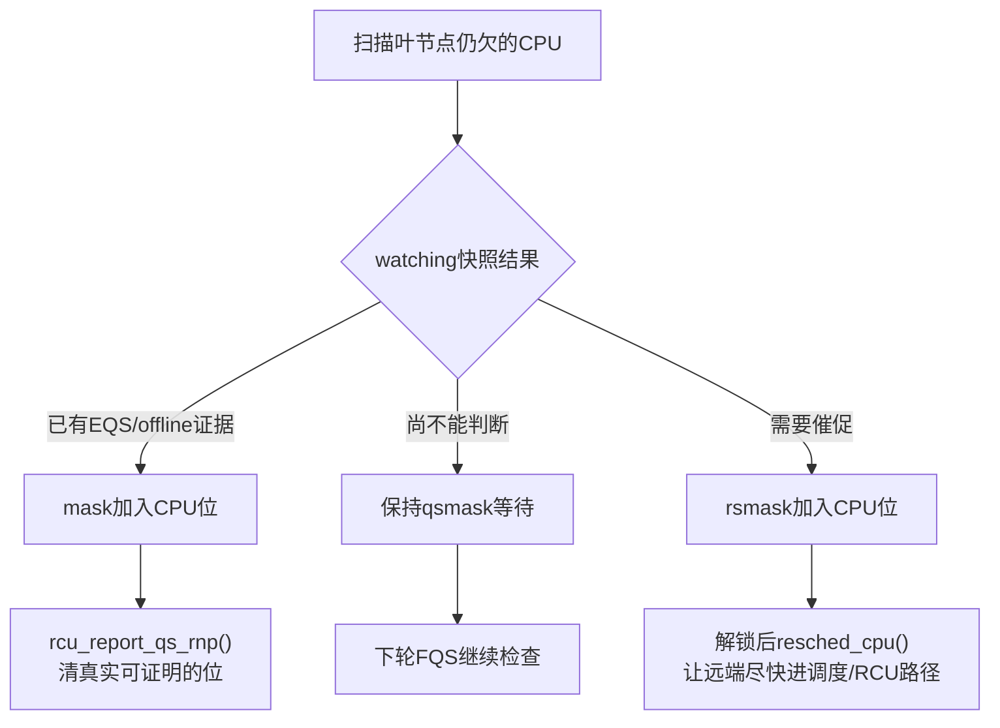
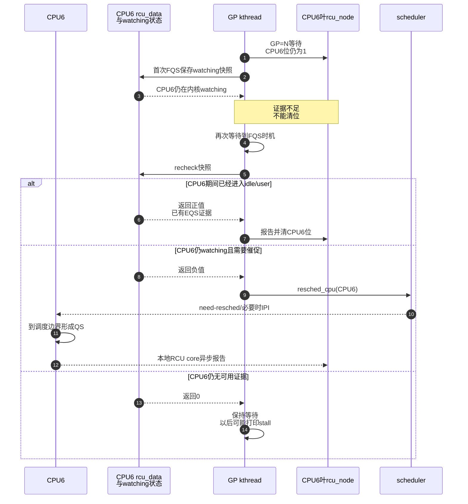

# 第15章\_Tree\_RCU\_force\_QS迟延与Stall


## 15.1\_Tree\_RCU\_force\_QS迟延与\_Stall

### 15.1.1\_场景\_qsmask剩一位究竟意味着什么

GP=N 已经等待一段时间，根最终只剩 CPU6 所在叶分支。可能存在三种完全不同的事实：

1. CPU6 早已进入 idle，只是没有主动运行 `rcu_core()` 报告；
2. CPU6 正在内核态运行，能够被重调度催促并很快产生 QS；
3. CPU6 长时间关中断或旧 reader 永不退出，当前确实没有安全证据。

如果 GP kthread 一律继续睡，前两种会造成无谓延迟；如果一律超时清位，第三种会释放仍在使用的对象。force-QS 的职责是 **区分已有证据、可以催促、仍必须等待**，不是强行宣布 reader 已结束。

### 15.1.2\_一个故意制造stall的错误代码

下面的诊断模块片段在 CPU 上长期关闭中断并停留在 RCU 读侧，会阻断 scheduler tick、softirq 和正常 QS 进展：

```c
/* 错误示例：只用于理解告警原因，不能在生产或无保护测试机运行。 */
static void bad_path(struct demo_obj __rcu **slot)
{
	struct demo_obj *obj;
	unsigned long flags;

	local_irq_save(flags);
	rcu_read_lock();
	obj = rcu_dereference(*slot);

	while (!READ_ONCE(stop_bad_test))
		cpu_relax();

	consume(obj);
	rcu_read_unlock();
	local_irq_restore(flags);
}
```

它同时破坏调度与 RCU 活性，stall 日志可能把 CPU、当前任务、GP 号、tick/softirq 状态暴露出来。正确做法是缩短不可抢占/关中断区间，把长工作拆到可调度上下文；若对象必须跨越区间，使用独立引用或所有权转移，而不是延长 RCU 读侧。

### 15.1.3\_普通GP的等待与扫描节奏

`kernel/rcu/tree.c::rcu_gp_fqs_loop()` 先设置下一次扫描时刻并睡在 `rcu_state.gp_wq`：

```text
gp_state=RCU_GP_WAIT_FQS
    → swait_event_idle_timeout_exclusive(...)
    → 根完成、显式FQS请求、过载或超时任一条件唤醒
    → gp_state=RCU_GP_DOING_FQS
```

若根尚未完成且到达扫描条件，调用 `rcu_gp_fqs(first_time)`。第一次与后续扫描故意不同：

```text
第一次：rcu_watching_snap_save
    → 保存仍watching CPU的基线
    → 当前已在EQS者可立即报告

后续：rcu_watching_snap_recheck
    → 判断CPU自基线以来是否进入/穿过EQS
    → 或判断是否需要resched催促
```

因此 force-QS 名字中的 force 更接近“强制进行一轮证据检查/催促”，不是“写一个位伪造 QS”。

### 15.1.4\_force\_qs\_rnp如何按叶节点处理

`force_qs_rnp(check_fn)` 遍历叶节点，只检查当前 `qsmask` 仍为一的 CPU。对每个 CPU 调用 watching 快照函数，并把结果分成：

| `check_fn` 返回 | 解释 | 后续动作 |
| ---: | --- | --- |
| `> 0` | 已经在 EQS、穿过 EQS 或 offline，证据充分 | 加入 `mask`，节点锁下 `rcu_report_qs_rnp()` |
| `0` | 仍 watching，尚不足以证明，也未到强催促条件 | 保留等待位 |
| `< 0` | 仍欠证据且需要调度催促 | 加入 `rsmask`，释放节点锁后 `resched_cpu(cpu)` |

如果叶 `qsmask==0` 但 PREEMPT_RCU 仍有 `gp_tasks`，扫描不再检查 CPU 位，而是调用 `rcu_initiate_boost()` 的可选路径处理任务活性。



### 15.1.5\_urgent\_resched\_IPI和boost各做什么

这些词经常被压成“RCU 发 IPI 通知 CPU”，实际有不同成本层级：

| 路径 | 状态/动作 | 谁处理 | 解决什么 |
| --- | --- | --- | --- |
| 本地正常报告 | `cpu_no_qs=false` 后 `rcu_core()` | 本 CPU | 高频正常闭环 |
| watching被动观察 | 远端读取 context-tracking 快照 | GP/FQS扫描者 | CPU已在 user/idle 时避免打扰 |
| urgent标志 | `rdp->rcu_urgent_qs` 等 | scheduler tick/本 CPU路径 | 请求尽快重调度或处理 QS |
| `resched_cpu()` | 写远端 need-resched，必要时由架构发送 reschedule IPI | scheduler/远端 CPU | 促使长内核执行尽快到安全边界 |
| irq_work/softirq | 安排本 CPU 后续 RCU 处理 | 中断返回/softirq/调度路径 | 当前上下文不适合立即报告时延迟交付 |
| RCU boost | 节点 boost kthread、`boost_tasks` | 可选 `CONFIG_RCU_BOOST` | 让被低优先级任务拖住的旧 reader 得到运行机会 |

被移除的“每 reader 主动通知全局协调者”成本，被每 CPU 状态、GP 周期扫描和异常慢路径通信替代。正常读侧不付 IPI；只有 GP 失去自然进展时才逐渐升级干预。

### 15.1.6\_完整迟延CPU时序



### 15.1.7\_Stall是证明链停滞的诊断\_不是根因名称

常见原因按状态层分类：

| 层 | 可能根因 | 可观察后果 |
| --- | --- | --- |
| reader/任务 | 过长读侧、读侧内错误阻塞、低优先级被饿死 | `gp_tasks` 长期存在或 CPU长期欠QS |
| CPU执行 | 长时间关中断/禁抢占、死循环 | tick、softirq、调度QS都不能推进 |
| RCU执行者 | GP kthread、`rcu_core` 或 callback线程得不到CPU | 已有状态无人消费，GP/回调延迟 |
| 时间基础 | timer/jiffies/虚拟机暂停异常 | stall时刻和FQS节奏异常 |
| 系统过载 | callback大量积压、CPU饥饿 | GP与callback吞吐下降，可能触发过载路径 |
| 内核缺陷 | 状态位、hotplug、锁或报告代际错误 | 某节点长期无法收敛 |

一条 stall 日志只能证明 RCU 在预期时间内没有完成证据链。它不能单独证明是 `rcu_read_lock()` 太长，也不能证明旧对象已经 UAF。

### 15.1.8\_安全性与活性必须分开

```text
安全性：没有CPU/任务证据
    → GP不能完成
    → callback不能进入安全执行阶段
    → writer不能据此释放旧对象

活性：迟延参与者最终是否会运行、报告或退出
    → 由调度、FQS、IPI、boost、配置与系统健康共同决定
```

stall 检测、强制扫描和 boost 都试图恢复活性，但不能降低安全标准。内核不会因为已经打印 N 次告警就把 `qsmask` 或 `gp_tasks` 无证据清零。

### 15.1.9\_诊断步骤

1. 从日志记录 GP 序列、stall CPU/任务和持续时间。
2. 判断欠的是 CPU 位还是 PREEMPT_RCU blocked task。
3. 检查目标 CPU 是否在线、user/idle、长时间关中断或被虚拟机暂停。
4. 检查 GP kthread、`rcuc`/softirq、nocb/boost线程是否有调度机会。
5. 用 ftrace/perf/lockdep 定位最长读侧、irq-off 和 preempt-off 区间。
6. 再检查 callback 过载与 hotplug 竞争，避免把“回调慢”误写成“GP不安全”。

可用入口取决于配置：

```bash
grep -E 'CONFIG_(RCU_CPU_STALL_TIMEOUT|RCU_TRACE|RCU_BOOST|PREEMPT_RCU)=' \
    /boot/config-"$(uname -r)"
cd /sys/kernel/tracing/events/rcu
find . -maxdepth 2 -name enable -print
```

### 15.1.10\_源码入口

- `kernel/rcu/tree.c::rcu_gp_fqs_loop()`：等待、扫描节奏与根完成检查。
- `kernel/rcu/tree.c::rcu_gp_fqs()`：首轮 save、后续 recheck。
- `kernel/rcu/tree.c::force_qs_rnp()`：按叶节点分类证据和 `resched_cpu()`。
- `kernel/rcu/tree.c::rcu_sched_clock_irq()`：urgent QS 的本地消费。
- `kernel/rcu/tree_plugin.h::rcu_initiate_boost()`：可选被抢占 reader boost。
- `kernel/rcu/tree_stall.h`：stall 阈值、检测、打印和抑制逻辑。

上一篇：[Tree RCU rcu_node 树与分层汇聚](P14_Tree_RCU_rcu_node树与分层汇聚.md)。

下一篇：[Tree RCU Expedited GP](P16_Tree_RCU_Expedited_GP.md)。
