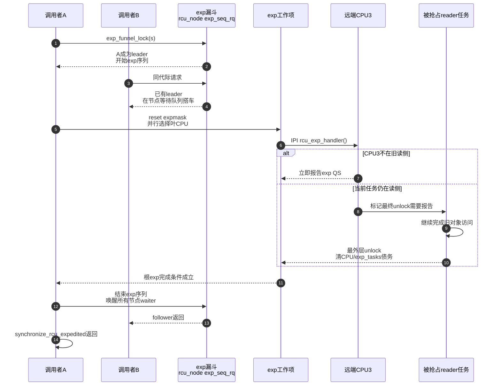

# 第16章\_Tree\_RCU\_Expedited\_GP

## 16.1\_场景\_控制路径愿意用系统扰动换更短等待

设备驱动撤销一个 MMIO 映射。新的 reader 已被入口切断；在真正关闭硬件窗口前，控制线程必须确认旧 reader 已经离场。普通 GP 可能等待 CPU 自然到 QS，而平台希望缩短这条低频控制路径的尾延迟：

```c
mutex_lock(&map_update_lock);
old = rcu_replace_pointer(active_map, NULL,
			  lockdep_is_held(&map_update_lock));
mutex_unlock(&map_update_lock);

/* 低频、明确需要尽快确认；不是数据面循环。 */
synchronize_rcu_expedited();
disable_device_window(old);
kfree(old);
```

`synchronize_rcu_expedited()` 与普通 `synchronize_rcu()` 的安全语义相同：都覆盖调用前的既有 reader。区别是 expedited 主动选择 CPU、检查 EQS、发送 IPI 并处理被抢占任务，用更高系统成本争取更短 GP 等待。

## 16.2\_它不是普通GP的超时开关

普通 GP 和 expedited GP 有不同的序列、等待位和推进路径：

| 维度 | 普通 GP | Expedited GP |
| --- | --- | --- |
| 全局序列 | `rcu_state.gp_seq` | `rcu_state.expedited_sequence` |
| 节点 CPU 债务 | `qsmask/qsmaskinit` | `expmask/expmaskinit` |
| 抢占任务边界 | `gp_tasks` | `exp_tasks` |
| 等待者合并 | callback代际与普通GP请求 | `exp_seq_rq`漏斗和exp序列 |
| 获得CPU证据 | 等自然QS并周期FQS | 主动快照、叶并行选择、IPI handler |
| 主要完成等待 | 普通 `gp_wq`/callback | `expedited_wq` 和节点 `exp_wq[]` |

显式调用 expedited 不表示“让当前普通 GP 加快一点”；它走一套独立但共享 Tree RCU reader 定义的证明通道。

## 16.3\_S0到S8\_一次expedited\_GP

| 阶段 | 入口 | 状态变化 | 参与者 | 退出条件 |
| --- | --- | --- | --- | --- |
| S0 取票 | `rcu_exp_gp_seq_snap()` | 保存需要覆盖的 exp 序列 | 调用任务 | 已有完成代际不足 |
| S1 漏斗 | `exp_funnel_lock(s)` | 节点 `exp_seq_rq` 向根登记需求 | 多个调用者 | 成为 leader 或等待 follower |
| S2 开始 | `rcu_exp_gp_seq_start()` | `expedited_sequence` 开始新代际 | leader | 唯一物理exp GP |
| S3 重置树 | `sync_exp_reset_tree()` | `expmask=expmaskinit` | exp worker/leader | 节点参与集合建立 |
| S4 选择CPU | `sync_rcu_exp_select_cpus()` | 检查 offline/EQS，设置 `exp_tasks` | 各叶工作项 | 得到需IPI的CPU集合 |
| S5 主动请求 | `smp_call_function_single(...rcu_exp_handler...)` | 远端立即报告或设置延迟exp QS | 发起者和远端CPU | CPU位最终清除 |
| S6 等任务 | reader在IPI时仍处读侧 | `exp_tasks` 保持，最终unlock推进 | 被抢占任务 | 最后任务离场 |
| S7 根完成 | exp CPU/任务债务清零 | `expedited_wq` 条件成立 | 报告路径 | leader结束序列 |
| S8 唤醒 | `rcu_exp_wait_wake()` | `rcu_exp_gp_seq_end()`、节点等待队列唤醒 | leader | followers与调用者返回 |

## 16.4\_漏斗锁怎样合并并发调用者

若 100 个 CPU 同时调用 expedited，不能让 100 个线程各自广播一轮 IPI。`exp_funnel_lock(s)` 从调用 CPU 的叶节点沿父节点向根推进：

```text
本节点exp_seq_rq已经覆盖s
    → 说明有人正在做足够新的exp GP
    → 在本节点exp_wq[代际槽]等待并搭车

尚无人覆盖s
    → 写本节点exp_seq_rq=s
    → 继续向父节点

到根并取得rcu_state.exp_mutex
    → 成为本轮leader
```

这既降低全局 mutex 争用，也让位于同一子树的 follower 就近等待。若其他任务在竞争期间已经完成足够新的一轮，调用者可直接返回。

## 16.5\_CPU选择和IPI不是无条件广播

`sync_rcu_exp_select_cpus()` 先重置 exp 树，再为每个叶节点安排工作；6.12 可用多个 work item 并行处理叶节点，最后一个叶或早期启动场景可直接调用。

每个叶执行 `__sync_rcu_exp_select_node_cpus()`：

1. 锁叶节点，遍历 `expmask` 中的 CPU；
2. 当前 CPU、offline CPU 或已在 EQS 的 CPU 加入本地完成集合；
3. 对仍 watching 的远端 CPU 保存 `exp_watching_snap`；
4. 若存在被抢占 reader，把 `exp_tasks` 指向 blocked 链表边界；
5. 解锁后只对剩余 CPU 调用 `smp_call_function_single(cpu, rcu_exp_handler, ...)`；
6. 若与 CPU hotplug 竞争，重新检查在线位并重试或报告 offline。

因此实际 IPI 集合是：

```text
本轮expmask
    - 已offline
    - 当前CPU可本地处理
    - 快照已证明在EQS
    = 需要远端exp handler的CPU
```

## 16.6\_IPI\_handler在远端做什么

PREEMPT_RCU 下，`rcu_exp_handler()` 查看当前任务读侧深度：

- 若不在读侧，可立即报告该 CPU 的 expedited QS；
- 若仍在读侧，不能伪造完成，而是让当前/最终 `rcu_read_unlock()` 承担延迟报告；
- 若任务在 context switch 中成为 blocked reader，`exp_tasks` 继续代表任务债务。

非抢占式分支也必须尊重读侧执行约束；IPI 到达只增加取得证据的积极性，不会让 handler 在旧 reader 中间直接宣布安全。

## 16.7\_端到端时序



## 16.8\_为什么\_更快\_不等于固定deadline

expedited 会更积极，但仍可能受以下因素拖延：

- 旧 reader 本身很长；
- 被抢占 reader 长期得不到调度；
- CPU 长时间关中断，IPI 不能处理；
- CPU hotplug 与选择过程竞争；
- 系统工作队列、调度或虚拟化严重迟延；
- 多个调用者和其他 exp GP 正在合并/串行化。

源码具有 expedited stall 等待和诊断。它同样不会在证据不足时超时返回成功，因此 API 不提供硬实时上界。

## 16.9\_选择与替代

| 需求 | 建议 | 原因 |
| --- | --- | --- |
| 高频对象退休 | `call_rcu()`/`kfree_rcu()` 批量异步 | 不让更新线程阻塞，也不广播频繁IPI |
| 批量更新后可统一等待 | 一次 `synchronize_rcu()` | 多对象共享普通GP |
| 低频控制路径确有短尾延迟要求 | 评估 `synchronize_rcu_expedited()` | 用扰动换积极取证 |
| 循环中每项都 expedited | 重构为批处理 | 源码注释明确要求避免 |
| 想等待此前 callback 全执行 | `rcu_barrier()` | expedited只等reader，不等全部callback |

内核还可通过 `rcu_normal_after_boot` 等策略在启动阶段改变普通/expedited 选择；调用者不能仅看函数名就忽略实际配置和启动阶段。

## 16.10\_源码和trace入口

- `kernel/rcu/tree_exp.h::synchronize_rcu_expedited()`：公共入口、非法上下文检查和 fallback。
- `exp_funnel_lock()`：并发请求合并。
- `sync_exp_reset_tree()`：`expmask` 初始化。
- `sync_rcu_exp_select_cpus()` / `__sync_rcu_exp_select_node_cpus()`：叶并行选择、EQS检查、IPI。
- `rcu_exp_handler()`：远端立即或延迟报告。
- `rcu_exp_wait_wake()`：结束序列并唤醒 follower。

```bash
cd /sys/kernel/tracing
echo 1 | sudo tee events/rcu/rcu_exp_grace_period/enable
echo 1 | sudo tee events/rcu/rcu_exp_funnel_lock/enable
echo 1 | sudo tee tracing_on
```

运行一次低频测试，观察 leader/follower、select、start/end，而不是用 tight loop 制造无意义 IPI 压力。

上一篇：[Tree RCU force-QS、迟延与 Stall](P15_Tree_RCU_force_QS迟延与Stall.md)。

下一篇：[Tree RCU rcu_segcblist 回调状态机](P17_Tree_RCU_rcu_segcblist回调状态机.md)。
