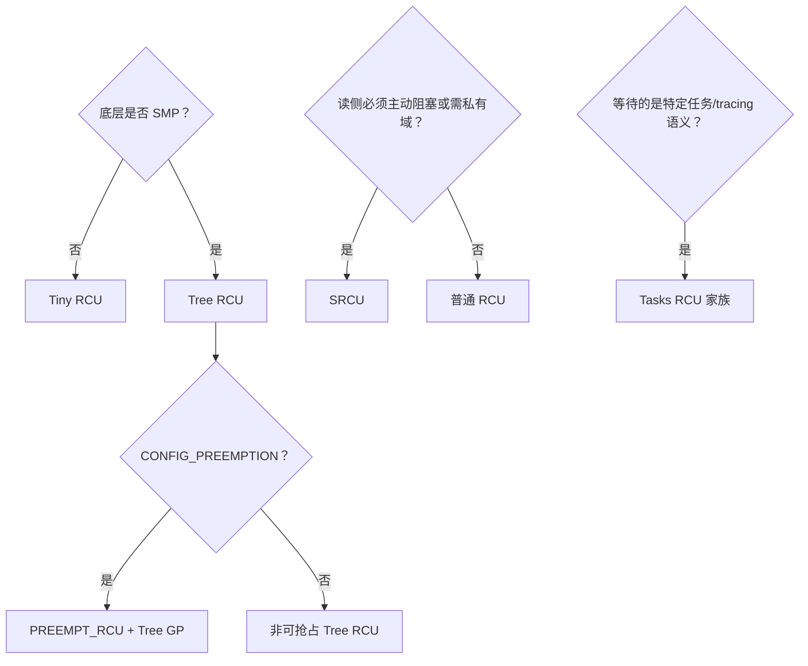

# 第17章\_RCU\_实现家族与内核配置

到这里，普通 Tree RCU 的硬件基础、读者通知和宽限期汇聚已经连成一条完整链路。现在再看“RCU 种类”，每个名称都可以落到一个具体问题：它定义了怎样的读者集合、允许怎样的执行上下文、又使用哪种宽限期判定。

## 17.1\_RCU\_种类\_存在三个维度

讨论 RCU 种类时，必须先分清：

1. **底层实现**：Tree RCU 还是 Tiny RCU。
2. **读侧语义**：普通 RCU、SRCU 还是 task-based RCU。
3. **接口包装**：`rcu_read_lock_bh()`、`rcu_read_lock_sched()` 等是否代表独立 GP 实现。

如果将这三层混在一起，就会把历史上的 RCU-bh/RCU-sched 独立宽限期实现与 Linux 6.12 的合并语义混淆。

## 17.2\_Tree\_RCU

`CONFIG_TREE_RCU` 是 SMP 系统的主要 RCU 实现。Linux 6.12.20 Kconfig 说明它面向数百乃至数千 CPU 的大型 SMP 系统，也能向下适配较小系统。

其主要扩展性设计包括：

- `rcu_data`：每 CPU 状态与回调队列。
- `rcu_node` 层次树：聚合 CPU 静止状态，避免单一全局锁热点。
- `rcu_state`：全局 GP 序列和 GP 线程。
- `rcu_segcblist`：按 GP 阶段管理回调。
- dynticks/EQS 与 CPU hotplug 协同。

## 17.3\_PREEMPT\_RCU

`CONFIG_PREEMPT_RCU` 选中 Tree RCU，并允许普通 RCU 读侧临界区被抢占。它不是一套与 Tree RCU 无关的 GP 引擎，而是 Tree RCU 加上可抢占读者跟踪。

读者进入时增加：

```c
current->rcu_read_lock_nesting
```

如果读者在临界区内被抢占，`rcu_note_context_switch()` 将当前任务挂到相关 `rcu_node` 的 `blkd_tasks` 列表。CPU 此时可以报告静止状态，但 GP 仍必须等待挂起的旧读者任务退出外层临界区。

## 17.4\_TINY\_RCU

`CONFIG_TINY_RCU` 用于非 SMP、非 PREEMPT_RCU 的单 CPU 系统，目标是降低内存占用。单 CPU 上不需要 Tree RCU 的多 CPU 层次聚合，静止状态和回调推进可以大幅简化。

Tiny RCU 不是“功能更弱的 API”，而是针对 UP 配置的底层实现选择。普通使用者仍通过 `rcu_read_lock()`、`call_rcu()` 等统一 API 编程。

## 17.5\_SRCU

SRCU（Sleepable RCU）与普通 RCU 的关键差别是：

- 使用者显式持有 `struct srcu_struct` 私有域。
- 读侧使用分 index 计数，可以跨越主动阻塞。
- 宽限期只等待同一 `srcu_struct` 的既存读者。
- lock/unlock 必须使用同一域和 lock 返回的 index。

Linux 6.12 根据配置在 `CONFIG_TREE_SRCU` 与 `CONFIG_TINY_SRCU` 之间选择底层实现。

## 17.6\_Tasks\_RCU\_家族

Task-based RCU 不是普通数据结构查找的默认选择，而是为特定内核机制定义不同的“读者已结束”语义。

| 种类 | 静止状态思路 | 典型服务对象 |
| --- | --- | --- |
| Tasks RCU | 自愿上下文切换、idle、用户态 | 需要等待任务经过调度边界的机制 |
| Tasks Rude RCU | 上下文切换（包括抢占）与用户态，可强制 IPI/切换 | 更强制的 task-based 等待 |
| Tasks Trace RCU | 跟踪 tracing/BPF 相关的任务读侧 | tracing 和 BPF 的特定生命周期 |

它们与普通 Tree RCU 可以同时存在，因为它们等待的“读者集合”和“静止状态”不同。

## 17.7\_RCU-bh\_和\_RCU-sched\_在\_Linux\_6.12\_中的位置

`rcu_read_lock_bh()` 会同时禁用本地软中断，`rcu_read_lock_sched()` 会表达禁止抢占的读侧语义。但 Linux 5.0 以后，普通 RCU 宽限期已统一考虑：

- `rcu_read_lock()` 标记的读侧。
- `local_bh_disable()` 覆盖的区域。
- `preempt_disable()` 覆盖的区域。
- 硬中断、软中断和 NMI 处理路径。

所以这些接口在 6.12 中主要表达读侧执行约束，不应再当作完全独立的 GP 实现。

## 17.8\_选择关系图



## 17.9\_版本证据

本章的配置关系来自 Linux 6.12.20 [`kernel/rcu/Kconfig`](../../../../research/source_reading/linux/kernel/rcu/Kconfig)，PREEMPT_RCU 读者跟踪来自 [`tree_plugin.h`](../../../../research/source_reading/linux/kernel/rcu/tree_plugin.h)。

上一篇：[Tree RCU CPU 热插拔与回调迁移](P16_Tree_RCU_CPU热插拔与回调迁移.md)。

下一篇：[SRCU 私有域与双 index 状态机](P18_SRCU_私有域与双_index_状态机.md)。
