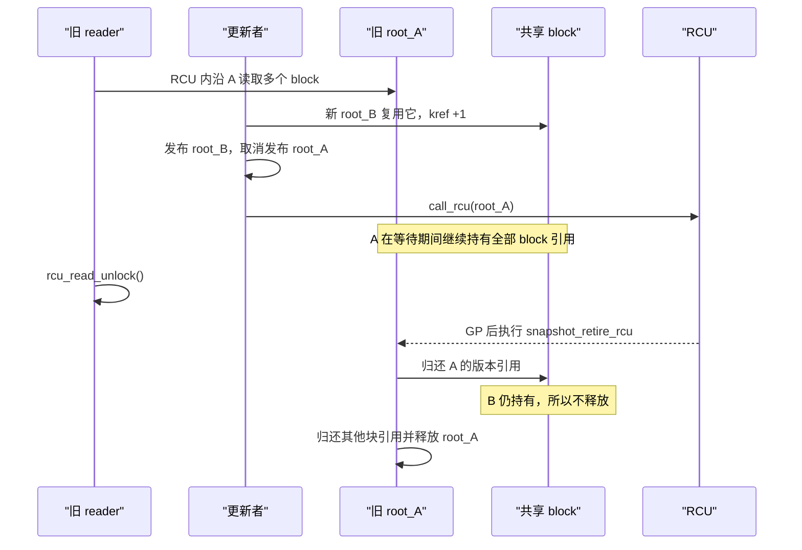

# 第21章\_RCU\_数据结构模板与选型

API 表解决“某个函数做什么”，却不能自动组成正确程序。本章先画对象的分配与所有权拓扑，再选择取消发布、宽限期、kref 归零和最终释放的顺序。重点区分三类经常被混成“RCU + kref”的模型：单个对象逃出读区、单个对象的发布引用跨越 GP，以及一个 RCU 版本根拥有多个 kref 数据块。

以下模板以仓库保存的 Linux 6.12.20 [`kref.h`](../../../../research/source_reading/linux/include/linux/kref.h)、[`refcount.h`](../../../../research/source_reading/linux/include/linux/refcount.h) 和 [`kref.rst`](../../../../research/source_reading/linux/Documentation/core-api/kref.rst) 为接口边界：`struct kref` 本身只内嵌 `refcount_t`，release 由每次 `kref_put()` 的调用者传入；`kref_get_unless_zero()` 只解决“非零才增加”，其计数器所在内存仍必须先由 RCU 或其他协议保持有效。

## 21.1\_先按分配与所有权拓扑选模板

| 模型 | RCU 入口 | kref 所在对象 | reader 是否逐次 get | 退休顺序 |
| --- | --- | --- | --- | --- |
| A：单对象逃逸 | 直接指向对象 | 同一个对象 | 只有逃出读区的 reader get | 取消发布 → 对象 kref 归零 → RCU GP → 释放对象 |
| B：发布引用跨 GP | 直接指向对象 | 同一个对象 | 逃出读区的 reader get | 取消发布 → RCU GP → 归还发布引用 → 对象 kref 归零后释放 |
| C：复合快照 | 指向版本根 | 每个分散 block | 短 reader 不 get；逃逸 block 才 get | 取消发布旧根 → RCU GP → 旧根逐块 put → 各 block 独立归零 |

模型 A 与 B 是同一分配块的两种合法串联顺序；模型 C 则包含一个根分配和多个叶子分配。选择之后，所有入口必须遵守同一协议，不能让同一块内存同时拥有直接 `kfree()` 和独立 RCU 回调两个出口。

## 21.2\_模型\_A\_单个\_RCU\_对象被长期持有

对象本身同时内嵌 kref 和 RCU 回调头：

```c
struct lookup_obj {
	struct kref ref;
	struct rcu_head rcu;
	int id;
};

static struct lookup_obj __rcu *current_obj;
static DEFINE_MUTEX(obj_update_lock);
```

共享入口持有 `kref_init()` 建立的初始引用。reader 在 RCU 临界区内尝试取得独立引用：

```c
static struct lookup_obj *lookup_obj_get(void)
{
	struct lookup_obj *obj;

	rcu_read_lock();
	obj = rcu_dereference(current_obj);
	if (obj && !kref_get_unless_zero(&obj->ref))
		obj = NULL;
	rcu_read_unlock();

	return obj;
}
```

最后一次 put 不直接释放，而是把同一块对象内存交给 RCU：

```c
static void lookup_obj_release(struct kref *ref)
{
	struct lookup_obj *obj;

	obj = container_of(ref, struct lookup_obj, ref);
	kfree_rcu(obj, rcu);
}

static void lookup_obj_put(struct lookup_obj *obj)
{
	kref_put(&obj->ref, lookup_obj_release);
}
```

替换路径先封闭新 lookup，再归还入口引用：

```c
static void replace_lookup_obj(struct lookup_obj *new)
{
	struct lookup_obj *old;

	mutex_lock(&obj_update_lock);
	old = rcu_replace_pointer(current_obj, new,
				  lockdep_is_held(&obj_update_lock));
	mutex_unlock(&obj_update_lock);

	if (old)
		lookup_obj_put(old);
}
```

传入的 `new` 必须已经完成全部字段初始化并执行 `kref_init()`；这份初始引用从发布成功开始属于共享入口。

若旧 reader 的 `kref_get_unless_zero()` 先成功，入口 put 不会使计数归零；若入口 put 先归零，reader 的 get 失败，而 `kfree_rcu()` 又保证计数器内存在 reader 退出 RCU 前仍有效。完整的单对象竞态与 `dying` 状态见[kref 与 RCU](../../object_lifetime/kref/P10_kref_与_RCU.md)。

## 21.3\_模型\_B\_先过\_GP\_再归还单对象的发布引用

同一个对象也可以让初始引用一直代表“仍可能被旧 RCU reader 查找”，直到 GP 后才归还：

```text
替换共享入口
    -> call_rcu(&old->rcu, drop_publish_ref_rcu)
        -> GP 后执行 kref_put(&old->ref, object_release)
            -> 若无长期引用，release 直接释放
            -> 若仍有长期引用，最后一个用户 put 时释放
```

此模型中，发布引用保证 GP 结束前 `old->ref` 必然大于零，因此 reader 在正确 RCU 临界区内取得长期引用时不会碰到零值对象。`object_release()` 可以直接释放，是因为发布引用直到 GP 后才放掉，所有临时 RCU lookup 已经结束。它与模型 A 的 `release() -> kfree_rcu()` 二选一；不要让同一个对象有时在 GP 前归还发布引用，有时又假定发布引用跨越 GP。

## 21.4\_模型\_C\_一个\_RCU\_版本根拥有多个\_kref\_数据块

### 21.4.1\_对象定义与所有权不变量

复合快照用一个小根节点表达版本身份和块目录，每个 block 是独立分配：

```c
struct data_block {
	struct kref ref;
	unsigned long value;
};

struct data_snapshot {
	struct rcu_head rcu;
	unsigned int nr_blocks;
	struct data_block *blocks[];
};

static struct data_snapshot __rcu *current_snapshot;
static DEFINE_MUTEX(snapshot_update_lock);
```

必须长期成立的不变量是：

```text
一个 snapshot 的 blocks[i] 非 NULL
    -> 该 snapshot 为 blocks[i] 持有一份 kref；

snapshot 仍可能被 RCU reader 使用
    -> 不得归还它持有的任何 block 引用；

block 被任一 snapshot 发布
    -> 其供 reader 直接读取的字段保持不变，或另有独立同步协议；

构造新 snapshot 复用旧 block
    -> 发布新 root 之前，先为新 root 增加一份 block 引用。
```

block 的最后释放入口只属于 block 自己：

```c
static void data_block_release(struct kref *ref)
{
	struct data_block *block;

	block = container_of(ref, struct data_block, ref);
	kfree(block);
}
```

### 21.4.2\_构造新版本时取得块所有权

新建 block 的初始引用直接归新版本所有：

```c
static struct data_block *data_block_alloc(unsigned long value)
{
	struct data_block *block;

	block = kmalloc(sizeof(*block), GFP_KERNEL);
	if (!block)
		return NULL;

	kref_init(&block->ref);
	block->value = value;
	return block;
}
```

若新版本复用旧 block，则在新版本发布前增加一份版本所有权引用：

```c
static void snapshot_share_block(struct data_snapshot *new,
				 unsigned int index,
				 struct data_block *block)
{
	kref_get(&block->ref);
	new->blocks[index] = block;
}
```

这里允许普通 `kref_get()`，因为更新者在自己的更新锁下从当前版本取 block，而当前版本尚未取消发布并持续持有该 block 的非零引用。若 block 可以脱离 root 独立删除，这个前提不成立，必须增加独立状态机或子块级 RCU 协议。

构造失败时必须逐个 put 已经为新 root 取得的共享引用，并释放尚未发布的根；不能把失败清理拖到 RCU，因为该根从未对 reader 可见。

### 21.4.3\_短\_reader\_只借用版本已有的块引用

```c
static unsigned long read_block_value(unsigned int index)
{
	struct data_snapshot *snapshot;
	struct data_block *block;
	unsigned long value = 0;

	rcu_read_lock();
	snapshot = rcu_dereference(current_snapshot);
	if (snapshot && index < snapshot->nr_blocks) {
		block = snapshot->blocks[index];
		if (block)
			value = READ_ONCE(block->value);
	}
	rcu_read_unlock();

	return value;
}
```

这条高频路径没有逐块 get／put。reader 的安全性来自：旧 snapshot 只会在自己的 GP 后归还 block 引用，因此 reader 仍在临界区时，根节点替它托住了 block。

### 21.4.4\_旧版本在\_GP\_后逐块归还所有权

```c
static void snapshot_retire_rcu(struct rcu_head *rcu)
{
	struct data_snapshot *snapshot;
	unsigned int i;

	snapshot = container_of(rcu, struct data_snapshot, rcu);

	for (i = 0; i < snapshot->nr_blocks; i++) {
		if (snapshot->blocks[i])
			kref_put(&snapshot->blocks[i]->ref,
				 data_block_release);
	}

	kfree(snapshot);
}

static void publish_snapshot(struct data_snapshot *new)
{
	struct data_snapshot *old;

	mutex_lock(&snapshot_update_lock);
	old = rcu_replace_pointer(current_snapshot, new,
				  lockdep_is_held(&snapshot_update_lock));
	mutex_unlock(&snapshot_update_lock);

	if (old)
		call_rcu(&old->rcu, snapshot_retire_rcu);
}
```

`snapshot_retire_rcu()` 不查询“哪些 reader 看过哪个 block”。GP 已经证明旧 reader 不再沿该 root 访问任何 block，回调只负责归还 root 明确记录的所有权。每个 block 的最后一次 put 再独立决定是否执行 `data_block_release()`。



## 21.5\_复合模型中把某个块带出\_RCU

若调用者要把一个 block 交给工作队列或跨越睡眠，必须在 root 仍受 RCU 保护时取得独立引用：

```c
static struct data_block *data_block_get_current(unsigned int index)
{
	struct data_snapshot *snapshot;
	struct data_block *block = NULL;

	rcu_read_lock();
	snapshot = rcu_dereference(current_snapshot);
	if (snapshot && index < snapshot->nr_blocks) {
		block = snapshot->blocks[index];
		if (block)
			kref_get(&block->ref);
	}
	rcu_read_unlock();

	return block;
}

static void data_block_put(struct data_block *block)
{
	kref_put(&block->ref, data_block_release);
}
```

这里的 `kref_get()` 不是无保护地从零复活：root 对 block 的版本引用保证，在当前 RCU 临界区结束以及 root 对应 GP 完成之前，block 计数不会降到零。reader get 成功后，root 的退休回调可以归还版本引用，但 reader 自己的引用仍继续托住 block。

如果 block 同时还出现在一个可独立删除的 RCU 索引中，就不能只依赖 root 的不变量；应为那个入口单独设计 `kref_get_unless_zero()`、取消发布和回收链，避免一个分配块被两套入口各自直接释放。

## 21.6\_回调工作量与内存峰值

复合快照消除了短 reader 的逐块原子操作，却把工作转移到构造和退休路径：

| 成本 | 由谁承担 | 形成过程 |
| --- | --- | --- |
| 共享块 get | 新版本构造者 | 每复用一个 block，为新 root 增加一份所有权 |
| 批量 block put | 旧 root 退休者 | GP 后归还旧 root 持有的全部引用 |
| 版本并存内存 | 更新路径 | 旧 root 等 GP，新 root 已发布，长期引用还可能托住更老的 block |
| 热点块原子争用 | 逃逸 reader | 只有确实取得长期 block 引用的路径发生 |

RCU 回调必须保持短小且不能主动阻塞。若一个 root 包含数量很大的 block，或者 block 的最后 `release()` 可能睡眠，不应在 RCU 回调中执行无界清理。可以在允许睡眠的更新上下文中用 `synchronize_rcu()` 后批量归还，或让短小的 RCU 回调把退休工作转交给工作队列；无论采用哪种方式，都必须保证 root 和块目录在工作真正接管之前保持有效。

## 21.7\_RCU\_与\_seqcount/seqlock\_对比矩阵

| 特征 | RCU | seqcount_t | seqlock_t |
| --- | --- | --- | --- |
| 读侧行为 | 轻量，短读可直接消费旧版本 | 无锁读取并在冲突时重试 | 无锁读取并在冲突时重试 |
| 写者串行化 | RCU 不提供，由使用者选择 | 必须由使用者提供 | 内置 spinlock |
| 复合数据 | 用不可变根一次发布，可引用多个分散块 | reader 重试以取得同一代字段 | reader 重试以取得同一代字段 |
| 指针生命期 | GP 与所有权图负责延迟回收 | 不能让 reader 在重试窗口解引用可释放指针 | 同左 |
| 更新成本 | 构造新根／新块、引用共享块、退休旧版本 | 原地写并更新序号 | 持锁原地写并更新序号 |
| 适合场景 | 读多写少、允许旧版本、内存可延迟回收 | 写入较短、reader 可重试 | 需要内置写锁的短更新 |

## 21.8\_所有权与回收核对表

| 检查项 | 目标 | 状态 |
| --- | --- | --- |
| RCU 入口直接发布的是单对象还是版本根 | 先确定回收层级 | □ |
| 每个分配块由哪些 root 或长期用户持有 | 建立所有权图 | □ |
| 新 root 复用 block 前是否先取得引用 | 防止发布悬空块 | □ |
| 旧 root 是否保持块引用直到自己的 GP 完成 | 保护临时 reader | □ |
| 短 reader 是否避免无意义的逐块 get／put | 保留读侧扩展性 | □ |
| 逃逸 block 是否在 RCU 内取得独立引用 | 完成保护交接 | □ |
| 同一分配块是否只有一个最终 release 路径 | 防止 UAF 与 double-free | □ |
| 退休回调的循环和 block release 是否有界且不阻塞 | 符合回调上下文 | □ |
| 连续更新和长期引用的内存峰值是否可接受 | 防止旧代积压 | □ |
| 多个写者是否由更新锁或其他协议串行化 | 防止所有权重复转移 | □ |

## 21.9\_小结

- 单个 RCU 对象被带出读区时，kref 统计的是对这个对象本身的长期持有。
- 复合旧照中，版本根持有每个分散 block 的 kref；短 reader 借用根已有的引用，不必逐块计数。
- 新版本复用 block 时先增加版本引用，旧版本只在 GP 后归还自己的引用。
- reader 把子块带出读区时才增加逃逸引用，旧 root 退休不会使该块提前释放。
- RCU 与 kref 仍然彼此无感；对象所属模块用根目录、RCU 回调和 block release 把所有权逐层收敛。
- 回收顺序由所有权拓扑决定，不存在对所有 RCU + kref 场景都成立的固定先后顺序。


上一篇：[RCU API 速查](P20_RCU_通用API与调用契约.md)。

下一篇：[RCU 驱动应用模式](P22_RCU_驱动与子系统应用模式.md)。


