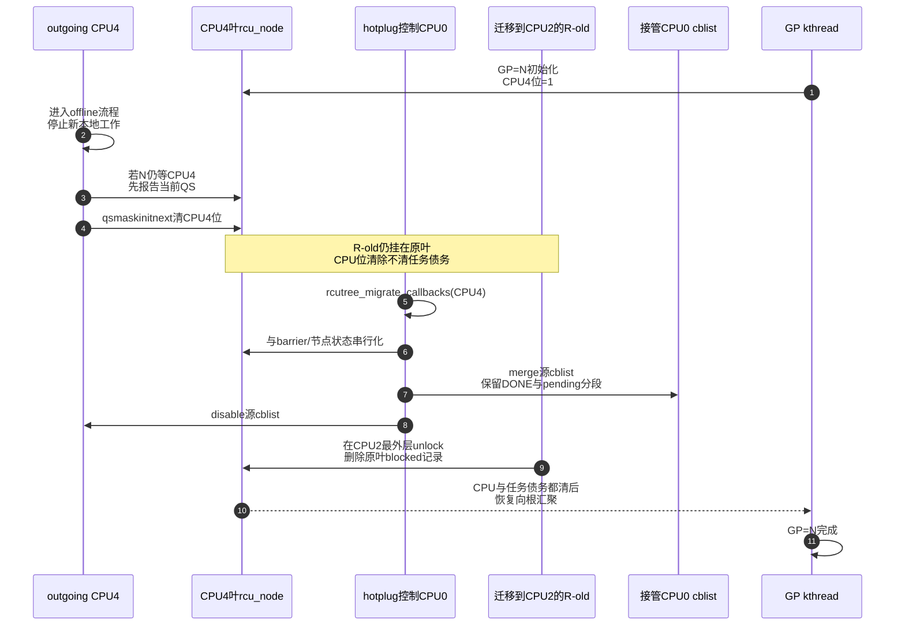

# 第21章\_Tree\_RCU\_CPU热插拔与回调迁移

## 21.1\_场景\_CPU4在GP中途下线

GP=N 已经把 CPU4 的叶节点位放入 `qsmask`；CPU4 的 `rcu_data.cblist` 还有等待 GP=N 和 N+1 的 callback；PREEMPT_RCU 下还可能有一个曾在 CPU4 上被抢占的旧 reader，任务已经迁移到 CPU2。

管理员执行：

```bash
echo 0 | sudo tee /sys/devices/system/cpu/cpu4/online
```

下线过程必须同时回答三组问题：

```text
参与集合：当前GP还等不等CPU4，下一轮还应不应纳入它？
任务债务：挂在CPU4叶节点的被抢占任务由谁继续等待？
回调所有权：CPU4以后不再运行，cblist由哪个在线CPU执行？
```

只做 `qsmask &= ~CPU4` 会丢 callback 和任务状态；只迁移 callback 又会让当前 GP 永远等一个死亡 CPU。

## 21.2\_当前GP与下一轮参与集合必须分开

叶节点有三组相关位：

| 字段 | 本场景含义 |
| --- | --- |
| `qsmask` | GP=N 当前仍欠 CPU4 的证明 |
| `qsmaskinit` | GP=N 初始化采用的参与集合 |
| `qsmaskinitnext` | 下一轮 GP 应采用的在线 CPU 集合 |

CPU4 下线时，如果当前 `qsmask` 仍有其位，离线路径先为当前 GP 报告 QS；之后再从 `qsmaskinitnext` 删除 CPU4。顺序不能反过来，否则当前 GP 报告路径可能失去解释它为何还在等待 CPU4 的代际上下文。

Linux 6.12.20 的 `rcutree_report_cpu_dead()` 明确执行：

```c
if (rnp->qsmask & mask)
	rcu_report_qs_rnp(mask, rnp, rnp->gp_seq, flags);
WRITE_ONCE(rnp->qsmaskinitnext, rnp->qsmaskinitnext & ~mask);
```

并要求从这一点直到 CPU 真正死亡保持 IRQ disabled，避免 CPU 已从未来参与集合删除后又由中断引入新的普通 RCU 读侧。

## 21.3\_上线也不能中途加入当前GP

`rcutree_report_cpu_starting(cpu)` 在 incoming CPU 自己、尚未开中断的精确位置执行：

```c
rnp->qsmaskinitnext |= rdp->grpmask;
rnp->expmaskinitnext |= rdp->grpmask;
smp_store_release(&rdp->beenonline, true);
smp_mb(); /* 以后才能使用普通RCU读侧。 */
```

新 CPU 加入 **下一轮** 初始化集合，而不是凭上线事件强行扩展已经开始的 GP=N。源码若发现当前 `qsmask` 错误地仍在等 incoming CPU，会警告并报告该位，表明正常协议不允许当前 GP 依赖一个尚未被授权使用 RCU 的 CPU。

## 21.4\_被抢占任务为何不能随CPU位一起删除

R-old 曾在 CPU4 读侧内被抢占，已经挂到 CPU4 所属叶节点 `blkd_tasks`；它可能迁移到 CPU2 并继续持有旧对象。CPU4 offline 只证明 CPU4 不再运行旧 reader，不证明 R-old 已退出。

若某叶节点所有 CPU 都 offline，但仍有 blocked task，`rcu_node.wait_blkd_tasks` 保持这条叶分支的任务债务。GP 初始化/hotplug清理只有在：

```text
该叶没有在线CPU
    && blkd_tasks/gp_tasks已经排空
```

时，才可把整条离线叶分支从上层参与关系清理。任务最终在 CPU2 unlock，仍通过 `task_struct.rcu_blocked_node` 回到原叶节点解除记录。

## 21.5\_非offload\_callback怎样迁移

CPU4 死亡后不再运行 `rcu_core()`，其 cblist 不能原地等待。`rcutree_migrate_callbacks(cpu4)` 在另一个在线 CPU 上执行：

1. 若源 CPU 是 NOCB offload，callback本来由远端管线管理，本函数直接返回；
2. 取得全局 `barrier_lock`，防止与 `rcu_barrier()` 对队列的哨兵登记竞争；
3. 若源 cblist 非空，先 `rcu_barrier_entrain(source_rdp)`，保持正在进行的 barrier 覆盖；
4. 取得目标 CPU NOCB/节点锁并 flush 目标 bypass；
5. 对源、目标 cblist 执行 `rcu_advance_cbs()`，利用最近已完成 GP；
6. `rcu_segcblist_merge(&target->cblist, &source->cblist)`；
7. disable 源 cblist，检查源已空；
8. 根据目标是否 offload 唤醒 NOCB GP 或普通 GP/core。

迁移用 `rcu_segcblist_merge()`，不是把源链表全塞进目标 NEXT。DONE callback必须仍保持 DONE，等待不同目标 GP 的 callback也必须保留分段语义。

## 21.6\_S0到S9\_CPU4离线周期

| 阶段 | 事件 | 状态变化 | 执行者 | 退出条件 |
| --- | --- | --- | --- | --- |
| S0 在线 | CPU4正常参与 | `qsmaskinitnext`含CPU4，cblist enabled | CPU4/RCU | 收到offline请求 |
| S1 早期offline | `rcutree_offline_cpu()` | 清 `ffmask`、调整线程affinity、保持tick依赖 | hotplug控制线程 | 进入stop-machine/死亡边界 |
| S2 CPU dying | `rcutree_dying_cpu()` | trace是否仍阻塞GP | hotplug路径 | CPU即将不再正常运行 |
| S3 最后本地收尾 | `rcutree_report_cpu_dead()` | deferred wake/QS处理；若当前GP等它则报告 | outgoing CPU | 当前CPU债务清除 |
| S4 删除未来参与 | 同上 | `qsmaskinitnext`清CPU4位 | outgoing CPU | 后续不得新建RCU读侧 |
| S5 回调接管 | `rcutree_migrate_callbacks()` | barrier协调、advance、merge、disable源队列 | 在线接管CPU | 源cblist为空 |
| S6 任务继续等待 | 叶仍有blocked task时 | `wait_blkd_tasks/gp_tasks`保持 | 原叶节点 | 任务最终unlock |
| S7 dead完成 | `rcutree_dead_cpu()` | 在线CPU计数下降 | hotplug控制线程 | CPU完全移除 |
| S8 以后GP | 下一轮init | `qsmaskinit`不再含CPU4 | GP kthread | 新参与集合生效 |
| S9 再上线 | prepare/starting/online | 重建本地状态，加入`qsmaskinitnext` | incoming CPU | 中断/RCU读侧获准 |

## 21.7\_端到端时序



## 21.8\_为什么需要barrier\_lock参与迁移

`rcu_barrier()` 可能正在遍历每 CPU 队列并给 CPU4 entrain 哨兵 callback。若迁移同时把队列搬走而没有串行化，barrier 可能：

- 在已经移空的源队列放哨兵，接收 CPU 又不执行它；
- 观察源队列为空并跳过，但 callback 正在搬入目标且已错过目标扫描；
- 重复计数同一个队列。

迁移在 `rcu_state.barrier_lock` 下 entrain/merge，使“barrier截止边界”和“callback所有权转移”形成一个可序列化顺序。

## 21.9\_NOCB\_CPU为何不同

offload CPU 的 callback即使 CPU 本身 offline，仍由 NOCB kthread在 housekeeping CPU 管理；所以普通 `rcutree_migrate_callbacks()` 不迁移它。NOCB offload/deoffload、线程 park 和 bypass flush有自己的协议。

这再次说明三条状态轴正交：

```text
CPU是否在线
CPU的reader/QS是否仍欠GP
CPU名下callback由本地core还是NOCB执行
```

不能由其中一项推导另外两项。

## 21.10\_实验和观察边界

在支持 hotplug 的测试机可观察：

```bash
grep -E 'CONFIG_(HOTPLUG_CPU|TREE_RCU|RCU_NOCB_CPU)=' \
    /boot/config-"$(uname -r)"
cat /sys/devices/system/cpu/online
echo 0 | sudo tee /sys/devices/system/cpu/cpu4/online
echo 1 | sudo tee /sys/devices/system/cpu/cpu4/online
dmesg | tail -n 100
```

不要下线承载不可迁移中断、唯一 housekeeping职责或测试会话的 CPU。虚拟机/板卡还可能限制 CPU hotplug；失败首先按平台约束诊断，不能直接归因于 RCU。

## 21.11\_源码入口

- `tree.c::rcutree_prepare_cpu()`、`rcutree_report_cpu_starting()`、`rcutree_online_cpu()`。
- `tree.c::rcutree_offline_cpu()`、`rcutree_dying_cpu()`、`rcutree_report_cpu_dead()`、`rcutree_dead_cpu()`。
- `tree.c::rcutree_migrate_callbacks()`。
- `rcu_segcblist.c::rcu_segcblist_merge()`。
- `tree.c::rcu_cleanup_dead_rnp()` 与 `rcu_node.wait_blkd_tasks`。

上一篇：[Tree RCU 同步等待与 rcu_barrier](P20_Tree_RCU_同步等待与rcu_barrier.md)。

下一篇：[RCU 实现家族与内核配置](P22_RCU_实现家族与内核配置.md)。
