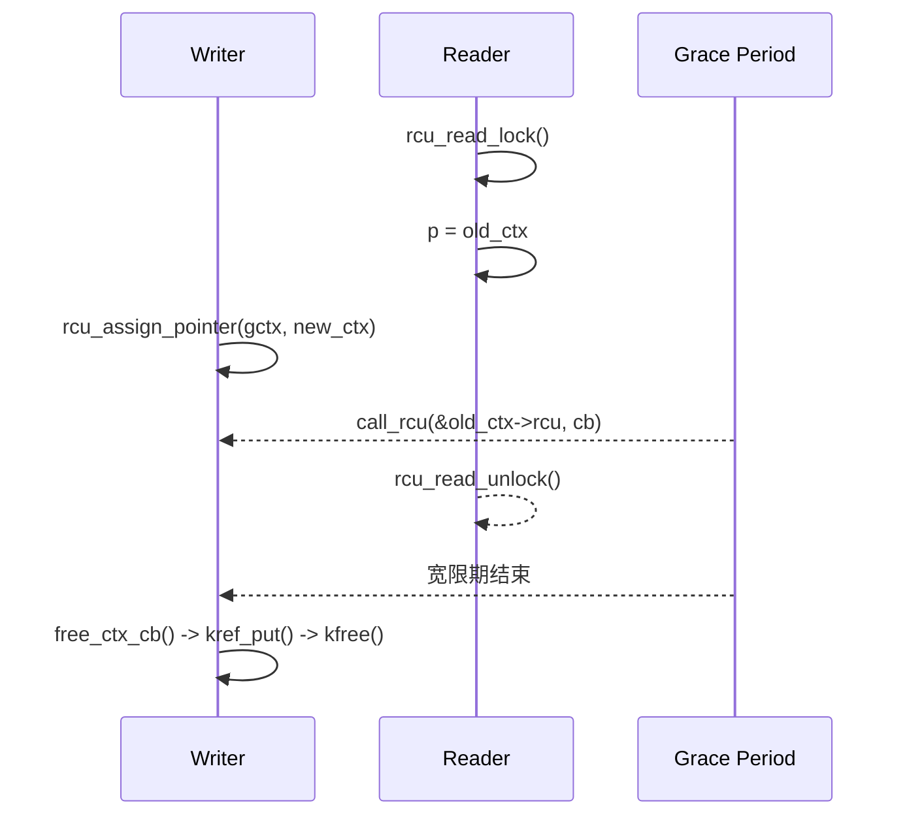

# 第22章\_RCU\_驱动与子系统应用模式

掌握最小模板后，再把同一套生命期规则放进真实驱动场景。本章关注设备链表、状态表和异步销毁中的结构差异，同时观察 RCU 何时必须与更新锁、kref 或卸载同步协作。

## 22.1\_RCU\_在驱动场景中的典型应用模式

#### (1)\_章节内容说明

本节从**开发者视角**出发，展示 RCU 在 Linux 驱动中三类典型场景的应用模式：

1. **设备链表与热插拔** —— 解决“读遍历与写插拔并发”；
2. **设备状态表（open/close/poll）** —— 解决“读频繁、写稀疏”的状态访问；
3. **对象引用与延迟销毁** —— 解决“对象仍被读者访问时不能提前释放”的问题。

所有示例均与平台无关，可直接在内核模块中编译运行。

------

#### (2)\_场景一\_设备链表与热插拔

##### 1)\_问题背景

驱动层往往维护一个设备节点链表：

```c
struct dev_entry {
	struct list_head list;
	struct device *dev;
	int online;
};
```

在设备热插拔或动态加载时：

- **读者**：频繁遍历链表（如 sysfs、监控任务）；
- **写者**：插入或删除节点。

传统锁方案 (`spin_lock`) 在高并发读下竞争严重，而 RCU 提供了**读无锁 + 延迟释放** 的解决方案。

------

##### 2)\_RCU\_化实现

```c
LIST_HEAD(dev_list);
DEFINE_SPINLOCK(dev_lock);

/* 写侧：添加新设备 */
void dev_add(struct device *d)
{
	struct dev_entry *e = kmalloc(sizeof(*e), GFP_KERNEL);
	e->dev = d;
	e->online = 1;

	spin_lock(&dev_lock);
	list_add_rcu(&e->list, &dev_list);
	spin_unlock(&dev_lock);
}

/* 写侧：删除设备（延迟释放） */
void dev_del(struct device *d)
{
	struct dev_entry *e;
	spin_lock(&dev_lock);
	list_for_each_entry_rcu(e, &dev_list, list) {
		if (e->dev == d) {
			list_del_rcu(&e->list);
			spin_unlock(&dev_lock);
			kfree_rcu(e, rcu);  // 延迟释放
			return;
		}
	}
	spin_unlock(&dev_lock);
}

/* 读侧：遍历设备 */
void dev_show_all(void)
{
	struct dev_entry *e;
	rcu_read_lock();
	list_for_each_entry_rcu(e, &dev_list, list)
		pr_info("dev: %s\n", dev_name(e->dev));
	rcu_read_unlock();
}
```

> `[INV]`：读区内禁止修改链表结构。
>  `[MIX]`：写侧仍需自行互斥；读侧不获取传统共享读锁，但仍执行配置相关的生命周期标记和 RCU 指针访问。

------

##### 3)\_机制分析

| 操作     | 安全点                 | 机制                     |
| -------- | ---------------------- | ------------------------ |
| 添加节点 | 加锁串行               | 结构一致                 |
| 删除节点 | RCU 删除 + 延迟释放    | 允许旧读者继续访问已摘除节点而不发生 UAF |
| 遍历     | `rcu_read_lock()` 保护 | 在生命周期保护区内遍历；不自动形成字段快照 |

`list_add_rcu()` / `list_del_rcu()` 与 `list_for_each_entry_rcu()` 实现了完整的 RCU 链表支持。

------

#### (3)\_场景二\_设备状态表(open/close/poll)

##### 1)\_问题背景

设备驱动常维护运行状态，例如：

```c
struct drv_status {
	bool online;
	bool ready;
	bool fault;
};
```

- **读者**：文件操作函数 (`read`, `poll`) 高频访问；
- **写者**：状态变化（如掉电、复位）低频更新。

这种“高读低写”的模式非常适合 RCU。

------

##### 2)\_RCU\_状态表实现

```c
struct drv_status __rcu *gstat;
static DEFINE_MUTEX(status_lock);

/* 写者：更新状态 */
void update_status(bool ready)
{
	struct drv_status *old, *new;

	new = kmalloc(sizeof(*new), GFP_KERNEL);
	if (!new)
		return;

	mutex_lock(&status_lock);
	old = rcu_dereference_protected(gstat,
					lockdep_is_held(&status_lock));
	*new = *old;
	new->ready = ready;
	rcu_assign_pointer(gstat, new);
	mutex_unlock(&status_lock);
	kfree_rcu(old, rcu);  // 宽限期后释放旧状态
}

/* 读者：访问状态 */
ssize_t drv_read(struct file *f, char __user *buf, size_t len, loff_t *off)
{
	struct drv_status *s;
	rcu_read_lock();
	s = rcu_dereference(gstat);
	if (!s->ready) {
		rcu_read_unlock();
		return -EAGAIN;
	}
	rcu_read_unlock();
	return len;
}
```

------

##### 3)\_性能与一致性比较

| 项         | RCU 方案           | 锁方案         |
| ---------- | ------------------ | -------------- |
| 读路径特征 | 不与写者争抢同一把锁 | 可能获取读锁或互斥锁 |
| 写代价 | 创建新版本并安排旧对象回收 | 通常可原地修改 |
| 实际延迟 | 必须通过基准测试 | 必须通过基准测试 |
| 读取模型 | 新旧版本可并存，读者不重试 | 读者取得锁保护的当前状态 |

> 适合：设备状态表、统计计数、策略标志等 **“读多写少”路径**。

------

#### (4)\_场景三\_对象引用与延迟销毁

##### 1)\_问题背景

设备上下文或资源对象常被多个线程同时访问：

- 用户态文件操作；
- 工作队列；
- 中断下半部。

若直接 `kfree()`，可能出现悬空指针。
 RCU + `kref` 是一种安全的“引用 + 延迟释放”组合方案。

------

##### 2)\_RCU\_+\_kref\_实现

```c
struct dev_ctx {
	struct kref ref;
	struct device *dev;
	struct rcu_head rcu;
};

struct dev_ctx __rcu *gctx;
static DEFINE_MUTEX(ctx_lock);

/* 读侧：获取上下文 */
struct dev_ctx *ctx_get(void)
{
	struct dev_ctx *c;
	rcu_read_lock();
	c = rcu_dereference(gctx);
	if (c && !kref_get_unless_zero(&c->ref))
		c = NULL;
	rcu_read_unlock();
	return c;
}

/* 写侧：替换上下文 */
void ctx_replace(struct device *dev)
{
	struct dev_ctx *old, *new;
	new = kzalloc(sizeof(*new), GFP_KERNEL);
	kref_init(&new->ref);
	new->dev = dev;

	mutex_lock(&ctx_lock);
	old = rcu_replace_pointer(gctx, new,
				  lockdep_is_held(&ctx_lock));
	mutex_unlock(&ctx_lock);
	if (old)
		call_rcu(&old->rcu, free_ctx_cb); // GP 后放掉集合持有的引用
}

/* 回调释放 */
void free_ctx_cb(struct rcu_head *head)
{
	struct dev_ctx *ctx = container_of(head, struct dev_ctx, rcu);
	kref_put(&ctx->ref, ctx_release);
}
```

> `[MIX]`：RCU 保护从共享入口查找并尝试增引用的窗口；成功取得的 `kref` 负责离开 RCU 后的长期生命周期。
>  `[INV]`：仅当引用为 0 且宽限期结束时，才真正释放对象。

------

##### 3)\_时序图



------

#### (5)\_混搭矩阵(驱动常见模块)

| 组件               | 是否可与 RCU 混用 | 混用模式                    |
| ------------------ | ----------------- | --------------------------- |
| GPIO / LED 驱动    | ✅                 | 状态表保护                  |
| 网络驱动           | ✅                 | 邻居表 / 路由表             |
| 字符设备           | ✅                 | `file_operations` 状态表    |
| I2C / SPI 子设备表 | ✅                 | 子节点链表                  |
| DMA 缓冲池         | ⚠️                 | 仅控制结构 RCU 化           |
| 中断处理           | ✅                 | `call_rcu()` 安全释放       |
| Block 层           | ⚠️                 | 局部结构可用                |
| Platform Device    | ✅                 | `device_link` 使用 RCU 管理 |

------

#### (6)\_核对表(交付前自检)

| 检查项                | 说明                                  | 状态 |
| --------------------- | ------------------------------------- | ---- |
| [CHECK] 写路径互斥    | 多写需自锁                            | □    |
| [CHECK] 延迟释放      | 是否使用 `call_rcu()` / `kfree_rcu()` | □    |
| [CHECK] 读路径最短    | 快照访问，不睡眠                      | □    |
| [CHECK] SRCU 场景识别 | 可睡读路径迁移至 SRCU                 | □    |
| [CHECK] 回调安全      | 回调中不再访问旧对象                  | □    |

------

#### (7)\_小结

| 要点                                                   | 说明 |
| ------------------------------------------------------ | ---- |
| RCU 是**读侧加速机制**，写侧仍需互斥。                 |      |
| 在驱动开发中，它广泛用于链表、状态表、上下文指针管理。 |      |
| 延迟释放是关键安全点：`call_rcu()` / `kfree_rcu()`。   |      |
| 可与 `kref`、`mutex`、`workqueue` 等安全组合。         |      |
| 适合“读多写少”的路径：状态读取、设备扫描、资源共享。   |      |


------

## 22.2\_本章边界

本章只保留驱动场景中的组合方式，不重复维护通用接口说明。接口契约统一查阅[RCU API 速查](P20_RCU_通用API与调用契约.md)，可直接复用的最小调用链统一查阅[RCU 模板、选型与核对](P21_RCU_数据结构模板与选型.md)。

审查驱动代码时，应把注意力放在场景新增的责任上：写者由谁串行化、对象能否逃出读侧区间、回调是否引用模块代码，以及卸载路径是否阻止了新回调产生。

上一篇：[RCU 模板、选型与核对](P21_RCU_数据结构模板与选型.md)。

下一篇：[RCU 类型语义与 Sparse 检查](P23_RCU_类型语义_Sparse与Lockdep.md)。


