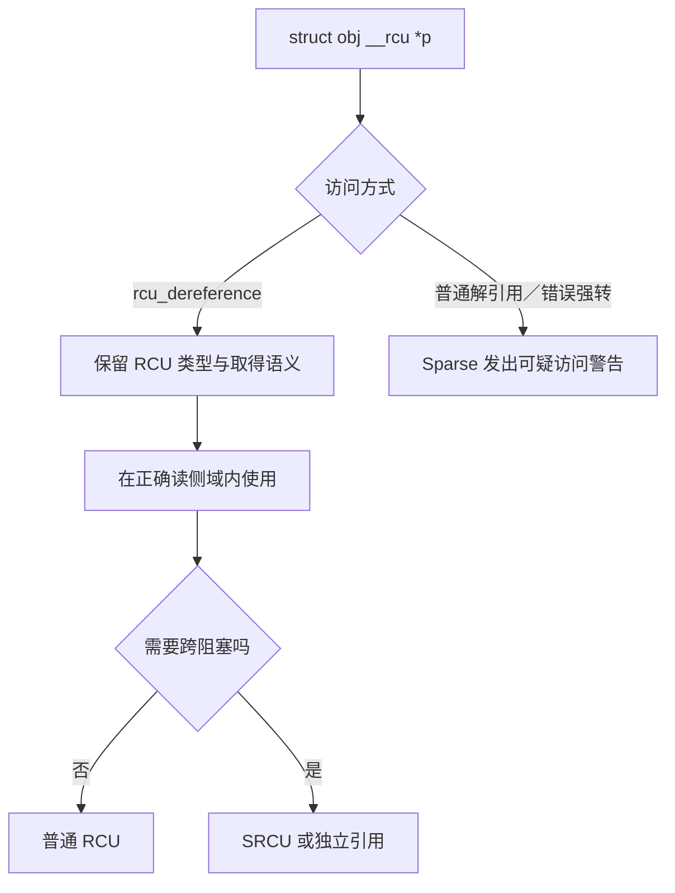

# 第23章\_RCU\_类型语义\_Sparse与\_Lockdep

代码在运行时“看起来能工作”还不够，编译期也应尽量暴露错误的指针取得方式。本章集中讨论 `__rcu` 与 Sparse 类型检查，不再重复 SRCU 的运行机制和接口。



## 23.1\_rcu\_修饰符与\_RCU\_类型语义

#### (1)\_章节内容说明

本节专门讲解 RCU 体系中最容易被忽略、但在编译期极为重要的语义标识符 —— `__rcu`。
 该修饰符并不直接影响运行时性能，而是 RCU 类型安全体系的核心。
 在驱动开发中，若不理解 `__rcu` 的存在与检查机制，很容易误用普通指针访问 RCU 数据，造成潜在的竞态与乱序读写。

------

#### (2)\_rcu\_的定义与属性

在内核头文件 `include/linux/compiler_types.h` 中定义如下：

```c
#define __rcu __attribute__((noderef, address_space(4)))
```

它由两个 GCC 属性组成：

| 属性               | 作用                                                   |
| ------------------ | ------------------------------------------------------ |
| `noderef`          | 禁止直接解引用该指针（即不允许 `*ptr` 访问）           |
| `address_space(4)` | 将其标识为“RCU 管理的指针空间”，不同于普通内核地址空间 |

------

#### (3)\_设计目的与意义

| 目标                 | 说明                                                         |
| -------------------- | ------------------------------------------------------------ |
| **类型区分**         | 区分“普通指针”和“RCU 管理指针”                               |
| **静态检查**         | Sparse 工具可检测错误访问方式                                |
| **接口强制性**       | 迫使开发者通过 `rcu_dereference()` / `rcu_assign_pointer()` 操作 |
| **文档语义化**       | 代码层面显式声明“该对象受 RCU 管理”                          |
| **防止编译优化错误** | 避免编译器跨屏障乱序访问共享内存                             |

简言之，

> `__rcu` 是一种**编译期契约（compile-time contract）**，
>  用于确保 RCU 对象只能以符合内存一致性语义的方式被访问。

------

#### (4)\_典型使用方式

##### 1)\_全局指针定义

```c
struct dev_state {
	int status;
};

/* 全局共享状态指针，受 RCU 管理 */
struct dev_state __rcu *gstate;
```

此时任何直接访问 `gstate` 的行为都将被静态分析工具报告为错误。

------

##### 2)\_正确读写方式

```c
/* 写侧 */
static DEFINE_MUTEX(state_lock);

void update_state(struct dev_state *new)
{
	struct dev_state *old;
	mutex_lock(&state_lock);
	old = rcu_replace_pointer(gstate, new,
				  lockdep_is_held(&state_lock));
	mutex_unlock(&state_lock);
	if (old)
		kfree_rcu(old, rcu);
}

/* 读侧 */
void show_state(void)
{
	struct dev_state *s;
	rcu_read_lock();
	s = rcu_dereference(gstate);
	pr_info("status=%d\n", s->status);
	rcu_read_unlock();
}
```

> `[INV]`：禁止直接 `s = gstate;` 或 `gstate = new;`，否则 Sparse 会发出类型空间警告。
>  `[CHECK]`：`rcu_assign_pointer()` 在当前 6.12.20 的非 `NULL` 常量路径使用 release store；`rcu_dereference()` 提供 `READ_ONCE()`、依赖顺序、编译器约束和检查语义，不能一概说成所有架构上的 acquire load。

------

#### (5)\_Sparse\_静态检查机制

##### 1)\_触发方式

内核编译命令中加入：

```bash
make C=1
```

即启用 Sparse 静态分析。Sparse 会识别 `address_space(4)` 类型的变量，
 当检测到不规范访问时，输出如下警告：

```
warning: incorrect type in assignment (different address spaces)
```

##### 2)\_典型误用示例

```c
struct foo *p = gptr;   // 错误：gptr 为 __rcu 类型
*p = *gptr;             // 错误：直接解引用 __rcu 指针
```

##### 3)\_正确写法

```c
struct foo *p = rcu_dereference(gptr);
```

Sparse 会自动识别并验证该 API 已执行必要的同步屏障。

------

#### (6)\_在驱动开发中的意义

| 使用场景       | 原因                   | 示例                                |
| -------------- | ---------------------- | ----------------------------------- |
| 全局设备状态   | 状态更新频繁，读多写少 | `struct dev_state __rcu *gstate;`   |
| 动态链表头     | 支持并发注册/注销      | `struct list_head __rcu *dev_list;` |
| 子系统配置指针 | 多线程访问配置结构     | `struct config __rcu *cfg;`         |
| 快速路径缓存   | 快速读无锁、写侧替换   | `rcu_assign_pointer(cache, new);`   |

------

#### (7)\_与普通指针的区别

| 项目                 | 普通指针 | `__rcu` 指针                |
| -------------------- | -------- | --------------------------- |
| 编译器属性           | 无       | `noderef, address_space(4)` |
| 可直接解引用         | ✅        | ❌                           |
| 是否强制使用 RCU API | ❌        | ✅                           |
| 是否经过内存屏障     | 否       | 是（由 API 插入）           |
| 是否能被 Sparse 检查 | 否       | 是                          |
| 使用场景             | 普通内存 | RCU 管理共享对象            |

------

#### (8)\_与链表\_/\_哈希封装宏的关系

- `list_for_each_entry_rcu()`、`list_entry_rcu()` 内部会自动封装 `rcu_dereference()`；
- 所以这些宏天然支持 `__rcu` 指针；
- 不需要显式写 `rcu_dereference()`。

##### 1)\_示例

```c
struct dev_node {
	struct list_head list;
	int id;
};

LIST_HEAD(dev_list);

void show_all(void)
{
	struct dev_node *n;
	rcu_read_lock();
	list_for_each_entry_rcu(n, &dev_list, list)
		pr_info("id=%d\n", n->id);
	rcu_read_unlock();
}
```

------

#### (9)\_核对表

| 检查项                                       | 说明              | 状态 |
| -------------------------------------------- | ----------------- | ---- |
| [CHECK] 是否使用 `__rcu` 修饰共享指针        | 强制静态检查      | □    |
| [CHECK] 是否通过 `rcu_dereference()` 读取    | 表达 RCU 取得、依赖顺序与检查契约 | □    |
| [CHECK] 是否通过 `rcu_assign_pointer()` 写入 | 使初始化先于指针发布被观察       | □    |
| [CHECK] 是否启用 Sparse 检查（`make C=1`）   | 静态验证          | □    |
| [CHECK] 是否在链表中使用 RCU 宏族            | 确保类型安全      | □    |

------

#### (10)\_小结

- `__rcu` 是 **RCU 类型体系的编译期保护层**；
- 它不改变运行逻辑，仅提供**类型安全与接口约束**；
- 所有 `__rcu` 指针必须通过 `rcu_dereference()` / `rcu_assign_pointer()` 访问；
- Sparse 静态分析工具会在编译期检测误用；
- 在驱动开发中，任何长期存在的全局共享结构或链表头都应使用 `__rcu` 修饰，
   以明确其数据访问路径受 RCU 机制保护。


------

## 23.2\_Lockdep检查的是运行时保护条件

Sparse 通过 `__rcu` address space 检查类型层面的错误解引用；lockdep 则帮助验证调用点是否处于声明的 RCU 读侧、更新锁或其他允许条件中。`rcu_dereference_check()` 一类接口把“RCU 读侧成立，或者指定更新锁成立”的逻辑条件显式交给检查器。

两者不能证明对象一定存活到读侧之外，也不能替代写者互斥和 GP 后回收协议：**类型正确、保护条件正确和生命周期正确是三层独立检查。**

## 23.3\_本章边界

本章只维护 `__rcu` 类型语义和 Sparse 检查。SRCU 的私有域、双 index、宽限期状态机统一阅读[SRCU 私有域与双 index 运行机制](P18_SRCU_私有域与双_index_状态机.md)，接口统一查阅[RCU API 速查](P20_RCU_通用API与调用契约.md)，驱动场景则放在[RCU 驱动应用模式](P22_RCU_驱动与子系统应用模式.md)。

上一篇：[RCU 驱动应用模式](P22_RCU_驱动与子系统应用模式.md)。

下一篇：[RCU 集成模式与常见误用](P24_RCU_调试验证与集成误用.md)。
