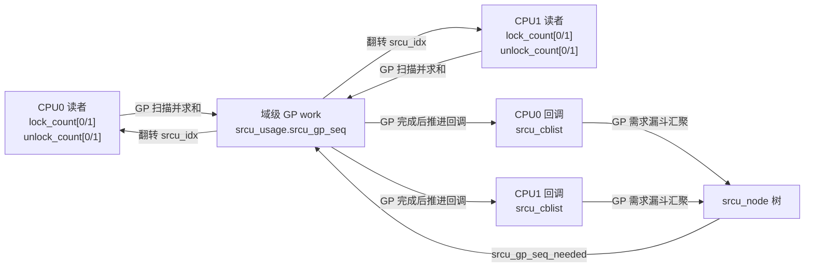
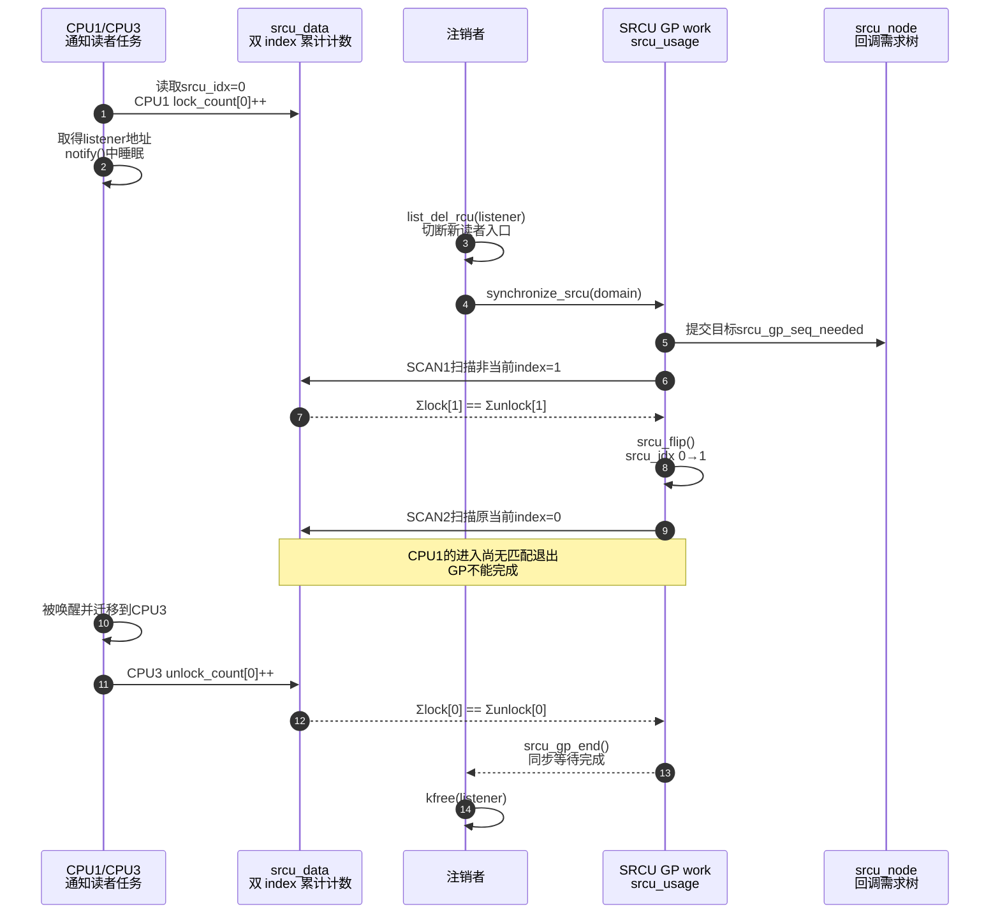

# 第23章\_SRCU\_私有域与双\_index\_状态机

本章从一个可睡眠通知链开始：读者遍历监听器时会调用驱动回调，而回调可能取得 mutex、等待固件或访问可睡眠总线。普通 RCU 的读侧执行约束不能满足这个场景；SRCU 用“私有域 + 双 index 进入/退出计数”重新定义读者和 GP。

## 23.1\_问题场景\_注销监听器时不能释放正在睡眠的回调对象

先定义一个由多个设备共享的通知总线：

```c
struct event_listener {
	struct list_head node;
	void (*notify)(struct event_listener *listener, unsigned long event);
	/* 驱动私有状态，notify() 可能访问它。 */
};

struct event_bus {
	struct srcu_struct srcu;
	struct list_head listeners;
	struct mutex update_lock;
};
```

读者不是简单复制几个整数，而是取得 `event_listener` 的地址并调用它。`notify()` 允许睡眠：

```c
static void event_bus_notify(struct event_bus *bus, unsigned long event)
{
	struct event_listener *listener;
	int idx;

	idx = srcu_read_lock(&bus->srcu);
	list_for_each_entry_rcu(listener, &bus->listeners, node,
				srcu_read_lock_held(&bus->srcu))
		listener->notify(listener, event); /* 允许主动阻塞。 */
	srcu_read_unlock(&bus->srcu, idx);
}
```

示例中的第四个条件告诉 RCU list 的 lockdep 检查：这里由指定的 SRCU 域而非普通 `rcu_read_lock()` 提供生命期保护。

注册和注销由 mutex 串行化；注销先切断可达性，再等待旧 SRCU 读者，最后释放：

```c
static void event_bus_register(struct event_bus *bus,
			       struct event_listener *listener)
{
	mutex_lock(&bus->update_lock);
	list_add_tail_rcu(&listener->node, &bus->listeners);
	mutex_unlock(&bus->update_lock);
}

static void event_bus_unregister(struct event_bus *bus,
				 struct event_listener *listener)
{
	mutex_lock(&bus->update_lock);
	list_del_rcu(&listener->node);
	mutex_unlock(&bus->update_lock);

	/* 必须在 update_lock 之外等待，旧 notify() 可能间接需要该锁。 */
	synchronize_srcu(&bus->srcu);
	kfree(listener);
}
```

初始化和销毁也属于生命周期协议：

```c
static int event_bus_init(struct event_bus *bus)
{
	INIT_LIST_HEAD(&bus->listeners);
	mutex_init(&bus->update_lock);
	return init_srcu_struct(&bus->srcu);
}

static void event_bus_destroy(struct event_bus *bus)
{
	/* 调用者先保证没有监听器、读者、更新者和待处理回调。 */
	cleanup_srcu_struct(&bus->srcu);
}
```

不能把 `synchronize_srcu()` 换成 `synchronize_rcu()`：后者等待普通 RCU 域，完全不知道这个 `srcu_struct` 中的进入/退出计数。

## 23.2\_参与者和状态所有权

Tree SRCU 不是一个原子计数器，而是一组正交状态：

| 层次 | Linux 6.12.20 字段 | 谁写 | 谁读 | 含义 |
| --- | --- | --- | --- | --- |
| 域入口 | `srcu_struct.srcu_idx` | GP 工作 | 新读者 | 当前进入哪一组计数 |
| 每 CPU 读侧 | `srcu_data.srcu_lock_count[2]` | `__srcu_read_lock()` | GP 扫描 | 各 index 的累计进入次数 |
| 每 CPU 读侧 | `srcu_data.srcu_unlock_count[2]` | `__srcu_read_unlock()` | GP 扫描 | 各 index 的累计退出次数 |
| 每 CPU 更新侧 | `srcu_data.srcu_cblist`、`srcu_gp_seq_needed` | `call_srcu()` 路径 | SRCU work | 本 CPU 回调和需要推进到的 GP |
| 汇聚节点 | `srcu_node.srcu_have_cbs[]`、`srcu_data_have_cbs[]` | 漏斗提交与回调路径 | GP/work | 哪些子节点或 CPU 有特定 GP 的回调 |
| 域级更新侧 | `srcu_usage.srcu_gp_seq`、`srcu_gp_seq_needed` | GP/work | 请求者、轮询者 | 域的 GP 状态与目标 |
| 串行化 | `srcu_usage.srcu_gp_mutex` | GP/work | GP/work | 串行化双 index 扫描 |

特别注意：`srcu_node` 主要汇聚 **回调的 GP 需求和归属**，不是将读者计数逐层写进树。普通读者是否仍存在，最终由所有 `srcu_data` 中同一 index 的累计 lock 与 unlock 总和是否相等来判断。



## 23.3\_读者为什么能睡眠和迁移

Linux 6.12.20 的核心读侧实现是：

```c
idx = READ_ONCE(ssp->srcu_idx) & 0x1;
this_cpu_inc(ssp->sda->srcu_lock_count[idx].counter);
smp_mb();
return idx;
```

退出不是对原 CPU 的同一原子变量做减法，而是在 **当前 CPU** 增加累计退出次数：

```c
smp_mb();
this_cpu_inc(ssp->sda->srcu_unlock_count[idx].counter);
```

所以任务可以出现下面的执行：

```text
CPU1：lock_count[0] += 1
        ↓ 任务睡眠并迁移
CPU3：unlock_count[0] += 1
```

GP 扫描的是全 CPU 求和：

```text
Σ lock_count[index] == Σ unlock_count[index]
```

相等才表示该 index 没有未退出读者。SRCU 不要求退出发生在进入时的 CPU，但必须满足：

- lock/unlock 使用同一个 `srcu_struct`；
- unlock 使用 lock 返回的原 `idx`；
- 普通 `srcu_read_lock()` 与 unlock 在同一执行上下文配对，不能让 IRQ 或另一个任务代为 unlock。

## 23.4\_为什么一组计数不够

若只有一组计数，旧读者和更新后不断到来的新读者会混在一起。在高频通知负载下，计数可能长期不归零；更新者无法只等待“删除之前已经进入”的读者。

两个 index 把这个问题拆成两个阶段。Linux 6.12.20 的 `srcu_gp_seq` 低位状态为：

```text
SRCU_STATE_IDLE → SRCU_STATE_SCAN1 → SRCU_STATE_SCAN2 → IDLE
```

完整周期统一记为 S0～S5：

| 阶段 | 触发与状态 | 扫描对象 | 证明 |
| --- | --- | --- | --- |
| S0 发布 | `list_del_rcu()` 切断旧 listener 的可达性 | 无 | 新遍历不再获得该 listener |
| S1 请求 | `call_srcu()` 或同步等待提交 `srcu_gp_seq_needed` | 回调需求经 `srcu_node` 漏斗汇聚 | 有 GP 必须启动 |
| S2 SCAN1 | `srcu_gp_start()` 令序列进入 `SRCU_STATE_SCAN1` | `1 ^ (srcu_idx & 1)`，即当前非活动 index | 排除可能滞后使用上一轮 index 的读者 |
| S3 翻转 | `srcu_flip()` 增加 `srcu_idx` | 新读者从此选择另一 index | 原当前 index 成为稳定排空组 |
| S4 SCAN2 | 再取 `1 ^ (srcu_idx & 1)` | 翻转前的当前 index | 删除前可能存在的旧读者已退出 |
| S5 完成 | `srcu_gp_end()` 完成序列并调度回调 | 已满足目标序列的回调 | 同步等待者或异步回调可继续 |

第一遍扫描不能省略。源码注释明确指出：读者可能读到 `srcu_idx` 后被长时间延迟，尚未来得及增加对应计数，因此任意时刻两组都可能残留读者。SCAN1 先清空非当前组，配合内存屏障后才能安全翻转；SCAN2 再排空原当前组。

## 23.5\_完整时序\_睡眠读者怎样阻止释放



这里没有“读者主动通知注销者”这条直接通道。unlock 写本 CPU 累计计数，GP work 重试扫描所有 CPU 的总数；回调需求和 GP 目标则经 `srcu_node`/域级状态传播。这就是 SRCU 的通信成本落点。

## 23.6\_同步等待和异步回调

`call_srcu()` 调用 `__call_srcu()` 把回调加入 `srcu_data.srcu_cblist`，再由 `srcu_gp_start_if_needed()` 提交 GP 需求。`srcu_funnel_gp_start()` 将分散需求沿 `srcu_node` 向根部汇聚。

`synchronize_srcu()` 最终也要把一个唤醒动作关联到 SRCU GP 并等待完成，但 Linux 6.12 还有 idle heuristic 和 expedited 分支，不能把源码机械压缩成永远固定的一条调用链：

```text
synchronize_srcu()
    ├─ srcu_might_be_idle() 或全局 expedited
    │      → synchronize_srcu_expedited()
    └─ 普通情况
           → __synchronize_srcu(ssp, true)
```

共同语义不变：调用返回前，同一域中在调用前开始的 SRCU 读侧已经结束。

## 23.7\_死锁与生命周期错误

### 23.7.1\_在同一域读侧等待自己

```c
idx = srcu_read_lock(&bus->srcu);
synchronize_srcu(&bus->srcu); /* 错误：当前任务就是被等待的读者。 */
srcu_read_unlock(&bus->srcu, idx);
```

间接等待同样错误：读者等待 mutex，而 mutex 持有者正在执行 `synchronize_srcu()`。

### 23.7.2\_用错域或用错index

```c
idx = srcu_read_lock(&bus_a.srcu);
/* ... */
srcu_read_unlock(&bus_b.srcu, idx); /* 错误：bus_a 的债务永不归还。 */
```

传错 index 会让一组出现多余 lock、另一组出现多余 unlock，GP 可能永久等待或破坏计数假设。

### 23.7.3\_只等GP却遗漏已排队回调

与普通 RCU 相同，`synchronize_srcu()` 等待旧读者，不等价于“此前所有 `call_srcu()` 回调已经执行”。销毁域之前还要按 API 契约处理 `srcu_barrier()`、工作项和所有使用者，再调用 `cleanup_srcu_struct()`。

## 23.8\_成本与选择边界

| 维度 | 普通 Tree RCU | Tree SRCU |
| --- | --- | --- |
| 读者高频状态写入 | 极少；主要是执行约束和必要慢路径 | 每次进入/退出都更新域的每 CPU 计数 |
| 主动阻塞 | 普通读侧禁止 | 允许 |
| 迁移 | 按普通 RCU 配置语义处理 | 允许；全 CPU 累计进入/退出可配平 |
| 等待范围 | 系统普通 RCU 域 | 指定 `srcu_struct` 私有域 |
| GP 判定 | CPU QS/EQS + 必要的任务债务 | 双 index 的两阶段全 CPU 计数扫描 |
| 扩展性状态 | `rcu_node.qsmask` 汇聚 QS | `srcu_node` 汇聚回调需求；读计数仍在 `srcu_data` |

选择结论不是“SRCU 更高级”，而是：只有读者确实要睡眠，或必须隔离成私有域时，额外的进入/退出记账和 GP 扫描才值得。对只读几项字段就退出的高频路径，普通 RCU 通常更合适。

## 23.9\_Linux\_6.12.20源码证据

- [`include/linux/srcu.h`](../../../../research/source_reading/linux/include/linux/srcu.h)：读侧接口、同域等待禁令和上下文配对契约。
- [`include/linux/srcutree.h`](../../../../research/source_reading/linux/include/linux/srcutree.h)：`srcu_struct`、`srcu_data`、`srcu_node`、`srcu_usage` 和 `SRCU_STATE_*`。
- [`kernel/rcu/srcutree.c`](../../../../research/source_reading/linux/kernel/rcu/srcutree.c)：`__srcu_read_lock()`、`__srcu_read_unlock()`、`srcu_flip()`、`srcu_advance_state()`、`srcu_gp_start()`、`srcu_gp_end()`、`call_srcu()` 与 `synchronize_srcu()`。
- 版本模块入口：[Linux 6.12 Tree SRCU 模块源码概念导读](../../../../research/source_reading/rcu/navigation/P07_Linux_6.12_Tree_SRCU模块源码概念导读.md#7.1_先分清Tree_RCU与Tree_SRCU)。
- 唯一函数实现：[Linux 6.12 Tree SRCU 源码实现](../../../../research/source_reading/rcu/source_explanations/P11_Linux_6.12_Tree_SRCU源码实现.md#11.2_源码符号覆盖账本)。其中 [reader 累计账本与扫描](../../../../research/source_reading/rcu/source_explanations/P11_Linux_6.12_Tree_SRCU源码实现.md#11.4_reader进入退出写的是累计账本)、[双扫描 GP](../../../../research/source_reading/rcu/source_explanations/P11_Linux_6.12_Tree_SRCU源码实现.md#11.6_双扫描GP状态机怎样推进)和 [同步/barrier 交付](../../../../research/source_reading/rcu/source_explanations/P11_Linux_6.12_Tree_SRCU源码实现.md#11.9_synchronize_srcu怎样把异步callback变成同步等待)分别展开这里使用的实现结论。

上一篇：[RCU 实现家族与内核配置](P22_RCU_实现家族与内核配置.md)。

下一篇：[Tasks RCU 与 Tiny RCU 实现边界](P24_Tasks_RCU与Tiny_RCU实现边界.md)。
