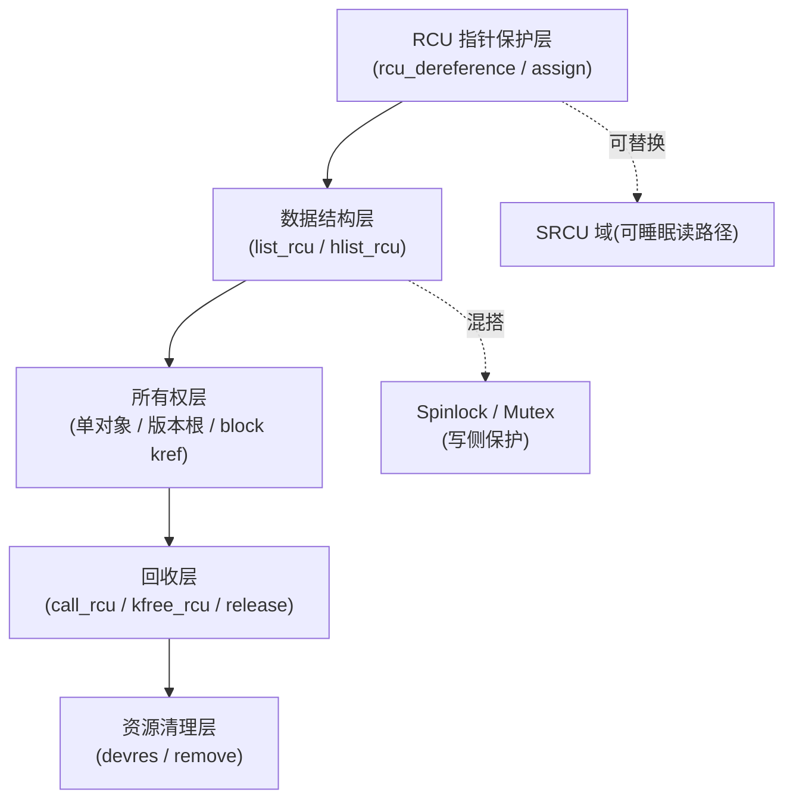

# 第24章\_RCU\_调试验证与集成误用

RCU 很少孤立存在：写者仍可能需要锁，对象离开读侧区间后可能需要引用计数，工作队列和模块卸载又引入新的生命期。本章从组合关系检查正确性，不再重复基础 API。

## 24.1\_先判断是哪条状态链停滞

调试 RCU 不能只搜索“谁调用了 `synchronize_rcu()`”。应先区分：GP 是否未完成、回调是否已经成熟但未执行、nocb 线程是否未运行，还是对象在取消发布前后违反了生命周期协议。

| 现象 | 优先检查 |
| --- | --- |
| RCU stall | 未报告 CPU、被抢占旧任务、长时间关中断、GP kthread调度 |
| 回调积压 | `rcu_segcblist` 分段、RCU core/nocb CB kthread、批处理限流 |
| `rcu_barrier()` 久等 | 各 CPU 回调、nocb bypass、CPU hotplug/迁移 |
| UAF | 取消发布与最终释放之间是否真正经过对应 GP |

Linux 6.12.20 可结合 `kernel/rcu/tree_stall.h` 的 stall 输出、RCU tracepoint、lockdep/Sparse 报告和 `kernel/rcu/rcutorture.c` 的压力模型定位。`rcutorture` 用来验证实现和配置组合，不替代具体业务对象生命周期测试。

## 24.2\_RCU\_机制在驱动中的集成模式与常见误用

#### (1)\_章节内容说明

RCU 在驱动中极具价值：

- 读路径无锁、性能高；
- 写路径同步、可控；
- 延迟释放、避免悬空访问。

但由于它与 spinlock/mutex、工作队列、引用计数等机制可交叉使用，
 许多开发者误以为“RCU 就是万能同步”，从而引入隐性竞态或死锁。

本节通过“混搭矩阵 + 禁配对照表 + 模式整合图”，
 梳理驱动开发中 **RCU 与其它机制的可组合边界、禁区与正确搭配模式**。

------

#### (2)\_RCU\_混搭矩阵(驱动开发通用)

| 搭配机制                | 是否可混用       | 说明                                  | 替代建议                 |
| ----------------------- | ---------------- | ------------------------------------- | ------------------------ |
| **spinlock**            | ✅ 可混用（写侧） | 在写侧加锁保护更新；读侧用 RCU        | RCU 读 + spin 写         |
| **mutex**               | ⚠️ 谨慎           | 不可在普通 RCU 读区内执行可能睡眠的加锁       | 将阻塞阶段移出读区或改用 SRCU |
| **rw_semaphore**        | ⚠️ 谨慎           | 可用于更新侧或分层保护；不得在普通 RCU 读区内获取可能睡眠的锁 | 按临界区边界拆分                 |
| **workqueue**           | ✅ | 短小且不阻塞的保护区可用普通 RCU；必须跨阻塞时用 SRCU | 按临界区行为选择 |
| **threaded IRQ**        | ✅ | 上下文可睡不等于保护区必然睡眠 | 按临界区行为选择 |
| **completion**          | ⚠️ 慎用           | completion 可能睡眠                   | SRCU 或同步点后触发      |
| **waitqueue**           | ⚠️ 分层使用 | 不得在普通 RCU 读区内睡眠等待 | 先取得独立引用并退出 RCU，或使用 SRCU |
| **refcount/kref**       | ✅ 可组合 | RCU 证明临时访问结束，kref 统计对象所有者；先后顺序由所有权拓扑决定 | 统一到对象 release 或 root 退休回调 |
| **devres（devm 系列）** | ✅ 可共存         | RCU 控制访问，devres 控制清理         | 分层管理                 |
| **timer/hrtimer**       | ✅ 可用普通 RCU | 回调中不可调用阻塞等待接口 | 读侧保持短小 |

> `[INV]`：如果 RCU 保护范围必须跨越主动阻塞操作，使用 SRCU，或先在普通 RCU 内取得独立引用再退出。
>  `[MIX]`：RCU 提供发布—取得契约和读侧临时生命期，不自动保证对象字段或复合业务状态一致。

------

#### (3)\_禁配对照表

| 错误组合                                   | 后果             | 正确替代                               |
| ------------------------------------------ | ---------------- | -------------------------------------- |
| 在普通 RCU 读区中执行可能睡眠的 `mutex_lock()` | 违反读侧上下文约束并可能触发调度问题 | 将加锁移出读区或使用 SRCU |
| 在中断上下文中使用 `synchronize_rcu()`     | 阻塞导致软锁死   | 改用 `call_rcu()` 异步延迟释放         |
| 写侧未加锁直接更新指针                     | 并发覆盖导致脏读 | `spin_lock()` + `rcu_assign_pointer()` |
| 删除节点后立即 `kfree()`                   | 读者悬空访问     | 使用 `kfree_rcu()` 或 `call_rcu()`     |
| 复合旧 root 刚取消发布就归还全部 block 引用 | 旧 reader 沿 root 访问已释放 block | 等 root 的 GP 后再逐块 put |
| 查询 `kref_read()==0` 后另走手工释放路径 | 与最后 put/release 竞态，可能 UAF 或 double-free | 只让最后一次 put 进入唯一 release |
| 混用不同 SRCU 域                           | 永不退出宽限期   | 保证域一致性                           |
| 工作队列在普通 RCU 读区内执行阻塞操作 | 临界区不能按普通 Tree RCU 规则推进 | 缩短读区、先取得引用，或使用 SRCU |

------

#### (4)\_驱动中常见集成模式

| 模式                                  | 结构关系                              | 特点                    |
| ------------------------------------- | ------------------------------------- | ----------------------- |
| **模式①：RCU + Spinlock（经典组合）** | RCU 读无锁，写加自旋锁                | 读多写少场景的常见候选        |
| **模式②：单个 RCU 对象 + kref** | RCU 保护 lookup，kref 保护逃逸对象 | 最后 put 后再安排 GP，或让发布引用跨 GP |
| **模式③：RCU root + 多个 kref block** | root 定义一代快照并持有各 block | root 的 GP 后逐块归还引用 |
| **模式④：SRCU + 工作队列**            | 可睡眠读路径 + 延迟回收               | 异步任务安全读共享状态  |
| **模式⑤：RCU + 链表宏族**             | 使用 `list_for_each_entry_rcu()`      | 结构化访问，防错率低    |
| **模式⑥：RCU + Devm 资源**            | 仅在 remove 前先取消发布并排空相关读者/回调时可用 | devm 不理解 RCU GP，不能让其自动释放仍可被读者访问的资源 |

------

#### (5)\_单对象与复合快照不能共用一条固定顺序

```c
struct drv_obj {
	struct kref ref;
	struct rcu_head rcu;
	int id;
};

void drv_obj_release(struct kref *r)
{
	struct drv_obj *o = container_of(r, struct drv_obj, ref);
	kfree_rcu(o, rcu);   /* 同一对象：最后 put 后等待 GP */
}

void drv_obj_put(struct drv_obj *o)
{
	kref_put(&o->ref, drv_obj_release);
}
```

上面只适用于 `drv_obj` 本身既是 RCU 可见对象又是 kref 对象。若 RCU 直接发布的是一个版本根，根下面挂着多个 kref block，则应反过来：

```c
static void root_retire_rcu(struct rcu_head *rcu)
{
	struct version_root *root;
	unsigned int i;

	root = container_of(rcu, struct version_root, rcu);
	for (i = 0; i < root->nr_blocks; i++)
		block_put(root->blocks[i]); /* GP 后才归还根的块引用 */
	kfree(root);
}
```

若审查时只看到“RCU + kref”几个名词，却没有看到入口、版本根、block 和长期用户之间的所有权边，就不能判断代码应当使用哪一种顺序。权威模板见[RCU 数据结构模板与选型](P21_RCU_数据结构模板与选型.md)。

------

#### (6)\_RCU\_集成架构图



> `[CHECK]`：
>
> - RCU 层负责 **发布—取得和临时访问生命期**，
> - Spinlock 层负责 **写侧互斥性**，
> - 所有权层负责区分根引用、块引用和逃逸引用，
> - Devm 层负责 **设备资源清理**。

------

#### (7)\_调试与验证要点

| 工具 / 文件                       | 作用                |
| --------------------------------- | ------------------- |
| `/sys/kernel/debug/rcu`           | RCU 调试状态与统计  |
| `/proc/lockdep_chains`            | 检查锁依赖死锁      |
| `CONFIG_PROVE_RCU=y`              | 启用运行期 RCU 检查 |
| `CONFIG_DEBUG_OBJECTS_RCU_HEAD=y` | 检查错误释放对象    |
| `CONFIG_TORTURE_TEST_RCU`         | 压力测试 RCU 机制   |

> `[CHECK]`：驱动调试阶段可暂时启用 `CONFIG_PROVE_RCU` 验证 API 使用正确性。

------

#### (8)\_核对表(RCU\_集成层)

| 检查项                         | 说明                                    | 状态 |
| ------------------------------ | --------------------------------------- | ---- |
| [CHECK] 保护区是否必须跨越主动阻塞？ | 若是，使用 SRCU 或改为引用交接 | □ |
| [CHECK] 写侧是否仍加锁？       | 否则无法保证指针完整性                  | □    |
| [CHECK] 删除路径是否按所有权图延迟释放？ | 单对象可用 `kfree_rcu()`；复合根在 GP 后逐块 put | □ |
| [CHECK] 对象是单分配还是复合根？ | 决定 kref 与 GP 的自然顺序 | □ |
| [CHECK] 旧 root 何时归还 block？ | 必须在该 root 的 GP 完成后 | □ |
| [CHECK] 是否误用同步函数？     | 中断中不可 `synchronize_rcu()`          | □    |
| [CHECK] 卸载清理顺序正确？ | 先取消发布并阻止新回调，必要时再用 `rcu_barrier()` 等已排队回调 | □ |

------

#### (9)\_小结

- RCU 并非“替代锁”，其核心是发布—取得、读侧生命周期保护与 GP 后回收；它不自动保证对象字段的一致快照；
- 存在多个写者或复合结构不变量时，写路径必须另行串行化；读侧不获取传统共享读锁，但仍有配置相关状态操作；
- SRCU 解决可睡眠读路径问题；
- RCU 与 Kref/Devm/Spinlock 是协同关系，但组合顺序必须从对象所有权拓扑推出；
- 开发者必须在“可见性、一致性、生命周期”三层上分别控制；
- 只有模块可能留下指向本模块代码的已排队 RCU 回调时，卸载路径才需要 `rcu_barrier()`；不应无条件添加。

------

上一篇：[RCU 类型语义与 Sparse 检查](P23_RCU_类型语义_Sparse与Lockdep.md)。

下一篇：[RCU 内存序与使用边界复盘](P25_RCU_内存序_误用与选择边界.md)。


