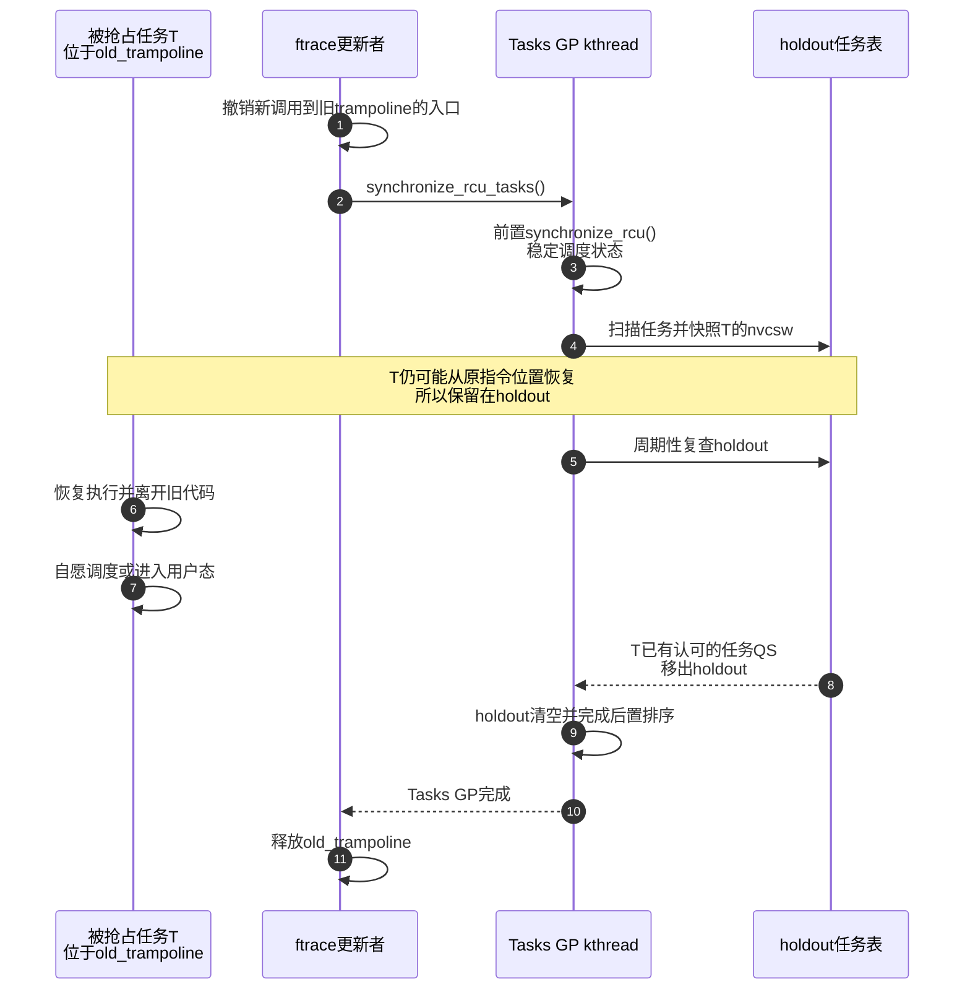
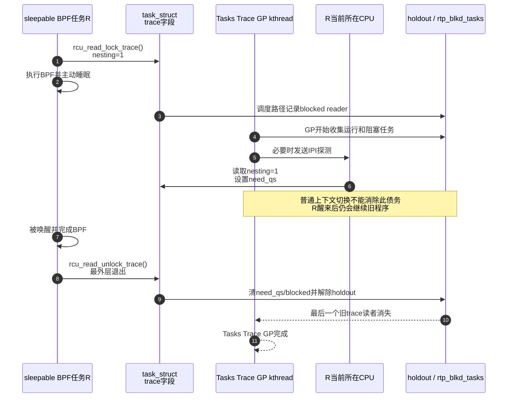
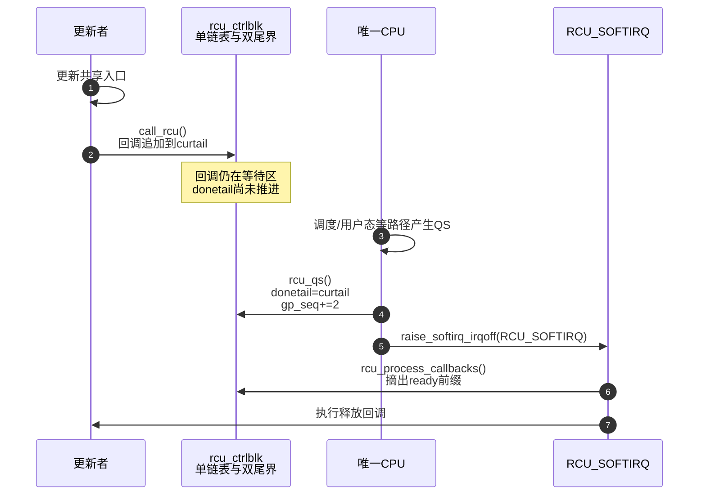

# 第24章\_Tasks\_RCU与Tiny\_RCU实现边界


## 24.1\_Tasks\_RCU与\_Tiny\_RCU实现边界

Tasks RCU 和 Tiny RCU 常被放在“其他种类”中一笔带过，但它们解决的是两个完全不同的问题：Tasks 家族重定义 **要等待的执行轨迹**，Tiny 则在单 CPU 构建中简化 **普通 RCU 的实现**。本章分别用 ftrace/BPF 代码回收和单 CPU 配置发布两个场景还原它们。

### 24.1.1\_场景一\_为什么修改函数入口不能只等普通RCU对象读者

假设 ftrace 注销一个 trampoline。更新者已经阻止新的调用进入旧 trampoline，但某个任务可能已经把程序计数器推进到那段机器码中：

```text
CPU1上的任务T：已经进入old_trampoline的几条汇编指令
CPU0上的更新者：撤销入口 → 等待 → 释放trampoline镜像
```

旧执行现场不是“通过 `rcu_dereference()` 取得对象的普通 RCU 读者”。如果只等待普通 Tree RCU，CPU 提交的普通 QS 未必等价于“所有任务都已经离开可被改写的函数前导/跳板代码”。

Linux 6.12.20 的 `kernel/trace/ftrace.c` 在释放相关 trampoline 前调用：

```c
synchronize_rcu_tasks();
ftrace_trampoline_free(ops);
```

源码注释给出的原因很具体：一个任务可能在 trampoline 中被抢占；仅让每个 CPU 调度过一个任务并不足够，必须等待那些既有任务自己发生自愿调度或进入用户态等认可边界。

### 24.1.2\_Tasks\_RCU没有显式读锁\_它怎样定义读者

经典 Tasks RCU 不提供与 `rcu_read_lock()` 对称的读侧标记。它把既有内核执行片段视为跨越以下任一边界后结束：

- 自愿上下文切换；
- `cond_resched_tasks_rcu_qs()`；
- 进入用户态；
- 进入 idle。

因此它必须在 GP 时枚举任务，而不是依靠调用点显式登记。Linux 6.12.20 的 `rcu_tasks_wait_gp()` 使用 flavor 函数指针组织同一条阶段链：

| 阶段 | 函数 | 状态/动作 | 为什么需要 |
| --- | --- | --- | --- |
| T0 前置排序 | `rcu_tasks_pregp_step()` | `synchronize_rcu()` | 等待既有 `on_rq`、`nvcsw` 转换稳定 |
| T1 扫任务 | `for_each_process_thread()` → `rcu_tasks_pertask()` | pin 任务、快照 `nvcsw`、加入 holdouts | 建立“GP 开始时可能仍在旧代码”的保守集合 |
| T2 补退出竞态 | `rcu_tasks_postscan()` | 汇合已经从全局任务表移除、但尚在退出路径中的任务 | 防止任务消失于扫描视野 |
| T3 反复复查 | `check_all_holdout_tasks()` | 检查 `on_rq`、自愿切换计数和任务状态 | 从 holdouts 删除已有证明的任务 |
| T4 后置排序 | `rcu_tasks_postgp()` | 再执行普通 RCU 排序 | 让调度字段转换先于 GP 完成可见 |

关键任务字段位于 `task_struct`：

```c
unsigned long    rcu_tasks_nvcsw;
u8               rcu_tasks_holdout;
struct list_head rcu_tasks_holdout_list;
struct list_head rcu_tasks_exit_list;
```

`rcu_tasks_nvcsw` 保存扫描时的自愿切换快照，`rcu_tasks_holdout` 与链表项保存该任务仍欠当前 GP 证明的共享状态。`struct rcu_tasks` 则保存 flavor 的 GP kthread、回调队列、GP 状态和函数指针。



这也解释了为什么 Tasks RCU 的 GP 可能很长：一个长期在内核中运行且不自愿调度的任务可以持续成为 holdout。它不是普通对象查表的通用高频替代品。

### 24.1.3\_排队但尚未运行的任务是否要等待

边界仍与普通 RCU 相同：更新者先撤销旧入口。一个尚未运行、程序计数器从未进入旧 trampoline 的任务，以后只能沿更新后的入口执行，不拥有旧执行现场。

Tasks RCU 扫描任务表是保守实现手段，不代表每个扫描到的任务都一定执行过旧代码。它建立的是“哪些既有任务还没有给出足以排除旧执行现场的任务 QS”，随后逐项消债。

### 24.1.4\_Tasks\_Rude\_用强制调度边界换简单证明

Tasks Rude 不逐任务等待自愿切换。Linux 6.12.20 的 `rcu_tasks_rude_wait_gp()` 直接：

```c
schedule_on_each_cpu(rcu_tasks_be_rude);
```

这会向所有在线 CPU 推动调度工作，包括 idle CPU。每个 CPU 发生上下文切换后，旧的不可抢占执行片段不可能仍在该 CPU 上跨越此边界。

它的取舍很直白：

- 证明链短，能够主动推动所有在线 CPU；
- 代价是广泛 IPI 和本来不需要的上下文切换；
- 因而只供少数内核内部路径使用，不是应用作者看见“等待慢”就应替换的接口。

### 24.1.5\_场景二\_sleepable\_BPF为什么需要\_Tasks\_Trace

sleepable BPF 程序可能在 trampoline 调用期间阻塞。普通 Tasks RCU 没有显式读侧标记，而“任务发生自愿切换”在这里恰恰不能表示读者结束：任务睡眠后醒来仍会继续执行 BPF 程序。

Linux 的调用路径因此显式标记 trace 读侧：

```c
rcu_read_lock_trace();
migrate_disable();

/* 执行可能 fault 或睡眠的 BPF 程序。 */
run_sleepable_bpf_program(prog, ctx);

migrate_enable();
rcu_read_unlock_trace();
```

回收与之配对：

```c
call_rcu_tasks_trace(&prog->aux->rcu, free_old_bpf_prog);
/* 或在允许阻塞的更新路径使用 synchronize_rcu_tasks_trace()。 */
```

这段简化代码对应 `kernel/bpf/trampoline.c` 的真实组织方式；具体对象有时还需普通 RCU、percpu ref 和 Tasks RCU 多段回收，不能因为 Tasks Trace 已完成就自动推导其他生命周期域也完成。

### 24.1.6\_Tasks\_Trace的状态怎样从任务传播给GP线程

读者快路径写当前 `task_struct`：

```text
rcu_read_lock_trace()
    → current->trc_reader_nesting++

rcu_read_unlock_trace()
    → nesting--
    → 若存在special债务，调用rcu_read_unlock_trace_special()
```

重要字段包括：

| 字段 | 所有者 | 含义 |
| --- | --- | --- |
| `task_struct.trc_reader_nesting` | 任务 | trace 读侧嵌套；大于零表示读侧仍存在 |
| `task_struct.trc_reader_special.b.need_qs` | 任务/GP探测路径共享 | GP 已要求该任务在最外层退出时还债 |
| `task_struct.trc_reader_special.b.blocked` | 任务/调度路径共享 | 被阻塞读者已进入每 CPU blocked list |
| `task_struct.trc_blkd_node`、`trc_blkd_cpu` | 任务 | 链表节点与记录归属 CPU |
| `rcu_tasks_percpu.rtp_blkd_tasks` | 每 CPU | 已阻塞 trace 读者列表 |
| `struct rcu_tasks` 的 holdout/GP 状态 | flavor 全局 | 扫描集合、GP kthread 与回调推进 |

GP 的 `rcu_tasks_trace_pregp_step()` 在 CPU hotplug 读锁下收集当前运行任务和已阻塞读者。对难以稳定检查的远端运行任务，`trc_wait_for_one_reader()` 可以经 `smp_call_function_single()` 发送 IPI，`trc_read_check_handler()` 在目标 CPU 上读取 nesting：

- nesting 为零：标记已经检查，可从 holdout 移除；
- nesting 大于零：把 `need_qs` 置位，使最外层 unlock 执行特殊清债；
- 正在跨越进入/退出过渡：稍后重试，不能猜测已安全。



Tasks Trace 的“读者可睡眠”与 SRCU 表面相似，但状态域不同：SRCU 等指定 `srcu_struct` 的计数；Tasks Trace 等 tracing/BPF 定义的任务执行区间。不能互换等待函数。

### 24.1.7\_场景三\_同一份普通RCU代码在单CPU内核中怎样运行

假设一个很小的单 CPU 控制器内核发布配置对象：

```c
struct tiny_cfg {
	u32 mode;
	struct rcu_head rcu;
};

static struct tiny_cfg __rcu *active_cfg;

static u32 read_mode(void)
{
	struct tiny_cfg *p;
	u32 mode = 0;

	rcu_read_lock();
	p = rcu_dereference(active_cfg);
	if (p)
		mode = p->mode;
	rcu_read_unlock();
	return mode;
}

static void replace_cfg(struct tiny_cfg *new)
{
	struct tiny_cfg *old;

	old = rcu_replace_pointer(active_cfg, new, true);
	if (old)
		call_rcu(&old->rcu, free_cfg_rcu);
}
```

源码不需要出现 `tiny_*` API。构建条件 `SMP=n && PREEMPT_RCU=n` 使 `CONFIG_TINY_RCU=y`，公共接口链接到 `kernel/rcu/tiny.c`。

### 24.1.8\_Tiny没有树\_但仍有回调状态边界

Linux 6.12.20 用一个全局 `rcu_ctrlblk`：

```c
struct rcu_ctrlblk {
	struct rcu_head *rcucblist;
	struct rcu_head **donetail;
	struct rcu_head **curtail;
	unsigned long gp_seq;
};
```

它是一条链表加两个尾边界：

- `curtail` 指向全部已排队回调的末端；
- `donetail` 把已经历 QS、允许执行的前缀与仍等待的后缀分开；
- `gp_seq` 给轮询接口保存 GP 进度。

`call_rcu()` 在关本地中断的区间把回调追加到 `curtail`。唯一 CPU 的 `rcu_qs()` 执行时，若还有未成熟回调，就令 `donetail = curtail`，把当前全部待等待回调划为可执行，并触发 `RCU_SOFTIRQ`。`rcu_process_callbacks()` 再摘走 ready 前缀并逐个调用。



只有一个 CPU 时不需要：

- 为多个 CPU 保存 `rcu_data`；
- 用 `rcu_node.qsmask` 汇聚分散证明；
- 向远端 CPU 发送催促 IPI。

但它没有取消“发布之后等待旧读者边界再执行回调”的语义。

### 24.1.9\_为什么Tiny的同步等待看起来几乎什么也不做

Tiny RCU 的 `synchronize_rcu()` 在禁止抢占的短区间把 `gp_seq` 增加 2，没有像 Tree RCU 那样睡眠等待 GP 线程。

证明不是“单 CPU 所以没有并发”，而是：

1. Tiny RCU 配置是非抢占式单 CPU；
2. 在普通 RCU 读侧内调用 `synchronize_rcu()` 本来就是非法的；
3. 合法调用正在 process context 运行，意味着唯一 CPU 此刻不可能同时还运行另一个旧普通 RCU 读侧；
4. 因而这个调用现场本身已经足以跨过先前读者，函数只需推进供轮询 API 观察的序列。

异步 `call_rcu()` 仍不能立即调用回调，因为当前 CPU 可能正从某些原子或中断执行现场排队；它继续等待下一次 `rcu_qs()` 把队列边界推进。

### 24.1.10\_不能互换的等待域

```c
/* 错误一：用普通RCU GP回收sleepable BPF读者访问的对象。 */
rcu_assign_pointer(prog_slot, new_prog);
synchronize_rcu();
kfree(old_prog); /* 若旧访问由Tasks Trace保护，普通GP证据不够。 */

/* 错误二：把Tasks RCU当成普通对象查表的读锁。 */
synchronize_rcu_tasks(); /* 没有替调用者建立普通RCU发布/访问协议。 */
```

正确性来自同一协议的配对：

```text
普通rcu_read_lock()       ↔ synchronize_rcu()/call_rcu()
srcu_read_lock(domain)    ↔ synchronize_srcu(domain)/call_srcu(domain)
rcu_read_lock_trace()     ↔ synchronize_rcu_tasks_trace()/call_rcu_tasks_trace()
隐式Tasks执行区间         ↔ synchronize_rcu_tasks()/call_rcu_tasks()
```

Tiny 只是第一行协议在单 CPU 构建中的底层实现，不新增一套应用可见保护域。

### 24.1.11\_Linux\_6.12.20源码证据与选择表

| 问题 | 源码入口 |
| --- | --- |
| Tasks 通用 GP kthread 和回调 | `kernel/rcu/tasks.h`：`struct rcu_tasks`、`rcu_tasks_kthread()`、`rcu_tasks_one_gp()` |
| Tasks 扫描/holdout | `rcu_tasks_wait_gp()`、`rcu_tasks_pregp_step()`、`check_all_holdout_tasks()` |
| Tasks Rude | `rcu_tasks_rude_wait_gp()` |
| Tasks Trace 读侧和探测 | `include/linux/rcupdate_trace.h`；`trc_wait_for_one_reader()`、`trc_read_check_handler()` |
| 真实 ftrace 使用 | `kernel/trace/ftrace.c`：释放 trampoline 前的 `synchronize_rcu_tasks()` |
| 真实 BPF 使用 | `kernel/bpf/trampoline.c`：trace 读侧与 `call_rcu_tasks_trace()` |
| Tiny 普通 RCU | `kernel/rcu/tiny.c`：`rcu_ctrlblk`、`rcu_qs()`、`call_rcu()`、`rcu_process_callbacks()` |

RCU 源码材料的分类和建议顺序见 [Linux 6.12 Tree RCU 与 SRCU 源码导读](../../../../research/source_reading/rcu/navigation/P01_Linux_6.12_Tree_RCU_与_SRCU_源码导读.md#1.9_建议的源码阅读顺序)；本章对应的子功能、模块边界、调用链和字段归纳见 [Linux 6.12 Tasks RCU 与 Tiny RCU 模块源码概念导读](../../../../research/source_reading/rcu/navigation/P04_Linux_6.12_Tasks_RCU与Tiny_RCU模块源码概念导读.md#4.1_Linux_6.12_Tasks_RCU与_Tiny_RCU模块源码概念导读)。

最终选择时只问三组问题：

1. 保护的是数据对象，还是正在执行的代码轨迹？
2. 读侧是否允许主动睡眠；若允许，它属于私有 SRCU 域还是 Tasks Trace 契约？
3. Tree/Tiny 是目标内核配置已经决定的实现，还是你误把它当成了调用点选择？

上一篇：[SRCU 私有域与双 index 状态机](P23_SRCU_私有域与双_index_状态机.md)。

下一篇：[RCU 驱动与子系统应用模式](P25_RCU_驱动与子系统应用模式.md)。
