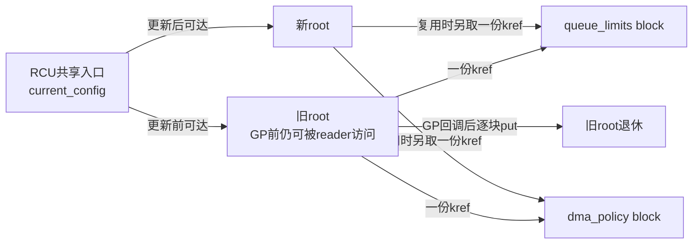
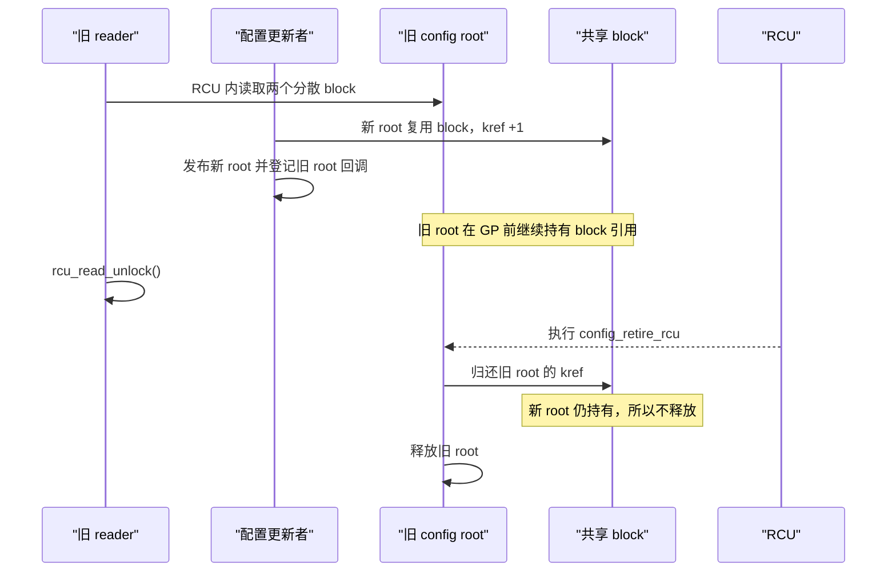

# 第25章\_RCU\_驱动与子系统应用模式

掌握最小模板后，再把同一套生命期规则放进真实驱动场景。本章关注设备链表、状态表和异步销毁中的结构差异，同时观察 RCU 何时必须与更新锁、kref 或卸载同步协作。

## 25.1\_RCU\_在驱动场景中的典型应用模式

### 25.1.1\_本章固定的四类场景

本节从 **开发者视角** 出发，展示 RCU 在 Linux 驱动中四类典型场景的应用模式：

1. **设备链表与热插拔** —— 解决“读遍历与写插拔并发”；
2. **设备状态表（open/close/poll）** —— 解决“读频繁、写稀疏”的状态访问；
3. **单对象引用与延迟销毁** —— 解决“对象逃出 RCU 读区后仍需存活”的问题；
4. **复合配置快照** —— 解决“一代旧照由多个可共享分散块组成”的逐层退休问题。

示例只表达平台无关的生命期骨架；错误处理、模块初始化和具体业务字段需要按实际驱动补齐。

------

### 25.1.2\_场景一\_设备链表与热插拔

#### (1)\_问题背景

驱动层往往维护一个设备节点链表：

```c
struct dev_entry {
	struct list_head list;
	struct rcu_head rcu;
	struct device *dev;
	int online;
};
```

在设备热插拔或动态加载时：

- **读者**：频繁遍历链表（如 sysfs、监控任务）；
- **写者**：插入或删除节点。

若读者也取得同一把 `spin_lock`，每个 CPU 的遍历都会写锁缓存行；CPU 越多、遍历越频繁，这条缓存行越频繁在 CPU 间转移。RCU 的改变是让普通遍历不写这把共享更新锁，把跨 CPU 通信推迟到删除后的 GP。代价是节点不能立即释放，写者仍须串行化链表修改。

------

#### (2)\_RCU\_化实现

```c
LIST_HEAD(dev_list);
DEFINE_SPINLOCK(dev_lock);

/* 写侧：添加新设备 */
void dev_add(struct device *d)
{
	struct dev_entry *e = kmalloc(sizeof(*e), GFP_KERNEL);

	if (!e)
		return;
	e->dev = d;
	e->online = 1;

	spin_lock(&dev_lock);
	list_add_rcu(&e->list, &dev_list);
	spin_unlock(&dev_lock);
}

/* 写侧：删除设备（延迟释放） */
void dev_del(struct device *d)
{
	struct dev_entry *e;
	spin_lock(&dev_lock);
	list_for_each_entry(e, &dev_list, list) {
		if (e->dev == d) {
			list_del_rcu(&e->list);
			spin_unlock(&dev_lock);
			kfree_rcu(e, rcu);  // 延迟释放
			return;
		}
	}
	spin_unlock(&dev_lock);
}

/* 读侧：遍历设备 */
void dev_show_all(void)
{
	struct dev_entry *e;
	rcu_read_lock();
	list_for_each_entry_rcu(e, &dev_list, list)
		pr_info("dev: %s\n", dev_name(e->dev));
	rcu_read_unlock();
}
```

这个最小示例只回收 `dev_entry` 节点，并假定节点中的 `struct device *` 在对应 GP 结束前仍然有效。实际驱动若不能从设备核心的注销顺序得到该保证，节点还必须为设备取得独立引用，并在允许执行设备 release 的后续上下文中归还；RCU 只保护链表节点，不会自动延长被节点指向的设备生命期。

> `[INV]`：读区内禁止修改链表结构。
>  `[MIX]`：写侧仍需自行互斥；读侧不获取传统共享读锁，但仍执行配置相关的生命周期标记和 RCU 指针访问。

------

#### (3)\_机制分析

| 操作     | 安全点                 | 机制                     |
| -------- | ---------------------- | ------------------------ |
| 添加节点 | 加锁串行               | 结构一致                 |
| 删除节点 | RCU 删除 + 延迟释放    | 允许旧读者继续访问已摘除节点而不发生 UAF |
| 遍历     | `rcu_read_lock()` 保护 | 在生命周期保护区内遍历；不自动形成字段快照 |

`list_add_rcu()` / `list_del_rcu()` 与 `list_for_each_entry_rcu()` 实现了完整的 RCU 链表支持。

------

### 25.1.3\_场景二\_设备状态表(open/close/poll)

#### (1)\_问题背景

设备驱动常维护运行状态，例如：

```c
struct drv_status {
	struct rcu_head rcu;
	bool online;
	bool ready;
	bool fault;
};
```

- **读者**：文件操作函数 (`read`, `poll`) 高频访问；
- **写者**：状态变化（如掉电、复位）低频更新。

这种“高读低写”的模式非常适合 RCU。

------

#### (2)\_RCU\_状态表实现

```c
struct drv_status __rcu *gstat;
static DEFINE_MUTEX(status_lock);

/* 写者：更新状态 */
void update_status(bool ready)
{
	struct drv_status *old, *new;

	new = kmalloc(sizeof(*new), GFP_KERNEL);
	if (!new)
		return;

	mutex_lock(&status_lock);
	old = rcu_dereference_protected(gstat,
					lockdep_is_held(&status_lock));
	new->online = old ? old->online : false;
	new->fault = old ? old->fault : false;
	new->ready = ready;
	rcu_assign_pointer(gstat, new);
	mutex_unlock(&status_lock);
	if (old)
		kfree_rcu(old, rcu);  /* 宽限期后释放旧状态 */
}

/* 读者：访问状态 */
ssize_t drv_read(struct file *f, char __user *buf, size_t len, loff_t *off)
{
	struct drv_status *s;
	rcu_read_lock();
	s = rcu_dereference(gstat);
	if (!s || !s->ready) {
		rcu_read_unlock();
		return -EAGAIN;
	}
	rcu_read_unlock();
	return len;
}
```

------

#### (3)\_性能与一致性比较

| 项         | RCU 方案           | 锁方案         |
| ---------- | ------------------ | -------------- |
| 读路径特征 | 不与写者争抢同一把锁 | 可能获取读锁或互斥锁 |
| 写代价 | 创建新版本并安排旧对象回收 | 通常可原地修改 |
| 实际延迟 | 必须通过基准测试 | 必须通过基准测试 |
| 读取模型 | 新旧版本可并存，读者不重试 | 读者取得锁保护的当前状态 |

> 适合：设备状态表、统计计数、策略标志等 **“读多写少”路径**。

------

### 25.1.4\_场景三\_单个设备上下文被带出\_RCU\_读区

设备上下文可能先从全局入口查到，再交给工作队列或文件实例长期使用。此时共享入口直接指向同一个 `dev_ctx` 分配，kref 统计的也是对这个对象本身的长期持有。

```c
struct dev_ctx {
	struct kref ref;
	struct rcu_head rcu;
	struct device *dev;
};

static struct dev_ctx __rcu *gctx;
static DEFINE_MUTEX(ctx_lock);

static void ctx_release(struct kref *ref)
{
	struct dev_ctx *ctx;

	ctx = container_of(ref, struct dev_ctx, ref);
	kfree_rcu(ctx, rcu);
}

static struct dev_ctx *ctx_get(void)
{
	struct dev_ctx *ctx;

	rcu_read_lock();
	ctx = rcu_dereference(gctx);
	if (ctx && !kref_get_unless_zero(&ctx->ref))
		ctx = NULL;
	rcu_read_unlock();

	return ctx;
}

static void ctx_put(struct dev_ctx *ctx)
{
	kref_put(&ctx->ref, ctx_release);
}

static void ctx_replace(struct dev_ctx *new)
{
	struct dev_ctx *old;

	mutex_lock(&ctx_lock);
	old = rcu_replace_pointer(gctx, new,
				  lockdep_is_held(&ctx_lock));
	mutex_unlock(&ctx_lock);

	if (old)
		ctx_put(old);       /* 归还共享入口持有的初始引用 */
}
```

新对象在发布前用 `kref_init()` 建立一份属于共享入口的初始引用。旧对象最后一个 put 调用 `ctx_release()`，但 release 不直接 `kfree()`，而是用 `kfree_rcu()` 等待仍可能拿着临时裸指针的 lookup reader。这里的唯一释放链是：

```text
最后一个 dev_ctx kref_put
    -> ctx_release
        -> kfree_rcu
            -> GP 后释放 dev_ctx
```

### 25.1.5\_场景四\_一代设备配置由多个分散块组成

设备配置可能不是一个连续结构，而是一个根节点组合队列限制、DMA 策略和过滤表等独立分配。不同代配置还可能共享未变化的 block：

```c
struct config_block {
	struct kref ref;
	unsigned long value;
};

struct dev_config {
	struct rcu_head rcu;
	struct config_block *queue_limits;
	struct config_block *dma_policy;
};

static struct dev_config __rcu *current_config;
static DEFINE_MUTEX(config_lock);
```

示例假设 block 发布后不再原地修改；若 `value` 仍会变化，需要另外使用锁、原子操作或替换整个 block。

每个 `dev_config` 为自己的两个 block 各持有一份 kref。新版本复用旧 block 时，在发布前为新根增加一份引用；旧根只在 GP 后归还自己的引用：

```c
static struct dev_config *config_clone(struct dev_config *old)
{
	struct dev_config *new;

	lockdep_assert_held(&config_lock);
	new = kzalloc(sizeof(*new), GFP_KERNEL);
	if (!new)
		return NULL;
	if (!old)
		return new;

	/* 新root在发布以前就取得自己对两个block的版本引用。 */
	if (old->queue_limits) {
		kref_get(&old->queue_limits->ref);
		new->queue_limits = old->queue_limits;
	}
	if (old->dma_policy) {
		kref_get(&old->dma_policy->ref);
		new->dma_policy = old->dma_policy;
	}
	return new;
}
```

`config_clone()` 返回的新 root 尚不可见，所以失败清理可以直接逐块 put；一旦发布，root 对 block 的引用就必须一直保留到该 root 自己的 GP 回调。

```c
static void config_block_release(struct kref *ref)
{
	struct config_block *block;

	block = container_of(ref, struct config_block, ref);
	kfree(block);
}

static void config_retire_rcu(struct rcu_head *rcu)
{
	struct dev_config *config;

	config = container_of(rcu, struct dev_config, rcu);
	if (config->queue_limits)
		kref_put(&config->queue_limits->ref, config_block_release);
	if (config->dma_policy)
		kref_put(&config->dma_policy->ref, config_block_release);
	kfree(config);
}

static void config_publish(struct dev_config *new)
{
	struct dev_config *old;

	mutex_lock(&config_lock);
	old = rcu_replace_pointer(current_config, new,
				  lockdep_is_held(&config_lock));
	mutex_unlock(&config_lock);

	if (old)
		call_rcu(&old->rcu, config_retire_rcu);
}
```

普通短 reader 只需借用根已经持有的 block 引用：

```c
static void read_current_config(void)
{
	struct dev_config *config;

	rcu_read_lock();
	config = rcu_dereference(current_config);
	if (config) {
		use_queue_limits(config->queue_limits);
		use_dma_policy(config->dma_policy);
	}
	rcu_read_unlock();
}
```

`use_queue_limits()` 和 `use_dma_policy()` 在这个模板中必须只做不阻塞、且不保存裸指针的短访问。reader 不需要每次读取都对两个 block 执行 get／put；只有某个 block 要交给异步任务并逃出 RCU 读区时，reader 才在临界区内为该 block 增加自己的长期引用。





这类复合快照的顺序是“GP 后逐块 put”，与上一场景的“最后 put 后 `kfree_rcu()`”不同。详细所有权不变量和逃逸 block 模板统一见 [RCU、kref 与复合对象生命周期](P04_RCU_kref与复合对象生命周期.md)。

### 25.1.6\_按问题特征选择组合

| 问题特征 | RCU负责 | 还需要的机制 |
| --- | --- | --- |
| 高频查找、低频插拔的节点表 | 查找期间节点生命期、删除后延迟回收 | 更新锁串行化结构修改 |
| 整体替换且发布后不变的状态 | 允许读者看到任一完整版本 | 更新锁；发布前完整初始化 |
| 对象要交给文件或工作队列长期使用 | 只保护 lookup 到安全 get 的窗口 | kref/refcount 保护逃逸生命期 |
| root 组合多个可共享 block | 保护旧 root 到 GP | root 对每块持 kref；GP 后逐块 put |
| 读侧必须等待 I/O 或 mutex | 普通 RCU 不适用该跨度 | SRCU，或先取得引用再退出普通 RCU |
| DMA 描述符/设备资源还受硬件访问 | 只能保护 CPU 软件入口的一部分 | DMA 停止、IRQ 同步、设备核心引用等硬件/框架协议 |

------

### 25.1.7\_交付前核对表

| 检查项                | 说明                                  | 状态 |
| --------------------- | ------------------------------------- | ---- |
| [CHECK] 写路径互斥    | 多写需自锁                            | □    |
| [CHECK] 延迟释放      | 是否使用 `call_rcu()` / `kfree_rcu()` | □    |
| [CHECK] 读路径最短    | 快照访问，不睡眠                      | □    |
| [CHECK] SRCU 场景识别 | 可睡读路径迁移至 SRCU                 | □    |
| [CHECK] 回调安全      | 回调中不再访问旧对象                  | □    |
| [CHECK] 复合快照所有权 | 旧 root 是否保持每个 block 到 GP 后 | □ |
| [CHECK] 逃逸子块引用 | 带出 RCU 前是否取得 block 独立引用 | □ |

------

### 25.1.8\_小结

| 要点                                                   | 说明 |
| ------------------------------------------------------ | ---- |
| RCU 是 **读侧加速机制**，写侧仍需互斥。                 |      |
| 在驱动开发中，它广泛用于链表、状态表、上下文指针管理。 |      |
| 延迟释放是关键安全点：`call_rcu()` / `kfree_rcu()`。   |      |
| 可与 `kref`、`mutex`、`workqueue` 等安全组合。         |      |
| 适合“读多写少”的路径：状态读取、设备扫描、资源共享。   |      |
| 单对象和“root + 多 block”必须使用不同的所有权模板。 | |


------

## 25.2\_本章边界

本章只保留驱动场景中的组合方式，不重复维护通用接口说明。接口契约统一查阅[RCU API 速查](P03_RCU_通用API与最小使用闭环.md)，可直接复用的最小调用链统一查阅[RCU 模板、选型与核对](P04_RCU_kref与复合对象生命周期.md)。

审查驱动代码时，应把注意力放在场景新增的责任上：写者由谁串行化、对象能否逃出读侧区间、版本根与分散 block 之间各由谁持有引用、GP 前后在哪一层归还引用、回调是否引用模块代码，以及卸载路径是否阻止了新回调产生。

上一篇：[Tasks RCU 与 Tiny RCU 实现边界](P24_Tasks_RCU与Tiny_RCU实现边界.md)。

下一篇：[RCU 类型语义、Sparse 与 Lockdep](P26_RCU_类型语义_Sparse与Lockdep.md)。


