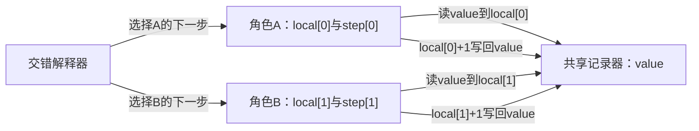
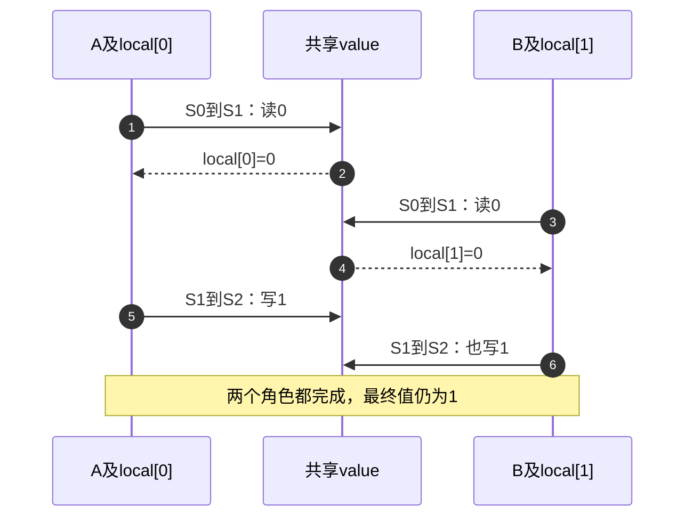

# 第1章\_同一对象的多条执行路径

上一阶段已经解决对象由谁持有、何时可以释放。现在保留对象，让两个使用者各记一次事件。计数从0开始，两次加一以后理应是2；如果对象一直活着，却只留下1，生命周期协议并没有违约。我们还缺少对 **访问过程** 的约束。

本章只要求能够读懂C的结构体、数组和函数调用。先用一个确定性的程序还原丢失更新，再追问两条路径如何交错、等待者能否让出处理器。这里先建立选择问题，不提前要求你认识每一种内核锁。

## 1.1\_先把一次加一拆开

假设一个事件记录器只有一个共享计数。角色A和B都要把它加一。先建立一个有意简化的机器：读取和写回各算一步，每步不可再分，所有角色看到同一个最新共享值，不考虑编译器变换和硬件乱序。

一次更新先读取共享值到自己的暂存，再把暂存加一写回。即使在这个比真实硬件更友好的模型里，两次更新也可能互相覆盖。



图中“读”箭头表示谁发起访问；数据从value复制到各自local。local不是第二份公共计数，而是本次更新据以计算的旧快照。两个角色的操作周期分别有三个阶段，组合在一起才构成全局状态。

| 阶段 | 进入和写入 | 下一步谁读取 | 已能保证与尚未保证 |
| --- | --- | --- | --- |
| S0待执行 | 解释器把该角色step初始化为0 | 解释器选择尚未执行的角色 | 没有读值，也没有更新 |
| S1持快照 | 该角色把value复制到自己的local，step变1 | 同一角色后续计算读local | 快照记录过去，不能保证共享值没变 |
| S2已写回 | 该角色将local+1写入value，step变2 | 另一角色或最终观察者读取value | 该次写回完成，但可能覆盖另一更新 |



问题发生在“读到旧值”与“提交新值”之间。B没有把A的新值再加一，而是把自己的旧快照加一写回。把变量改大、让对象多活一会儿，甚至承诺每次读写都完整，也没有消除这个窗口。

## 1.2\_运行所有允许的交错

不必先让两个真实线程竞争，再靠运行次数碰到错误。下面用单线程解释器列出两角色、各两步的全部交错。这样C程序本身没有数据竞争；若直接写两个线程并发修改普通C整数，触发的是语言层未定义行为，不能把偶尔观察到1或2当作其完整结果集合。

程序还有一个guarded模式。owner为-1表示无人占有；角色读取前先成为拥有者，写回以后放弃。解释器拒绝让另一角色在这段期间前进。它只表达互斥规则，**不是实际可并发使用的锁实现**；真实锁还必须解决原子竞争、内存顺序和等待方式。

```c
/* C11单线程交错解释器：不制造C数据竞争，也不实现Linux锁。 */
#include <assert.h>
#include <stdbool.h>
#include <stdio.h>

struct model {
    unsigned int value;
    unsigned int local[2];
    unsigned int step[2];
    int owner;
    char trace[5];
};
struct results {
    unsigned int paths, lost;
};

static void explore(struct model state, bool guarded,
                    struct results *results)
{
    unsigned int depth = state.step[0] + state.step[1];
    if (depth == 4) {
        ++results->paths;
        results->lost += state.value != 2;
        assert(state.owner == -1);
        printf("%s %s => %u\n", guarded ? "guarded" : "plain",
               state.trace, state.value);
        return;
    }
    for (int actor = 0; actor < 2; ++actor) {
        if (state.step[actor] == 2)
            continue;
        if (guarded && state.owner != -1 && state.owner != actor)
            continue; /* 解释器不让另一个角色进入该临界区。 */
        struct model next = state; /* 分支各持一份状态，避免互相污染。 */
        next.trace[depth] = (char)('A' + actor);
        next.trace[depth + 1] = '\0';
        if (next.step[actor] == 0) {
            if (guarded)
                next.owner = actor;
            next.local[actor] = next.value; /* 第一步：读到私有暂存。 */
        } else {
            next.value = next.local[actor] + 1; /* 第二步：计算并写回。 */
            if (guarded)
                next.owner = -1;
        }
        ++next.step[actor];
        explore(next, guarded, results);
    }
}

int main(void)
{
    struct model initial = { .owner = -1 };
    struct results plain = {0}, guarded = {0};
    explore(initial, false, &plain);
    explore(initial, true, &guarded);
    assert(plain.paths == 6 && plain.lost == 4);
    assert(guarded.paths == 2 && guarded.lost == 0);
    printf("plain: %u paths, %u lost; guarded: %u paths, %u lost\n",
           plain.paths, plain.lost, guarded.paths, guarded.lost);
    return 0;
}
```

把程序保存为interleaving.c，或者从仓库根目录编译[同名材料](../../../labs/kernel/synchronization/materials/interleaving.c)：

```bash
cc -std=c11 -Wall -Wextra -Werror -O2 \
  labs/kernel/synchronization/materials/interleaving.c -o /tmp/interleaving
/tmp/interleaving
```

需要普通C11编译器，不需要装载模块或访问设备。程序不修改外部数据；可执行文件在临时目录中，实验后可删除。

explore每次挑一个尚未完成的角色推进一步，再递归探索余下步骤；next复制当前结构体，因此一条分支写回的值不会污染另一分支。四步都执行以后才统计一次完整轨迹。输出用四个字母记录选择顺序，同一个字母第一次出现是读、第二次是写；例如AABB表示A读写完毕后B再读写，ABAB则表示两者先后读取，再先后写回。先按这个规则预测下面的结果。

```text
plain AABB => 2
plain ABAB => 1
plain ABBA => 1
plain BAAB => 1
plain BABA => 1
plain BBAA => 2
guarded AABB => 2
guarded BBAA => 2
plain: 6 paths, 4 lost; guarded: 2 paths, 0 lost
```

同一个字母第一次出现表示读，第二次表示写，因此ABBA也是丢失更新：A先读0，B读0再写1，最后A再写1。结果中的4/6不是现实故障概率；解释器只是枚举合法排列，没有模拟调度概率、缓存、时间或负载。

守住从读到写的整个区间后，只剩AABB和BBAA。我们把需要保持不可交错效果的区间叫 **临界区**，把“同一时刻只准一个参与者进入”的约束叫 **互斥**。代价也很具体：B必须推迟进入，无法与A同时更新这份状态。锁不是越大越好，扩大保护区会把本来互不依赖的工作也排成一队；缩得太小又会重现旧快照覆盖。

本实验枚举了自己定义的全部八条轨迹，尚未检验任何内核锁。真实实现必须让owner的争夺本身也不可被两个角色同时赢得，不能照抄“先读owner再赋值”的普通C代码。

## 1.3\_只有一个处理器也会交错

处理器（Central Processing Unit，CPU）是执行指令的角色。一条任务执行路径运行到中途，系统可以保存它的位置，让另一任务先运行，然后再恢复。任务的完成时间重叠、执行步骤可以交错，称为并发；两颗CPU在同一时刻各执行一路，是并行。丢失更新需要交错窗口，并不要求真正同时执行两条指令。

在可发生任务切换的窗口，单CPU可以按“A读、切到B、B读写、切回A、A写”运行。另一种来源是中断：设备请求到达后，处理器转去执行处理函数，结束必要处理后再继续被打断的路径。若处理函数也更新同一对象，它就是需要加入协议的另一个访问者。

同一CPU上有任务切换、硬中断等不同来源，另一CPU还可能独立运行。禁止其中一种来源，不会自动禁止其余来源。例如禁止本地任务抢占不能排除硬中断；关闭本地可屏蔽中断不能阻止远端CPU访问。不可屏蔽事件也不能被普通关中断接口一概覆盖。选择机制以前，应画出 **所有可能读写同一状态的路径**。

这里给出的是可能发生的交错，具体窗口受内核配置和调用环境限制。不能据此断言所有内核C语句之间都会切换任务；非抢占内核也不能因此省略对中断、显式调度点和其他CPU的分析。

## 1.4\_等待不是只有一种办法

如果A还占有临界区，B暂时不能继续。一种办法是反复检查能否取得资格，称为自旋；另一种办法是登记等待，让调度器暂时不运行自己，等条件变化再恢复，称为睡眠等待。这里的睡眠不是整颗CPU停机，也不是固定延时，其他可运行任务可以继续利用它。

自旋省去一次完整睡眠与唤醒交接，短临界区可能适合它；但占用执行时间，持有者迟迟不释放时，等得越久浪费越多。睡眠需要保存等待关系、安排唤醒和重新调度，适合允许阻塞且等待可能较长的路径。实际原语可能把快速尝试、自旋和睡眠组合起来；此处比较基本责任，不预测每次加锁一定发生哪条慢路径。

更严重的情形发生在同一CPU上：任务A持着严格自旋锁，被硬中断H打断；H去自旋等待同一把锁。A只有在H返回后才能继续释放，H却等A先释放才返回。再快的CPU也无法完成这个循环。


因此跨CPU互斥和本地重入控制是两项问题。对适用的非实时内核路径，持锁前保存并关闭本地硬中断、释放后恢复原状态，可以避免该类本地打断；同时仍需要锁排除远端竞争。保护范围要覆盖检查、修改和必要恢复，不能在已经持锁被打断以后才补关中断。

## 1.5\_先辨认当前路径再选择接口

执行上下文指当前代码怎样被调用、能否由调度器作为独立任务暂停，以及已经持有什么限制。普通系统调用或内核线程属于任务上下文；硬中断处理借用了被打断CPU的执行现场，不能把自己当普通任务随意睡眠。可延后处理的软中断也有自己的接口限制，不能因为碰巧在某个线程中执行，就擅自给原本不可睡的回调加入阻塞操作。

任务上下文只是允许考虑睡眠的起点。进入禁止抢占区、关闭本地中断，或持有严格自旋锁以后，可能睡眠的调用仍不合法；即使完全可睡，拿着完成者也需要的锁等待它，也会死锁。`current`存在、函数名字里有thread、一次测试没有报错，都不足以代替调用契约。

| 已确定的现场 | 继续追问的问题 | 后续入口 |
| --- | --- | --- |
| 普通可阻塞任务之间共享状态 | 临界区是否允许睡眠、等待时间是否可控 | [可睡互斥](synchronization/locks/P02_互斥锁与读写信号量.md) |
| 与真正硬中断共享短状态 | 哪条任务路径会被本地处理函数重入、是否还有远端竞争 | [自旋锁](synchronization/locks/P01_自旋锁.md) |
| 等另一个操作完成 | 完成状态在哪里、如何登记等待、谁发布并唤醒 | [等待与完成量](synchronization/waiting_notification/大纲.md) |
| 事件现场不能完成全部工作 | 交给谁执行、交付期间谁持对象、怎样取消和排空 | [工作队列](asynchrony/workqueue/大纲.md) |

Linux的实时抢占配置PREEMPT_RT会改变普通spinlock_t的实现与部分执行上下文，不能把上述“严格自旋”一概套到它。raw_spinlock_t保留严格自旋责任，普通spinlock_t的配置差异留在[锁专题](synchronization/locks/大纲.md)。它们不是快慢等级，也不是看名字任选。

这些Linux接口边界以[固定版本锁源码索引](../../../research/source_reading/locking/navigation/P01_Linux_6.12_锁源码总阅读索引.md#1.5_配置与证明边界)和该提交的Documentation/locking/locktypes.rst核对。当前源码配置为单CPU、非实时、非抢占分支；多CPU与实时变体是阅读同一固定提交中的条件分支，不是本实验的运行结果。

## 1.6\_同步与异步怎样在同一条路径上合作

把工作交给另一个执行者，叫异步推进：发起者可以先做别的事，不必在原现场等全部工作完成。它并没有消除共享状态。发布工作、接收结果和停止服务的每个交接处，仍需要同步协议规定谁拥有对象、何时可以读、什么算完成。

同步也不等于一律阻塞。锁的互斥、数据发布顺序、等待完成和旧对象延迟回收，建立的是不同保证。一个方案能让计数变成2，不代表它也安全发布了对象里的其他字段；保证对象没有释放，也不代表允许新业务开始。上一阶段的生命周期结论应当保留，再加上本章的访问约束。

接下来先读[内存顺序](synchronization/memory_ordering/大纲.md)，检查真实编译器和处理器是否满足本章假设的“每步按顺序可见”；再读[锁](synchronization/locks/大纲.md)，把临界区规则兑现为取得、等待和释放。需要外部事件来源时进入[中断](asynchrony/interrupts/大纲.md)。不必一次学完所有变体，但不能省掉自己所用方案的前提。

## 1.7\_把模型改错一次再修复

先不运行，写出BAAB的最终值，并标明四步分别使用哪一份local。再把两处加一都改成加二：正确总和应是4，丢失更新的路径会得到多少？修改终点判断和断言以后再验证，别只改输出文字。

第三个实验把guarded模式释放owner的位置移到读完以后。为什么即使写回那一步再次取得owner，也保不住两步之间的快照？答案是另一个角色能够在两次取得之间读到同一旧值；应该保护整个读改写关系，而非分别给每条语句贴上锁。

最后换到一个真实驱动现场：系统调用、硬中断和延迟执行的工作都访问同一计数，解绑会停止它们。画出各自的状态地址、访问窗口、可等待条件和退出顺序。此时答案不再是一把锁的名字：既要协调计数，也要让资源活到最后一次合法访问，再回收它。

回顾：在本章模型中，BAAB得到1，加二版本丢失时得到2；互斥删去了会重叠的更新窗口，而代价是参与者等待。能解释这些结果以后，再去阅读具体接口，才知道它们必须履行哪项承诺。
