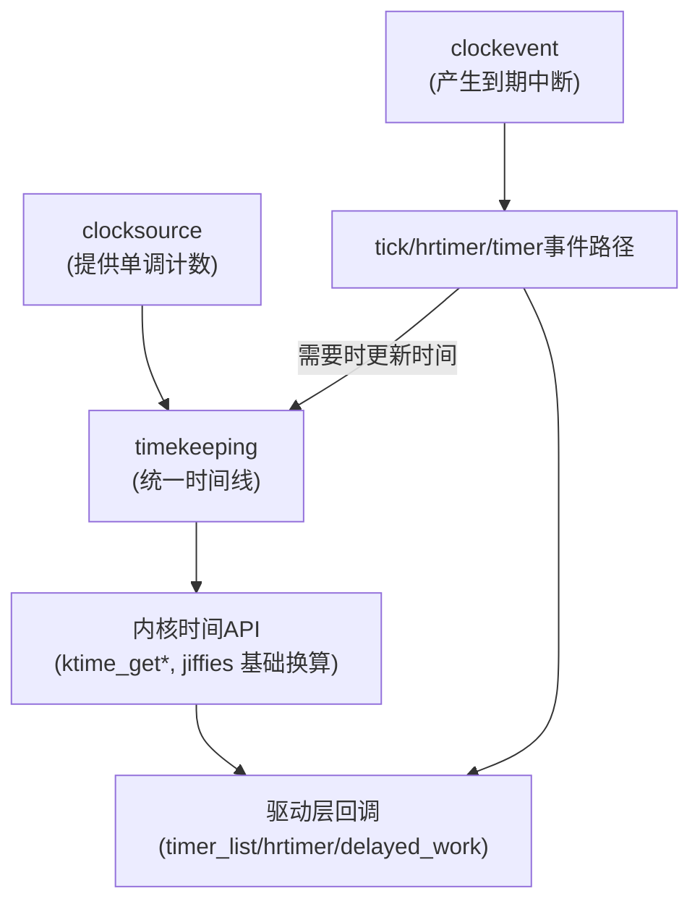
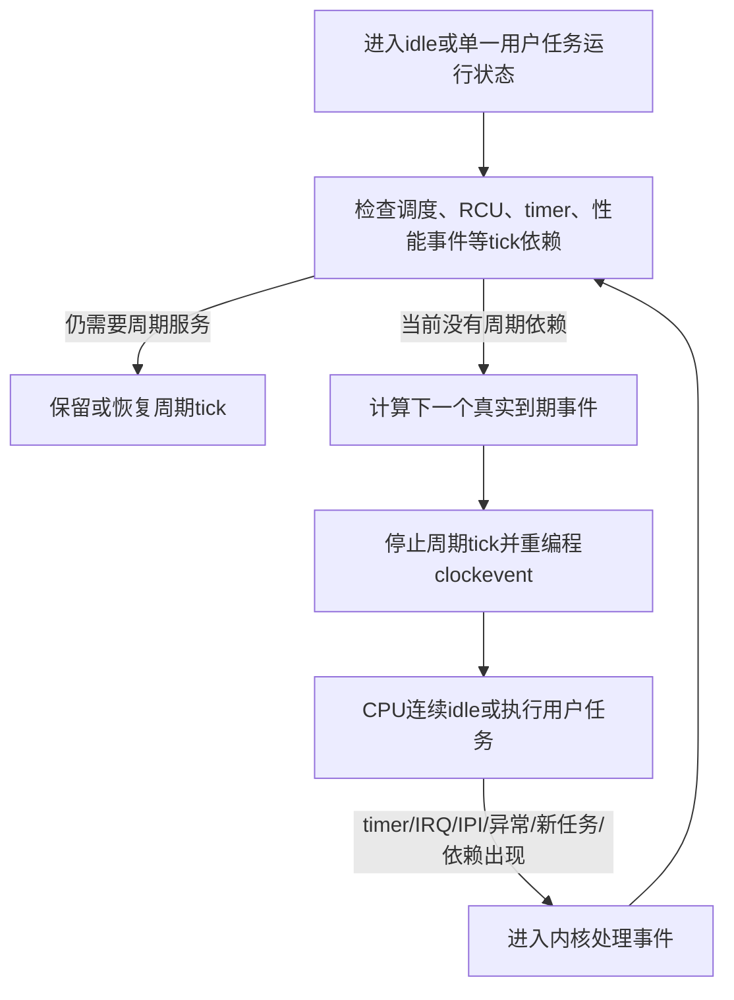

# 第2章\_Linux\_时间基础与\_timekeeping\_框架速览

## 2.1\_章节内容说明

这一章的作用是：**解释为什么内核时间看起来比用户态麻烦，以及驱动为什么要知道 timekeeping/clocksource/clockevent 这三个角色。**驱动一般不直接操作这些核心时间代码，但你必须知道：

1. 你的定时器是“跟着节拍走的”还是“真的高精度的”；
2. 平台/配置一变（比如启用 NO_HZ / 高精度定时器），周期 tick、真实定时事件和回调调度之间的关系会怎样改变；
3. 为啥同一份驱动在 A 板子上周期性回调很准，在 B 板子上就有轻微抖动。

所以本章的目标是：

- 搭建“Linux 内核时间体系”的最小认知模型；
- 把 `jiffies`、HZ、tick 的来源说清楚；
- 把 timekeeping/clocksource/clockevent 的分工说清楚；
- 给后面第3章“时间表示与转换接口”提供语义基础。

## 2.2\_内核时间体系的定位

内核时间子系统要同时满足四种完全不同的需求：

1. **内核自己要有一条“系统时间”**（wall time），给日志、文件时间戳、用户态看；
2. **调度和定时器要有一条“节拍/事件时间”**，用来触发 tick、软中断、timer wheel；
3. **要能提供一个“尽量单调的、高精度的时间源”**，给高精度定时器、追踪、性能分析用；
4. **要能在不同硬件上工作**，哪怕底层只有粗糙的定时中断，也能模拟出一条时间线。

这就导致：**时间在内核里不是一根线，而是几根线拼在一起的效果**。对驱动来说，最直接的体现是：

- 你能看到 `jiffies` 这种“很内核味”的节拍式时间；
- 你也能看到 `ktime_get()` 这种纳秒级的获取接口；
- 你还能看到各种“到期时间”的结构（timer_list 的 expires，hrtimer 的 expires）；
- 还有和硬件/平台耦合很重的 RTC/clocksource/clockevent 部分。

所以，驱动作者要先接受一个事实：**我们不会也不应该去改 timekeeping，但要写出“能和它和平共处”的驱动**。这就是本章的“开发者视角”——知道框架，选对接口，别和它对着干。

## 2.3\_tick\_HZ\_与\_jiffies

这一节是整个时间专题的“最小公约数”。你说的很多“500ms”“10ms 去抖”“1s 轮询”最后其实都会走到这里。

### 2.3.1\_HZ\_是什么

- `CONFIG_HZ` 定义内核每秒有多少个 **逻辑节拍单位**，也决定周期调度 tick 运行时的目标频率；
- 常见值是 100、250、1000，也有 300、1024 这种；
- HZ 越大，基于 jiffies 的时间粒度通常越细，但保留周期 tick 时的调度和中断负担也越重；
- 启用 NO_HZ 后，某个 CPU 可以省略一段时间内的物理周期 tick，不能再把 `CONFIG_HZ=1000` 机械理解成“每个 CPU 永远每秒进入 1000 次 tick IRQ”。

所以：**不能在驱动里写死对 HZ 的假设**。否则同一驱动在服务器核和嵌入式核上表现就会不同。

### 2.3.2\_jiffies\_是什么

- `jiffies` 是以 `1/HZ` 为单位表达内核逻辑时间的全局节拍计数器；
- 在周期 tick 模式下，可以先用“一个负责更新时间的 tick 使它前进一个单位”建立直觉；
- 在 NO_HZ 省略了若干物理 tick 后，内核会依据已经流逝的时间补算应前进的节拍数，所以 **省略物理 tick 不等于 jiffies 或系统时间停止**；
- 所有基于 `struct timer_list` 的低精度定时器，底子都是这个；
- 它一般是 `unsigned long`，内核还会有 `jiffies_64` 版本防止溢出。

所以你常看到：

```c
mod_timer(&dev->timer, jiffies + msecs_to_jiffies(500));
```

这句话的语义其实是：“请在**当前节拍的基础上**，再加上 500ms 对应的节拍数，在那个节拍点把这个定时器拉起来”。

### 2.3.3\_为什么要用转换宏

因为你不知道 HZ 是多少，所以 500ms → jiffies 必须要用内核提供的宏，把“时间长度”翻译成“节拍数”：

```c
unsigned long to = msecs_to_jiffies(500);
mod_timer(&dev->timer, jiffies + to);
```

你如果直接写 `+ 500`，就是在假定 1 tick = 1ms（也就是 HZ=1000）。这在 ARM 嵌入式上经常不成立。

### 2.3.4\_jiffies\_驱动的定时器精度

基于 jiffies 的定时器有两个天然限制：

1. **到期时间先量化为 jiffies 粒度**，不能表达任意两个逻辑节拍之间的纳秒级期限；
2. **到期不等于回调已经获得 CPU**：IRQ 长时间关闭、softirq 积压、更高优先级任务、工作队列排队等都可能使实际执行晚于到期点。

但换个角度看，它也有明显优点：

- 成本低：软中断拉起来做；
- 写法简单：`mod_timer()` 周期化特别方便；
- 对绝大多数“几十毫秒、几百毫秒”的驱动任务来说已经够用。

所以正确的认识是：**不是所有定时任务都要上 hrtimer，基于 jiffies 的 timer 是默认方案。**

### 2.3.5\_简单时间线示意


（说明：这里用的是“到点就回调”的最简单路径，后面第4章会画真正的 timer 流程图，包含 softirq 分发。）

## 2.4\_timekeeping\_/\_clocksource\_/\_clockevent\_的基本角色

这一节是本章最重要的“数据结构视角”。虽然你写驱动不会天天去看这些结构，但你要知道**它们各司其职**，否则你会把“时间不准”错怪到定时器头上。

### 2.4.1\_timekeeping\_维护\_当前时间线\_的那一层

- **职责**：维护系统当前的“墙钟时间”（wall time）和“单调时间”（monotonic time），提供统一的读法；
- **你能看到的接口**：`ktime_get()`, `ktime_get_ns()`, `ktime_get_boottime()`, `do_gettimeofday()`（旧）；
- **驱动为何要知道它**：当你要做“跟系统时间对齐/打时间戳/和用户态比时间”的事，需要拿这条线的时间；
- **特点**：这层会处理时钟源偏差、NTP 校时、重启后基准时间恢复等问题，**所以它可能会被调整**。

也就是说：**timekeeping 是“标准时间出口”，不是硬件时钟本体。**

### 2.4.2\_clocksource\_提供\_读数\_的硬件或软件源

- **职责**：提供一个“能被快速读取的、单调递增的计数器”；
- 常见实现：TSC、ARM arch timer、SoC 专用定时器；
- 内核会从多个可用的 clocksource 里选一个最合适的；
- 精度、读取开销、是否单调、是否跨 CPU 一致，会成为选择条件；
- **如果 clocksource 出问题，所有依赖它的高精度时间都会受影响**，比如 hrtimer 精度下降。

对驱动的意义是：**你看起来是在用统一的 `ktime_get_ns()`，但底下其实是某个 clocksource 在跑**，不同板子可能表现不同，这就是你有时会看到“在 A 板子上 hrtimer 很准，在 B 板子上偶尔飘”的根源。

### 2.4.3\_clockevent\_负责\_产生事件\_的那层

- **职责**：按设定的时间点/周期，发出一个“现在该执行定时相关工作的事件”（本质上是中断）；
- 内核调度器的 tick、定时器的驱动、延后执行的触发，都会依赖它；
- 有的硬件只能以固定频率发事件，有的能编程到具体时间点；
- 在 tickless/NO_HZ 模式下，clockevent 更重要，因为要“多久后再叫醒我”；

所以，简单说：

- **clocksource = 读时间**
- **clockevent = 到点叫你**
- **timekeeping = 把时间变成统一口径、还能调**

可以画成一张你后面也能复用的示意图：



说明：

- clocksource 给 timekeeping 提供“现在到了哪里”的读数；clockevent 只负责在设定时刻制造事件，不给系统提供当前时间本身；
- tick 或 timer 事件到来后，相关路径可能更新时间并分发到期工作；驱动如果发现“时间不准/回调被推迟”，要区分 **时间读数错误、到期事件错误和到期后迟迟未获得执行** 三种原因。


------

## 2.5\_NO\_HZ\_/\_高精度定时器配置对驱动的影响

先直接回答“NO_HZ 是不是把 tick 关闭了”：

> **NO_HZ 会在当前不需要周期调度 tick 时，动态停止该 CPU 的周期 scheduling-clock tick；它不是永久关闭 tick，更不是关闭所有定时器中断。**

“tickless”更准确的含义是 **省略不必要的周期 tick**。一旦某项内核工作需要 tick，tick 可以恢复；如果真正的 timer/hrtimer 已经安排到期点，clockevent 仍要在那个时刻产生中断。

本节会反复出现四个部署术语：`NO_HZ_FULL` 是“运行中的指定 CPU 也允许省略周期 tick”的 full-dynticks 模式；NOCB 是 Tree RCU 的 callback 卸载策略；housekeeping CPU 是承接被迁移后台工作的非隔离 CPU；RT task 是具有实时 deadline 与优先级约束的任务。

### 2.5.1\_先分清三种tick工作模式

下面三项都是内核构建期的 Kconfig 布尔配置：`CONFIG_HZ_PERIODIC` 选择始终周期 tick，`CONFIG_NO_HZ_IDLE` 选择 idle dynticks，`CONFIG_NO_HZ_FULL` 选择 full dynticks。

| 模式 | 什么时候保留或停止周期调度tick | 主要目标 |
| --- | --- | --- |
| `CONFIG_HZ_PERIODIC` | CPU 运行和 idle 时都保留周期 tick | 实现简单、行为规律 |
| `CONFIG_NO_HZ_IDLE` | CPU 进入 idle 且条件允许时停止周期 tick；离开 idle 后恢复 | 避免唤醒无事可做的 CPU，降低能耗 |
| `CONFIG_NO_HZ_FULL` | 包含 idle tickless；指定 CPU 只有一个可运行任务并在用户态持续执行、且没有其他 tick 依赖时，也尽量停止周期 tick | 减少计算核的 OS jitter，改善 CPU isolation |

`CONFIG_NO_HZ_IDLE` 主要解决“CPU 已经无任务可跑，为什么还要按 HZ 周期醒来”；`CONFIG_NO_HZ_FULL` 又解决“CPU 只有一个用户态任务，为什么还要周期性打断它询问是否需要调度”。后者并不是所有 CPU 的默认状态：启动参数 `nohz_full=` 指定进入 full-dynticks 管理集合的 CPU，系统仍要保留 housekeeping CPU 承担时间保持、RCU callback、非绑定工作等后台职责，启动 CPU 也不会被放入该集合。

### 2.5.2\_停止的是周期tick而不是所有时间事件

本节的 IRQ 指 interrupt request，即普通外设中断请求；IPI 指 inter-processor interrupt，即一个 CPU 主动通知另一个 CPU 的核间中断。

满足停 tick 条件时，内核执行的不是简单写入一个永久的 `tick_enable = false`，而是重新评估“下一件必须发生的事”：



因此以下事件都没有被 NO_HZ 消灭：

- 已编程的普通 timer 或 hrtimer 到期；
- 设备 IRQ、核间中断 IPI、异常和系统调用；
- 新任务唤醒、迁移或其他确实需要重新调度的事件；
- 子系统重新声明 tick 依赖后恢复的调度 tick。

所以“CPU 不再有周期 tick”只能推出 **少了一种固定频率的内核进入原因**，不能推出“CPU 永不进入内核”“不会调度”或“所有定时器都停了”。

### 2.5.3\_NO\_HZ\_FULL的典型对象是长时间用户态计算

`NO_HZ_FULL` 最容易成立的负载是：指定 CPU 上只有一个可运行的用户态计算任务，它很少系统调用、不使用会要求周期记账的 POSIX CPU timer，并且平台具有稳定可用的 clocksource。只要出现额外 runnable task 或其他 tick 依赖，周期 tick 就可能重新启动。

这解释了为什么它常见于 HPC、用户态数据面和隔离计算核，也能帮助某些长计算段实时任务降低尾延迟。它不是“收到外设中断后快速反应”的专用机制；设备 IRQ 应落在哪个 CPU，是另一项架构决定。

实时系统至少有两种不能混写的布局：

| 布局 | 事件和计算怎样衔接 | 收益 | 代价与边界 |
| --- | --- | --- | --- |
| 同核事件响应 | IRQ/线程化 IRQ 与高优先级 RT task 放在同一 CPU | 少一次核间交接，可能缩短最紧的 event-to-action 路径 | IRQ 和其他内核工作直接扰动 RT task；未必适合 `NO_HZ_FULL` |
| 分离式隔离计算 | housekeeping/I/O CPU 接收事件，经共享内存、ring 和唤醒协议把数据交给隔离 CPU | 计算 CPU 的工作集和执行窗口更可控，适合长用户态计算 | 多一次缓存行所有权转移、内存屏障、唤醒/IPI 和调度交接；端到端时延不一定更短 |

不能把 CPU 当作中断控制器的“缓存”：在 ARM 系统上，GIC 负责把中断路由到目标 CPU，真正的 handler 仍由 CPU 执行。是否把 I/O 与计算分核，要用完整的最坏时延链比较，而不是只看隔离 CPU 是否更“干净”。

### 2.5.4\_为什么NO\_HZ\_FULL还要配合RCU\_NOCB

假设 CPU3 已经满足单一用户任务条件，周期调度 tick 得以停止。如果 CPU3 对应的 RCU callback 仍需要由它本地推进和批量调用，这些工作可能重新制造内核噪声，或者形成停 tick 的依赖。为避免这段 callback 侧工作落回 CPU3，当前 Tree RCU 会让 `nohz_full` CPU 同时进入 callback offload 集合，再由 NOCB kthread 管理等待并执行成熟 callback。

这不是“进入 `NO_HZ_FULL` 前先把旧 RCU 账单结清，然后永久关 tick”的一次性过程。更准确的时间关系是：

```text
启动/配置阶段
    建立nohz_full CPU集合
    建立这些CPU的RCU callback offload属性
    规划housekeeping CPU与NOCB线程落点

运行阶段
    每次条件满足 → 动态停止周期tick
    条件破坏     → 必要时恢复tick
    callback出现 → 仍登记到对应per-CPU队列，但由NOCB侧推进和调用
```

纯用户态计算函数不会直接调用内核 `call_rcu()`。不过系统调用、缺页、调度、设备路径或该 CPU 上偶发执行的内核代码仍可能使用 RCU；而 callback 队列和 GP/QS 责任本来也是内核状态。NOCB 的作用是使 **未来出现的 callback 也继续走卸载协议**，不是把 CPU 的全部 RCU 读侧、QS/EQS 跟踪或所有内核活动清零。完整责任边界见 [Tree RCU NOCB 回调卸载](../../synchronization/rcu/P16_Tree_RCU_NOCB回调卸载.md#16.2_卸载前后责任对比)。

### 2.5.5\_普通timer不会因为省略tick就被遗忘

NO_HZ 的正确实现目标正是：省掉中间无用的周期 tick，同时把 clockevent 编程到 **下一个不能错过的真实事件**。因此不能把“1 秒普通 timer 偶尔在 1.x 秒才执行”直接解释成“内核为了 NO_HZ 故意不叫醒 CPU”。

实际回调晚于到期点时，应继续分层排查：

- `timer_list` 的 jiffies 量化和 timer wheel 粒度；
- timer slack、可合并策略，或是否明确使用了 deferrable timer；
- 到期中断是否被 IRQ-off 区间推迟；
- timer softirq 是否积压或被更高优先级工作延后；
- `delayed_work` 到期后是否还在等待 worker 获得 CPU；
- CPU 频率、电源状态退出、虚拟化和平台 clockevent 是否造成额外延迟。

其中 **deferrable timer** 明确允许 CPU 在 idle 时不因它单独醒来；普通非 deferrable timer 则应参与“下一个事件”的计算。NO_HZ 改变唤醒组织方式，但不把普通定时器的到期契约自动降级成“随便晚一些”。

### 2.5.6\_hrtimer提高到期表达精度但不承诺deadline

`CONFIG_HIGH_RES_TIMERS` 是启用高分辨率 timer 基础设施的 Kconfig 配置；`hrtimer` 是使用该基础设施表达高精度到期点的内核定时器对象。当系统启用 `CONFIG_HIGH_RES_TIMERS=y` 时，内核可以在两个逻辑 tick 之间安排高精度事件，`hrtimer` 才能真正表达“在 5 ms + 300 μs 附近到期”。适合考虑它的场景包括：

- 期限小于一个 jiffies 粒度；
- 需要较小的到期量化误差；
- 音频、采样、控制等确实需要高分辨率事件。

但 hrtimer 只改善 **到期时间的表达和事件编程精度**。IRQ 屏蔽、抢占、回调执行时间和后续 worker 排队仍会形成 jitter，所以 `hrtimer` 本身不提供硬实时 deadline 保证。

### 2.5.7\_不要默认所有实时负载都适合NO\_HZ\_FULL

对长时间连续执行的单一用户态计算，减少周期 tick 往往有价值；对每 100 μs 一次、频繁进出内核的周期控制循环，稳定的周期 tick 有时反而更容易形成可预测的执行节奏，NO_HZ 的进入/退出与记账成本未必划算。当前内核实时配置文档也把这两类负载分开建议。

因此选择顺序应是：先画出 event-to-action 或 compute-completion 的完整路径，再测量周期 tick 是否真的进入尾延迟主因，最后决定使用 periodic tick、`NO_HZ_IDLE` 还是 `NO_HZ_FULL`。**“实时”不是自动启用 `NO_HZ_FULL` 的充分条件。**

### 2.5.8\_官方机制说明入口

- [NO_HZ: Reducing Scheduling-Clock Ticks](https://docs.kernel.org/timers/no_hz.html)：三种 tick 模式及其基本约束。
- [CPU Isolation](https://docs.kernel.org/admin-guide/cpu-isolation.html)：`nohz_full`、housekeeping 与隔离核的职责划分。
- [Real-time kernel configuration](https://docs.kernel.org/next/core-api/real-time/kernel-configuration.html)：周期控制循环与长用户态计算对 NO_HZ 的不同选择。

------

## 2.6\_内核时间获取接口速览(驱动常用)

本节是一个“用户视角”的小目录，给你一个印象：**内核时间不止一条线，不同函数取到的时间语义不一样**。后面章节提到的我就不再重复解释。

| 接口/宏                 | 含义/语义                      | 是否单调 | 驱动典型用途                   |
| ----------------------- | ------------------------------ | -------- | ------------------------------ |
| `jiffies`               | 节拍计数，跟 HZ 绑定           | 单调     | 定时器到期、差值超时           |
| `get_jiffies_64()`      | 64 位 jiffies，防溢出          | 单调     | 长时间运行系统                 |
| `ktime_get()`           | 单调时间（monotonic：单调的）  | 单调     | 高精度时间戳                   |
| `ktime_get_ns()`        | 单调时间，ns                   | 单调     | 高精度日志/trace               |
| `ktime_get_boottime()`  | 启动以来的时间，含 suspend     | 单调     | 统计运行时长                   |
| `do_gettimeofday()`(旧) | 近似墙钟时间                   | 否       | 很少在驱动中用                 |
| `sched_clock()`         | 非稳定快速时钟，多核不一定同步 | 否       | 快速打点、调试，不要做精确度量 |

你要记住的是：**能用 jiffies 做的先用 jiffies；要精度再上 ktime/hrt；要对外报时间再走 timekeeping。**

------

## 2.7\_调试与验证

第1章说过一遍了，这里补充**跟 timekeeping 这一层相关的调试点**，方便你判断“问题到底在驱动还是在系统时间”。

### 2.7.1\_看\_dmesg\_里的\_clocksource\_选择

启动日志里一般会有一行类似：

```text
clocksource: arch_sys_counter: mask: 0xffffffffffffff max_cycles: ...
```

或

```text
clocksource: tsc: ...
```

如果你在两个板子上定时表现不同，**先看它们是不是同一个 clocksource**。不是同一个，就不要用同一组“定时误差”去比较驱动。

### 2.7.2\_用\_trace\_看\_timer/softirq

打开 `events/timer/*`，能看到定时器添加、触发、回调的时间点。你可以核对：

- 你下发的 expires 值；
- 真正触发的时间；
- 中间有没有被推。

### 2.7.3\_检查\_NO\_HZ\_相关的配置

可以结合 `/proc/cmdline`、`/sys/devices/system/cpu/nohz_full`、`/proc/timer_list`（不同版本格式不同）和内核配置确认 NO_HZ/highres 状态。但配置存在只能证明机制可用或 CPU 被列入集合，不能单独证明一次迟到由 NO_HZ 造成；还要用 trace 区分“到期事件晚了”和“事件已到期、回调排队晚了”。

### 2.7.4\_人工压测法

写个简单的测试定时器/延迟工作：

```c
static void demo_timer_fn(struct timer_list *t)
{
    pr_info("demo: fired at jiffies=%lu\n", jiffies);
    mod_timer(t, jiffies + msecs_to_jiffies(1000));
}
```

在不同配置的同一块板子上跑，记录触发间隔，就能看出该平台的“周期性精度”大概在什么级别。**这能帮你给正式驱动定“合理预期”**，比如你就别要求它做到 1ms 级周期性。

------

## 2.8\_小结

1. Linux 的时间不是一条线，是 **clocksource（读）+ clockevent（叫）+ timekeeping（统一）** 三层叠出来的；
2. `CONFIG_HZ` 定义逻辑节拍尺度；NO_HZ 可以省略物理周期 tick，但不会让 jiffies 或系统时间停住；
3. `NO_HZ_IDLE` 服务 idle 节能，`NO_HZ_FULL` 主要服务单一用户态任务的 CPU isolation；二者都不关闭真实 timer、IRQ、IPI 和异常；
4. NO_HZ 会把 clockevent 重编程到下一个真实事件，不能把普通 timer 的迟到直接归咎于“少了 tick”；
5. `NO_HZ_FULL` 与 NOCB 分别减少周期 tick 和 RCU callback 噪声，但仍需 housekeeping、IRQ/线程放置和系统级容量规划；
6. 要做高精度事件，优先核对 `CONFIG_HIGH_RES_TIMERS` 并选择 `hrtimer`，但执行 deadline 仍要分析 IRQ、调度和回调成本；
7. 本章是后面几章的“地基”，第3章开始就只讲一件事：**怎么把“外部给的时间”安全地转换成“内核要的时间”**。

------

------

上一篇：[P01 驱动中的 时间问题 概述](P01_驱动中的_时间问题_概述.md)。
下一篇：[P03 时间表示与转换接口详解](P03_时间表示与转换接口详解.md)。
