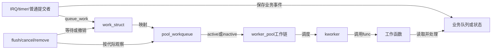
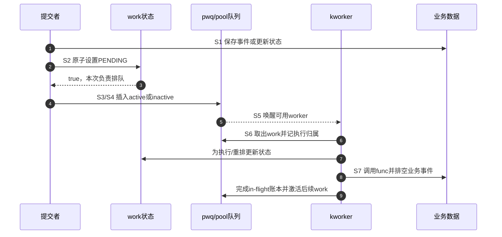

# 第2章\_异步执行的抽象状态机

## 2.1\_为什么要把触发与执行分开

硬中断、持自旋锁路径或延迟敏感调用点可能只允许快速确认事件，不能睡眠、长时间计算或访问慢设备。直接做完全部工作会扩大不可抢占延迟；为每类事件创建专用线程又带来线程数量、调度和生命周期管理成本。工作队列把“哪件事要做”保存为 work，由共享 worker 执行。

## 2.2\_朴素任务队列的三个缺口

1. 同一个 work 被多个 CPU 同时提交，如何避免同一对象并发执行两次？
2. worker 在工作函数里睡眠时，谁保证 pool 仍有其他执行者推进剩余工作？
3. remove 想等待“以前提交的工作”结束，怎样区分已有代际和后来重新提交？

cmwq 分别用 work 的 pending/归属状态、worker pool 的并发管理和 workqueue flush 颜色/屏障解决这些问题。

## 2.3\_角色关系

work 不是业务事件仓库。pending 只说明该 work 已代表“一轮需要处理”；若每次 IRQ 都不能丢，事件必须另存到业务队列/计数中，工作函数负责排空。

## 2.4\_S0到S8完整周期

| 阶段 | 触发 | work/队列状态 | 通信方向 |
| --- | --- | --- | --- |
| S0 空闲 | work 已初始化且未提交 | 非 pending | 调用者持有对象 |
| S1 业务发布 | 事件到达 | 先写业务状态 | producer → work function |
| S2 抢 pending | `queue_work()` | 原子设置 pending；失败表示已有人代表该 work | 多提交者 → work 状态 |
| S3 选择执行域 | pending 成功 | 选择 CPU/pwq/pool | wq 属性 → pool |
| S4 入队/抑制 | 并发额度判断 | active 入 pool worklist，或 inactive 等待 | pwq → pool |
| S5 唤醒执行者 | pool 需要运行 | 唤醒 idle worker/管理 worker | pool → scheduler |
| S6 取出执行 | worker 选择 work | 记录 current_work/current_pwq | pool → worker |
| S7 调用与完成 | 执行 `work->func()` | 清 pending 使重排成为可能，执行账本推进 | worker ↔ 业务状态 |
| S8 同步收尾 | flush/cancel/destroy | 等目标代际或 barrier 完成 | teardown → worker/pwq |

## 2.5\_正常投递时序

`queue_work()` 成功还提供发布顺序：调用前的写在成功排队的 work function 中可见。若返回 false，本次没有创建新排队代际，业务层仍需用自己的锁/原子协议保证事件不会丢。

## 2.6\_异步不等于无同步

提交、执行和取消分布在不同 CPU 与时间点：pending 位需要原子更新，pool/pwq 链表需要锁，业务数据需要发布协议，flush/cancel 需要等待完成，remove 需要关闭生产者。异步机制只分离执行现场，不会移除共享状态通信。

## 2.7\_本章结论与下一问

工作队列是由 work 状态、并发账本、执行者和完成证明共同构成的多阶段系统。下一章把这些抽象角色映射到 `work_struct`、`workqueue_struct`、`pool_workqueue`、`worker_pool` 和 `worker`，解释为什么不能把 workqueue 当线程对象。

上一篇：[工作队列](P01_工作队列.md)。

下一篇：[cmwq 对象层次与状态所有权](P03_cmwq对象层次与状态所有权.md)。
