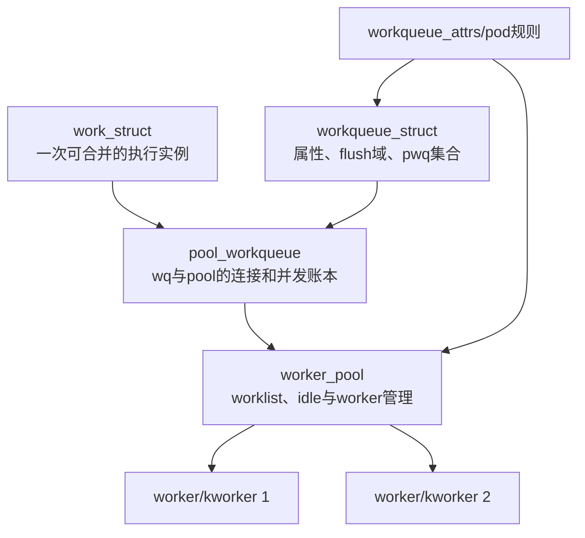
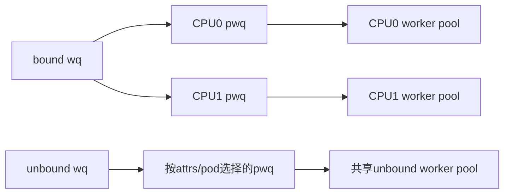

# 第3章\_cmwq对象层次与状态所有权

## 3.1\_为什么workqueue不是一组私有线程

如果每个子系统的队列都固定创建线程，空闲时浪费资源，阻塞时又可能不够用。cmwq 把“用户可见的属性与 flush 域”和“实际 worker 资源”解耦：多个 workqueue 可以映射到共享 pool，同时由中间的 pool_workqueue 维护各自并发和在途账本。

## 3.2\_五层对象

`workqueue_struct` 不拥有一一对应的 kworker；`worker_pool` 也不只服务一个 workqueue。`pool_workqueue` 是两者之间的连接对象，保存 active/inactive 和 flush 相关状态。

## 3.3\_状态所有权表

| 对象 | 关键状态 | 谁主要修改 | 用于回答 |
| --- | --- | --- | --- |
| `work_struct` | data 中 pending/归属编码、entry、func | 提交、pool 和执行路径 | 这一个 work 当前在哪里 |
| `workqueue_struct` | flags、pwqs、flush 颜色、名称、属性 | 分配、属性更新、flush/destroy | 用户定义的执行域是什么 |
| `pool_workqueue` | pool/wq 指针、active 计数、inactive list、in-flight 颜色 | queue、激活、完成、flush | 该 wq 在该 pool 上能否继续激活 |
| `worker_pool` | lock、worklist、worker/idle 集合、运行计数 | queue 与 worker manager | 实际执行能力是否充足 |
| `worker` | task、current_work/current_pwq、scheduled list | worker loop | 当前 kworker 正在代表谁执行 |

`work_struct.data` 会在 off-queue 标志与指向 pwq 的编码之间切换，属于高度版本化实现。知识正文只保留“work 必须携带 pending 与执行归属”这一稳定模型，具体位定义进入源码实现文档。

## 3.4\_bound与unbound映射

bound workqueue 通常按提交 CPU 选择 per-CPU pwq/pool，工作在该 CPU 关联的执行域推进。unbound workqueue 根据 attributes、CPU mask 和 affinity pod 选择共享 unbound pool；调度器仍可能决定具体运行 CPU。

`WQ_UNBOUND` 不表示“没有 CPU 约束”或“每个 work 新建线程”，而是取消提交 CPU 的固定 per-CPU 绑定，改由属性与调度策略选择执行域。

## 3.5\_锁与读取规则

`worker_pool.lock` 保护 pool worklist、worker 状态和许多与 work 归属有关的字段；wq/pwq 的配置和 RCU 指针还有各自锁与生存期规则。源码字段注释用 I、P、WQ、PW 等标记访问上下文，阅读时要先找锁域，不能按结构声明顺序猜谁可以修改。

## 3.6\_源码入口

对象地图和建议阅读顺序见[工作队列对象与投递模块源码概念导读](../../../../../research/source_reading/workqueue/navigation/P02_Linux_6.12_工作队列对象与投递模块源码概念导读.md#2.2_五层对象与状态所有权)。字段裁剪只在[工作队列对象布局源码实现](../../../../../research/source_reading/workqueue/source_explanations/P01_Linux_6.12_工作队列对象布局源码实现.md#1.2_源码符号覆盖账本)展开。

## 3.7\_本章结论与下一问

cmwq 用 pwq 把逻辑 workqueue 与物理 worker pool 解耦，因此并发限制、flush 域和执行资源可以分别管理。下一章沿一个 work 追踪 pending 设置、pool 选择、active/inactive 分流和重新提交。

上一篇：[异步执行的抽象状态机](P02_异步执行的抽象状态机.md)。

下一篇：[work 投递、激活与 pending 合并](P04_work投递激活与pending合并.md)。
