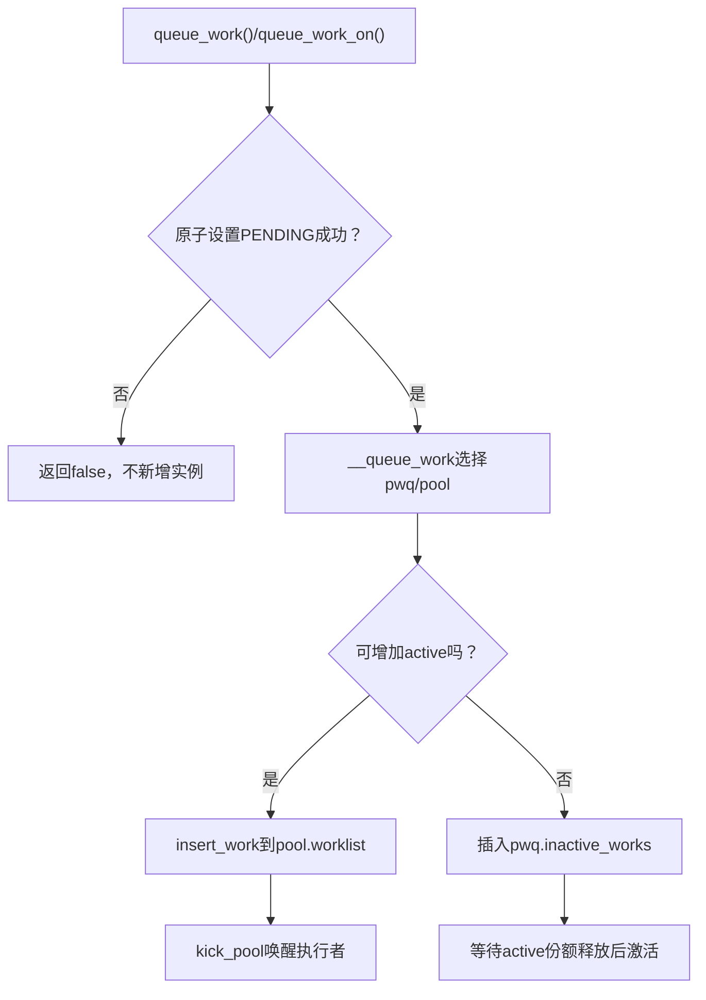
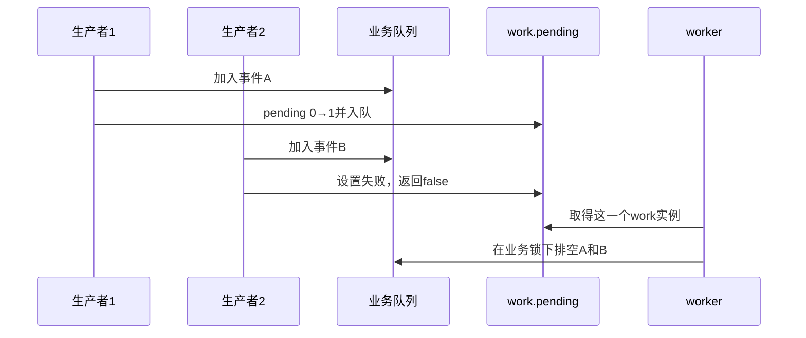

# 第4章\_work投递激活与pending合并

## 4.1\_queue\_work返回false意味着什么

提交者先原子尝试设置 work 的 PENDING 位。只有从非 pending 转为 pending 的调用者进入 `__queue_work()`；其他并发提交返回 false。false 表示本次没有新增排队实例，不表示工作函数已经处理了调用者刚写入的每个业务事件。

可靠模式是先把事件放进受保护队列或累计计数，再 queue 一个负责排空的 work。pending 合并的是执行机会，不应吞掉业务事实。

## 4.2\_投递调用链

## 4.3\_为什么需要inactive列表

`max_active` 约束的是 workqueue 在对应执行域中同时活跃的 work 数，不是固定线程数。达到额度后，新 work 仍保持 pending 和归属，但先放入 pwq 的 inactive list；已有 active work 完成、`pwq_dec_nr_active()` 释放份额后，再把最早的 inactive work 激活到 pool worklist。

这样逻辑并发限制由 pwq 维护，pool 仍可为其他 workqueue 执行工作。

## 4.4\_跨pool重新提交的约束

一个正在执行或刚完成的 work 可能在另一 CPU/队列被重新提交。`__queue_work()` 需要避免旧 pool 仍认为它在执行时，work 直接跳到不相关 pool 导致同一实例并发。Linux 通过 work 当前归属、last pool 和 pool lock 协调这一窗口。

稳定契约是：同一个 `work_struct` 的一次 pending 实例不会被普通 `queue_work()` 并发执行两次；调用者仍不能未经同步地销毁、重新初始化或修改其 func。

## 4.5\_发布顺序

成功 `queue_work()` 形成提交者到工作函数的发布边界：提交前的写必须能被执行该排队实例的 worker 观察。业务对象有多个生产者或 queue 返回 false 时，仍需用锁/原子操作保护它们之间的合并；工作队列的顺序不能替代业务队列自身一致性。

## 4.6\_delayed\_work的双阶段归属

delayed work 在延迟未到时由 timer 保存将来的投递；到期回调再把内含 work 送入 workqueue。取消必须同时处理 timer pending 与 workqueue pending/running，不能只对内含 `work_struct` 使用普通 cancel 接口。周期回调自重排还会制造新的生产者，必须受 stopping 控制。

## 4.7\_源码入口

`queue_work_on()`、`__queue_work()`、`insert_work()` 与 active/inactive 状态见[工作队列对象与投递模块源码概念导读](../../../../../research/source_reading/workqueue/navigation/P02_Linux_6.12_工作队列对象与投递模块源码概念导读.md#2.3_从queue_work到insert_work)。唯一裁剪实现见[投递与激活源码实现](../../../../../research/source_reading/workqueue/source_explanations/P02_Linux_6.12_工作队列投递与激活源码实现.md#2.2_源码符号覆盖账本)。

## 4.8\_本章结论与下一问

pending 把并发提交合并为一个执行代表，pwq 再按 active 额度决定立即进入 pool 还是等待激活。work 到达 pool 后，仍需动态维持足够 worker；下一章进入 worker 并发管理和执行循环。

上一篇：[cmwq 对象层次与状态所有权](P03_cmwq对象层次与状态所有权.md)。

下一篇：[worker 并发管理与执行循环](P05_worker并发管理与执行循环.md)。
