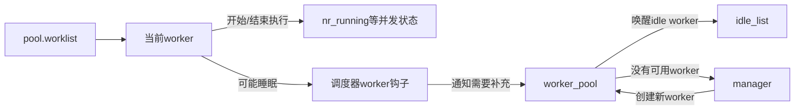
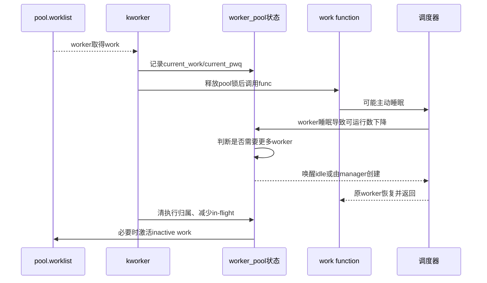

# 第5章\_worker并发管理与执行循环

## 5.1\_固定数量worker为什么不够

若 pool 只有一个 worker，它在 work function 中睡眠时，后续工作全部停顿；若预先创建很多 worker，大多数时间又浪费线程和内存。cmwq 让调度器钩子和 pool 状态感知 worker 是否正在运行/睡眠，按需唤醒或创建执行者。

## 5.2\_pool中的角色与状态

worker pool 维护 worklist、worker 集合、idle 集合和管理者状态；每个 worker 记录 `current_work/current_pwq`，让 flush、冲突检测和诊断知道哪个任务正在代表哪个 work 执行。

## 5.3\_worker\_thread主循环

1. worker 被调度运行并进入 pool 锁保护区；
2. 若没有足够可运行 worker，必要时进入 `manage_workers()`；
3. 从 pool worklist 取工作，移入 worker 的 scheduled/当前状态；
4. `process_one_work()` 建立执行归属、锁依赖和 trace 状态；
5. 释放 pool 锁，调用 `work->func(work)`；
6. 重新取得 pool 锁，完成 in-flight/active 账本并激活后续 work；
7. 无工作时转为 idle 并睡眠。

工作函数在不持有 pool 内部锁时执行，否则任意可睡回调都会阻塞整个 pool 管理。

## 5.4\_端到端执行时序

## 5.5\_manager与mayday不是普通执行路径

manager 只在 pool 需要创建/管理 worker 时介入；worker 创建可能涉及内存分配和 kthread 建立。若内存回收依赖本 workqueue 前进，而新 worker 又因内存压力创建失败，就出现循环依赖。WQ_MEM_RECLAIM 的 rescuer/mayday 路径专门解决这一异常慢路径，不能把它描述成所有 work 的常规调度者。

## 5.6\_WQ\_CPU\_INTENSIVE的真实含义

CPU-intensive work 运行时不计入普通并发管理对“正在运行 worker”的限制，避免长计算阻挡 pool 启动其他普通 work。它不会自动创建专用 CPU，也不提高调度优先级；多个计算工作仍会竞争 CPU。若需要严格隔离，应使用更明确的队列属性、CPU 绑定或专用线程设计。

## 5.7\_工作函数的阻塞边界

work function 处于进程上下文通常可睡，但若它运行在 ordered/低 max_active 队列、持有其他路径 flush 所需锁，或者处于内存回收依赖链，阻塞会放大为整个队列停顿或死锁。审计时要画出“谁等待 work 完成、work 又等待谁”的依赖环，而不只检查函数是否允许 `schedule()`。

## 5.8\_源码入口

worker/pool 状态和执行循环见[worker 管理模块源码概念导读](../../../../../research/source_reading/workqueue/navigation/P03_Linux_6.12_worker管理模块源码概念导读.md#3.3_worker_thread与process_one_work)。函数体只在[worker、flush 与取消源码实现](../../../../../research/source_reading/workqueue/source_explanations/P03_Linux_6.12_worker_flush与取消源码实现.md#3.3_worker_thread与process_one_work执行边界)展开。

## 5.9\_本章结论与下一问

cmwq 通过 worker 睡眠感知、idle 唤醒和 manager 创建维持执行能力；工作函数能睡眠并不意味着任意依赖都安全。下一章研究 flush/cancel 如何在 work 仍可重排、多个 pwq 并行的条件下证明目标代际完成。

上一篇：[work 投递、激活与 pending 合并](P04_work投递激活与pending合并.md)。

下一篇：[flush、cancel 与颜色代际](P06_flush_cancel与颜色代际.md)。
