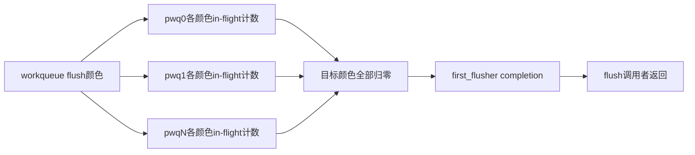
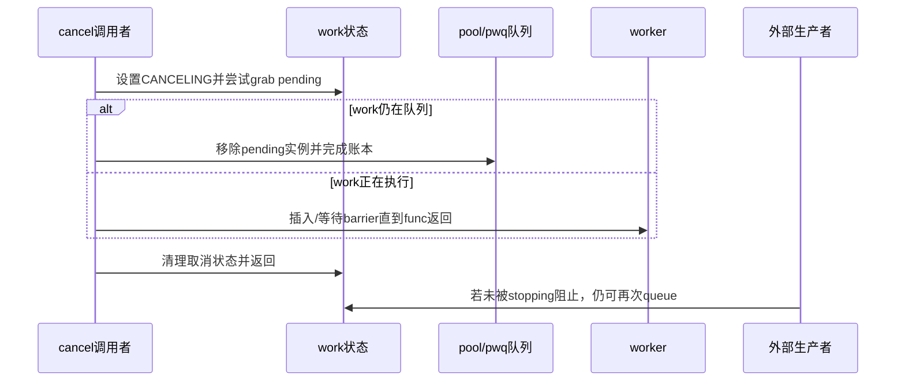

# 第6章\_flush\_cancel与颜色代际

## 6.1\_排空队列\_为什么不是稳定说法

生产者可以在 flush 进行时继续提交，工作函数也可能重排自己。如果要求队列在某一瞬间绝对为空，持续生产会让等待永不结束。workqueue flush 的核心是划定代际：等待 flush 边界之前属于目标颜色的 in-flight work 完成，后来提交的工作进入新颜色，不阻塞本轮结论。

## 6.2\_三种等待对象

| 接口目标 | 等待/改变什么 | 不保证什么 |
| --- | --- | --- |
| `flush_work(work)` | 指定 work 当前目标实例完成 | 阻止以后重新 queue |
| `flush_workqueue(wq)` | wq 在 flush 颜色覆盖的 in-flight 代际完成 | 永久关闭生产者 |
| `cancel_work_sync(work)` | 取消 pending；若正在运行则等待退出 | 返回后其他路径不再 queue |

destroy 还需要更高层先封住生产者，不能把 cancel 或 flush 当停止开关。

## 6.3\_颜色怎样汇聚全局结论

work 入队时带上当前 work color；执行完成或取消时对应 pwq 的 in-flight 计数减少。所有 pwq 的目标颜色归零后，workqueue 才形成全局完成结论并唤醒 flusher。

## 6.4\_flush\_work为何插入barrier

要等待一个具体 work，内核可在该 work 后面插入一个带 completion 的 barrier work；若目标正在执行，barrier 连接到当前执行序列。barrier 被执行并 complete，证明目标实例的执行位置已经越过。它不拥有业务对象生命期，也不禁止目标随后重新入队。

## 6.5\_cancel的竞争闭环

因此 remove 的第一步必须是让 P 不再提交；否则 cancel 返回后竞态依旧存在。

## 6.6\_自等待和锁依赖

work function 对自己 `flush_work()` 或同步取消，会等待自身返回而死锁。同一 max_active=1/ordered 队列中，work A 等待排在其后的 work B，也可能永远无法推进。remove 持有 work 退出所需 mutex 再 `cancel_work_sync()` 同样形成依赖环。

这些错误要画成等待图：调用者等 completion/barrier，barrier 等 worker，worker 又等调用者持有的锁或同一队列额度。仅看到“接口允许睡眠”不足以证明安全。

## 6.7\_源码入口

flush 颜色、barrier、cancel 和 destroy 的模块关系见[flush、取消与生命周期模块源码概念导读](../../../../../research/source_reading/workqueue/navigation/P04_Linux_6.12_flush取消与生命周期模块源码概念导读.md#4.2_三类完成证明)。唯一裁剪实现见[worker、flush 与取消源码实现](../../../../../research/source_reading/workqueue/source_explanations/P03_Linux_6.12_worker_flush与取消源码实现.md#3.4_flush颜色与barrier)。

## 6.8\_本章结论与下一问

flush 用颜色把分散 pwq 的局部 in-flight 证据汇聚成目标代际完成，cancel 用 pending 抢占与 barrier 处理排队/执行竞态；两者都不永久关闭生产者。下一章进入内存回收场景，解释 rescuer 怎样提供异常前进保证，以及 unbound 属性怎样改变 pool 选择。

上一篇：[worker 并发管理与执行循环](P05_worker并发管理与执行循环.md)。

下一篇：[unbound、rescuer 与回收前进性](P07_unbound_rescuer与回收前进性.md)。
