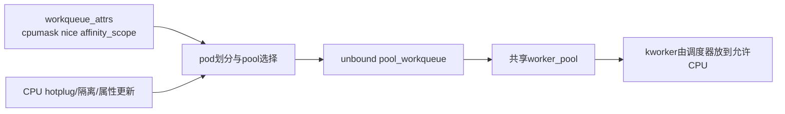
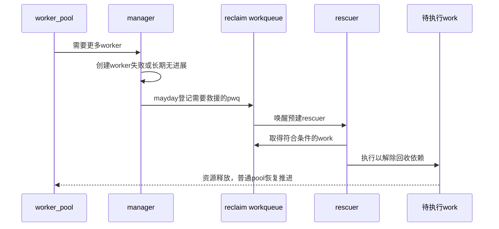

# 第7章\_unbound\_rescuer与回收前进性

## 7.1\_unbound解决的是执行域而非阻塞本身

bound pool 保留提交 CPU 关联，有利于局部性和 per-CPU 语义，但 CPU 上下线、长阻塞和跨节点负载可能需要更灵活的执行位置。`WQ_UNBOUND` 让 workqueue 按 attributes 与 affinity scope/pod 映射到 unbound pool，调度器在允许 CPU 集合内选择运行点。

代价是较弱的提交 CPU 局部性、更复杂的 pool 复用/属性更新，以及不能依赖每 CPU 顺序。unbound 不自动解决业务死锁，也不保证低延迟。

## 7.2\_属性传播关系

`max_active` 在新式 unbound 管理中还会按节点/CPU 可用性分配 active 额度，不能理解为单个固定线程数。

## 7.3\_内存回收循环依赖

设回收路径等待 work A 释放内存，A 所在 pool 的 worker 都阻塞在内存分配，而创建新 worker 又需要内存。没有预留执行者时，系统可能在“必须执行 A 才能回收—必须先回收才能执行 A”之间僵住。

`WQ_MEM_RECLAIM` 为 workqueue 建立 rescuer。正常路径仍由普通 pool 执行；当 pool 无法创建所需 worker 时发出 mayday，把需要救援的 pwq 交给预建 rescuer 执行，保留最小前进能力。

## 7.4\_正常与救援路径

rescuer 是异常慢路径，不保证无限并发，也不能修复 work 自等待或反向锁依赖。使用 WQ_MEM_RECLAIM 只在该队列确实位于回收前进依赖链时有意义。

## 7.5\_ordered\_highpri与power\_efficient边界

- `WQ_ORDERED` 用特殊并发约束保持队列内单活动顺序，长阻塞会拖住全部后继工作。
- `WQ_HIGHPRI` 选择高优先级 pool，不是实时保证，也不能绕过调度和锁等待。
- power-efficient 系统队列/配置可能牺牲局部性或唤醒时延来合并执行，适合不敏感后台工作。
- `WQ_FREEZABLE` 参与系统 freezer，但设备 suspend 仍需自己的硬件和对象状态协议。

## 7.6\_选择核对

- work 是否真的不应绑定提交 CPU，还是只是“可能阻塞”？
- CPU mask、NUMA 局部性和 affinity scope 的期望是否明确？
- 该 workqueue 是否位于 reclaim 依赖链，谁在等待它释放资源？
- ordered 或低 max_active 下是否存在 work 间同步等待？
- 高优先级是否有上界和依赖证明，还是仅希望“快一点”？

## 7.7\_本章结论与下一问

unbound 改变 pool 映射与调度位置，rescuer 只在普通 worker 创建受阻的回收慢路径提供前进性。最后一章把 CPU 热插拔、freezer、停机生产者和对象释放放进统一生命周期。

上一篇：[flush、cancel 与颜色代际](P06_flush_cancel与颜色代际.md)。

下一篇：[CPU 热插拔、电源管理与生命周期](P08_CPU热插拔电源管理与生命周期.md)。
