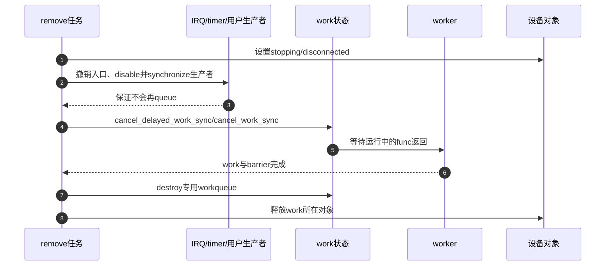

# 第8章\_CPU热插拔电源管理与生命周期

## 8.1\_执行域也有生命周期

work 不只依赖业务对象，还依赖选定 CPU/pool、workqueue 属性和 worker 基础设施。CPU 下线时 bound pool 不能继续按原方式执行；系统冻结时 freezable 队列要停止推进；设备 remove 时 IRQ/timer/用户入口仍可能重新提交。完整 teardown 必须同时处理这些生命周期。

## 8.2\_CPU上下线的状态变化

bound workqueue 按 CPU 建立 pwq/pool 映射。CPU 下线期间，内核要停止或重绑相关 worker、处理 pool 在线状态并保证已经排队的 work 有合法去向；CPU 上线再恢复执行能力。unbound 队列则根据新的在线 CPU 集合和 attributes 更新 pod/pool 映射。

调用者应依赖 workqueue API 的 hotplug 语义，不读取内部 pool 指针或假设 queue 后一定在最初指定 CPU 执行。必须严格运行在某 CPU 的硬件协议应结合 CPU hotplug callback、per-CPU 生命周期或更专门机制设计。

## 8.3\_freezer与设备电源管理不是一回事

`WQ_FREEZABLE` 让 workqueue 在系统冻结阶段停止启动普通 work，避免后台活动阻碍 suspend。但它不会自动：

- 停止设备产生 IRQ；
- 保存/恢复寄存器；
- 取消非 freezable 队列上的相关 work；
- 决定 resume 后旧事件是否仍有效。

设备 PM 仍要定义 quiesce、硬件停机、在途 work 同步和恢复重排顺序。

## 8.4\_remove的统一端到端时序

顺序中的关键不变量是 **先阻止所有新提交，再等待旧 work**。若 work function 会自重排，stopping 检查必须发生在重排前；若 cancel 调用者持有 work 所需 mutex，应先释放或重构依赖。

## 8.5\_错误与恢复路径

分配专用 workqueue 失败时不能留下已注册 IRQ/入口继续提交到空指针。初始化应按逆序回滚：先阻止生产者，再同步在途来源，取消已初始化 work，最后释放对象。模块卸载还要保证工作函数代码本身在所有 work 退出前不会被卸载。

delayed work 的 timer、RCU work 的宽限期回调和跨 workqueue 链式提交分别引入额外生产者；teardown 清单必须从真实调用关系枚举，而不是只取消结构体里肉眼可见的第一个 work。

## 8.6\_诊断矩阵

| 症状 | 先查状态 | 典型根因 |
| --- | --- | --- |
| work 永远不执行 | pending、pwq active、pool worker、CPU 在线状态 | inactive 额度、pool 无进展、错误 CPU 约束 |
| remove 卡住 | current_work、锁依赖、重排生产者 | cancel_sync 反向等锁或 work 自重排 |
| 重复事件丢失 | 业务队列/计数与 queue 返回值 | 把 pending 当事件计数器 |
| suspend 后访问硬件 | freezable 与 PM 停止顺序 | 只冻结队列未停设备生产者 |
| reclaim hang | WQ_MEM_RECLAIM 与依赖图 | 回收等待无 rescuer 队列或工作反向分配 |

`/proc` worker 栈、workqueue tracepoint、lockdep 和 hung-task 报告可帮助定位已发生路径；未观测到 hang 不能证明 shutdown 协议完整。

## 8.7\_最终选择与验收

- 为什么需要 workqueue，而不是线程化 IRQ、timer、irq_work 或专用 kthread？
- work 表示合并后的状态处理，还是每个事件都必须保存？
- bound/unbound、max_active、ordered、freezable、reclaim 属性分别解决哪条具体因果链？
- queue 返回 false 时业务事件仍保存在哪里？
- flush/cancel 等待哪个代际，谁能在其后重新提交？
- CPU 下线、suspend、remove 和初始化失败分别怎样封住生产者？
- work、workqueue、工作函数代码和业务对象何时才允许释放？

## 8.8\_源码与专题出口

Linux 6.12.20 的对象、投递、worker、flush 和销毁路径从[工作队列源码总阅读索引](../../../../../research/source_reading/workqueue/navigation/P01_Linux_6.12_工作队列源码总阅读索引.md#1.6_建议阅读顺序)进入。中断触发边界回到[中断专题](../interrupts/大纲.md)，时间触发回到[定时专题](../timers/大纲.md)，对象回收回到[kref 专题](../../../object_lifetime/kref/大纲.md)。

上一篇：[unbound、rescuer 与回收前进性](P07_unbound_rescuer与回收前进性.md)。
