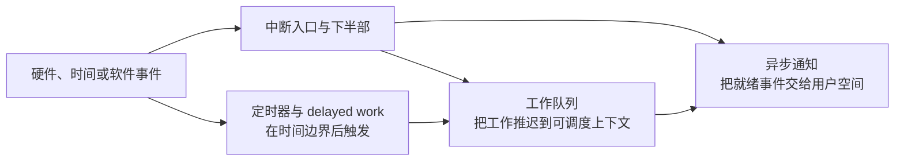

# 第1章\_Linux\_异步机制大纲

## 1.1\_从事件到后续执行

## 1.2\_专题入口

1. [中断机制](interrupts/大纲.md)：建立异步事件入口、硬中断/下半部边界以及执行上下文约束。
2. [工作队列](workqueue/大纲.md)：把后续工作交给 worker 在线程上下文执行。
3. [定时与延迟执行](timers/大纲.md)：区分时间表示、睡眠、timer、hrtimer 与 delayed work。
4. [fasync 异步通知](async_notification/大纲.md)：把内核 I/O 就绪事件经信号机制传给用户空间。

## 1.3\_归属边界

- 本节按“事件发生后怎样继续推进”组织可复用机制，不把“异步”误写成“不需要同步”。队列、回调、取消和拆除路径仍需遵守[同步机制](../synchronization/大纲.md)与对象生命周期约束。
- [VFS Direct I/O 与异步完成](../../../kernel_subsystems/vfs/P17_Direct_IO与异步完成.md)、[字符设备阻塞、poll 与异步通知](../../../driver_model/character_device/P06_阻塞_poll与异步通知.md)保留在领域专题，因为它们解释通用机制怎样组合进具体数据路径。
