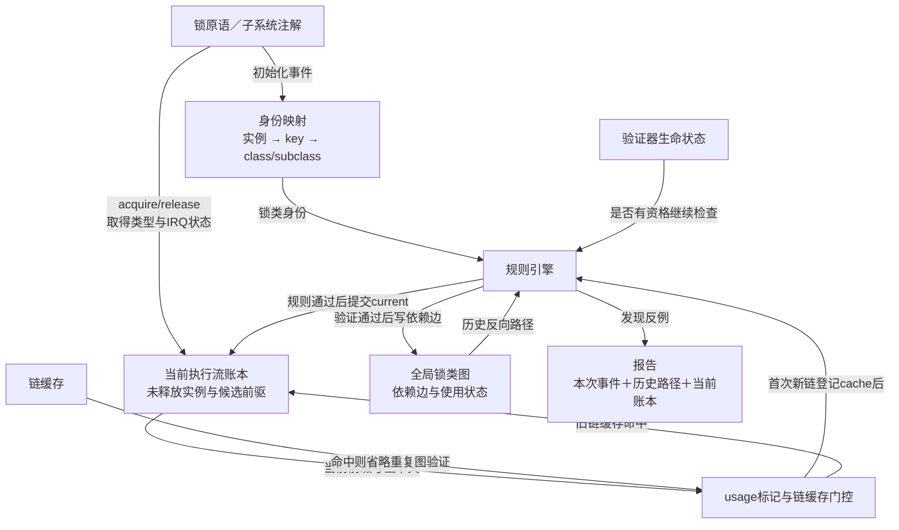
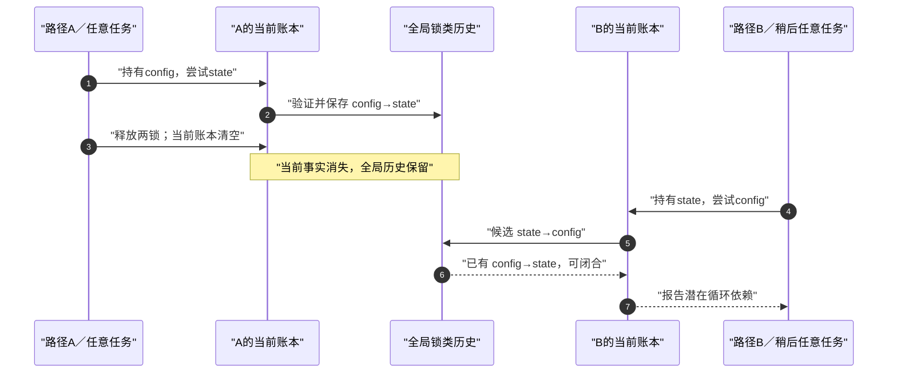

# 第2章\_Lockdep\_抽象模型与证明边界

## 2.1\_先从要证明的问题反推状态

上一章留下的目标很具体：测试先执行 `config_lock → state_lock`，全部释放；过一段时间又执行 `state_lock → config_lock`。验证器应在第二条路径准备取得 `config_lock` 时指出风险。

若只保存一种状态，会立即遇到三个矛盾：

1. 只保存功能锁 owner，第一条路径解锁以后历史消失，不能与第二条路径组合；
2. 只保存全局顺序图，无法知道本次取得发生时 current 还持有什么，也无法回答“此刻是否持有指定实例”；
3. 发现内部错误或容量耗尽后仍继续输出“无告警”，会把不完整知识伪装成有效证明。

因此至少需要四层彼此不能替代的状态：

| 状态层 | 典型内容 | 所有者与时间尺度 | 解决的问题 |
| --- | --- | --- | --- |
| 功能同步状态 | mutex owner、等待队列、自旋锁锁字 | 具体锁实例，随竞争变化 | 谁真正取得锁、谁需要等待 |
| 当前影子状态 | current 尚未释放的实例、类、取得类型和 IRQ 状态 | 当前执行上下文，一次动态持锁区间 | 本次新锁的前驱是谁、断言是否成立 |
| 全局历史状态 | 锁类、依赖边、IRQ 使用事实、链缓存 | 跨任务、跨时间 | 独立组件链能否组合成递归、环或上下文反转 |
| 验证器生命状态 | 是否启用、是否递归进入、容量是否可用 | 检查器自身 | 当前结果是否还有资格作为证据 |

这不是对 Linux 字段的分类，而是从证明任务必然推出的最小职责。后文再把它们映射到 `owner`、`held_locks[]`、`lock_class` 和 `debug_locks`。

## 2.2\_错误模型到正确模型

### 2.2.1\_错误模型一\_Lockdep扫描所有锁

这个模型认为检查器在需要时扫描所有锁对象，找出 current 持有的锁。矛盾在于内核不存在一个覆盖 mutex、spinlock、rwsem 和自定义同步域的统一可枚举对象表；即使能扫描，也无法恢复几分钟前已经释放的取得顺序。

正确增量是：**同步原语在初始化、取得、失败回退和释放等约定时点主动上报事件。** 检查器消费事件，不从功能状态反推完整协议。

### 2.2.2\_错误模型二\_只要保存一张锁图

图能保存 `A → B`，却不能回答 current 现在是否仍持有 A，也不能区分“刚刚先用 A、释放后再用 B”和“持有 A 期间尝试 B”。后者才建立等待依赖。

正确增量是：**当前执行流先维护未释放取得账本，只有账本中的前驱与新取得之间才产生候选边；全局图只保存经过验证的历史关系。**

### 2.2.3\_错误模型三\_见到lock\_acquire就表示已经拿到锁

阻塞锁的死锁风险恰恰发生在“已经持有 A，准备等待 B”的时刻。若等 B 真正成功后才上报，ABBA 中两个任务可能已经永远睡下，验证器也失去报告机会。

正确增量是：**检查事件可以早于功能取得成功。** 版本证据从 [Linux 6.12.20 Lockdep 源码导读](../../../../../research/source_reading/lockdep/navigation/P01_Linux_6.12_Lockdep源码导读.md#1.1_基线与阅读目标)进入。该版本普通 mutex 的共同获取路径通过 `mutex_acquire_nest()` 在功能尝试和睡眠以前进入 Lockdep；成功后另有 `lock_acquired()` 统计事件，可中断取得失败则用 `mutex_release()` 撤销影子记录。具体调用先后见[共同获取函数](../../../../../research/source_reading/locking/source_explanations/kernel/locking/mutex.c.md#1.4_mutex_lock_common的阶段)。事件名描述检查协议，不是功能结果，也不是硬件 acquire 内存序。

## 2.3\_一次操作不是单一状态机

四层状态在一次 acquire 中同时变化，因此 Lockdep 不是“一个大状态机”，而是多组正交状态的协作：

```text
功能轴：未持有B → 尝试B → 立即成功或等待 → 成功持有／失败返回 → 释放
当前轴：持有[A] → 候选[A,B] → 正式[A,B] → 回滚[A]或释放后[A]
历史轴：已有类和边 → cache门控首次新链 → 验证候选A→B → 通过后提交新边 → release后仍保留
生命轴：可验证 → 检查执行 → 继续有效，或因错误/容量问题停检
```

关键不是背四条箭头，而是知道每条轴由谁写、何时失效。功能锁失败只应撤销当前影子记录，不能删除之前已经观察到的全局依赖；检查器停检也不应改变 mutex 的真实 owner。

## 2.4\_S0到S6的端到端周期

沿用贯穿场景：current 已经成功持有 `config_lock`，现在调用 `mutex_lock_interruptible(&state_lock)`。以下把抽象职责映射到固定提交 dfaf2136 的普通阻塞获取，假定相关证明配置启用、检查器有效，且不是 trylock、lock_sync 或被主动禁用检查的注解；这些分支不能机械套用同一条提交路线。

| 阶段 | 触发与问题 | 当前影子状态 | 全局历史状态 | 功能锁状态 |
| --- | --- | --- | --- | --- |
| S0 身份就绪 | `state_lock` 怎样进入图 | 仍为 `[config]` | 实例可解析到稳定锁类 | state 可能空闲或被他人持有 |
| S1 尝试上报 | mutex 准备尝试或等待 state | 仍为 `[config]` | 读取本次类、读写/trylock 与 IRQ 属性 | 尚未由本次调用成功取得 |
| S2 建立候选 | 当前哪些锁会成为前驱 | 在数组尾部组织 state 候选，尚未增加有效深度 | 准备候选的类、取得类型与上下文属性 | 不受影子写入影响 |
| S3 标记与缓存门控 | wait context 和 IRQ 使用是否允许；本链是否首次出现 | 候选只供内部验证，不对查询承诺 | 标记 usage 后计算候选链键；新链缓存未命中时登记 cache 项并持有图锁 | 可以尚未竞争锁字 |
| S4 规则与边提交 | `config → state` 是否递归、闭环或上下文冲突 | 仍未完成当前提交 | 读取既有反向路径；规则通过后才写依赖边和证据栈 | 不受影响 |
| S5 提交当前 | 详细验证通过或旧链缓存命中 | 正式变为 `[config,state]` | 保存当前链键 | 随后立即成功、阻塞等待，或走失败路径 |
| S6 成功后释放或失败回滚 | `mutex_unlock()`，或可中断取得返回错误 | 删除 state，恢复 `[config]` | 已学习的合法依赖边保留 | 成功路径释放 owner；失败路径从未成为 owner |

S3 中的 cache 项不是“这条链已经通过”的独立证书。Linux 6.12.20 为了在图锁下封闭并发重复登记窗口，先把首次新链加入缓存，再做详细递归和依赖检查；若后续发现违规，报告路径会使 `debug_locks` 停检，不能继续拿这个缓存项作为有效证明。真正的依赖边只在 S4 规则通过后写入，current 的有效深度又到 S5 才增加。

S5 早于功能锁成功并不表示检查器“撒谎说已经拿到锁”。这条 held record 同时表示 **current 已经进入会等待该锁的动态区间**；它让下一层验证看到真实等待前缀。只有调用者从锁 API 成功返回以后，业务代码才可以把功能锁视为已经持有。

这里有两种容易混为一谈的失败。若检查本身在 S4 拒绝候选，就没有正常完成 S5 的当前提交，不能假定检查器随后仍有效；若 S5 已完成而功能 mutex 因信号返回失败，则释放注解撤回本次当前记录，但历史中那条合法等待顺序仍然有价值。它记录“这个路径会持有 config 去尝试 state”，不承诺这一次尝试最终成功。具体候选和有效深度的区别见[取得状态提交](../../../../../research/source_reading/lockdep/source_explanations/P02_Linux_6.12_Lockdep取得释放与持锁账本源码实现.md#2.4___lock_acquire取得状态提交)。

## 2.5\_角色关系与状态地址

抽象账本到本版本的具体地址如下。表中的阶段沿用 S0～S6，后续图不再把“全局历史”当成没有存储位置的黑盒：

| 状态落点 | 何时写入、由谁读取 |
| --- | --- |
| current->held_locks[depth] | S2 由当前取得事件组织候选；验证路径读取，但有效深度尚未包含它 |
| current->lockdep_depth 与 curr_chain_key | S5 提交当前前缀；查询与下次取得读取，S6 释放或失败回退时维护 |
| 全局锁类及其 usage_mask、依赖关系 | S3/S4 在检查器同步保护下记录上下文事实与边；其他任务的后续检查读取 |
| chainhash_table 与锁链记录 | S3 缓存门控查找/登记；命中只是避免重复图检查，不替代检查器有效性判断 |
| debug_locks 与当前递归控制状态 | 检查入口和错误路径维护；后续事件先据此判断能否继续验证 |

这些检查字段不是功能 mutex 的 owner。跨 CPU 的历史更新需要图锁等同步；current 记录也须与 IRQ 上下文和检查器自身递归隔离。因此“不向另一任务发消息”并不意味着没有通信成本：共享历史的查找、首次更新和缓存一致性仍然存在，缓存命中只是减少重复验证工作。



图中的箭头是状态流，不是普通函数调用装饰。锁原语只提供事件；规则引擎必须同时读取当前前缀和全局历史才能形成结论。报告也必须包含这两套证据，否则读者只会看到“最后出现在栈顶的函数”，看不到协议怎样闭环。

## 2.6\_两个执行流怎样通过历史通信

Lockdep 不需要在任务 A 和任务 B 之间发送一条“你们可能死锁”的消息。通信通过共享历史完成：



第一条路径可能来自另一任务、另一 CPU，甚至更早的启动阶段。全局锁类历史及相关使用状态是证据汇合点，current 账本仍归各自执行流所有。图中只展开锁序边；链缓存和检查器生命状态也会被其他执行流间接共享，不能把通信缩减为仅仅读一张邻接表。

## 2.7\_Lockdep能证明到哪里

对每条 **至少执行过一次并正确上报的简单锁链**，Lockdep 可以组合这些组件链，判断它们的某种时序组合是否形成受支持类型的锁死。这比要求复杂多 CPU 交错真实发生更强，但不是对所有代码的静态证明。

结论依赖以下前提：

1. 相关同步原语确实接入了 Lockdep，事件时点和取得类型忠实；
2. 关键路径在检查配置启用且验证器仍有效时执行过；
3. 实例到锁类的归类符合真实业务协议；
4. IRQ 上下文、trylock、读写和 wait type 被正确描述；
5. 检查器状态未被容量耗尽、内部错误或显式关闭破坏。

它不直接证明共享数据无竞争、对象未 UAF、内存屏障正确或从未执行的分支安全。准确说法是：**Lockdep 验证已上报、已覆盖锁协议组件的动态闭包。**

## 2.8\_本章结论

先做一个不用运行内核的账本练习。current 已持 config，历史中还没有 config→state。假定这条候选合法、S5 已提交，但功能获取收到信号失败：请分别写出 S5 和 S6 后的功能状态、当前记录与历史边。再把条件改为 S4 发现反向路径，说明为什么不能继续把这次检查当作有效的新链缓存命中。

对照答案：S5 后 state 尚未取得，当前记录却已包含 state，合法历史边可以已保留；功能失败执行 S6 后，当前记录回到 config，历史边不因这次信号消失。若 S4 检查拒绝，当前提交未正常完成，报告可能停检；此前登记的缓存项不能脱离生命状态独立充当证明。这个练习分别检验“检查失败”和“功能失败”，不要用一个失败布尔值覆盖四条状态轴。

本章没有从 `held_lock` 字段开始，而是从 ABBA 证明任务推出四层状态。功能同步状态决定真实执行；current 账本给出本次等待前缀；全局图汇聚跨时间组件链；验证器生命状态决定结论是否可信。一次阻塞取得的检查事件可以早于功能成功，失败只回滚当前记录。

下一个矛盾是：全局历史要长期保留，但内核里可能有成千上万个动态对象。如果给每个地址永久建图节点，图会爆炸；如果粗暴合并，又会误报。下一章解决实例怎样归入锁类。

上一篇：[为什么需要 Lockdep](P01_为什么需要_Lockdep.md)。

下一篇：[锁实例、锁类、key 与 subclass](P03_锁实例_锁类_key与subclass.md)。
