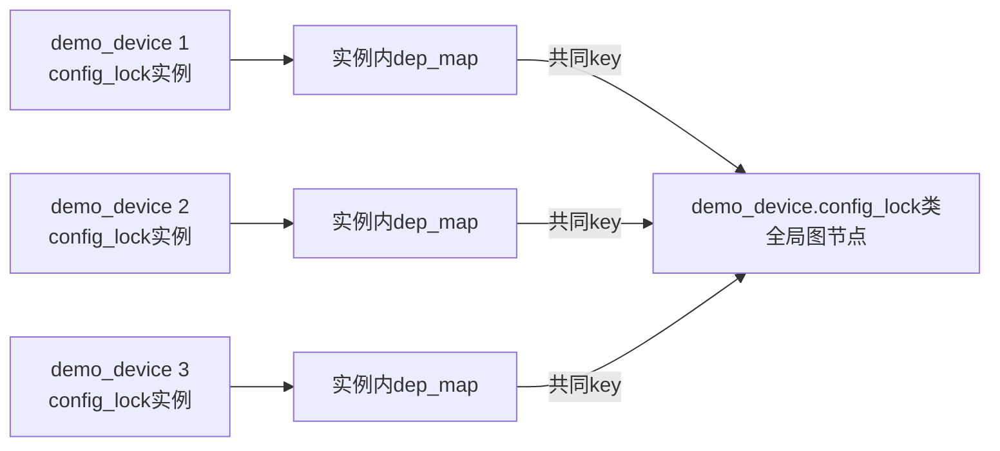

# 第3章\_锁实例\_锁类\_key与subclass

## 3.1\_从动态对象规模推导锁类

上一章需要一张跨任务、跨时间保留的图。如果把每个锁地址都作为永久节点，一个驱动只要创建几千个请求、inode 或队列对象，就会制造几千套几乎相同的图；测试只触发对象 1 的顺序，也无法把结论推广到对象 2。

但若把所有 mutex 都压成同一个节点，任何两把不相干的 mutex 又会互相污染。验证器需要一个介于“具体地址”和“原语种类”之间的协议身份：**锁类表示一组遵循同一锁序规则的锁实例。**



设备 1 上观察到 `config类 → state类`，设备 2 上观察到反向顺序时，两个具体地址不同，协议却应当组合。锁类正是这种跨实例迁移的基础。

## 3.2\_四个身份概念分别回答什么

| 概念 | 回答的问题 | 典型生命周期 |
| --- | --- | --- |
| 锁实例 | current 操作的是哪个具体对象 | 跟随业务对象 |
| `lockdep_map` | 该实例怎样向验证器暴露名称、key、缓存和等待类型 | 通常嵌入功能锁实例，仅在相关调试配置下存在 |
| `lock_class_key` | 哪些实例共享同一套协议规则 | 必须比可能引用它的全局历史更持久 |
| 锁类 / subclass | 全局图实际推理的节点与层级变体 | 跨任务、跨时间保留 |

两种查询需要不同身份：`lockdep_is_held(&dev->config_lock)` 要精确回答 current 是否持有 **这个实例**；死锁闭包则要让不同设备实例共享 **这个字段所属的锁类**。因此 current held record 同时保存实例指针和类索引，不是二选一。

## 3.3\_dep\_map由什么配置提供

`dep_map` 不需要用户态分析工具，也不是运行时外挂模块。它由启用锁调试的内核在锁结构和锁 API 中编译接入：

| 条件 | 结果 |
| --- | --- |
| `CONFIG_DEBUG_LOCK_ALLOC=y` | 标准 mutex、spinlock 等结构包含相应 `dep_map`，初始化和生命期检查接入 Lockdep |
| `CONFIG_PROVE_LOCKING=y` | 选择 `LOCKDEP`、`DEBUG_LOCK_ALLOC` 和 IRQ flags 跟踪等完整依赖证明所需能力 |
| `CONFIG_LOCKDEP=y` | 核心状态和事件设施存在；它通常由上面的用户可见选项选择，单独为 y 不等于完整规则都开启 |
| `CONFIG_LOCKDEP=n` | `lockdep_map`/key 成为空结构或相关宏退化，不改变 mutex owner、自旋锁锁字等功能状态 |

运行时只需让目标路径真正执行，然后从内核日志和 `/proc/lockdep*` 读取结果。`dmesg`、`grep` 等只是查看输出的普通工具，不负责生成 `dep_map` 或完成图搜索。配置和运行态的完整核对留到 P08。

版本化证据见 [`lock_class_key` 与 `lockdep_map` 身份结构](../../../../../research/source_reading/lockdep/source_explanations/P01_Linux_6.12_Lockdep身份与锁类源码实现.md#1.2_lock_class_key与lockdep_map身份结构)、[`lockdep_init_map_type()` 与关闭配置分支](../../../../../research/source_reading/lockdep/source_explanations/P01_Linux_6.12_Lockdep身份与锁类源码实现.md#1.3_lockdep_init_map_type与关闭配置分支)，以及 [`PROVE_LOCKING`、`DEBUG_LOCK_ALLOC` 与 `LOCKDEP`](../../../../../research/source_reading/lockdep/source_explanations/P04_Linux_6.12_Lockdep查询注解与配置源码实现.md#4.5_PROVE_LOCKING_DEBUG_LOCK_ALLOC与LOCKDEP)。

## 3.4\_初始化调用点怎样共享key

动态设备对象通常在同一个初始化函数中初始化字段：

```c
struct demo_device {
	struct mutex config_lock;
	struct mutex state_lock;
};

static void demo_device_init(struct demo_device *dev)
{
	mutex_init(&dev->config_lock);
	mutex_init(&dev->state_lock);
}
```

Linux 的 `mutex_init()` 宏在 **每个宏展开调用点** 声明静态 `lock_class_key`，再交给底层初始化。于是所有经过第一行调用点初始化的 `config_lock` 实例共享一个 key；所有经过第二行调用点初始化的 `state_lock` 实例共享另一个 key。

```text
mutex功能初始化
  → owner、等待队列等功能状态复位

Lockdep身份初始化
  → dep_map关联名称、调用点静态key和等待类型
  → 首次取得时查找或登记锁类
```

“同一初始化函数”不是魔法字符串匹配，而是因为同一宏展开位置拥有同一个静态 key 对象。若业务绕过标准初始化、自行复制已初始化锁内存，或者给同一协议的实例制造大量不同调用点，就可能破坏预期分类。

## 3.5\_key为何必须比实例更持久

全局图会在具体锁释放以后保留历史边。若用一块短命动态内存地址当 key，对象释放后该地址可能被无关对象复用，旧图节点就被错误解释成新协议。

正确边界是：

- 静态锁和初始化调用点中的静态 key 天然具有长期身份；
- 动态分配的 key 必须先通过受支持接口登记，在释放 key 内存前注销；
- 不能用函数栈变量或寿命短于全局图引用的临时地址冒充 key；
- 锁对象自身是动态地址时，也不能仅凭“地址现在唯一”推出它适合做长期类身份。

Linux 6.12.20 首次查找或登记锁类的双检和容量失败路径见 [`register_lock_class()` 锁类注册](../../../../../research/source_reading/lockdep/source_explanations/P01_Linux_6.12_Lockdep身份与锁类源码实现.md#1.4_register_lock_class锁类注册)。

## 3.6\_错误归类如何制造误报与漏报

### 3.6.1\_错误合并

控制锁 A 和数据锁 A' 若业务协议不同，却错误共享一个 key：

```text
控制路径允许 A  → B
数据路径允许 B  → A'
错误合并后图中变成 A类 → B → A类
```

验证器会报告不存在的同类闭环。这是分类过宽导致的误报。

### 3.6.2\_错误拆分

同一个字段的实例若被错误分成不同类：

```text
设备1观察到 A1 → B
设备2观察到 B  → A2
真实协议要求 A1 与 A2 同类，但图中被拆开
```

图无法组合两个方向，可能漏掉真实风险。因此 `lockdep_set_class*()` 不是“把告警消掉”的按钮；只有业务协议确实不同，才有资格改变分类。

## 3.7\_完整层级示例为何需要subclass

现在考虑一棵设备树，每个节点都有同一字段 `lock`。父子节点都由同一初始化调用点创建，所以默认属于同一锁类。删除子节点时，协议规定必须始终先锁父节点，再锁子节点：

```c
enum demo_node_lock_level {
	DEMO_NODE_PARENT,
	DEMO_NODE_CHILD,
};

struct demo_node {
	struct mutex lock;
	struct demo_node *parent;
	bool online;
};

static void demo_node_lock_init(struct mutex *lock)
{
	/* 所有节点锁经过同一调用点，因而共享同一基础锁类。 */
	mutex_init(lock);
}

static void demo_node_init(struct demo_node *node,
			   struct demo_node *parent)
{
	demo_node_lock_init(&node->lock);
	node->parent = parent;
	node->online = true;
}

static void demo_detach_child(struct demo_node *child)
{
	struct demo_node *parent = child->parent;

	/* 对象拓扑规定唯一顺序：父节点在外，子节点在内。 */
	mutex_lock_nested(&parent->lock, DEMO_NODE_PARENT);
	mutex_lock_nested(&child->lock, DEMO_NODE_CHILD);
	child->online = false;
	mutex_unlock(&child->lock);
	mutex_unlock(&parent->lock);
}
```

`demo_node_lock_init()` 特意把所有节点锁收敛到同一个 `mutex_init()` 调用点，确保父锁和子锁共享基础锁类；如果把 `mutex_init()` 分散到不同宏展开位置，示例就不再能证明这里讨论的同类嵌套。若没有层级信息，Lockdep 只看到 `demo_node.lock类 → demo_node.lock类`，无法自行知道两个实例的父子关系。subclass 把同一基础类在本次取得中的自然层级映射成不同图节点：

```text
demo_node.lock/PARENT → demo_node.lock/CHILD
```

它没有改变 mutex 的功能，也没有自动检查 `parent` 指针真伪。使用它以前必须证明：

1. 层级由对象拓扑稳定决定，不是“谁先抢到谁当父”；
2. 所有路径都遵循父先于子，不存在反向回调；
3. 实际最大嵌套层级受实现支持；
4. 本来是同一实例递归的错误不会被伪装成合法层级。

若无法证明这四点，应重构锁序或所有权，而不是用 `_nested()` 压掉报告。

## 3.8\_从抽象身份映射到Linux\_6.12

开始阅读具体字段前，先用 [Lockdep 身份与事件接入模块导读](../../../../../research/source_reading/lockdep/navigation/P02_Linux_6.12_Lockdep身份与事件接入模块导读.md#2.1_模块问题) 建立文件地图。映射关系如下：

| 抽象角色 | Linux 6.12.20 主要落点 |
| --- | --- |
| 实例检查身份 | 功能锁内嵌的 `struct lockdep_map` |
| 协议 key | `struct lock_class_key` 及其 subclass 子键 |
| 全局图节点 | `struct lock_class` 与类索引 |
| 实例到类的快速映射 | `lockdep_map.class_cache[]` |
| 首次登记 | `register_lock_class()` |

这些是特定版本的实现落点；“实例用于当前查询、类用于跨实例协议推理”才是跨版本机制结论。

## 3.9\_本章结论

锁实例回答“当前是哪一个对象”，锁类回答“哪些对象共享同一套顺序规则”。`dep_map` 是内核调试配置编译进锁原语的检查身份，不需要额外用户态生成工具；key 必须足够持久，subclass 只用于经过证明的自然层级。错误合并会误报，错误拆分会漏报。

身份问题解决后，读者还不知道一次取得怎样从 `dep_map` 流到 current 账本，又怎样把 `config类 → state类` 写进历史。下一章沿一个 acquire/release 周期追踪全部状态写入。

上一篇：[Lockdep 抽象模型与证明边界](P02_Lockdep_抽象模型与证明边界.md)。

下一篇：[持锁账本、依赖图与状态闭环](P04_持锁账本_依赖图与状态闭环.md)。
