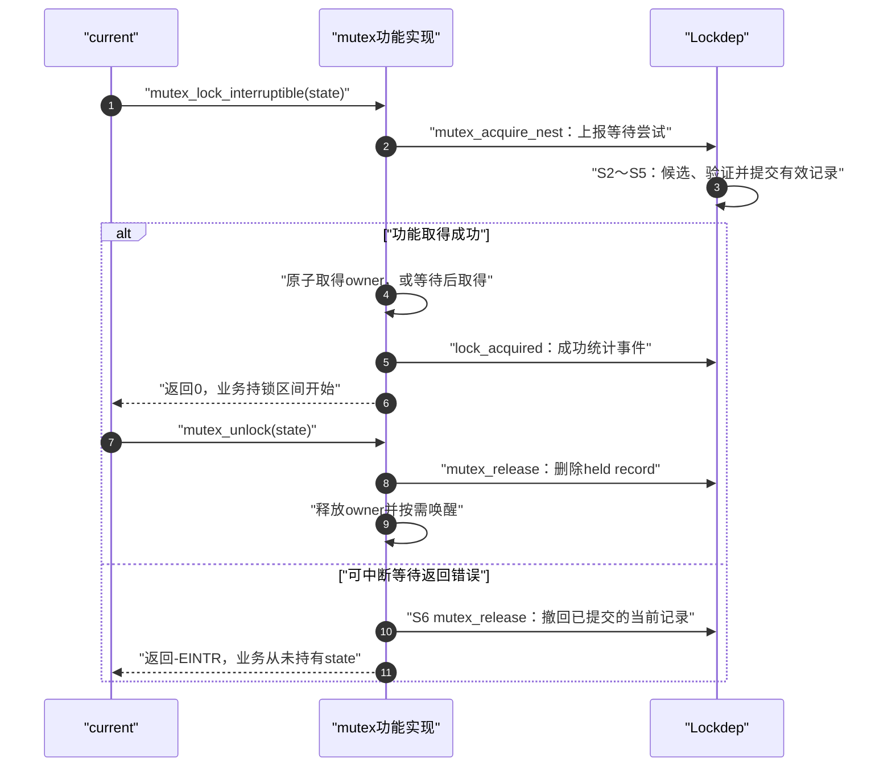
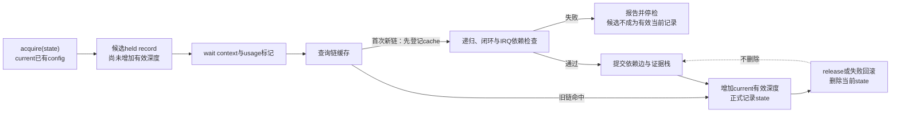

# 第4章\_持锁账本\_依赖图与状态闭环

## 4.1\_本章只追踪一个问题

前三章已经得到两个结论：current 必须有自己的未释放取得账本，动态实例又必须先映射成稳定锁类。现在只追踪一个操作：

```text
current 已成功持有 config_lock
  → 调用 mutex_lock_interruptible(state_lock)
  → 成功时进入双锁临界区，失败时只保留 config_lock
```

读完本章应能回答：检查事件在哪个时点进入；谁把 `config类 → state类` 交给规则引擎；哪些状态属于当前执行流；取得失败和正常 release 分别撤销什么；为什么历史边不会随 unlock 删除。

## 4.2\_held账本不是C调用栈

当前账本按尚未 release 的检查事件组织，但它不是函数调用栈，也不是 CPU 栈回溯。一个 held record 至少要携带：

- 具体 `lockdep_map` 实例，用于普通记录的查询和释放匹配；合并嵌套记录仍有上一章说明的类匹配边界；
- 锁类索引，用于全局图推理；
- 取得位置、IRQ 上下文和 IRQ 开关状态；
- 独占、非递归读或递归读类型；
- trylock、检查等级、nested、pin 等协议属性；
- 前一链键，使常见栈顶释放能够回退。

调用栈与持锁区间并不重合。被调函数可以没有任何 `mutex_lock()`，却继承调用者的动态保护：

```c
static void demo_update_payload(struct demo_device *dev)
{
	lockdep_assert_held(&dev->state_lock);
	dev->active_mode++;
}

static void demo_update_state(struct demo_device *dev)
{
	mutex_lock(&dev->state_lock);
	demo_update_payload(dev);
	mutex_unlock(&dev->state_lock);
}
```

“在锁内”指功能取得成功后到匹配 unlock 前的动态执行区间；Lockdep 的 held record 则从等待关系需要被验证的 acquire 事件开始存在。对普通业务代码，只有锁 API 成功返回以后才能依赖功能互斥。

## 4.3\_为什么阻塞以前就要上报

若 mutex 先尝试睡眠，等成功后才让 Lockdep 检查，ABBA 的两个任务可能都已永远阻塞。从 [Lockdep 总阅读索引](../../../../../research/source_reading/lockdep/navigation/P01_Linux_6.12_Lockdep源码导读.md#1.1_基线与阅读目标)确认固定提交后，再看下面的 Linux 6.12.20 普通 mutex 共同获取路径。假定证明配置开启、检查器有效且使用标准阻塞注解；图中失败是功能取得被信号打断，不是检查器已经报告并停检。



这里有三个名称容易混淆：

- `mutex_acquire_nest()` / `lock_acquire()` 是 Lockdep 事件，不表示 mutex owner 已经属于 current；
- `lock_acquired()` 用于成功取得后的统计与跟踪，不负责重新建立锁依赖；
- CPU 指令或 C 内存模型中的 acquire ordering 是另一层概念，由锁功能实现承担。

进入版本化证据前，先用 [Lockdep 总阅读索引](../../../../../research/source_reading/lockdep/navigation/P01_Linux_6.12_Lockdep源码导读.md#1.6_建议阅读顺序)定位全局顺序，再读[身份与事件接入模块导读](../../../../../research/source_reading/lockdep/navigation/P02_Linux_6.12_Lockdep身份与事件接入模块导读.md#2.4_取得与释放调用链)。Linux 6.12.20 的公共事件入口与 current 状态提交见 [`lock_acquire()` 事件入口](../../../../../research/source_reading/lockdep/source_explanations/P02_Linux_6.12_Lockdep取得释放与持锁账本源码实现.md#2.3_lock_acquire事件入口)和 [`__lock_acquire()` 取得状态提交](../../../../../research/source_reading/lockdep/source_explanations/P02_Linux_6.12_Lockdep取得释放与持锁账本源码实现.md#2.4___lock_acquire取得状态提交)。

## 4.4\_从当前账本生成候选前驱

current 在动态持锁区间中已经有 `[config]`，现在尝试 state，候选关系就是：

```text
前驱：config类（当前尚未release）
后继：state类（本次可能等待）
候选：config类 → state类
```

若 current 已有 `[A,B]` 又取得 C，A 与 B 都可能成为 C 的相关前驱。实现还会结合 IRQ 上下文边界、trylock、nested 和已有冗余关系筛选，但“未释放前驱指向新后继”这个方向不变。

先取得 A、释放 A、稍后再取得 B 不产生 `A → B`。一般时间先后不是锁依赖；**持有 A 的同时可能因 B 不能前进** 才是依赖的因果含义。

## 4.5\_验证通过后为什么写两处状态

候选关系通过规则检查以后，需要完成两个时间尺度的有效提交：

1. 首次需要学习的新链在规则通过后提交相关全局依赖，使两把锁释放以后，未来的 `state类 → config类` 仍能与 `config类 → state类` 组合；
2. 随后 current 账本增加有效深度并提交链键，使查询、断言、release 和再下一次取得知道 state 仍处在等待/持有区间。

这对应上一章的 S4 与 S5，不能倒过来读。已有链命中缓存时可能没有新边可写，但仍要提交本次 current 记录。“两处状态”描述的是两种时间尺度，不是每次调用必定新增两个对象。



把两处状态混成一张表会产生矛盾：release 若删除所有关系，历史闭包无法成立；历史图若又用于 `lockdep_is_held(state)`，过去持有会被误判成现在持有。

## 4.6\_链键和缓存为何不等于省略账本

高频路径可能反复出现同一类序列。每次都搜索全局图会非常昂贵，因此 current 逐次计算链键：

```text
初始链键
  → 混入 config 类和取得类型
  → 混入 state 类和取得类型
```

Linux 6.12.20 的具体顺序是：缓存未命中时，在图锁保护下先登记新 chain cache 项，然后继续做同类递归和依赖图验证；规则通过才提交新依赖边。若规则失败，报告路径会停检，因此“缓存里存在”不能单独解释成“这条链已验证成功”。以后在仍有效的检查会话中命中旧链，才可跳过重复图搜索和重复写边。

对本章的标准阻塞获取，无论缓存是否命中，都不能跳过 current 账本更新，否则 release、断言和后续新锁会失去当前事实。这个结论不扩展到没有实际临界区的 lock_sync 事件，也不把检查关闭时的占位分支当成已经验证成功。

链哈希也不是“数学上绝无碰撞”的魔法。Lockdep 的闭包论证把链键唯一性作为实现假设之一，P09 会把它与容量、覆盖一起放入证据边界。

## 4.7\_release怎样回退当前链

最常见的是后进先出：`[config,state]` 释放 state，恢复 state record 中保存的前一链键，再把有效深度减一。

内核也存在合法的非栈顶 release 模型。若 `[A,B,C]` 中移除 B，不能只在数组中留一个洞：

```text
释放前：[A,B,C]
先回退到B以前：[A]
按C原来的实例、类和取得属性重新建立后半段：[A,C]
释放后：当前B消失；全局历史边不随本次release删除
```

这说明 held record 必须保存足够的取得属性，而不能只是地址集合。Linux 6.12.20 的实例匹配、栈顶回退和非栈顶重建见 [`__lock_release()` 释放与链回退](../../../../../research/source_reading/lockdep/source_explanations/P02_Linux_6.12_Lockdep取得释放与持锁账本源码实现.md#2.5___lock_release释放与链回退)。

这里的“重新建立 C”只重建检查账本，不会重新执行 C 的功能 mutex_lock，也不会临时释放 C。业务上 C 仍连续持有。对合并引用记录，一次 release 还可能只减少 references，尚不删除整个记录；因此“每次 release 都让深度减一”也不是通用规则。以上例子特指未合并的普通记录。

## 4.8\_trylock为什么改变候选边语义

失败的 trylock 立即返回，不等待持有者；成功的 trylock 虽进入 current 账本，却不表示“如果锁被占用我会一直等”。因此 Lockdep 不应把“持有 A 时尝试 trylock B”无条件当成普通阻塞 `A → B`。

但 trylock 不是万能消环工具：

- 成功取得 B 后再阻塞取得 C，B 仍可能成为 C 的真实前驱；
- 持有其他资源不断重试，可能形成活锁或更高层等待协议；
- 自定义原语实际会等待却谎报 trylock，会把真实边从证明输入中删掉；
- 调用者忽略失败返回，功能代码仍然错误。

## 4.9\_一个周期中的写入所有权

| 状态 | 主要存储位置 | 写入者 | 后续读取者 | 失效条件 |
| --- | --- | --- | --- | --- |
| 功能 owner / 锁字 | 具体锁实例 | mutex/spinlock 功能路径 | 竞争者与 unlock | 功能释放 |
| 当前 held record | current->held_locks[]，有效范围由 lockdep_depth 确定 | acquire/release 事件 | 新 acquire、查询、断言、诊断 | release 或功能失败回滚 |
| 当前链键 | current->curr_chain_key，旧值保存在记录的 prev_chain_key | acquire 提交、release 回退 | 链缓存与内部一致性检查 | 随当前链变化 |
| 锁类使用状态 | 全局锁类对象 | 首次新上下文使用事件 | IRQ/等待规则 | 通常跨单次 release 保留 |
| 依赖边与证据栈 | 全局类图 | 首次新链验证通过 | 闭环搜索与报告 | 不随单次 release 删除 |
| 验证器有效性 | 全局 debug_locks 与当前执行上下文的递归/抑制状态 | 配置、错误和容量路径 | 所有检查入口 | 停检后不再提供完整证明 |

## 4.10\_本章结论

先检查三组具体变化。第一组：旧链已命中缓存，当前从 [config] 进入 state 的等待区间；是否还需要有效的 state 记录？第二组：[A,B,C] 释放 B，重建 C 的检查记录时 C 的功能锁是否暂时空闲？第三组：state 获取被信号打断，应该删除候选区、已提交的当前记录，还是全局历史边？

对照答案：第一组必须记录当前事实，否则释放时无法匹配；第二组功能锁没有被释放，只有检查状态重建；第三组在本章有效检查流程里，取得尝试前已完成 S5，应撤回正式当前记录，保留已学习的合法历史边。若改成 S4 检查拒绝，生命周期状态和提交结果就不同，不能继续套用这条正常回滚路线。这些是固定源码的状态推演，不代表已运行信号竞争测试。

一次阻塞取得在功能竞争前上报，是为了在真正睡死前验证等待关系。Lockdep 先组织候选 held record；首次新链经过 cache 门控后再做详细规则，规则通过才写全局依赖边，随后增加 current 有效深度。release 或失败只撤销当前事实，跨时间历史继续保留。

现在剩下的关键问题不是“边存在哪里”，而是“候选 `A → B` 为什么危险”。下一章会从 ABBA 目标反推搜索方向，再用正确的自旋锁 IRQ 场景和读写阻塞矩阵完善朴素图模型。

上一篇：[锁实例、锁类、key 与 subclass](P03_锁实例_锁类_key与subclass.md)。

下一篇：[递归、依赖环、IRQ 与读写规则](P05_递归_依赖环_IRQ与读写规则.md)。
