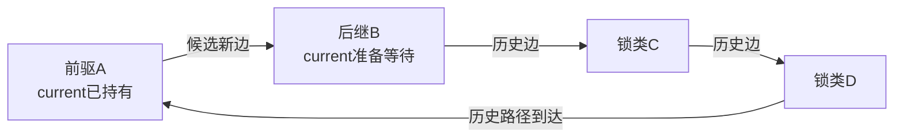
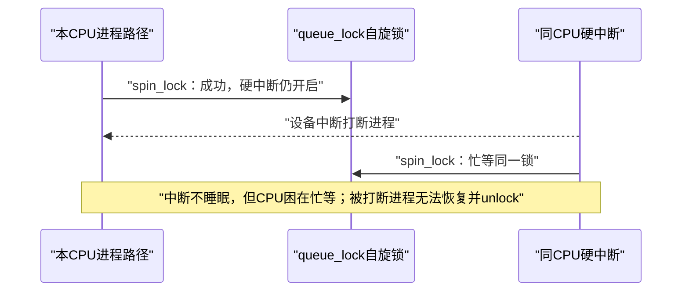

# 第5章\_递归\_依赖环\_IRQ与读写规则

## 5.1\_先明确闭环搜索要回答什么

上一章把新取得抽象成候选 `A → B`，但“检查闭环”不能作为不言自明的步骤。它要回答的实际问题是：

> 若某执行流已经持有 A，并且可能因等待 B 停住，历史上是否存在另一组已观察组件链允许某执行流持有 B 后一路等待回 A？

若答案是肯定的，两个方向可以在某种并发时序下同时成立。贯穿场景中：

```text
历史边：config → state
本次边：state  → config

任务A可以持config等state
任务B可以持state等config
```

所以检查器不是为了“把图画成圆”而搜索，而是在证明 **每个参与者都占着下一位需要的资源，且没有参与者能先完成释放**。

## 5.2\_为何从后继B搜索前驱A

准备提交 `A → B` 时，这条边还不能污染历史。要判断它是否闭环，只需问既有图中能否从 B 到达 A：



如果 B 不可达 A，加入 `A → B` 不会因这条新边制造环；如果可达，候选边补上最后一段。使用广度优先搜索还能找出一条较短历史路径，报告就可以同时展示本次取得点与过去各条边的来源。

版本化阅读先从 [Lockdep 总阅读索引](../../../../../research/source_reading/lockdep/navigation/P01_Linux_6.12_Lockdep源码导读.md#1.6_建议阅读顺序)进入，再用[依赖图与规则引擎模块导读](../../../../../research/source_reading/lockdep/navigation/P03_Linux_6.12_Lockdep依赖图与规则引擎模块导读.md#3.2_规则链而不是一个环检测函数)建立函数协作关系。Linux 6.12.20 的搜索方向和“先验证、后写双向索引”见 [`check_prev_add()` 新依赖验证](../../../../../research/source_reading/lockdep/source_explanations/P03_Linux_6.12_Lockdep依赖图与规则引擎源码实现.md#3.4_check_prev_add新依赖验证)。

## 5.3\_同类递归为何先于普通环

current 已持有 A 类，又准备取得 A 类时，不需要先向图写 `A → A` 才知道有风险。规则引擎直接扫描当前账本：

```text
普通独占或非递归读 + 再次取得同类
  → 可能由自己等待自己

递归读 + 已有读取得
  → 按共享读的真实阻塞语义判断

经过证明的subclass／nest_lock／实例比较顺序
  → 按显式自然层级继续检查
```

“同一类”不能一律判错，因为父子对象可能有稳定层级；`_nested()` 也不能一律放行，因为错误层级会掩盖真递归。具体实现见 [`check_deadlock()` 同类递归检查](../../../../../research/source_reading/lockdep/source_explanations/P03_Linux_6.12_Lockdep依赖图与规则引擎源码实现.md#3.2_check_deadlock同类递归检查)。

## 5.4\_hardirq场景不是在中断里等mutex

继续使用 P01 的 `queue_lock`。它是保护极短共享队列的自旋锁；示例假定普通非 PREEMPT_RT 内核。硬中断不能等待 mutex、semaphore 或 completion，但能够取得适合该上下文的自旋锁。错误来自进程侧没有在持锁期间屏蔽本地硬中断：



进程侧改成 `spin_lock_irqsave()` 后，本 CPU 在临界区内不会进入该 hardirq；中断将在恢复 IRQ 状态后处理。中断侧仍可用普通 `spin_lock()`，因为进入 hardirq 时本地同级硬中断已经处于相应受控状态，具体选择还要服从嵌套中断和目标架构规则。

在 PREEMPT_RT 上，`spinlock_t` 的实现和可用上下文发生变化；真正 hardirq 需要核对 `raw_spinlock_t`、线程化 IRQ 与版本配置。本章的稳定结论是“不可恢复的中断抢占关系会产生隐含等待边”，不是把某个 API 组合外推到所有配置。

## 5.5\_safe和unsafe是历史事实

Lockdep 从每次取得事件累积锁类使用状态：

- **hardirq-safe：** 该锁类曾在 hardirq 上下文中取得；
- **hardirq-unsafe：** 该锁类曾在 hardirq 开启时取得。

同一锁类同时具有两种事实，就允许 P01 的同 CPU 递归场景。`safe` 不是“锁类型天生安全”，`unsafe` 也不是“这把锁一定写错”；它们只是相对于 hardirq 的已观察使用方式。softirq 有对应状态。

状态写入的版本化实现见 [`mark_usage()` 锁类上下文状态](../../../../../research/source_reading/lockdep/source_explanations/P03_Linux_6.12_Lockdep依赖图与规则引擎源码实现.md#3.3_mark_usage锁类上下文状态)。

## 5.6\_IRQ危险如何沿多锁路径传播

危险不只发生在同一锁。设 H 曾在 hardirq 中取得，因此是 hardirq-safe；U 曾在 IRQ 开启的进程路径中取得，因此是 hardirq-unsafe；历史图又存在 `H → ... → U`。

```text
进程路径：持有U，硬中断仍可进入
硬中断：  先取得H，再沿历史允许的路径尝试U
结果：    中断等待U；持有U的进程被中断，无法释放
```

因此 `hardirq-safe → ... → hardirq-unsafe` 是禁止的强依赖方向。新增边时，规则引擎需要：

1. 向候选前驱的反向子图汇聚可能的 IRQ-safe 来源；
2. 向候选后继的正向子图寻找相应 IRQ-unsafe 终点；
3. 找到具体两端和中间依赖路径，打印可解释报告。

这里没有 IRQ 主动发送“我可能死锁”的消息。取得事件先把上下文事实写入锁类，后续新边或新使用状态再读取共享图完成推理。Linux 6.12.20 的整图检查见 [`check_irq_usage()` IRQ 依赖传播检查](../../../../../research/source_reading/lockdep/source_explanations/P03_Linux_6.12_Lockdep依赖图与规则引擎源码实现.md#3.5_check_irq_usageIRQ依赖传播检查)。

## 5.7\_为何图边必须携带读写类型

朴素模型把所有边都当成“后者阻塞前者”，但共享锁有三类取得：

| 取得类型 | 记号 | 会被什么阻塞 | 同类嵌套结论 |
| --- | --- | --- | --- |
| 独占写 | `W` | 写者与读者 | 普通递归危险 |
| 非递归读 | `r` | 写持有者；还可能被已经等待的写者阻塞 | 再次读可能自死锁 |
| 递归读 | `R` | 写持有者，不因写等待者而阻塞递归读 | 已有读范围内可继续读 |

为什么 `r` 与 `R` 必须分开？沿同一时间线：

```text
任务A：read_lock(X)成功
任务B：write_lock(X)等待
任务A：再次read_lock(X)
```

若原语阻止新读者越过等待写者，A 的第二次读也会等待；但释放第一次读的代码在第二次读之后，形成自死锁。递归读语义允许已有读者再次进入，则第二次读不会被等待写者挡住。

所以不是“图里有任何环就报警”，而是环上取得类型组合确实能形成阻塞闭包时，才构成强依赖路径。

## 5.8\_wait\_type补上上下文约束

即使没有环，也可能出现“外层上下文不允许内层等待”的错误。例如在不可睡眠上下文中取得会睡眠的 mutex。wait type 用来表达锁的外部允许条件和持有后对内层施加的等待限制；PREEMPT_RT 会改变部分传统锁的实现和组合边界。

需要分清三类证明：

- 环检查：多把锁的等待关系是否可能闭合；
- IRQ 使用检查：中断抢占能否把 safe 到 unsafe 的路径变成不可恢复等待；
- wait-context 检查：当前外层执行约束是否允许内层原语睡眠或忙等。

它们共享事件和锁类身份，却不是同一个布尔规则。

## 5.9\_常见误修为什么破坏证明

| 处理方式 | 被掩盖的真实问题 | 应先核对什么 |
| --- | --- | --- |
| 看到环就给第二次取得加 `_nested()` | 真实反向锁序被伪装成层级 | 对象拓扑是否定义全路径一致顺序 |
| 给其中一把锁换独立 key | 同一协议被错误拆类，可能漏报 | 两组实例是否真的遵循不同协议 |
| 把会等待的路径标成 trylock | 真实阻塞边从输入中消失 | 失败是否立即返回，调用者是否退回 |
| 在告警点调用 `lockdep_off()` | 只停止诊断，功能死锁仍在 | 能否统一锁序、拆临界区或重构所有权 |
| 把 hardirq-safe 理解成“IRQ里随便用” | 忽略进程侧 irqsave 与依赖链 | 目标配置、同锁和整条依赖是否隔离 |

## 5.10\_本章结论

闭环搜索的目的，是判断本次新等待边能否与历史组件链组成不可前进的参与者环；因此添加 `A → B` 前从 B 搜索 A。同类递归直接读 current 账本；IRQ 规则来自硬中断自旋锁与进程路径之间的不可恢复抢占；读写和 wait type 决定一条边是否真的能够阻塞。

至此规则引擎已有可信输入。下一章转换到调用者视角：怎样查询 current、把持锁要求写成断言、检查回调期间没有偷偷解锁，以及何时才需要为自定义原语上报事件。

上一篇：[持锁账本、依赖图与状态闭环](P04_持锁账本_依赖图与状态闭环.md)。

下一篇：[查询、断言、pin 与自定义原语接入](P06_查询_断言_pin与自定义原语接入.md)。
